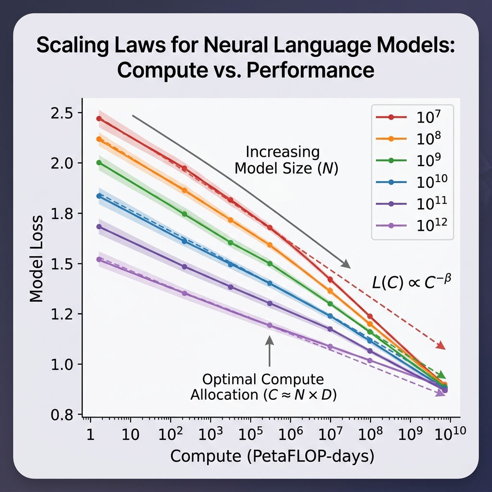

import { ScaleVisualizer } from '../../components/chapter-1/ScaleVisualizer.tsx';


# 1.4 The Bitter Lesson

In 2019, Richard Sutton, one of the pioneers of reinforcement learning, wrote a short essay titled **"The Bitter Lesson."** It has become one of the most influential texts in modern AI, and its argument later resonated strongly with the rise of foundation models.

**Behind-the-Scenes Story:** When this essay was published, it sparked serious debate in the AI community. For researchers who had spent their careers designing domain-specific rules and heuristics, Sutton's claim could feel like a dismissal of that entire tradition. A few years later, the success of large-scale neural models made the essay feel less like a provocation and more like a useful lens on where progress had actually been coming from.

Let's understand this lesson through a metaphor.

---

### **The Metaphor: The Master Craftsman vs. The Automated Factory**

Imagine you want to produce complex machinery.

*   **The Master Craftsman (Human Knowledge)** spends a lifetime learning to perfect a single design. They hand-carve every gear and lever. The result is beautiful and works well, but it takes months to build and cannot be easily scaled.
*   **The Automated Factory (Compute & Learning)** starts with a very simple, general design. It doesn't know the specifics of carving gears. However, it can run millions of experiments per day, refining its process automatically. Soon, it produces machinery that is not only built faster but is more complex than anything the craftsman could imagine.

The "bitter" part is for the craftsman: a system with far less handcrafted structure can eventually surpass expert-designed solutions if it scales effectively with compute and data.

---

## The Lesson Stated

Sutton's core thesis is simple yet profound:

> "The biggest lesson that can be read from 70 years of AI research is that general methods that leverage computation are the most effective, and by a large margin."

The lesson is bitter for AI researchers because it suggests that methods relying heavily on human knowledge, intuition, and hand-crafted features often plateau. Over long enough horizons, they are frequently overtaken by methods that scale search and learning with large amounts of compute.

### Human Knowledge vs. Compute

Sutton observed a recurring pattern in AI history:
1.  Researchers try to build intelligence by encoding human knowledge (e.g., rules for chess, features for vision).
2.  This works well in the short term and makes researchers feel good.
3.  In the long term, Moore's Law makes computation vastly cheaper.
4.  Methods that leverage compute (like brute-force search or massive neural networks) eventually crush the human-knowledge-based methods.

---

## The Two Pillars: Search and Learning

Sutton identifies two classes of methods that scale relentlessly with computation:

1.  **Search:** Exploring a massive space of possibilities (e.g., Monte Carlo Tree Search in AlphaGo).
2.  **Learning:** Adjusting parameters based on vast amounts of data (e.g., training a Transformer).

Foundation models are the clearest large-scale embodiment of this "Learning" pillar. They do not contain explicit rule books for grammar, physics, or code. Instead, they absorb useful structure from massive datasets through large-scale optimization.

---

<div style={{ display: 'flex', flexDirection: 'column', alignItems: 'center', width: '100%', margin: '20px 0' }}>

<div style={{ maxWidth: '600px', width: '100%' }}>

</div>

<em style={{ marginTop: '10px', color: '#7f8c8d' }}>Source: Generated by AI</em>

</div>

---

## The Scaling Law

The concrete mathematical manifestation of the Bitter Lesson is the **Scaling Law**. Research from OpenAI and others has shown that the performance of large language models scales predictably with three factors:

1.  **Model Size ($N$):** Number of parameters.
2.  **Dataset Size ($D$):** Number of tokens.
3.  **Compute ($C$):** Total floating-point operations (FLOPs) used for training.

In practice, scaling-law papers often fit more detailed empirical curves, but a simple illustrative form is:
$$L(N, D, C) \propto \left( \frac{1}{N^\alpha} + \frac{1}{D^\beta} + \frac{1}{C^\gamma} \right)$$
Where $L$ is the loss, and $\alpha, \beta, \gamma$ are scaling exponents.

This means if you want better performance, you don't necessarily need a better algorithm; you just need to scale $N, D,$ and $C$.

---

## Code Example: Simulating Scaling Laws

While we cannot train a giant model here, we can simulate the relationship between compute (model size $\times$ data size) and the resulting loss, following the power-law characteristics.

```python
import torch
import matplotlib.pyplot as plt

# Simulated scaling law parameters
alpha = 0.34  # Exponent for model size
beta = 0.28   # Exponent for data size

# Define ranges for N and D using PyTorch
N_range = torch.logspace(1, 5, 20)
D_range = torch.logspace(1, 5, 20)

# Create a grid for N and D
N_grid, D_grid = torch.meshgrid(N_range, D_range, indexing='ij')

# Compute loss grid using PyTorch operations
Loss = 1.0 / (N_grid**alpha) + 1.0 / (D_grid**beta)

# Convert to numpy for plotting (matplotlib requires numpy)
Loss_np = Loss.numpy()
N_np = N_range.numpy()
D_np = D_range.numpy()

# Plotting the result
plt.figure(figsize=(10, 6))
CS = plt.contourf(N_np, D_np, Loss_np, levels=20, cmap='viridis')
plt.xscale('log')
plt.yscale('log')
plt.xlabel('Model Size (N)')
plt.ylabel('Dataset Size (D)')
plt.title('Simulated Scaling Law: Loss as a function of N and D')
plt.colorbar(CS, label='Loss')
plt.show()

print("Notice how moving to the top-right (more compute) always reduces loss.")
```

---

## Example: The Power of Scale

Adjust the "Compute" available to the AI. See how the model transitions from learning simple patterns to complex reasoning, demonstrating the Bitter Lesson in action.

<ScaleVisualizer client:load />

---

## Looking Ahead: The Sequence Modeling Challenge

We have seen that scale and general methods are powerful. But how do we apply this to sequential data like language?
- How do we maintain memory of past tokens efficiently?
- What happens when sequences become extremely long?
- How did we move from simple Markov chains to complex neural networks?

These questions lead us to **Chapter 2: The Sequence Modeling Era**, where we will explore the evolution of models designed specifically for sequential data.

---

## Quizzes

<details>
<summary>Quiz 1: Why is Sutton's lesson called "bitter"?</summary>
*It is bitter for researchers because it suggests that human ingenuity in designing specific rules and heuristics is ultimately less effective than simple, general methods scaled with massive computation. It wounds the pride of experts who want to "teach" the AI.*
</details>

<details>
<summary>Quiz 2: Does the Bitter Lesson mean human experts are useless in AI research?</summary>
*No. Human expertise shifts from designing features and rules to designing scalable architectures, loss functions, and data pipelines. The focus changes from "what to think" to "how to learn."*
</details>

<details>
<summary>Quiz 3: How do modern LLMs reflect the Bitter Lesson?</summary>
*LLMs do not have hard-coded rules for grammar or logic. They are simple next-token predictors scaled to billions of parameters and trained on trillions of tokens. Their intelligence is an emergent property of scale, exactly as Sutton predicted.*
</details>

<details>
<summary>Quiz 4: What are the implications of the Bitter Lesson for the design of specialized AI hardware?</summary>
*The Bitter Lesson implies that hardware should be optimized for general, highly parallelizable operations (like matrix multiplication) that scale well with compute, rather than specialized operations for specific algorithms. This explains the dominance of GPUs and TPUs over more specialized architectures.*
</details>

<details>
<summary>Quiz 5: How does the "Bitter Lesson" relate to the concept of "Emergence" in large models?</summary>
*Emergence refers to capabilities that appear in large models but are not present in smaller ones. The Bitter Lesson predicts that as we scale compute and data, we will see unexpected, emergent abilities that could not be achieved by manually programming rules.*
</details>

<details>
<summary>Quiz 6: Derive the canonical compute approximation $C \approx 6ND$ for training a Transformer model, explaining the origin of the constant factor $6$.</summary>
*In a Transformer model, each parameter is involved in one multiply-accumulate operation per token during the forward pass, which equates to $2$ FLOPs (Floating Point Operations) per parameter per token. Therefore, the forward pass requires $2N$ FLOPs per token. During the backward pass, the compute required is approximately twice that of the forward pass: $2N$ FLOPs to calculate gradients with respect to the inputs/activations, and $2N$ FLOPs to calculate gradients with respect to the weights. Summing these yields $2N + 2N + 2N = 6N$ FLOPs per token for a full training step. Multiplying by the total number of tokens $D$ in the dataset gives the total compute $C \approx 6ND$.*
</details>

---

## References

1. <a id="ref-1"></a>Sutton, R. (2019). *The Bitter Lesson*. [Link](http://www.incompleteideas.net/IncIdeas/BitterLesson.html)
2. <a id="ref-2"></a>Kaplan, J., McCandlish, S., Henighan, T., Brown, T. B., Chess, B., Child, R., ... & Amodei, D. (2020). *Scaling laws for neural language models*. [arXiv:2001.08361](https://arxiv.org/abs/2001.08361).
3. <a id="ref-3"></a>**Recommended Interview**: [Dwarkesh Patel's Interview with Rich Sutton](https://www.youtube.com/watch?v=21EYKqUsPfg) An excellent interview where Sutton elaborates on 'The Bitter Lesson' and the future of AI.
