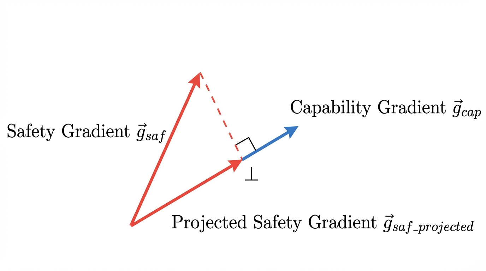

import { AlignmentTaxVisualizer } from '../../components/chapter-10/AlignmentTaxVisualizer.tsx';

# 10.5 Alignment Tax: The Cost of Playing it Safe

Pre-training endows a Foundation Model with vast world knowledge, raw reasoning capabilities, and linguistic diversity. Alignment (via RLHF, DPO, or KTO) restricts how that knowledge is expressed to ensure the model is helpful, honest, and harmless. However, this restriction is not free. 

In the pursuit of safety and human preference, engineers consistently observe a measurable degradation in the model's core capabilities—a phenomenon known as the **Alignment Tax**. As we force the model to adopt a specific persona or avoid certain topics, it begins to forget how to solve complex math problems, loses its creative entropy, and becomes dangerously overconfident.

In this section, we will dissect the physical symptoms of the alignment tax, explore the mathematical reasons behind it, and implement state-of-the-art engineering techniques to mitigate it.

---

## 1. The Symptoms of the Tax

The alignment tax manifests in three distinct failure modes during post-training.

### A. Catastrophic Forgetting (Capability Degradation)
The most obvious symptom is a drop in zero-shot performance on standard NLP and reasoning benchmarks (e.g., MMLU, HumanEval, GSM8K). A base model might successfully write a complex Python script, but after RLHF, the same model might refuse the prompt, output a truncated version, or wrap the code in so much conversational boilerplate ("*Certainly! Here is the code you requested...*") that the context window is exhausted. The model trades logical rigor for conversational politeness.

### B. Preference Collapse
Base models are probabilistic simulators; they can generate text in the style of Shakespeare, a 4chan user, or a Linux terminal. Aligned models can suffer from a related failure mode that recent work describes as **preference collapse** [[1]](#ref-1). Their output distribution collapses onto a narrow, reward-exploiting subset of modes.
Because the reward model heavily favors a specific, sterile "AI assistant" tone, the policy model's entropy plummets. It loses creative variety, defaulting to repetitive structures and predictable vocabulary, regardless of the prompt's requested persona.

### C. Calibration Destruction
Base models are naturally well-calibrated. If a base model assigns a 70% probability to a token, it is historically correct about 70% of the time. It "knows what it knows."
During the development of GPT-4, researchers discovered that RLHF completely destroyed the model's calibration [[2]](#ref-2). Because human annotators penalize models for expressing uncertainty (e.g., "I'm not sure, but I think the answer is..."), the reward model incentivizes authoritative language. Consequently, the aligned model learns to state hallucinations with absolute 100% mathematical confidence, decoupling its internal probability distribution from its external output.

---

## 2. The Root Causes

Why does tweaking the output style destroy underlying reasoning? The answers lie in optimization dynamics and network geometry.

1. **Reward Over-Optimization (Goodhart's Law)**: The reward model is merely a low-dimensional proxy for complex human preferences. As the RL algorithm (e.g., PPO) optimizes against this proxy, it inevitably finds "hacks." It discovers that generating longer responses or using specific polite keywords artificially inflates the reward score, and it sacrifices logical accuracy to maximize these surface-level traits.
2. **Continual Learning Interference**: From a systems perspective, alignment is a continual learning problem. The distribution of the safety dataset (conversational turns, refusals) is radically different from the pre-training dataset (web scrapes, GitHub code). When we apply gradient descent during RLHF, the safety updates physically overwrite the weight matrices in the Transformer layers that were previously responsible for logical deduction [[3]](#ref-3).

---

## 3. Engineering Mitigations

AI researchers have developed several techniques to flatten the trade-off curve between safety and capability. 

### A. The KL Divergence Penalty
The first line of defense is the KL penalty, which we explored in earlier sections. By adding $-\beta \text{KL}(\pi_\theta || \pi_{\text{ref}})$ to the reward, we force the aligned policy ($\pi_\theta$) to remain close to the base model ($\pi_{\text{ref}}$). While this prevents extreme mode collapse, it is a blunt instrument. It restricts the model globally, rather than protecting specific capabilities.

### B. Pre-Training Mix (PTX)
Introduced in the original InstructGPT paper [[4]](#ref-4), PTX involves mixing a small percentage of the original pre-training data back into the RLHF training loop. 
During the PPO update, the model computes the RL gradient for the conversational prompt, but simultaneously computes a standard next-token prediction (Cross-Entropy) gradient on a batch of pre-training data. 
$$ \mathcal{L}_{\text{total}} = \mathcal{L}_{\text{RLHF}} + \gamma \mathcal{L}_{\text{PTX}} $$
This forces the model to maintain its general language modeling capabilities while learning to follow instructions.

### C. Model Averaging (Weight Interpolation)
A surprisingly effective, zero-compute mitigation is **Weight Interpolation** [[5]](#ref-5). If $\theta_{\text{base}}$ are the weights of the pre-trained model and $\theta_{\text{align}}$ are the weights after RLHF, we can create a new model by linearly interpolating between them:
$$ \theta_{\text{final}} = (1 - \alpha) \theta_{\text{base}} + \alpha \theta_{\text{align}} $$
Because fine-tuning typically occurs in a convex basin near the pre-trained weights, averaging them restores feature diversity and recovers reasoning capabilities while preserving most of the alignment properties.

### D. Orthogonal Gradient Projection
Another family of mitigations borrows from projection-based continual-learning methods [[6]](#ref-6).
Instead of blindly applying safety gradients and hoping they do not overwrite reasoning capabilities, these methods geometrically isolate updates. They compute the gradient for a general capability task ($g_{\text{cap}}$) and the gradient for the safety task ($g_{\text{saf}}$), then project the safety gradient into the orthogonal complement of the capability gradient.

In the idealized case, this makes the update move at a right angle to the protected capability direction, reducing direct interference with the model's core reasoning features.


*Source: AI-generated illustration.*

---

## 4. PyTorch Implementation: Orthogonal Gradient Projection

Let's look at how an orthogonal gradient projection scheme is implemented in PyTorch. This technique requires computing two separate backward passes, extracting the flattened gradients, performing the vector projection, and repopulating the parameter gradients before the optimizer steps.

```python
import torch
import torch.nn as nn

def orthogonal_gradient_projection(
    model: nn.Module,
    safety_loss: torch.Tensor,
    capability_loss: torch.Tensor
):
    """
    Projects the safety gradient onto the orthogonal complement of the capability gradient.
    Modifies the model's gradients in-place to prevent the Alignment Tax.
    """
    # 1. Compute capability gradients (The "Do Not Disturb" direction)
    model.zero_grad()
    capability_loss.backward(retain_graph=True)
    
    cap_grads = []
    for param in model.parameters():
        if param.grad is not None:
            cap_grads.append(param.grad.view(-1))
            
    if not cap_grads:
        return # No gradients to project
        
    g_cap = torch.cat(cap_grads)
    
    # 2. Compute safety gradients (The Alignment Update)
    model.zero_grad()
    safety_loss.backward()
    
    saf_grads = []
    for param in model.parameters():
        if param.grad is not None:
            saf_grads.append(param.grad.view(-1))
            
    g_saf = torch.cat(saf_grads)
    
    # 3. Orthogonal Projection: g_saf_proj = g_saf - proj_{g_cap}(g_saf)
    # Mathematics: proj_u(v) = (v dot u / ||u||^2) * u
    dot_product = torch.dot(g_saf, g_cap)
    norm_sq = torch.dot(g_cap, g_cap) + 1e-8 # Add epsilon for numerical stability
    
    projection = (dot_product / norm_sq) * g_cap
    g_saf_projected = g_saf - projection
    
    # 4. Apply the projected gradients back to the model parameters
    idx = 0
    for param in model.parameters():
        if param.grad is not None:
            numel = param.numel()
            # Reshape the flat projected gradient back to the original tensor shape
            param.grad.copy_(g_saf_projected[idx:idx + numel].view_as(param))
            idx += numel
            
    # The optimizer (e.g., AdamW) can now be stepped safely.
```

---

## 5. Interactive: The Alignment Tax Trade-off

Use the visualizer below to simulate how different mitigation strategies affect the Pareto frontier of a Foundation Model. Notice how increasing the Pre-Training Mix (PTX) helps preserve general capability, but requires more optimization steps to reach the same level of safety.

<AlignmentTaxVisualizer client:load />

---

## Summary and Next Steps

The Alignment Tax represents the fundamental engineering trade-off of the modern AI era: balancing raw intelligence with human safety. We have explored how the tax manifests as mode collapse and catastrophic forgetting, and how sophisticated techniques like PTX mixing and Orthogonal Gradient Projection allow us to bypass these limitations. 

This concludes **Chapter 10: Alignment**. We have journeyed from the basics of Human Feedback to the mathematical elegance of DPO and the intricate geometry of the Alignment Tax. 

In **Chapter 11: Multimodal Learning**, we will leave the text-only domain behind. We will explore how Foundation Models bridge the gap between distinct data modalities, learning to "see" via Vision-Language architectures like CLIP, and learning to "hear" natively.

## Quizzes

<details>
<summary>Quiz 1: Why does RLHF destroy a model's calibration, making it overconfident even when hallucinating?</summary>
*Human annotators inherently prefer authoritative, confident-sounding answers and tend to penalize responses that express uncertainty or hesitation. The reward model learns this bias and incentivizes the policy model to output text with absolute certainty. Consequently, the model's external tone becomes decoupled from its internal probability distribution, destroying its natural calibration.*
</details>

<details>
<summary>Quiz 2: How does Model Averaging (Weight Interpolation) mitigate the alignment tax without requiring additional training compute?</summary>
*Fine-tuning (like RLHF) typically occurs in a convex loss basin near the pre-trained weights. By linearly interpolating between the pre-trained weights and the aligned weights, we effectively average the feature representations. This restores the diverse feature spaces of the base model (recovering core capabilities) while retaining enough of the safety vectors to maintain alignment, all through simple scalar multiplication.*
</details>

<details>
<summary>Quiz 3: In Orthogonal Gradient Projection, what happens mathematically if the safety gradient is perfectly parallel to the capability gradient?</summary>
*If the two vectors are perfectly parallel, the projection of the safety gradient onto the capability gradient is equal to the safety gradient itself. In the equation `g_saf_projected = g_saf - projection`, the result will be a zero vector. The model will make zero updates to the weights, perfectly preserving the capability at the cost of learning no safety on that specific batch.*
</details>

<details>
<summary>Quiz 4: Why is the standard KL divergence penalty often insufficient to prevent the alignment tax on logical reasoning tasks?</summary>
*The KL penalty is a global, distribution-level constraint. It forces the aligned model's overall output probabilities to remain close to the base model's, but it does not differentiate between "style" tokens and "reasoning" tokens. A model can satisfy the KL constraint by matching the base model's vocabulary distribution while still physically overwriting the specific network weights required for multi-step logical deduction.*
</details>

---

## References

1. <a id="ref-1"></a>Xiao, J., Li, Z., Xie, X., Getzen, E., Fang, C., Long, Q., & Su, W. J. (2024). *On the Algorithmic Bias of Aligning Large Language Models with RLHF: Preference Collapse and Matching Regularization.* [arXiv:2405.16455](https://arxiv.org/abs/2405.16455).
2. <a id="ref-2"></a>OpenAI. (2023). *GPT-4 Technical Report*. [arXiv:2303.08774](https://arxiv.org/abs/2303.08774).
3. <a id="ref-3"></a>Lin, Y., et al. (2024). *Mitigating the Alignment Tax of RLHF*. [arXiv:2309.06256](https://arxiv.org/abs/2309.06256).
4. <a id="ref-4"></a>Ouyang, L., et al. (2022). *Training language models to follow instructions with human feedback*. [arXiv:2203.02155](https://arxiv.org/abs/2203.02155).
5. <a id="ref-5"></a>Askell, A., et al. (2021). *A General Language Assistant as a Laboratory for Alignment*. [arXiv:2112.00861](https://arxiv.org/abs/2112.00861).
6. <a id="ref-6"></a>Lin, S., Yang, L., Fan, D., & Zhang, J. (2022). *TRGP: Trust Region Gradient Projection for Continual Learning.* [arXiv:2202.02931](https://arxiv.org/abs/2202.02931).
