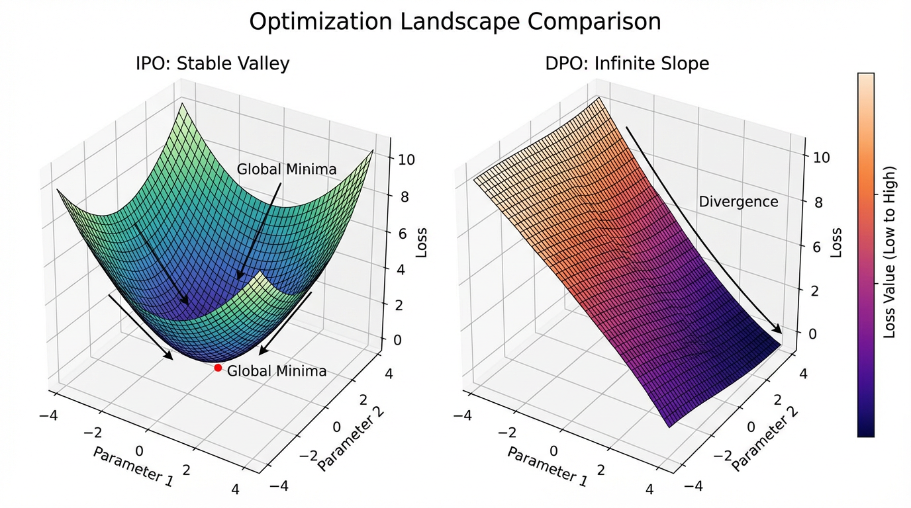

import PreferenceLossVisualizer from '../../components/chapter-10/PreferenceLossVisualizer.tsx';

# 10.4 KTO & IPO: Evolving Beyond DPO

Direct Preference Optimization (DPO) was a watershed moment in AI alignment. By mathematically proving that the reward model could be implicitly derived from the policy itself, DPO allowed engineers to bypass the notoriously unstable reinforcement learning (PPO) loop entirely. 

However, as DPO moved from academic benchmarks to massive production deployments, two critical engineering bottlenecks emerged:
1. **The Overfitting Trap**: DPO's loss function is unbounded. It incentivizes the model to push the probability margin between chosen and rejected responses to infinity, leading to deterministic, collapsed policies that lose generation diversity.
2. **The Data Acquisition Cost**: DPO mathematically requires pairwise preference data ($y_w \succ y_l$). Collecting high-quality, unambiguous pairs is exponentially more expensive and difficult than collecting simple binary feedback (e.g., a user clicking a "thumbs up" or "thumbs down" button).

To solve these physical and economic constraints, researchers developed the next generation of alignment algorithms. In this section, we will deep-dive into **IPO (Identity Preference Optimization)**, which fixes the mathematical bounds of DPO, and **KTO (Kahneman-Tversky Optimization)**, which completely removes the need for pairwise data.

---

## 1. The Mathematical Flaw in DPO

To understand why new algorithms were needed, we must look at the DPO loss function:

$$ \mathcal{L}_{\text{DPO}} = -\log \sigma \left( \beta \left( \log \frac{\pi_\theta(y_w|x)}{\pi_{\text{ref}}(y_w|x)} - \log \frac{\pi_\theta(y_l|x)}{\pi_{\text{ref}}(y_l|x)} \right) \right) $$

Let the term inside the parenthesis be the **implicit reward margin**, $M = r_w - r_l$. The loss is simply $-\log \sigma(\beta M)$. 

Because the sigmoid function $\sigma(x)$ only approaches $1$ as $x \to \infty$, the DPO loss only approaches $0$ as the margin $M \to \infty$. The model is continuously rewarded for making the chosen response infinitely more probable than the rejected response. 
In practice, if your dataset contains deterministic or slightly noisy pairs, DPO will aggressively overfit, destroying the model's entropy. The model stops generating diverse, creative text and collapses into rigid, repetitive patterns.

---

## 2. IPO: Identity Preference Optimization

Researchers at Google DeepMind introduced **IPO** [[1]](#ref-1) to directly address this overfitting trap. IPO is based on a simple but profound realization: *we don't want the margin to go to infinity; we just want it to be sufficiently large.*

Instead of using a logistic loss, IPO replaces it with an identity function (a squared error loss):

$$ \mathcal{L}_{\text{IPO}}(\pi_\theta) = \mathbb{E}_{(x, y_w, y_l)} \left[ \left( \log \frac{\pi_\theta(y_w|x)}{\pi_{\text{ref}}(y_w|x)} - \log \frac{\pi_\theta(y_l|x)}{\pi_{\text{ref}}(y_l|x)} - \frac{1}{2\beta} \right)^2 \right] $$

### The "Aha!" Moment of IPO
Look closely at the squared term: $(M - \frac{1}{2\beta})^2$. 

The absolute minimum of this loss function occurs exactly when the margin $M = \frac{1}{2\beta}$. 
- If the model hasn't separated the chosen and rejected responses enough, the loss is high.
- If the model separates them by *exactly* $\frac{1}{2\beta}$, the loss is **zero**.
- **Crucially**, if the model becomes overconfident and pushes the margin *higher* than $\frac{1}{2\beta}$, the loss **increases**.

IPO actively penalizes the model for being "too right." This built-in regularization prevents the logits from exploding, preserving the model's entropy and preventing mode collapse even on highly deterministic datasets.

<PreferenceLossVisualizer client:load />

---

## 3. KTO: Kahneman-Tversky Optimization

While IPO solves the mathematical problem of DPO, it still relies on pairwise data. In the real world, collecting pairs is a nightmare. If a user interacts with a chatbot, they don't want to read two separate responses and grade them. They just want to click 👍 or 👎 on the single response they received.

Contextual AI introduced **KTO** [[2]](#ref-2) to align models using only **pointwise binary feedback** ($y \in \{\text{good}, \text{bad}\}$).

### Prospect Theory & Human Bias
KTO is grounded in **Prospect Theory**, the Nobel Prize-winning behavioral economics theory developed by Daniel Kahneman and Amos Tversky. A core tenet of prospect theory is **loss aversion**: humans perceive a $100 loss much more intensely than a $100 gain. 

Standard alignment algorithms assume humans are perfectly rational reward-maximizers. KTO introduces a **Human-Aware Loss (HALO)** that explicitly models human cognitive biases. It optimizes the utility of a generation relative to a reference point, rather than optimizing the likelihood of a preference pair.

### The KTO Objective
Let $r_\theta(x, y) = \beta \log \frac{\pi_\theta(y|x)}{\pi_{\text{ref}}(y|x)}$ be the implicit reward of a single generation.
Let $z_0$ be the reference point, which is typically the expected KL divergence between the policy and the reference model across the batch.

The KTO loss is defined as:

$$ \mathcal{L}_{\text{KTO}}(\pi_\theta) = \mathbb{E}_{x, y} \begin{cases} \lambda_D \left( 1 - \sigma(r_\theta(x, y) - z_0) \right) & \text{if } y \text{ is desirable} \\ \lambda_U \left( 1 - \sigma(z_0 - r_\theta(x, y)) \right) & \text{if } y \text{ is undesirable} \end{cases} $$

Where $\lambda_D$ and $\lambda_U$ are hyperparameters that control the degree of loss aversion (typically, $\lambda_U > \lambda_D$ to heavily penalize bad outputs). 

Because KTO evaluates each generation independently against a moving baseline ($z_0$), it completely eliminates the need for $y_w$ and $y_l$ pairs. You can train on a dataset that has 10,000 "thumbs up" and 2,000 "thumbs down" without any complex pairing logic.



---

## 4. cDPO: Conservative DPO

A final, practical variant of DPO worth knowing is **Conservative DPO (cDPO)**. Human annotators are notoriously inconsistent. Studies show that human agreement on preference pairs is often as low as 60-70%. This means your dataset contains **label noise**—instances where the rejected response was actually better, but the annotator misclicked or had a subjective bias.

cDPO assumes there is a probability $\epsilon$ that the preference label is flipped. It modifies the DPO loss to account for this uncertainty:

$$ \mathcal{L}_{\text{cDPO}} = - (1 - \epsilon) \log \sigma(\beta(r_w - r_l)) - \epsilon \log \sigma(\beta(r_l - r_w)) $$

By explicitly injecting the possibility of a flipped label, cDPO prevents the model from trusting any single preference pair too much, resulting in smoother, more robust convergence in noisy datasets.

---

## 5. PyTorch Implementation

Let's look at how these elegant mathematical concepts translate into standard, runnable PyTorch code. Notice how all three algorithms operate on the exact same underlying log-probability tensors, simply manipulating them differently.

```python
import torch
import torch.nn.functional as F

def ipo_loss(
    policy_chosen_logps: torch.Tensor, policy_rejected_logps: torch.Tensor,
    ref_chosen_logps: torch.Tensor, ref_rejected_logps: torch.Tensor,
    beta: float = 0.1
) -> torch.Tensor:
    """Identity Preference Optimization (IPO) Loss"""
    # Calculate implicit reward margin
    pi_logratios = policy_chosen_logps - policy_rejected_logps
    ref_logratios = ref_chosen_logps - ref_rejected_logps
    logits = pi_logratios - ref_logratios
    
    # IPO enforces a strict minimum at 1 / (2 * beta)
    loss = (logits - 1.0 / (2.0 * beta)) ** 2
    return loss.mean()


def kto_loss(
    policy_logps: torch.Tensor, ref_logps: torch.Tensor,
    labels: torch.Tensor, # 1.0 for desirable, 0.0 for undesirable
    beta: float = 0.1, lambda_d: float = 1.0, lambda_u: float = 1.33
) -> torch.Tensor:
    """Kahneman-Tversky Optimization (KTO) Loss"""
    rewards = beta * (policy_logps - ref_logps)
    
    # Estimate z_0 (KL divergence) using the batch mean.
    # We detach it so gradients only flow through the current generation,
    # not the moving baseline.
    z_0 = rewards.detach().mean()
    
    # Mathematically: 1 - sigmoid(x) == sigmoid(-x)
    # We use this identity for numerical stability.
    desirable_loss = F.sigmoid(-(rewards - z_0))
    undesirable_loss = F.sigmoid(-(z_0 - rewards))
    
    loss = labels * lambda_d * desirable_loss + (1.0 - labels) * lambda_u * undesirable_loss
    return loss.mean()


def cdpo_loss(
    policy_chosen_logps: torch.Tensor, policy_rejected_logps: torch.Tensor,
    ref_chosen_logps: torch.Tensor, ref_rejected_logps: torch.Tensor,
    beta: float = 0.1, epsilon: float = 0.1
) -> torch.Tensor:
    """Conservative DPO (cDPO) Loss"""
    pi_logratios = policy_chosen_logps - policy_rejected_logps
    ref_logratios = ref_chosen_logps - ref_rejected_logps
    logits = pi_logratios - ref_logratios
    
    # Standard term and flipped term for label noise
    loss_correct = -F.logsigmoid(beta * logits)
    loss_flipped = -F.logsigmoid(-beta * logits)
    
    loss = (1.0 - epsilon) * loss_correct + epsilon * loss_flipped
    return loss.mean()
```

---

## 6. Algorithm Comparison Matrix

When architecting a post-training pipeline, choosing the right algorithm depends entirely on your data constraints and model goals.

| Algorithm | Data Requirement | Overfitting Risk | Label Noise Robustness | Best Use Case |
| :--- | :--- | :--- | :--- | :--- |
| **DPO** | Paired ($y_w \succ y_l$) | High (Unbounded) | Low | High-quality, perfectly curated paired datasets. |
| **IPO** | Paired ($y_w \succ y_l$) | Low (Bounded) | Medium | Datasets where DPO causes mode collapse or loss of creativity. |
| **cDPO** | Paired ($y_w \succ y_l$) | High | High | Crowdsourced paired data with high annotator disagreement. |
| **KTO** | Pointwise Binary (👍/👎) | Low | High | Legacy logs, production chatbot feedback, highly imbalanced data. |

---

## Summary and Next Steps

We have explored how the alignment landscape has rapidly evolved beyond standard DPO. By addressing fundamental mathematical flaws (IPO) and data acquisition bottlenecks (KTO), engineers now have a robust toolkit for steering Foundation Models. 

However, all of these preference optimization algorithms—from RLHF to KTO—rely on dragging the model's weights away from its pre-trained distribution. This manipulation comes at a hidden cost. In the next section, **10.5 Alignment Tax**, we will investigate how aligning a model to human preferences can paradoxically degrade its core reasoning capabilities and creativity, and how researchers attempt to balance safety with raw intelligence.

## Quizzes

<details>
<summary>Quiz 1: Why does IPO penalize a model for being "too right" about a preference pair?</summary>
*DPO's objective is unbounded, meaning it continuously pushes the log-probability margin between chosen and rejected responses toward infinity. This leads to deterministic, collapsed policies that lose generation diversity. IPO uses a squared error loss centered at $1/(2\beta)$. Once the margin hits this exact value, the loss is zero. If the model pushes the margin further, the loss increases, explicitly regularizing the model against overconfidence and mode collapse.*
</details>

<details>
<summary>Quiz 2: In KTO, how is the reference point $z_0$ practically estimated without requiring a separate forward pass over a massive dataset?</summary>
*In standard implementations, $z_0$ represents the expected KL divergence between the policy and the reference model. Instead of computing this over the entire dataset, it is approximated dynamically using the batch mean of the implicit rewards `beta * (policy_logps - ref_logps)`. The tensor is detached from the computation graph so that the model optimizes the individual responses against a stable moving baseline rather than trying to manipulate the baseline itself.*
</details>

<details>
<summary>Quiz 3: What happens to the cDPO loss if we set the label noise parameter $\epsilon = 0.5$?</summary>
*If $\epsilon = 0.5$, the assumed label noise is 50%, meaning the preference labels are completely random. The cDPO loss equation becomes $0.5 \cdot \text{loss\_correct} + 0.5 \cdot \text{loss\_flipped}$. Because $\log \sigma(x) + \log \sigma(-x) = \log(\sigma(x)(1-\sigma(x)))$, the gradients effectively cancel out or heavily penalize any strong preference. The model will refuse to update its policy away from the reference model, which is mathematically the correct optimal behavior when the signal contains zero mutual information.*
</details>

<details>
<summary>Quiz 4: If your organization has 1 million legacy chat logs with user "thumbs up/down" ratings, which alignment algorithm is the most natural fit and why?</summary>
*KTO (Kahneman-Tversky Optimization) is the natural fit. Legacy systems like chatbots typically collect pointwise binary feedback rather than pairwise preferences (Response A vs Response B). Converting binary feedback to pairs is difficult, error-prone, and discards data, whereas KTO is mathematically designed to optimize directly on unpaired, highly imbalanced binary signals.*
</details>

---

## References

1. <a id="ref-1"></a>Azar, M. G., et al. (2023). *A General Theoretical Paradigm to Understand Learning from Human Preferences*. [arXiv:2310.12036](https://arxiv.org/abs/2310.12036).
2. <a id="ref-2"></a>Ethayarajh, K., et al. (2024). *KTO: Model Alignment as Prospect Theoretic Optimization*. [arXiv:2402.01306](https://arxiv.org/abs/2402.01306).
3. <a id="ref-3"></a>Devanathan, R., et al. (2024). *The Paradox of Preference: A Study on LLM Alignment Algorithms and Data Acquisition Methods*. [ACL Anthology](https://aclanthology.org/2024.insights-1.16/).