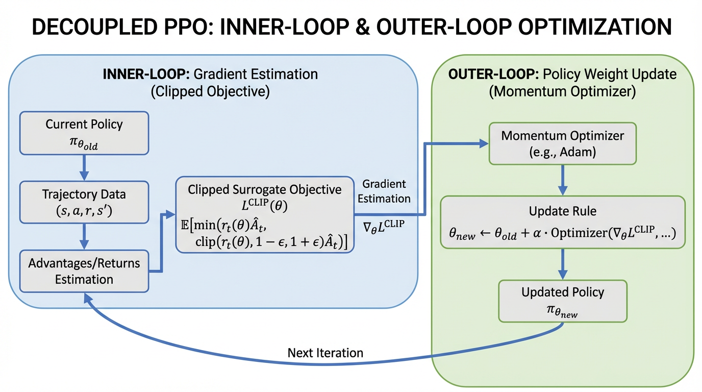

import PPOClippingVisualizer from '../../components/chapter-10/PPOClippingVisualizer.tsx';

# 10.2 PPO (Proximal Policy Optimization)

In Chapter 10.1, we established the "Feedback-Data Factory"—the asynchronous infrastructure required to generate, filter, and verify trajectories. However, collecting high-quality preference data is only the prerequisite. To fundamentally alter the model's behavior, we must translate these verified trajectories into physical weight updates. 

Historically, Reinforcement Learning (RL) has been notoriously unstable when applied to deep neural networks. A single aggressive weight update can cause "policy collapse," where the model forgets its pre-trained syntax and devolves into generating gibberish. Proximal Policy Optimization (PPO) was introduced to solve this exact stability problem. 

While classic PPO has been the workhorse of Alignment since 2017, the demands of modern Foundation Models have exposed its limitations. Recent state-of-the-art (SOTA) research from 2024 and 2025 has fundamentally deconstructed PPO, transforming it from a rigid algorithm into a modular gradient-estimation framework.

---

## The Trust Region and the Clipping Mechanism

To understand modern PPO, we must first look at the mathematical bottleneck it originally solved. When updating a policy $\pi_\theta$, we want to maximize the expected reward. However, if the new policy deviates too far from the old policy $\pi_{\theta_{old}}$, the mathematical assumptions used to estimate the advantage $\hat{A}_t$ break down. 

Trust Region Policy Optimization (TRPO) solved this by enforcing a strict Kullback-Leibler (KL) divergence constraint between the old and new policies. This required computing second-order derivatives (the Fisher Information Matrix), which is computationally prohibitive for billion-parameter LLMs.

PPO [[1]](#ref-1) approximates this trust region using a computationally cheap, first-order clipping mechanism. It relies on the probability ratio $r_t(\theta)$:

$$
r_t(\theta) = \frac{\pi_\theta(a_t|s_t)}{\pi_{\theta_{old}}(a_t|s_t)}
$$

Instead of a complex KL penalty, PPO optimizes a pessimistic surrogate objective:

$$
L^{CLIP}(\theta) = \hat{\mathbb{E}}_t \left[ \min(r_t(\theta)\hat{A}_t, \text{clip}(r_t(\theta), 1-\epsilon, 1+\epsilon)\hat{A}_t) \right]
$$

By taking the minimum between the unclipped and clipped versions, PPO ensures that the objective is bounded. If an action yields a positive advantage ($\hat{A}_t > 0$), the objective stops increasing once $r_t(\theta) > 1+\epsilon$. The gradient becomes zero, preventing the policy from over-updating on a single lucky trajectory.

### Interactive Visualizer: The PPO Surrogate Objective

Use the visualizer below to explore how the clipping mechanism reacts to positive and negative advantages. Notice that when $\hat{A}_t < 0$, the function only clips when $r_t(\theta) < 1-\epsilon$. It does *not* clip if $r_t(\theta)$ is greater than 1, because decreasing the probability of a bad action is exactly what we want the gradient to do.


<PPOClippingVisualizer client:load />

---

## The 2024 Paradigm Shift: Structural Decomposition (Outer-PPO)

For years, the RL community treated the PPO update as a single atomic operation: you calculate $L^{CLIP}$, call `.backward()`, and step your Adam optimizer. 

Recent research (Tan et al., 2024) [[2]](#ref-2) revealed a critical flaw in this monolithic view. Standard PPO implementations implicitly enforce a **unity learning rate (1.0)** and zero momentum on the actual policy step. The researchers proposed decomposing PPO into two distinct loops:

1. **The Inner Loop (Estimation):** The standard PPO clipped objective is iteratively optimized over a batch of data to estimate an optimal "update vector" (a pseudo-gradient).
2. **The Outer Loop (Application):** This update vector is then applied to the actual model weights using an arbitrary optimizer (like AdamW or SGD with momentum).

By decoupling estimation from application, engineers can apply non-unity learning rates and momentum to the *outer* loop. This "Outer-PPO" framework yields statistically significant improvements in sample efficiency and stability, particularly in high-dimensional continuous control and complex reasoning tasks, without altering the core surrogate objective.


*Source: AI-generated illustration.*

### Engineering the Decoupled Update

The following PyTorch implementation demonstrates how to structuralize this decoupled update. Notice how the inner loop operates on a cloned policy to estimate the update vector, which is then passed to the outer optimizer.

```python
import torch
import torch.nn as nn
import torch.optim as optim

def outer_ppo_step(
    policy: nn.Module,
    old_policy: nn.Module,
    states: torch.Tensor,
    actions: torch.Tensor,
    advantages: torch.Tensor,
    outer_optimizer: optim.Optimizer,
    clip_epsilon: float = 0.2,
    inner_epochs: int = 4
):
    """
    Demonstrates the Decoupled 'Outer-PPO' update (Tan et al., 2024).
    Shapes: states (B, SeqLen, Dim), actions (B, SeqLen), advantages (B, SeqLen)
    """
    # 1. Inner Loop: Estimate the update vector
    # Clone the policy to act as our 'inner' exploration point
    inner_policy = type(policy)(policy.config) # Assumes standard HF-style config init
    inner_policy.load_state_dict(policy.state_dict())
    
    # Inner optimizer uses a learning rate of 1.0 without momentum for pure estimation
    inner_optimizer = optim.SGD(inner_policy.parameters(), lr=1.0)
    
    for _ in range(inner_epochs):
        inner_optimizer.zero_grad()
        
        # Calculate probability ratio r_t(theta)
        current_logits = inner_policy(states).logits
        old_logits = old_policy(states).logits.detach()
        
        current_dist = torch.distributions.Categorical(logits=current_logits)
        old_dist = torch.distributions.Categorical(logits=old_logits)
        
        log_probs = current_dist.log_prob(actions)
        old_log_probs = old_dist.log_prob(actions)
        ratio = torch.exp(log_probs - old_log_probs)
        
        # Calculate the clipped surrogate objective
        surr1 = ratio * advantages
        surr2 = torch.clamp(ratio, 1.0 - clip_epsilon, 1.0 + clip_epsilon) * advantages
        
        # Maximize objective -> minimize negative objective
        loss = -torch.min(surr1, surr2).mean()
        
        loss.backward()
        inner_optimizer.step()
        
    # 2. Outer Loop: Apply the estimated update vector to the actual policy
    outer_optimizer.zero_grad()
    
    # Calculate the pseudo-gradient for the outer optimizer
    with torch.no_grad():
        for param, inner_param in zip(policy.parameters(), inner_policy.parameters()):
            # pseudo-gradient = current_weight - optimized_inner_weight
            param.grad = param.data - inner_param.data
            
    # Apply the update using the outer optimizer (e.g., AdamW with tuned LR/momentum)
    outer_optimizer.step()
    
    # Sync the old policy for the next rollout phase
    old_policy.load_state_dict(policy.state_dict())
```

---

## Overcoming Sample Inefficiency: Hybrid-Policy PPO (HP3O)

A fundamental drawback of standard PPO is that it is strictly **on-policy**. Once a batch of trajectories is used for an update, it is discarded. For large-scale LLM alignment, throwing away expensive, verifiable trajectories after a single update is highly inefficient.

However, simply injecting old trajectories (off-policy data) breaks the mathematical bounds of the trust region, leading to high variance and distribution drift. 

To bridge this gap, recent advancements like **HP3O (Hybrid-Policy Proximal Policy Optimization)** [[3]](#ref-3) introduce a trajectory-aware replay mechanism. HP3O utilizes a strict FIFO (First-In, First-Out) Trajectory Replay Buffer. During the update phase, the algorithm samples a hybrid batch consisting of:
1. The **best-performing trajectory** from recent history.
2. A random selection of recent trajectories from the FIFO buffer.

By anchoring the update to the most recent "success" while strictly limiting the age of the buffer via FIFO, HP3O attenuates data distribution drift. It empirically reduces the variance of the gradient estimator and significantly lowers the sample complexity required to align complex reasoning behaviors.

### Classic vs. Modern SOTA PPO

| Feature | Classic PPO (2017) | Modern SOTA (2024-2025) |
| :--- | :--- | :--- |
| **Update Logic** | Single-step gradient ascent on surrogate loss. | Decoupled Inner (estimation) and Outer (application) loops. |
| **Outer Optimizer** | Implicit learning rate of 1.0, no momentum. | Explicitly tuned LR, utilizing momentum (e.g., AdamW/Nesterov). |
| **Data Usage** | Purely on-policy; trajectories discarded after use. | Trajectory-aware FIFO buffers (HP3O) for hybrid off/on-policy learning. |
| **Stability Source** | Bounded purely by the $\epsilon$ clipping mechanism. | Bounded by clipping + outer-loop momentum + trajectory recency. |

---

## Summary & Next Steps

Proximal Policy Optimization is no longer just a static algorithm; it is a framework for stable gradient estimation. By decoupling the inner estimation loop from the outer application loop (Outer-PPO) and utilizing trajectory-aware replay buffers (HP3O), engineers can extract maximum value from the asynchronous Feedback-Data Factory without succumbing to policy collapse.

However, PPO still requires maintaining multiple models in memory (Policy, Reference, Reward, and Value models), making it exceptionally memory-heavy. In **10.3 DPO (Direct Preference Optimization)**, we will explore a mathematical breakthrough that completely bypasses the Reward Model and the RL loop, optimizing preferences directly over the supervised loss.

## Quizzes

<details>
<summary>Quiz 1: Why does PPO clip the probability ratio $r_t(\theta)$ instead of using a hard KL-divergence constraint like TRPO?</summary>
*Enforcing a hard KL-divergence constraint requires computing second-order derivatives (the Fisher Information Matrix), which is computationally prohibitive for large neural networks. Clipping provides a first-order approximation that prevents massive policy shifts while remaining computationally cheap.*
</details>

<details>
<summary>Quiz 2: In the "Outer-PPO" framework, what implicit hyperparameter in standard PPO is exposed and tuned?</summary>
*Standard PPO implicitly applies the estimated update vector with a fixed outer-loop learning rate of 1.0 and zero momentum. Outer-PPO exposes this, allowing engineers to apply standard optimizers (with tuned learning rates and momentum) to the application phase of the update.*
</details>

<details>
<summary>Quiz 3: If an action yields a negative advantage ($\hat{A}_t < 0$) and the probability ratio $r_t(\theta)$ is 1.5, does the PPO objective clip the gradient?</summary>
*No. If the advantage is negative, we want to decrease the probability of that action. An $r_t(\theta)$ of 1.5 means the policy has actually increased the probability of this bad action. The clipping function $\min(rA, \text{clip}(r)A)$ will evaluate to the unclipped $rA$, allowing the gradient to aggressively push the probability back down.*
</details>

<details>
<summary>Quiz 4: Why does HP3O use a strict FIFO buffer instead of DQN-style Prioritized Experience Replay (PER)?</summary>
*PPO relies on proximal (trust region) updates. PER heavily biases the data distribution toward high-error transitions, which aggressively breaks the on-policy assumptions and causes massive distribution drift. A FIFO buffer ensures recency, maintaining the "proximal" nature of the data while still improving sample efficiency.*
</details>

---

## References

1. <a id="ref-1"></a>Schulman, J., et al. (2017). *Proximal Policy Optimization Algorithms*. [arXiv:1707.06347](https://arxiv.org/abs/1707.06347).
2. <a id="ref-2"></a>Tan, C. B., et al. (2024). *Beyond the Boundaries of Proximal Policy Optimization*. [arXiv:2411.00632](https://arxiv.org/abs/2411.00632).
3. <a id="ref-3"></a>Liu, Q., et al. (2025). *Enhancing PPO with Trajectory-Aware Hybrid Policies*. [arXiv:2502.15579](https://arxiv.org/abs/2502.15579).