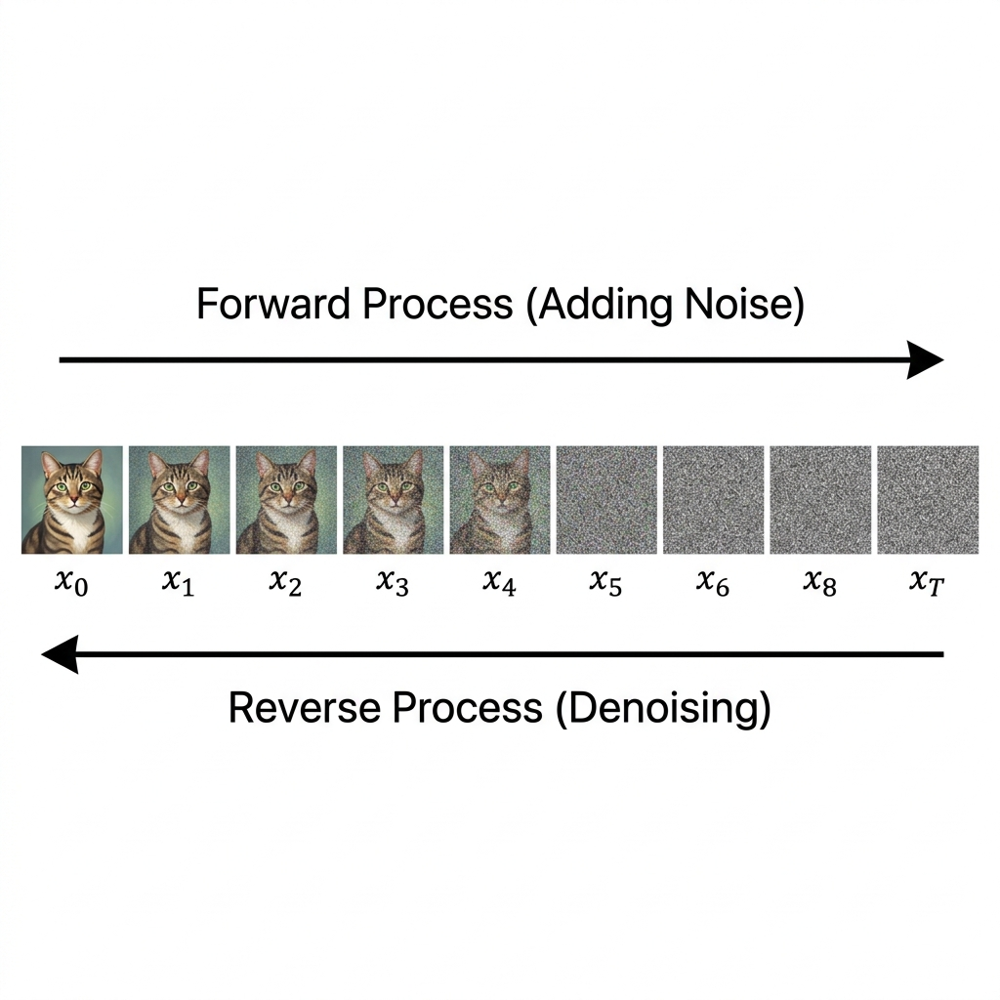

import DiffusionVisualizer from '../../components/chapter-11/DiffusionVisualizer.tsx';


# 11.4 Image Diffusion Models

While the previous sections focused on understanding and bridging different modalities, this section dives into **generation**—specifically, how models generate high-fidelity images from text prompts. The breakthrough that enabled this is **Diffusion**, a paradigm that has largely superseded Generative Adversarial Networks (GANs) and Autoregressive models for visual synthesis.

## 1. The Analogy: Clearing the Fog

Imagine looking through a window completely covered in thick, random fog. You cannot see anything outside. Now imagine you have a magical tool that can slightly clear the fog, step by step. If you know what you *want* to see (e.g., a cat in a garden), you can use that knowledge to guide the clearing process. At each step, you remove a bit of the random fog and add a bit of structure that looks like a cat. Eventually, the window is clear, and a beautiful image of a cat appears.

This is exactly how Diffusion Models work. They start with a canvas of pure random noise (the thick fog) and iteratively remove noise while adding structure, guided by a text prompt, until a clear image emerges.


<DiffusionVisualizer client:load />

---

## 2. The Core Mechanics: Forward and Reverse Diffusion

Diffusion models are continuous-time generative models motivated by non-equilibrium thermodynamics. They learn to generate data by reversing a process that gradually destroys data with noise.

### The Forward Process (Gaussian Diffusion)
In the forward process, we take a clean image $x_0 \sim q(x)$ and gradually add Gaussian noise to it over a series of time steps $T$. 
This process is defined as a Markov chain:
$$ q(x_{1:T} | x_0) = \prod_{t=1}^T q(x_t | x_{t-1}) $$
$$ q(x_t | x_{t-1}) = \mathcal{N}(x_t; \sqrt{1 - \beta_t} x_{t-1}, \beta_t \mathbf{I}) $$
Where $\beta_t$ is a variance schedule. 

A crucial property of this formulation is that it allows us to sample $x_t$ at any arbitrary time step $t$ directly from $x_0$ without iterating through the intermediate steps, using the reparameterization trick:
$$ x_t = \sqrt{\bar{\alpha}_t} x_0 + \sqrt{1 - \bar{\alpha}_t} \epsilon $$
Where $\alpha_t = 1 - \beta_t$, $\bar{\alpha}_t = \prod_{s=1}^t \alpha_s$, and $\epsilon \sim \mathcal{N}(0, \mathbf{I})$. As $T \to \infty$, $x_T$ becomes nearly indistinguishable from pure Gaussian noise.

### The Reverse Process (Generative Denoising)
The goal of generative modeling is to learn the reverse process $q(x_{t-1} | x_t)$. If we can reverse this process, we can start from random noise $x_T \sim \mathcal{N}(0, \mathbf{I})$ and generate a sample from the true data distribution $x_0$.

While the true reverse distribution is intractable (as it depends on the entire data distribution), Ho et al. (2020) [[1]](#ref-1) showed that for small $\beta_t$, the reverse step $q(x_{t-1} | x_t)$ can also be approximated as a Gaussian. We train a neural network $p_\theta(x_{t-1} | x_t)$ to learn this reverse transition:
$$ p_\theta(x_{t-1} | x_t) = \mathcal{N}(x_{t-1}; \mu_\theta(x_t, t), \Sigma_\theta(x_t, t)) $$

In practice, instead of predicting the mean $\mu_\theta$ directly, it yields better results to train the network $\epsilon_\theta(x_t, t)$ to predict the noise $\epsilon$ that was added to $x_0$ to produce $x_t$. The loss function simplifies to a simple Mean Squared Error (MSE) regression:
$$ \mathcal{L}_{simple} = \mathbb{E}_{t, x_0, \epsilon} [ \| \epsilon - \epsilon_\theta(x_t, t) \|^2 ] $$

This connection to **Score Matching** and Langevin dynamics is what makes diffusion models so powerful. The network is essentially learning the gradient of the log-density of the data distribution (the score function).


*Figure: The forward diffusion process adding noise, and the reverse process removing it.*

---

## 3. Latent Diffusion Models (LDM): Solving the Resolution Crisis

Early diffusion models operated directly in the pixel space. While effective, this approach was computationally devastating for high-resolution images. Processing massive tensors at every time step through deep U-Nets made training and inference prohibitively expensive.

The breakthrough that led to **Stable Diffusion** was **Latent Diffusion** [[2]](#ref-2). The key insight was to separate the learning process into two distinct stages:

### Stage 1: Perceptual Compression (VAE)
We train an autoencoder (specifically, a Variational Autoencoder or VAE). The encoder $\mathcal{E}$ maps a high-resolution image $x \in \mathbb{R}^{H \times W \times 3}$ into a lower-dimensional latent space $z = \mathcal{E}(x) \in \mathbb{R}^{h \times w \times c}$, where $h \ll H$ and $w \ll W$. The decoder $\mathcal{D}$ maps it back: $\tilde{x} = \mathcal{D}(z)$.
This step removes high-frequency, imperceptible details and reduncancy, leaving only the core semantic information in the latent space.

### Stage 2: Semantic Generation (Latent Diffusion)
The diffusion process (both forward and reverse) is performed entirely within this compressed latent space. The network now predicts noise in the latent space $z_t$, dramatically reducing computational cost.

### Conditioning via Cross-Attention
To enable text-to-image generation, LDM introduces cross-attention mechanisms into the denoising network. A text prompt $y$ is encoded using a pre-trained text encoder (like CLIP), and these embeddings are projected into the U-Net's attention layers:
$$ \text{Attention}(Q, K, V) = \text{softmax}\left(\frac{QK^T}{\sqrt{d}}\right)V $$
Where $Q$ is derived from the flattened latent representation and $K, V$ are derived from the text embeddings. This allows the model to generate images that strictly adhere to the semantic concepts described in the text.

---

## 4. Diffusion vs. GANs: Why Diffusion Won

For years, Generative Adversarial Networks (GANs) were the state-of-the-art for image generation. However, Diffusion models have largely replaced them. Why?

1.  **Stable Training**: GANs are notoriously difficult to train because they rely on a minimax game between a generator and a discriminator. This often leads to training instability and oscillations. Diffusion models, on the other hand, use a simple MSE regression loss, making training highly stable and scalable.
2.  **Avoiding Mode Collapse**: GANs often suffer from mode collapse, where the generator learns to produce only a small subset of the data distribution that fools the discriminator. Diffusion models explicitly maximize the likelihood of the data distribution, ensuring much better coverage of all modes in the dataset.
3.  **Scalability**: Diffusion models scale remarkably well with compute and model parameters, similar to LLMs, unlocking the capabilities seen in models like Flux.

---

## 5. Famous Open-Source Models and Comparison

While Stable Diffusion catalyzed the field, several other powerful open-source models have emerged.

| Model | Architecture | Open Source? | Key Feature / Innovation |
| :--- | :--- | :--- | :--- |
| **Stable Diffusion v1.5/2.1** | U-Net + CLIP | Yes | Popularized latent diffusion; massive community ecosystem. |
| **SDXL (Stable Diffusion XL)** | Larger U-Net + Refiner | Yes | Better anatomy, photorealism, and native high-res generation. |
| **Flux.1** | Diffusion Transformer (DiT) | Yes (Dev/Schnell) | State-of-the-art prompt adherence and text rendering. |
| **PixArt-$\alpha$** | DiT + T5 | Yes | Highly efficient training; excellent text-to-image alignment. |
| **Kandinsky** | UnCLIP-like | Yes | Excellent multilingual support and image-to-image capabilities. |

---

## 6. Case Study: The Rise and Evolution of Stable Diffusion

The story of Stable Diffusion is one of the most fascinating chapters in the history of generative AI. It highlights how open-source accessibility can rapidly accelerate technology while also showing the reality of architectural limitations.

### The Boom: Democratization and the Community
In 2022, OpenAI's DALL-E 2 wowed the world, but it was kept behind a closed API. Shortly after, Stable Diffusion was released with **open weights**. Anyone with a decent consumer GPU could download and run it.

This triggered a Cambrian explosion:
*   **Ecosystem Growth**: Developers built WebUIs (like Automatic1111 and ComfyUI) that turned SD into a professional tool.
*   **Micro-tuning (LoRAs)**: The community invented ways to fine-tune SD on specific styles or characters using just a few images.
*   **ControlNet**: Researchers developed ControlNet, allowing users to guide generation with sketches, poses, or depth maps.

### The Pivot: Scaling Walls and Corporate Shifts
However, by 2024, the landscape began to shift. The original Stable Diffusion models were based on the **U-Net** architecture. As users demanded higher resolutions and better text rendering, U-Net began to hit a wall.

The researchers who left Stability AI formed a new company, **Black Forest Labs**, and released **Flux.1**. Flux abandoned the U-Net in favor of a **Diffusion Transformer (DiT)**, treating image patches as tokens, which scales much better and achieved a massive leap in prompt adherence and text rendering.

---

## 7. Code: Simple Noise Prediction Step

To understand the formulas above, here is a simple PyTorch simulation of a single step in a Denoising Diffusion Probabilistic Model (DDPM).

```python
import torch
import torch.nn as nn

class SimpleDenoisingModel(nn.Module):
    def __init__(self, img_channels=3):
        super().__init__()
        # A simple CNN to predict noise
        self.net = nn.Sequential(
            nn.Conv2d(img_channels, 64, 3, padding=1),
            nn.ReLU(),
            nn.Conv2d(64, 64, 3, padding=1),
            nn.ReLU(),
            nn.Conv2d(64, img_channels, 3, padding=1)
        )
        
    def forward(self, x, t):
        # In a real model, 't' (time step) is embedded and injected into the network
        return self.net(x)

def ddpm_step(x_t, predicted_noise, t, beta_t):
    """
    A simplified single step of the reverse DDPM process.
    """
    alpha_t = 1 - beta_t
    # Formula to estimate x_{t-1} from x_t and predicted noise
    x_prev = (1 / torch.sqrt(alpha_t)) * (x_t - (beta_t / torch.sqrt(1 - alpha_t)) * predicted_noise)
    
    # Add noise in reverse step (except for the last step)
    if t > 0:
        noise = torch.randn_like(x_t)
        x_prev += torch.sqrt(beta_t) * noise
        
    return x_prev

# Simulation
img = torch.randn(1, 3, 64, 64) # Start with pure noise
model = SimpleDenoisingModel()
beta_schedule = torch.linspace(0.0001, 0.02, 1000)

# One step of denoising
t = 999
pred_noise = model(img, t)
denoised_img = ddpm_step(img, pred_noise, t, beta_schedule[t])
print(f"Denoised image shape: {denoised_img.shape}")
```

---

## 8. Beyond Images: Diffusion-Based LLMs

As we will explore in **Chapter 20.6 (Diffusion-based LLMs)**, researchers are actively developing techniques to apply diffusion to language modeling. By performing diffusion in the continuous embedding space or using discrete diffusion processes, these models offer potential advantages over standard autoregressive LLMs, such as non-autoregressive generation and better controllability.

---

## Quizzes

<details>
<summary>Quiz 1: Why does Latent Diffusion use less compute than pixel-space diffusion?</summary>
*Because it operates in a lower-dimensional latent space compressed by a VAE, rather than processing massive high-resolution pixel tensors at every time step.*
</details>

<details>
<summary>Quiz 2: What is the purpose of the forward process in Diffusion models?</summary>
*The forward process gradually adds noise to a clean image until it becomes pure noise. This provides the training data for the model to learn the reverse process (denoising).*
</details>

<details>
<summary>Quiz 3: What architecture transition enables models like Flux to scale better than traditional Stable Diffusion?</summary>
*Transitioning from a U-Net architecture to a Diffusion Transformer (DiT) architecture, which scales better with compute and parameters.*
</details>

---

## References

1. <a id="ref-1"></a>Ho, J., Jain, A., & Abbeel, P. (2020). *Denoising diffusion probabilistic models*. [arXiv:2006.11239](https://arxiv.org/abs/2006.11239).
2. <a id="ref-2"></a>Rombach, R., et al. (2022). *High-resolution image synthesis with latent diffusion models*. [arXiv:2112.10752](https://arxiv.org/abs/2112.10752).
3. <a id="ref-3"></a>Peebles, W., & Xie, S. (2023). *Scalable diffusion models with transformers*. [arXiv:2212.09748](https://arxiv.org/abs/2212.09748).
