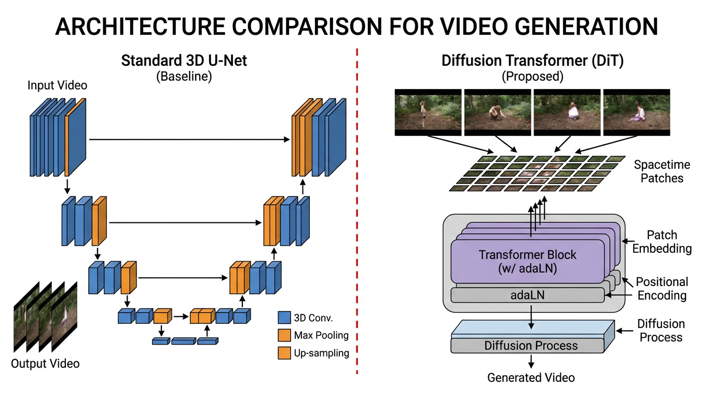

import SpatiotemporalAttentionVisualizer from '../../components/chapter-11/SpatiotemporalAttentionVisualizer.tsx';

# 11.5 Video Generation Foundations

Earlier in this chapter, we saw two complementary ideas emerge: Any-to-Any systems map modalities into shared token spaces, and diffusion systems became a powerful backbone for image generation. When the output modality becomes continuous, high-dimensional video, those ideas collide at a much larger systems scale. Video generation is not merely about producing a sequence of images; it is about predicting the evolution of high-dimensional physical states over time.

Historically, video generation relied on cascaded 3D U-Nets (e.g., Stable Video Diffusion). In this paradigm, a base model generated low-resolution frames, and separate temporal super-resolution models interpolated the motion. While functional, this modular approach inherently struggled with long-term consistency and complex physics, often resulting in objects morphing unnaturally or violating basic physical laws.

One of the major breakthroughs in the 2024–2026 period was the wider adoption of **Diffusion Transformers (DiT)** operating on **Spatiotemporal Patches**, a methodology popularized by OpenAI's Sora [[1]](#ref-1) and further extended by open-weight models like FullDiT [[2]](#ref-2) and Wan 2.1 [[3]](#ref-3). By treating video as a continuous 3D volume rather than a sequence of 2D frames, these models often display world-simulator-like behavior, especially around object permanence, camera motion, and temporal coherence.

---

## 1. Tokenizing the Multiverse: Spacetime Patches

To feed a video into a Transformer, we must first tokenize it. In text, we use Byte-Pair Encoding (BPE). In images (Vision Transformers), we use 2D spatial patches. For video, we use **Spacetime Patches** (or 3D Patches).

Instead of processing a video frame-by-frame, modern architectures utilize a **Spatiotemporal Autoencoder (3D VAE)**. This network compresses the raw pixel data—which has the shape $(Time \times Height \times Width \times Channels)$—across both spatial and temporal dimensions simultaneously into a lower-dimensional latent space.

This continuous latent volume is then divided into 3D chunks (e.g., $2 \times 2 \times 2$ latents) and flattened into a 1D sequence of tokens. This unified sequence encapsulates both the visual appearance and the motion dynamics over brief intervals.

Below is a realistic PyTorch implementation demonstrating how a compressed 3D video latent is converted into a flat sequence of tokens suitable for a Diffusion Transformer.

```python
import torch
import torch.nn as nn

class SpacetimePatchEmbed(nn.Module):
    """
    Converts a 3D latent video volume into a 1D sequence of spacetime tokens.
    """
    def __init__(self, in_channels=4, embed_dim=1152, patch_size=(2, 2, 2)):
        super().__init__()
        self.patch_size = patch_size
        
        # A 3D Convolution acts as the patch extraction and linear projection simultaneously.
        # The stride equals the patch size to ensure non-overlapping 3D patches.
        self.proj = nn.Conv3d(
            in_channels, embed_dim, 
            kernel_size=patch_size, 
            stride=patch_size
        )

    def forward(self, x):
        # x shape: (Batch, Channels, Time, Height, Width)
        B, C, T, H, W = x.shape
        
        # Extract and project patches
        x = self.proj(x)
        # Output shape: (Batch, embed_dim, T', H', W')
        # where T' = T // patch_size, H' = H // patch_size, etc.
        
        # Flatten the spatial and temporal dimensions into a single sequence dimension
        x = x.flatten(2) # shape: (Batch, embed_dim, T'*H'*W')
        
        # Transpose to match the standard Transformer expectation: (Batch, Sequence_Length, Embed_Dim)
        x = x.transpose(1, 2)
        
        return x

# Example execution simulating a compressed video latent
batch_size = 2
latent_channels = 4

# A 2-second video at 8 fps (16 frames), compressed spatially to 32x32 latents by the 3D VAE
video_latent = torch.randn(batch_size, latent_channels, 16, 32, 32)

patcher = SpacetimePatchEmbed(in_channels=latent_channels, embed_dim=1152, patch_size=(2, 2, 2))
tokens = patcher(video_latent)

print(f"Input latent shape: {video_latent.shape}")
print(f"Output token sequence shape: {tokens.shape}")
# Sequence length = (16/2) * (32/2) * (32/2) = 8 * 16 * 16 = 2048 tokens
```

---

## 2. The $O(n^2)$ Nightmare: Attention in Video

While tokenizing video into a 1D sequence is elegant, it introduces a catastrophic computational bottleneck. A 10-second 720p video at 24 fps can easily generate over 100,000 tokens. Because standard self-attention has an $O(n^2)$ time and memory complexity, computing attention across all tokens simultaneously is infeasible on standard hardware.

Engineers have developed several architectural strategies to route information efficiently:

1. **Factorized Attention (Pseudo-3D)**: The model first computes attention only across spatial tokens within the same frame, followed by a separate attention layer across the temporal axis for the same spatial position. While computationally cheaper, it severely limits the model's ability to track objects that move rapidly across the screen.
2. **Full Spatiotemporal Attention**: Every token attends to every other token across space and time. Models like FullDiT [[2]](#ref-2) utilize hardware-aware implementations (like RingAttention) to make this tractable, resulting in vastly superior temporal consistency.
3. **Sparse / Compact Attention**: Recent innovations like NABLA (Neighborhood Adaptive Block-Level Attention) dynamically restrict the attention mask. Specialized attention heads focus only on local 3D neighborhoods, cross-shaped spatial interactions, or specific temporal distances, drastically reducing FLOPs without sacrificing generation quality.

<SpatiotemporalAttentionVisualizer client:load />

---

## 3. The Diffusion Transformer (DiT) Backbone

Once the video is tokenized and the attention mechanism is defined, the actual generation is handled by the **Diffusion Transformer** [[4]](#ref-4). Unlike legacy U-Nets, which rely on rigid spatial downsampling and upsampling blocks, DiTs operate on a flat sequence of tokens, making them inherently flexible to arbitrary resolutions, aspect ratios, and durations.


*Source: AI-generated illustration*

### Adaptive Layer Normalization (adaLN)
How does a flat Transformer know *what* to generate? In a DiT, conditions are injected via **Adaptive Layer Normalization (adaLN)**. The text prompt embedding, the current diffusion timestep (noise level), and other global conditions are passed through a Multi-Layer Perceptron (MLP). This MLP outputs the scale ($\gamma$) and shift ($\beta$) parameters for the layer normalization applied before every self-attention and feed-forward block. This continuously guides the denoising process toward the target distribution without requiring computationally heavy cross-attention layers for every single condition.

### In-Context Conditioning
For advanced video generation, users often provide multiple conditions simultaneously: a text prompt, a starting image, a depth map sequence, and camera trajectory vectors. 

Modern architectures like FullDiT employ **In-Context Conditioning**. Instead of training a separate adapter network for each condition (which causes parameter redundancy and branch conflicts), the model tokenizes all conditioning signals and concatenates them directly with the noisy video latents into a single massive sequence. The full self-attention mechanism natively resolves the complex interplay between the camera movement, the depth map, and the text prompt, ensuring perfectly synchronized motion.

---

## 4. Emergent World Simulation

When a DiT is scaled to massive proportions (e.g., the Wan 2.1 14B model) and trained on trillions of spacetime patches encompassing diverse physics, geometry, and lighting, a fascinating phenomenon occurs: the model begins to exhibit properties of a **world simulator** [[1]](#ref-1).

Because the model is forced to predict how a noisy 3D latent volume resolves into a clean video, it must internally learn the rules governing that volume:
- **Object Permanence**: If a car drives behind a building, the self-attention mechanism retains the car's tokens in its context window, ensuring the car reappears on the other side with the correct color and trajectory.
- **3D Consistency**: When the prompt specifies a "drone circling a statue," the model accurately renders the shifting perspectives, lighting reflections, and background parallax, effectively acting as an implicit neural rendering engine.
- **Fluid Dynamics & Physics**: Complex interactions, such as water splashing against rocks or glass shattering, are synthesized not through hardcoded physics engines, but through the statistical interpolation of spacetime patches learned from real-world data.

While these models are not yet perfect simulators (they still occasionally hallucinate impossible physics or merge objects), the trajectory is still notable: scaling Diffusion Transformers on continuous multimodal data remains one of the most promising current paths toward models that better internalize physical regularities.

---

## 5. The Multimodal Landscape and Future Directions

Multimodal learning has rapidly evolved from simple cross-modal alignment (like CLIP) to full any-to-any generation and physical world simulation. As we look at the current landscape and the path forward, several key trends emerge.

### State-of-the-Art Commercial Models
The frontier of video generation is defined by massive models trained on vast datasets:
- **OpenAI Sora**: Demonstrated unprecedented video quality and object permanence, acting as an early prototype of a world simulator.
- **Google Veo 3.1**: Google's state-of-the-art video generation model, pushing the boundaries of cinematic quality and prompt adherence.
- **Seedance**: Another example of high-fidelity video generation gaining attention in the creative industry.

### Beyond Generation: World Models
The concept of **World Models** is becoming central to multimodal research. Models like **Google Genie 3** take video generation a step further by allowing users to *interact* with the generated environment. It can take a single image or description and generate a playable, interactive world, effectively simulating physics and action-consequence loops.

### The Path Forward: JEPA and Alternative Paradigms
While auto-regressive and diffusion models dominate today, alternative paradigms are emerging for true understanding. Yann LeCun's **JEPA (Joint Embedding Predictive Architecture)** proposes learning representations by predicting in representation space rather than pixel space. As a fundamental shift away from generative models, we will explore JEPA and the future of autonomous agents in **Chapter 20**.

The future of multimodal AI lies in moving from passive generation to active simulation, where models do not just generate realistic videos, but understand and interact with the physical laws of the world they simulate.

---

## Summary & Next Steps

The transition from cascaded U-Nets to Diffusion Transformers marks the maturation of video generation. By compressing videos into Spacetime Patches and leveraging sophisticated spatiotemporal attention mechanisms, modern models process video as a unified 3D volume. This architectural elegance allows for seamless integration of multiple conditioning signals and unlocks emergent physical reasoning, laying the groundwork for true world simulators.

---

## Quizzes

<details>
<summary>Quiz 1: Why do modern video generation models use Spacetime Patches instead of processing frames individually?</summary>
*Processing frames individually (or using 2D patches per frame) ignores the temporal correlation between frames, often leading to flickering and inconsistent physics. Spacetime patches compress the video in both spatial and temporal dimensions simultaneously, allowing the Transformer to natively learn motion dynamics, object permanence, and 3D consistency across time.*
</details>

<details>
<summary>Quiz 2: What is the primary computational bottleneck of using Full Spatiotemporal Attention in video DiTs, and how do models mitigate it?</summary>
*Full Spatiotemporal Attention has an $O(n^2)$ complexity relative to the sequence length. High-resolution videos produce hundreds of thousands of tokens, making full attention intractable. Models mitigate this by using Factorized Attention (computing spatial then temporal attention separately), or advanced Sparse/Compact Attention mechanisms that restrict attention to local 3D neighborhoods or cross-shaped patterns.*
</details>

<details>
<summary>Quiz 3: How does Adaptive Layer Normalization (adaLN) function in a Diffusion Transformer (DiT)?</summary>
*Unlike standard layer normalization, adaLN dynamically scales and shifts the normalized activations based on external conditioning signals. In a DiT, the text prompt embedding, the current diffusion timestep (noise level), and other conditions are passed through an MLP to generate the scale and shift parameters for each Transformer block, effectively guiding the denoising process.*
</details>

<details>
<summary>Quiz 4: In the context of video generation, what is the advantage of "In-Context Conditioning" (as seen in FullDiT) over traditional adapter-based methods like ControlNet?</summary>
*Traditional adapters require training a separate neural branch for each condition (e.g., one for depth, one for camera poses), which causes parameter redundancy and branch conflicts when multiple conditions are used simultaneously. In-Context Conditioning concatenates all condition tokens directly with the noisy video latents into a single sequence, allowing the model's full self-attention mechanism to natively resolve the interactions and physics between all constraints.*
</details>

---

## References

1. <a id="ref-1"></a>Brooks, T., et al. (2024). *Video generation models as world simulators*. OpenAI. [OpenAI Research](https://openai.com/research/video-generation-models-as-world-simulators).
2. <a id="ref-2"></a>Ju, X., et al. (2025). *FullDiT: Multi-Task Video Generative Foundation Model with Full Attention*. [arXiv:2503.19907](https://arxiv.org/abs/2503.19907).
3. <a id="ref-3"></a>Wan Team. (2025). *Wan: Open and Advanced Large-Scale Video Generative Models*. [arXiv:2503.20314](https://arxiv.org/abs/2503.20314).
4. <a id="ref-4"></a>Peebles, W., & Xie, S. (2023). *Scalable Diffusion Models with Transformers*. [arXiv:2212.09748](https://arxiv.org/abs/2212.09748).
