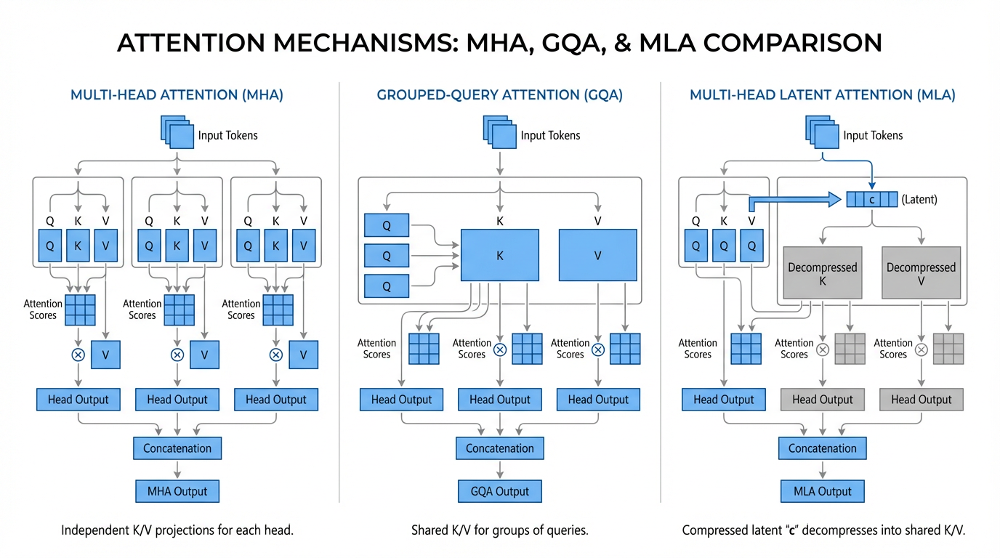

---
layout: ../../layouts/BookLayout.astro
title: 12.1 KV Cache Management
lang: en
---

import KVCacheCalculator from '../../components/chapter-12/KVCacheCalculator.tsx';

# 12.1 KV Cache Management

While multimodal architectures push the boundaries of *what* foundation models can generate, deploying these massive models in production environments introduces a harsh engineering reality. In the transition from academic research to datacenter-scale serving, the bottleneck shifts abruptly from raw compute (TFLOPS) to memory bandwidth and capacity. At the heart of this bottleneck lies a single, rapidly expanding data structure: the **KV Cache**.

To understand why serving Large Language Models (LLMs) is fundamentally different from serving traditional microservices, we must dive deep into the mechanics of autoregressive decoding, the physical limits of High Bandwidth Memory (HBM), and the clever architectural hacks engineers use to keep the memory wall at bay.

---

## 1. The Autoregressive Bottleneck

LLM inference operates in two distinct phases:
1. **The Prefill Phase**: The model processes the entire input prompt simultaneously. This phase is highly parallel, compute-bound, and fully utilizes the massive matrix-multiplication capabilities of modern GPUs.
2. **The Decode Phase**: The model generates the output one token at a time. Because token $N$ depends on the context of all tokens from $1$ to $N-1$, this process is strictly sequential.

If we naively compute the self-attention for each new token, the model must re-project every previous token in the sequence into Query (Q), Key (K), and Value (V) tensors, and then perform the attention calculation. This results in an $O(N^2)$ time complexity per generation step. For a 4,000-token response, the redundant computation becomes astronomically slow.

**The Solution:** As we generate new tokens, the Key and Value vectors for all *previous* tokens do not change. By caching these K and V tensors in GPU memory, the model only needs to compute the Q, K, and V for the *current* token. The current Q is then multiplied against the cached K and V matrices. This optimization reduces the per-step time complexity from $O(N^2)$ to $O(N)$, making real-time chat feasible.

However, this speed comes at a severe cost: memory.

---

## 2. The Mathematics of the Memory Wall

The KV cache is not a small buffer; it is a massive, dynamically growing memory allocation that often exceeds the size of the model's weights. 

For a standard Multi-Head Attention (MHA) model, the exact memory footprint in bytes required to store the KV cache for a single request is governed by this formula:

$$ \text{KV Cache Size} = 2 \times B \times S \times L \times H \times D \times P $$

Where:
- $2$: Accounts for both the Key and Value tensors.
- $B$: Batch size (number of concurrent requests).
- $S$: Sequence length (number of past tokens).
- $L$: Number of Transformer layers.
- $H$: Number of Attention Heads (KV heads).
- $D$: Dimension per head.
- $P$: Precision in bytes (e.g., 2 bytes for FP16/BF16).

Let's apply this to a theoretical 70B parameter model (80 layers, 8 KV heads (assuming GQA), 128 dimension) serving a batch of 32 users, each with an 8,192-token context, using FP16 precision:

$$ 2 \times 32 \times 8192 \times 80 \times 8 \times 128 \times 2 = 85,899,345,920 \text{ bytes} \approx 80 \text{ GB} $$

A single NVIDIA H100 GPU has 80 GB of HBM. In this scenario, the KV cache alone consumes all of the GPU's memory, leaving no room for the 140 GB of model weights. This is known as the **Memory Wall**. The decode phase is notoriously *memory-bandwidth bound*—the GPU's compute cores sit idle waiting for these massive KV tensors to stream from HBM into SRAM for every single generated token.

---

## 3. Architectural Evolution: MHA, GQA, and MLA

To mitigate the Memory Wall, researchers have aggressively modified the core Transformer architecture to reduce the $H$ (number of KV heads) variable in the formula.



### Multi-Query Attention (MQA) & Grouped-Query Attention (GQA)
Introduced around 2023, **MQA** forces all Query heads to share a *single* KV head. While this reduces the cache size by up to 64x, it severely degrades the model's reasoning capabilities. 

The industry standard quickly shifted to **Grouped-Query Attention (GQA)** (used in Llama 2/3, Mistral). GQA divides the Query heads into groups (e.g., 8 groups) and assigns one KV head per group. This provides a pragmatic 8x memory reduction with almost zero degradation in benchmark performance.

### Multi-Head Latent Attention (MLA): The Recent Trends
Pioneered by DeepSeek (V2, V3, and R1) [[1]](#ref-1), **Multi-Head Latent Attention (MLA)** completely redefines KV cache economics. Instead of caching high-dimensional K and V matrices, MLA projects the input into a highly compressed, low-dimensional **latent vector** $c_t \in \mathbb{R}^{d_c}$ (e.g., 512 dimensions). 

During inference, only this tiny latent vector is stored in the cache. 

**The Magic of Matrix Absorption:**
You might assume that during the decode phase, the model must read $c_t$ from memory and multiply it by an up-projection matrix to reconstruct the full multi-head K and V tensors, which would be computationally expensive. 
However, MLA utilizes a mathematical trick called *Matrix Absorption*. Because the attention score is computed as a dot product, the decompression matrix for the Keys ($W_{UK}$) can be mathematically absorbed into the Query projection matrix ($W_{DQ} W_{UQ}$). 

$$ \text{Attention Score} \propto (q_t W_{DQ} W_{UQ}) (c_t W_{UK})^T = q_t (W_{DQ} W_{UQ} W_{UK}^T) c_t^T $$

By pre-computing the absorbed matrix $(W_{DQ} W_{UQ} W_{UK}^T)$, the attention kernel can directly compute the dot product between the projected Query and the raw, compressed latent vector $c_t$ fetched from HBM. The high-dimensional Key matrix is *never materialized in memory*. 

*Note: To handle Rotary Position Embeddings (RoPE), which cannot be linearly absorbed, MLA explicitly caches a small, decoupled RoPE vector $r_t$ (e.g., 64 dimensions) alongside the latent vector.*

This reduces the KV cache footprint by an astounding **20x to 57x** compared to standard MHA, allowing massive models to serve huge batches of long-context requests on fewer GPUs.

<KVCacheCalculator client:load />

---

## 4. Data-Level Compression: Quantization

Beyond architectural changes, engineers tackle the $P$ (Precision) variable in the formula. By default, KV caches are stored in 16-bit precision (FP16 or BF16, 2 bytes per parameter). 

Modern inference engines (like vLLM and TensorRT-LLM) natively support **KV Cache Quantization**. By compressing the cache to FP8 (1 byte) or even INT4 (0.5 bytes), the memory footprint is halved or quartered. 

Because the decode phase is memory-bandwidth bound, reading an INT4 KV cache from HBM is up to 4x faster than reading an FP16 cache. The slight computational overhead required to dequantize the INT4 values back to FP16 in SRAM is completely hidden by the massive reduction in memory transfer time. This results in a direct, near-linear increase in token generation throughput (tokens/sec).

---

## 5. Engineering the Cache

To ground these concepts, below is a realistic PyTorch implementation of a Transformer attention layer that supports GQA and maintains a dynamic KV cache. Notice how the cache avoids recomputing past tokens by concatenating the current token's state to the historical tensor along the sequence dimension (`dim=1`).

```python
import torch
import torch.nn as nn
import torch.nn.functional as F

class CausalSelfAttention(nn.Module):
    """
    A realistic implementation of a Transformer attention layer supporting 
    Grouped-Query Attention (GQA) and KV Caching for autoregressive decoding.
    """
    def __init__(self, d_model=4096, n_heads=32, n_kv_heads=8):
        super().__init__()
        self.n_heads = n_heads
        self.n_kv_heads = n_kv_heads
        self.d_head = d_model // n_heads
        
        # Projections
        self.q_proj = nn.Linear(d_model, n_heads * self.d_head, bias=False)
        self.k_proj = nn.Linear(d_model, n_kv_heads * self.d_head, bias=False)
        self.v_proj = nn.Linear(d_model, n_kv_heads * self.d_head, bias=False)
        self.o_proj = nn.Linear(d_model, d_model, bias=False)
        
    def forward(self, x, kv_cache=None):
        # x shape: (Batch, Seq_Len, Dim)
        B, T, C = x.size()
        
        q = self.q_proj(x).view(B, T, self.n_heads, self.d_head)
        k = self.k_proj(x).view(B, T, self.n_kv_heads, self.d_head)
        v = self.v_proj(x).view(B, T, self.n_kv_heads, self.d_head)
        
        if kv_cache is not None:
            past_k, past_v = kv_cache
            # The core of KV Caching: Concatenate past history with the current token
            k = torch.cat([past_k, k], dim=1)
            v = torch.cat([past_v, v], dim=1)
            
        # Update the cache payload for the next autoregressive step
        new_kv_cache = (k, v)
        
        # GQA: Repeat K and V heads to match the number of Q heads
        groups = self.n_heads // self.n_kv_heads
        k = k.repeat_interleave(groups, dim=2)
        v = v.repeat_interleave(groups, dim=2)
        
        # Transpose for PyTorch attention computation: (Batch, Heads, Seq_Len, Dim)
        q = q.transpose(1, 2)
        k = k.transpose(1, 2)
        v = v.transpose(1, 2)
        
        # During decode (T=1), causal masking is implicitly handled by the cache structure.
        # During prefill (T>1), we must apply the causal mask.
        is_causal = T > 1
        
        # Utilize hardware-accelerated Flash Attention
        y = F.scaled_dot_product_attention(q, k, v, is_causal=is_causal)
        
        # Reshape back to flat sequence: (Batch, Seq_Len, Dim)
        y = y.transpose(1, 2).contiguous().view(B, T, C)
        return self.o_proj(y), new_kv_cache
```

---

## 6. The Fragmentation Problem (A Look Ahead)

The code above utilizes a naive strategy: allocating a contiguous PyTorch tensor and appending to it (`torch.cat`) at every step. In a production server handling hundreds of concurrent requests, this approach is disastrous. 

Because the final sequence length of a user's prompt is unknown at the start, the system must either over-allocate memory (wasting up to 80% of the cache capacity) or constantly reallocate and move tensors, causing severe memory fragmentation. Solving this OS-level memory management problem is the domain of **PagedAttention**, which we will explore in the next section.

---

## 7. Summary

Managing the KV cache is the most critical engineering challenge in LLM inference. By caching past Key and Value states, we drop the computational complexity of text generation from quadratic to linear. However, this optimization shifts the bottleneck to memory capacity and bandwidth. Innovations like Grouped-Query Attention (GQA), DeepSeek's Multi-Head Latent Attention (MLA), and INT4 quantization are essential tools for fitting massive context windows into limited GPU hardware.

---

## Quizzes

<details>
<summary>Quiz 1: Why does autoregressive generation without KV cache exhibit $O(N^2)$ time complexity per step?</summary>
*Without a cache, generating the $N$-th token requires re-projecting and re-calculating the attention scores for all $N-1$ previous tokens from scratch. Because this full sequence calculation must occur at every single step, the total time to generate $N$ tokens grows quadratically.*
</details>

<details>
<summary>Quiz 2: In the KV cache memory formula, why is the footprint multiplied by 2?</summary>
*The factor of 2 accounts for the fact that we must store both the Key (K) matrix and the Value (V) matrix for every token in the sequence.*
</details>

<details>
<summary>Quiz 3: How does DeepSeek's Multi-Head Latent Attention (MLA) avoid materializing high-dimensional Key matrices in memory during inference?</summary>
*MLA stores a low-dimensional latent vector in the cache. Through a mathematical technique called Matrix Absorption, the Key decompression matrix is absorbed directly into the Query projection matrix. This allows the attention kernel to compute the dot product between the projected Query and the raw, compressed latent vector fetched from HBM, bypassing the need to generate the full Key matrix.*
</details>

<details>
<summary>Quiz 4: If KV cache memory is reduced using INT4 quantization, what is the primary hardware trade-off encountered during the decode phase?</summary>
*The decode phase is heavily memory-bandwidth bound, meaning the GPU spends most of its time waiting for data to transfer from HBM to SRAM. While INT4 quantization introduces a slight computational overhead to dequantize the values back to FP16 in SRAM, it drastically reduces the time spent transferring data. Therefore, the trade-off is highly favorable, resulting in significantly higher token generation throughput.*
</details>

<details>
<summary>Quiz 5: Derive the exact mathematical formula for the memory footprint (in Gigabytes) of the KV cache for an LLM with $L$ layers, hidden dimension $d$, $H_Q$ query heads, $H_{KV}$ key-value heads (Grouped-Query Attention), sequence length $S$, batch size $B$, using float16 precision.</summary>
*In Grouped-Query Attention (GQA), the dimensions of the key and value vectors are reduced by the factor $H_{KV} / H_Q$. The dimension per KV head is $d_{head} = d / H_Q$. Thus, each token requires $2 \times L \times H_{KV} \times d_{head}$ parameters. For float16 precision, each parameter consumes 2 bytes. For batch size $B$ and sequence length $S$, the total memory in bytes is: $Memory = B \times S \times L \times H_{KV} \times \frac{d}{H_Q} \times 2 \times 2$ bytes. To convert this to Gigabytes (GB), we divide by $10^9$ or $2^{30}$. Therefore, the formula in GB is: $Footprint = \frac{4 \times B \times S \times L \times H_{KV} \times d}{H_Q \times 10^9}$ GB. This precise linear relationship with sequence length $S$ highlights why memory management is critical for long-context serving.*
</details>

---

## References

1. <a id="ref-1"></a>DeepSeek-AI (2025). *DeepSeek-V3 Technical Report*. [arXiv:2412.19437](https://arxiv.org/abs/2412.19437)
2. <a id="ref-2"></a>Ainslie, J., et al. (2023). *GQA: Training Generalized Multi-Query Transformer Models from Multi-Head Checkpoints*. [arXiv:2305.13245](https://arxiv.org/abs/2305.13245)