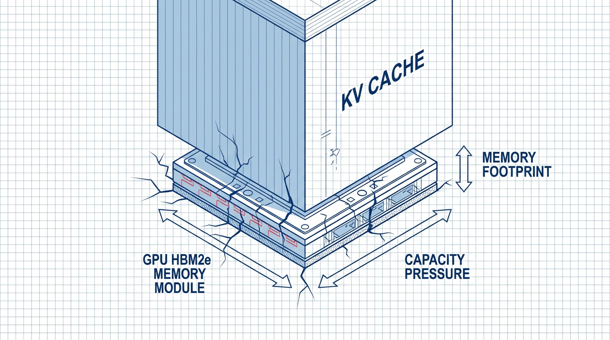
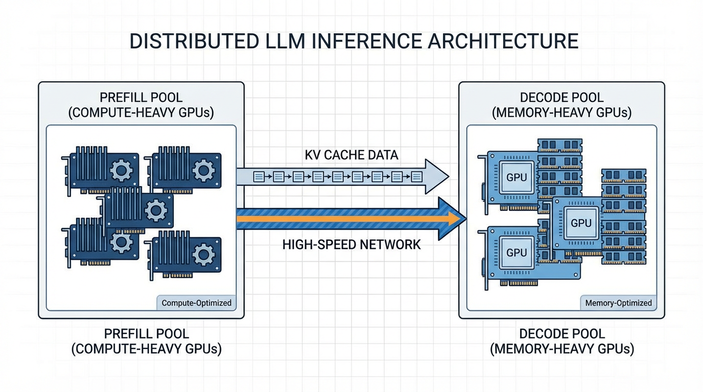

import SchedulingVisualizer from '../../components/chapter-12/SchedulingVisualizer.tsx';

# 12.5 Long Context Serving

The race to expand Large Language Model (LLM) context windows from a modest 4K tokens to 128K, 1M, and beyond has fundamentally broken traditional serving architectures. While model architectures can theoretically handle infinite context, the physical reality of GPU memory and compute scheduling dictates otherwise. 

Serving long-context models is no longer just an algorithmic challenge; it is a distributed systems problem. We must navigate the dichotomy between the compute-bound nature of processing massive prompts and the memory-bandwidth-bound nature of generating responses.

---

## 1. The Prefill-Decode Dichotomy and the Memory Wall

To understand why long context breaks traditional serving, we must revisit the two phases of LLM inference:

1.  **The Prefill Phase (Compute-Bound):** When a user submits a prompt, the model processes all tokens in parallel. This is a massive dense matrix multiplication. The GPU's arithmetic logic units (ALUs) are fully saturated, and the operation is bound by **Compute (TFLOPS)**.
2.  **The Decode Phase (Memory-Bound):** The model generates tokens autoregressively, one by one. For each new token, the model must read the entire history of past Keys and Values (the KV Cache) from High Bandwidth Memory (HBM) into the SRAM of the compute cores. This phase does very little math but moves massive amounts of data. It is bound by **Memory Bandwidth**.

### The "Head-of-Line Blocking" Problem

Imagine a grocery store. The Prefill phase is a customer with a cart full of 100,000 items. The Decode phase is a line of 50 customers, each buying a single candy bar. 

In traditional unified serving, if the 100,000-item customer gets to the register, the candy bar customers must wait. In LLM terms, an incoming 100K-token prompt will completely monopolize the GPU for several seconds. Any concurrent requests currently in the decode phase will stall, causing massive latency spikes (jitter) and destroying the Time Per Output Token (TPOT) metric.

### The Long Context Tax (Math)

The sheer size of the KV Cache becomes a "Memory Wall." Let's calculate the memory required to store the KV Cache for a single sequence.

$$
\text{Memory} = 2 \times 2 \times n_{\text{layers}} \times n_{\text{heads}} \times d_{\text{head}} \times L \times b \text{ (bytes)}
$$

Where:
*   $2$ for Key and Value.
*   $2$ bytes per parameter (FP16/BF16).
*   $n_{\text{layers}}$ = number of transformer layers.
*   $n_{\text{heads}}$ = number of attention heads.
*   $d_{\text{head}}$ = dimension per head.
*   $L$ = sequence length.
*   $b$ = batch size.

For a Llama-3-8B model ($n_{\text{layers}}=32$, $n_{\text{heads}}=32$, $d_{\text{head}}=128$):
*   At $L = 4,096$, the KV cache is $\sim 1$ GB.
*   At $L = 128,000$, the KV cache is **$\sim 32$ GB**.

A single request takes up nearly half the VRAM of an 80GB H100. You cannot batch requests efficiently. The GPU sits idle, starved of memory capacity, while its compute cores go unused.



---

## 2. Algorithmic Mitigation: StreamingLLM and YaRN

Before tackling the systems engineering, we must address how researchers algorithmically compress or trick the model into handling longer contexts without exploding memory.

### StreamingLLM: The Attention Sinks Phenomenon
Standard LLMs fail when the sequence length during inference exceeds the pre-training length, as the KV cache evicts old tokens and attention scores collapse. StreamingLLM [[1]](#ref-1) made a fascinating observation: **Attention Sinks**.

The model naturally assigns a disproportionate amount of attention score to the very first few tokens of a sequence, regardless of their semantic meaning. They act as a "sink" for the Softmax function to dump unnecessary attention mass. 

If you evict these initial tokens from the KV cache to save memory, the model's perplexity explodes. StreamingLLM proposes a simple windowed attention mechanism: **Keep the first 4 tokens (the sinks) permanently in the KV cache, alongside a sliding window of the most recent $N$ tokens.** This allows models to stream infinite text with a fixed $O(1)$ memory footprint.

### YaRN (Yet another RoPE extensioN)
For tasks requiring true long-context comprehension (like needle-in-a-haystack retrieval), you cannot simply drop tokens. YaRN [[2]](#ref-2) modifies Rotary Position Embeddings (RoPE) to stretch the context window. Instead of extrapolating positional embeddings (which fails catastrophically), YaRN uses **NTK-aware interpolation**. It scales the phase of the RoPE embeddings non-linearly, allowing a model trained on 4K tokens to effectively understand 32K or 128K tokens with minimal fine-tuning.

---

## 3. Systems Engineering: Scaling Chunked Prefill

To mitigate the extreme "Head-of-Line Blocking" problem caused by massive prompts, we rely on **Chunked Prefill**, a concept introduced in detail in Section 12.3. 

In the context of long-context serving, Chunked Prefill breaks a massive prompt (e.g., 100K tokens) into manageable chunks (e.g., 4,096 tokens) and interleaves them with the decoding steps of other active requests. While this prevents total system freezes, it introduces specific challenges at this scale:
*   **Linear TTFT Increase**: Time-To-First-Token (TTFT) for the long prompt increases linearly with the number of chunks, as the prefill is spread over multiple iterations.
*   **The Backlog Wall**: For ultra-long contexts (e.g., 1M tokens), chunking alone still creates a massive backlog of prefill work, eventually slowing down the entire system.

This limitation directly motivates the physical separation of compute and memory pools, leading to the current state-of-the-art: **Disaggregated Serving** (Section 4).

### PyTorch Simulation: Chunked Prefill Scheduler

Below is a simplified, runnable PyTorch simulation demonstrating how a scheduler manages chunked prefill vs. unified prefill.

```python
import torch
import time

class MockInferenceEngine:
    def __init__(self, max_chunk_size=4096):
        self.max_chunk_size = max_chunk_size
        self.hidden_dim = 4096
        # Simulate a GPU compute stream
        self.device = torch.device("cuda" if torch.cuda.is_available() else "cpu")

    def unified_prefill(self, prompt_len):
        """Simulates a blocking, massive prefill operation."""
        # Simulate O(N^2) attention compute cost roughly
        flops = (prompt_len ** 2) * self.hidden_dim
        # Dummy computation to simulate GPU load
        x = torch.randn(prompt_len, self.hidden_dim, device=self.device)
        _ = torch.matmul(x, x.T) 
        torch.cuda.synchronize() if torch.cuda.is_available() else None
        return flops

    def decode_step(self, batch_size):
        """Simulates a memory-bound decode step."""
        # Decode is fast but memory bandwidth bound
        x = torch.randn(batch_size, self.hidden_dim, device=self.device)
        _ = x * 0.1 # Trivial compute
        torch.cuda.synchronize() if torch.cuda.is_available() else None
        return batch_size * self.hidden_dim

def simulate_scheduling():
    engine = MockInferenceEngine(max_chunk_size=4096)
    long_prompt = 32768
    active_decodes = 10 # 10 users waiting for their next token
    
    print("--- Unified Serving (Head-of-Line Blocking) ---")
    start = time.time()
    engine.unified_prefill(long_prompt)
    prefill_time = time.time() - start
    print(f"Prefill (32k) took: {prefill_time:.4f}s. Decode users stalled for this duration!")
    
    print("\n--- Chunked Prefill Serving ---")
    chunks = [engine.max_chunk_size] * (long_prompt // engine.max_chunk_size)
    
    start_total = time.time()
    for i, chunk in enumerate(chunks):
        # 1. Process a chunk of the long prompt
        engine.unified_prefill(chunk)
        # 2. Immediately process a decode step for active users
        engine.decode_step(active_decodes)
        
        if i == 0:
            print(f"First chunk processed in {time.time() - start_total:.4f}s. Decode users get tokens early!")
            
    print(f"Total Chunked Prefill + 8 Decode steps took: {time.time() - start_total:.4f}s")

if __name__ == "__main__":
    simulate_scheduling()
```

---

## 4. The SOTA: Disaggregated Serving

Even with chunked prefill, a single GPU or homogenous cluster struggles to balance the conflicting hardware requirements of Prefill (needs TFLOPS) and Decode (needs Memory Bandwidth/Capacity).

The current state-of-the-art, championed by architectures like **Splitwise** [[4]](#ref-4) and **DistServe** [[5]](#ref-5), is **Disaggregated Serving**.

### Separating the Pools
Disaggregated serving physically separates the inference pipeline into two distinct clusters of GPUs:

1.  **The Prefill Pool:** Composed of compute-heavy GPUs (e.g., NVIDIA H100s). These machines ingest the massive prompts, calculate the initial KV cache, and generate the first token.
2.  **The Decode Pool:** Composed of memory-heavy, potentially cheaper GPUs (e.g., NVIDIA L40S or older A100s). These machines take over the autoregressive generation.

### The New Bottleneck: Network Transfer
When you split the workload, you introduce a new problem: **KV Cache Transfer**. 
Once the Prefill Pool finishes, it must send the massive KV Cache (e.g., 32GB for a 128K context) over the network to the Decode Pool. If the network is slow, the transfer time negates the benefits of disaggregation.

To solve this, SOTA systems rely on:
*   **High-speed Interconnects:** InfiniBand or RoCE (RDMA over Converged Ethernet) to move memory directly between GPU VRAMs bypassing the CPU (GPUDirect RDMA).
*   **KV Cache Quantization:** Compressing the KV cache from FP16 to FP8 or INT4 before transmission, halving the network payload and the VRAM footprint on the Decode node.



---

## 5. Interactive Visualization: Scheduling Strategies

To truly grasp the impact of these systems, interact with the timeline below. It visualizes how Unified, Chunked, and Disaggregated serving handle a mix of one heavy long-context request and multiple lightweight decode requests.


<SchedulingVisualizer client:load />

---

## 6. Summary and Open Questions

Serving long context is a masterclass in shifting bottlenecks. We moved from compute bounds to memory capacity bounds, solved that with PagedAttention and Chunking, and arrived at network bandwidth bounds via Disaggregated Serving. 

**Open Questions for the Next Era:**
*   As context windows push towards 10 Million tokens (e.g., Llama 4 Scout), even disaggregated serving with RDMA struggles to transfer the KV cache fast enough. Will we need to abandon the KV cache entirely in favor of State Space Models (SSMs) like Mamba?
*   Can we perform *semantic compression* on the KV cache, keeping only the "meaning" rather than the exact key-value tensors?

---

## Quizzes

<details>
<summary>Quiz 1: Why does Chunked Prefill technically increase the total Time-To-First-Token (TTFT) for the long-context request, even though it improves overall system throughput?</summary>
*By breaking the prefill into chunks and interleaving decode steps, the GPU is context-switching between the prefill task and the decode tasks. While the chunked prefill maximizes overall GPU utilization and prevents decode latency spikes (TPOT jitter), the absolute wall-clock time required to finish all prefill chunks for the long prompt is extended by the interleaved decode operations.*
</details>

<details>
<summary>Quiz 2: In a Disaggregated Serving architecture (like Splitwise), what hardware specifications would you prioritize differently for the Prefill Pool versus the Decode Pool?</summary>
*For the Prefill Pool, the workload is compute-bound, so you prioritize raw TFLOPS (e.g., H100s with high Tensor Core performance). For the Decode Pool, the workload is memory-bandwidth and capacity-bound, so you prioritize total VRAM capacity and memory bandwidth (e.g., linking multiple cheaper GPUs like L40S or using older A100 80GBs), as compute power is largely wasted during decoding.*
</details>

<details>
<summary>Quiz 3: Explain the fundamental mechanism of "Attention Sinks" in StreamingLLM and why evicting the first few tokens causes perplexity to explode.</summary>
*Because of the Softmax function in attention, the probabilities must sum to 1. During training, the model learns to dump "unnecessary" attention scores onto the first few tokens of the sequence (the sinks) when a current token doesn't strongly attend to anything else. If you evict these initial tokens to save memory, the attention mechanism is forced to distribute that "dumped" mass to adjacent, semantically important tokens, completely destroying the learned attention distribution and causing perplexity to spike.*
</details>

<details>
<summary>Quiz 4: When transferring a 128K token KV Cache from a Prefill node to a Decode node, why is KV Cache Quantization (e.g., FP8) critical beyond just saving VRAM?</summary>
*While saving VRAM on the Decode node is important, the primary bottleneck in Disaggregated Serving is the network transfer time. Quantizing the KV cache to FP8 halves the physical size of the data payload being sent over the InfiniBand/RDMA network, directly cutting the network latency penalty in half and allowing the Decode node to begin generating tokens much faster.*
</details>

<details>
<summary>Quiz 5: Formulate the scaling relationship for the Rotary Position Embedding (RoPE) base frequency $\theta$ when expanding the context window from sequence length $S$ to $S'$.</summary>
*In standard RoPE, the base frequency is $\theta_i = 10000^{-2(i-1)/d}$. When sequence length expands from $S$ to $S'$, the wavelengths of the sinusoidal functions must be stretched. In Linear Interpolation, the frequencies are scaled by a factor of $s = S'/S$. However, to preserve high-frequency local relationships, Dynamic NTK-aware scaling dynamically scales the base frequency $\theta$. The new base frequency becomes $\theta' = \theta \times s^{\frac{d}{d-2}}$. This mathematical adjustment stretches low-frequency components to accommodate long sequence contexts while maintaining the fidelity of the local context in the higher frequencies.*
</details>

---

## References

1. <a id="ref-1"></a>Xiao, G., et al. (2023). *Efficient Streaming Language Models with Attention Sinks.* [arXiv:2309.17453](https://arxiv.org/abs/2309.17453).
2. <a id="ref-2"></a>Peng, B., et al. (2023). *YaRN: Efficient Context Window Extension of Large Language Models.* [arXiv:2309.00071](https://arxiv.org/abs/2309.00071).
3. <a id="ref-3"></a>Agrawal, A., et al. (2023). *Sarathi: Efficient LLM Inference by Chunking Prefills.* [arXiv:2308.16369](https://arxiv.org/abs/2308.16369).
4. <a id="ref-4"></a>Patel, P., et al. (2024). *Splitwise: Efficient Generative LLM Inference Using Phase Splitting.* [arXiv:2311.18677](https://arxiv.org/abs/2311.18677).
5. <a id="ref-5"></a>Zhong, Y., et al. (2024). *DistServe: Disaggregating Prefill and Decoding for Goodput-optimized Large Language Model Serving.* [arXiv:2401.09670](https://arxiv.org/abs/2401.09670).