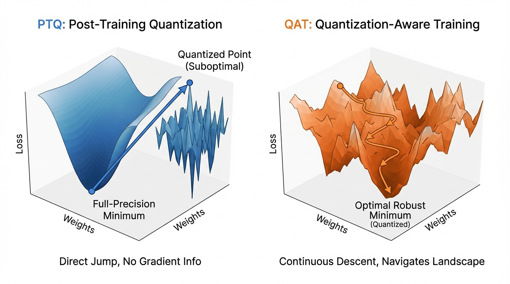

import QuantizationErrorVisualizer from '../../components/chapter-13/QuantizationErrorVisualizer.tsx';

# 13.1 PTQ vs QAT

In the previous section, we explored systems engineering solutions—like Chunked Prefill and Disaggregated Serving—to manage the massive memory footprint of the KV Cache during long-context inference. However, optimizing the context window only addresses the dynamic memory overhead. The static model weights themselves remain a colossal bottleneck. A 70-billion parameter model in 16-bit precision (BF16) requires 140GB of VRAM just to reside in memory, completely barring it from consumer hardware and inflating enterprise deployment costs.

To solve this, we must compress the weights. Quantization is the mathematical process of mapping high-precision floating-point values (FP32/BF16) to lower-precision discrete integer bins (INT8, INT4, or even smaller). 

The field of quantization is divided into two distinct paradigms based on *when* and *how* the model encounters the noise introduced by this compression: **Post-Training Quantization (PTQ)** and **Quantization-Aware Training (QAT)**.

---

## 1. The Mathematics of Linear Quantization

Before dividing the paradigms, we must understand the shared underlying math. The most common form of compression is **Affine (Linear) Quantization**. It maps a high-precision tensor $x$ to a quantized integer tensor $q$ using a scale factor $S$ and a zero-point $Z$:

$$
q = \text{clip}\left(\text{round}\left(\frac{x}{S} + Z\right), q_{\text{min}}, q_{\text{max}}\right)
$$

During inference, the hardware uses integer arithmetic for matrix multiplication, and the result is dequantized back to a floating-point representation:

$$
x_{\text{approx}} = S \times (q - Z)
$$

The difference between $x$ and $x_{\text{approx}}$ is the **Quantization Error**. The fundamental difference between PTQ and QAT is how they handle this error.

---

## 2. Post-Training Quantization (PTQ): The Passive Approach

PTQ is a strictly passive, downstream process. The model is trained to convergence in full precision. Once training is complete, the weights are frozen, and a conversion script maps them to lower precision. 

Because we are mapping a continuous distribution to discrete bins, we must determine the optimal Scale ($S$) and Zero-point ($Z$). This requires a **Calibration Phase**. The engineer passes a small dataset (typically 100 to 1,000 samples) through the model to observe the activation ranges (min and max values) of every layer. 

### The Calibration Trap
While PTQ is fast (taking minutes to hours) and requires minimal compute, it is incredibly fragile. If the calibration dataset is not perfectly representative of the production data distribution, the calculated activation scales will be too narrow. 

When the model later encounters out-of-distribution inputs in production, the activations will exceed the calibrated range, resulting in severe clipping. This destroys the model's forward-pass logic, leading to sudden, catastrophic perplexity degradation—often referred to as the "Calibration Trap."

### Engineering the Calibration Loop

Below is a PyTorch implementation demonstrating symmetric min-max calibration for a linear layer.

```python
import torch
import torch.nn as nn

class PTQLinear(nn.Module):
    def __init__(self, in_features, out_features):
        super().__init__()
        self.weight = nn.Parameter(torch.randn(out_features, in_features))
        self.bias = nn.Parameter(torch.zeros(out_features))
        self.weight_scale = None
        self.act_scale = None
        
    def calibrate(self, x):
        """
        Calibrates the scales based on the absolute maximum values.
        In practice, moving averages or KL-divergence are used for robustness.
        """
        # Calibrate activations (INT8 range: -128 to 127)
        max_act = torch.max(torch.abs(x))
        self.act_scale = max_act / 127.0 
        
        # Calibrate weights
        max_w = torch.max(torch.abs(self.weight))
        self.weight_scale = max_w / 127.0
        
    def forward(self, x):
        if self.weight_scale is None:
            # Pre-calibration forward pass
            return nn.functional.linear(x, self.weight, self.bias)
            
        # Simulate Quantized Inference (Hardware executes this in INT8/INT32)
        q_w = torch.clamp(torch.round(self.weight / self.weight_scale), -128, 127)
        q_x = torch.clamp(torch.round(x / self.act_scale), -128, 127)
        
        # INT32 Accumulation
        out = nn.functional.linear(q_x, q_w)
        
        # Dequantize back to floating point for the next layer
        return out * (self.weight_scale * self.act_scale) + self.bias

# Example Execution
layer = PTQLinear(128, 64)
calibration_data = torch.randn(32, 128) # Must represent real-world data!

layer.calibrate(calibration_data)
output = layer(calibration_data)
print(f"Quantized Output Shape: {output.shape}")
```

---

## 3. Quantization-Aware Training (QAT): The Active Approach

PTQ generally hits a severe "accuracy floor" when compressing below 8 bits. Moving an LLM from 8-bit to 4-bit via PTQ often results in a massive spike in perplexity because the rounding error becomes too large to ignore passively.

**Quantization-Aware Training (QAT)** breaks this floor. Instead of quantizing after the fact, QAT inserts "Fake Quantization" nodes into the computational graph *during* training or fine-tuning. The model’s optimizer "sees" the quantization error during the forward pass and adjusts the master weights during the backward pass to compensate. The model actively learns to survive the low-precision constraints.



### The Straight-Through Estimator (STE)

Implementing QAT introduces a critical mathematical roadblock: the `round()` function. 
The derivative of a step function like `round()` is zero almost everywhere (and undefined at the steps). If we run standard backpropagation, the gradients will multiply by zero at the quantization node, preventing any weight updates.

To solve this, QAT relies on the **Straight-Through Estimator (STE)** [[1]](#ref-1). During the backward pass, the STE simply ignores the `round()` operation, treating its local gradient as $1$. 

$$
\frac{\partial L}{\partial x} = \frac{\partial L}{\partial q} \cdot \frac{\partial q}{\partial x} \approx \frac{\partial L}{\partial q} \cdot 1
$$

### Engineering Fake Quantization with STE

```python
import torch
import torch.nn as nn

class RoundSTE(torch.autograd.Function):
    @staticmethod
    def forward(ctx, x):
        return torch.round(x)

    @staticmethod
    def backward(ctx, grad_output):
        # Straight-Through Estimator: pass the gradient through unchanged
        return grad_output

def fake_quantize(tensor, scale, bits=4):
    q_max = (1 << (bits - 1)) - 1
    q_min = -(1 << (bits - 1))
    
    # Scale and round using STE
    scaled = tensor / scale
    rounded = RoundSTE.apply(scaled)
    
    # Clip and Dequantize
    clipped = torch.clamp(rounded, q_min, q_max)
    return clipped * scale

class QATLinear(nn.Module):
    def __init__(self, in_features, out_features, bits=4):
        super().__init__()
        # Master weights remain in full precision
        self.weight = nn.Parameter(torch.randn(out_features, in_features) * 0.02)
        self.bias = nn.Parameter(torch.zeros(out_features))
        self.bits = bits
        
    def forward(self, x):
        # Dynamically calculate scale for weights
        w_max = torch.max(torch.abs(self.weight))
        q_max = (1 << (self.bits - 1)) - 1
        w_scale = w_max / q_max
        
        # Apply fake quantization
        q_weight = fake_quantize(self.weight, w_scale, self.bits)
        
        # Forward pass uses quantized weights, but the computational graph
        # routes gradients to the full-precision self.weight via STE.
        return nn.functional.linear(x, q_weight, self.bias)

# Example Execution
layer = QATLinear(128, 64, bits=4)
x = torch.randn(32, 128)
out = layer(x)
loss = out.sum()
loss.backward()

# Gradients successfully flow to the full-precision weights!
print(f"Master Weight Gradient Shape: {layer.weight.grad.shape}")
```

---

## 4. State-of-the-Art Developments

Historically, QAT was considered a luxury. It required storing the FP32 master weights, the INT4 fake-quantized weights, and the FP32 gradients simultaneously, effectively doubling the VRAM required compared to standard training. 

### Defeating the VRAM Tax
Recent frameworks like **Unsloth** [[2]](#ref-2) have commoditized QAT. By writing custom Triton kernels that fuse the fake-quantization operation directly into the matrix multiplication, they compute the quantized weights on-the-fly in SRAM. This prevents the need to materialize the quantized tensors in High Bandwidth Memory (HBM), reducing the memory footprint of QAT to match standard LoRA fine-tuning.

### Mixed-Precision and the $\gamma$ Scaling Factor
Not all layers in a Transformer react equally to quantization. Recent research [[3]](#ref-3) introduces a theoretical framework for **Mixed-Precision Quantization**. Instead of uniformly applying 4-bit quantization, bits are allocated based on *layer sensitivity* and *weight variance*.

The first few layers (which extract foundational features) and the final projection layers are highly sensitive to quantization noise. Redundant intermediate layers are robust. By introducing a learned scaling factor ($\gamma$), modern QAT algorithms dynamically allocate INT8 to sensitive layers and INT4/INT2 to robust layers, achieving up to a 68% reduction in model size while maintaining performance within 6% of the full-precision baseline.

---

## 5. Interactive Component: Quantization Error Visualizer

The visualization below demonstrates why PTQ fails at low bit-widths with high-variance weights, and how QAT mitigates this by allowing the model to "learn" an optimal scaling factor that trims extreme outliers to preserve the dense core of the distribution.


<QuantizationErrorVisualizer client:load />


---

## 6. Summary Comparison

| Feature | Post-Training Quantization (PTQ) | Quantization-Aware Training (QAT) |
| :--- | :--- | :--- |
| **Complexity** | Low (Minutes to hours) | High (Requires full training/fine-tuning) |
| **Data Required** | Small calibration set (100–1000 samples) | Full training/fine-tuning dataset |
| **Accuracy** | Excellent for 8-bit; Poor for less than 4-bit | Superior for low-bit (4-bit, 2-bit, 1.58-bit) |
| **Memory Overhead** | Minimal | Historically high (now optimized by fused kernels) |
| **Best Use Case** | Rapid deployment of 8-bit models | SOTA edge AI and ultra-compressed LLMs |

As we move to the next section, we will explore specific algorithms that have evolved from these paradigms—such as GPTQ, AWQ, and GGUF—and analyze how they handle the physical layout of quantized tensors on modern hardware.

---

## Quizzes

<details>
<summary>Quiz 1: Why might a PTQ model that evaluates perfectly on its calibration dataset experience catastrophic perplexity degradation when deployed in a production environment?</summary>
*If the calibration dataset is not representative of the production data distribution, the calculated activation scales will be too narrow. When the model encounters out-of-distribution inputs in production, the activations will exceed the calibrated range, resulting in severe clipping and destroying the model's forward-pass logic.*
</details>

<details>
<summary>Quiz 2: In Quantization-Aware Training, the `round()` function is applied during the forward pass to simulate lower precision. Why is the Straight-Through Estimator (STE) mathematically necessary during the backward pass?</summary>
*The mathematical derivative of the `round()` function is zero almost everywhere (and undefined at the midpoints). If standard backpropagation were used, gradients would multiply by zero at the quantization node, preventing any weight updates. The STE bypasses this by approximating the local gradient as 1, allowing the loss to flow back to the full-precision weights.*
</details>

<details>
<summary>Quiz 3: According to recent mixed-precision quantization frameworks, why is it sub-optimal to apply uniform 4-bit quantization across all layers of a Transformer?</summary>
*Transformer layers exhibit varying degrees of sensitivity and weight variance. The first and last layers are highly sensitive to quantization noise, while intermediate layers often contain redundant features. Uniform quantization over-penalizes sensitive layers and under-compresses redundant ones. Allocating higher bits (e.g., INT8) to sensitive layers and lower bits (e.g., INT4) to robust layers optimizes the accuracy-to-memory trade-off.*
</details>

<details>
<summary>Quiz 4: PTQ generally hits a severe "accuracy floor" when compressing weights to 4-bit or lower, whereas QAT can maintain performance. What fundamental difference in the optimization process allows QAT to break this floor?</summary>
*PTQ is a passive process; it statically maps pre-trained weights to the nearest quantization bin, taking the resulting rounding error as an unavoidable loss. QAT actively exposes the optimizer to this rounding error during training. This allows the model to adjust its weights dynamically, steering them toward values that inherently align better with the available quantization bins, effectively "training away" the quantization noise.*
</details>

<details>
<summary>Quiz 5: Provide the explicit mathematical formulation for backpropagating gradients through a linear quantization node using the Straight-Through Estimator (STE). How is the local derivative bounded?</summary>
*Let the forward pass be $q = \text{round}(x)$ with clipping boundaries $[x_{min}, x_{max}]$. The standard derivative is zero everywhere. In QAT via STE, the partial derivative is approximated using an indicator function: $\frac{\partial L}{\partial x} = \frac{\partial L}{\partial q} \cdot \mathbf{1}_{x_{min} \le x \le x_{max}}$. This formalization demonstrates that loss gradients flow back unchanged within the quantization boundaries, but are completely zeroed out if the continuous weight $x$ is clipped beyond the maximum bins.*
</details>

---

## References

1. <a id="ref-1"></a>Bengio, Y., Léonard, N., & Courville, A. (2013). *Estimating or Propagating Gradients Through Stochastic Neurons for Conditional Computation.* [arXiv:1308.3432](https://arxiv.org/abs/1308.3432).
2. <a id="ref-2"></a>Unsloth AI. (2024). "Unsloth: Making LLM Fine-tuning 2x faster and use 70% less memory." [GitHub Repository](https://github.com/unslothai/unsloth).
3. <a id="ref-3"></a>Hasan, J. (2024). *Optimizing Large Language Models through Quantization: A Comparative Analysis of PTQ and QAT Techniques.* [arXiv:2411.06084](https://arxiv.org/abs/2411.06084).