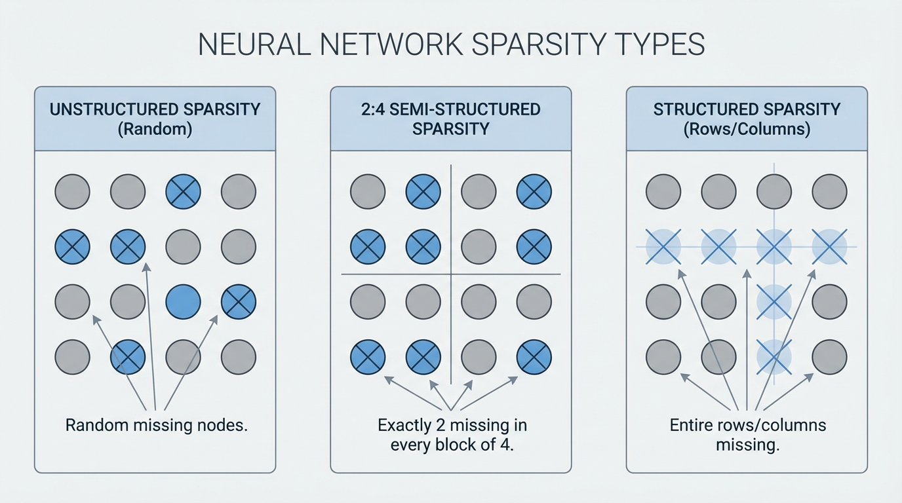

---
layout: ../../layouts/BookLayout.astro
title: 13.3 Weight Sparsification
lang: en
---

import SparsityVisualizer from '../../components/chapter-13/SparsityVisualizer.tsx';

# 13.3 Weight Sparsification

While quantization shrinks the memory footprint of each weight by reducing its numerical precision, sparsification (or pruning) aims to eliminate weights entirely. If a parameter does not meaningfully contribute to the model's output, it is set to zero. This reduces memory requirements and, crucially, physically eliminates the floating-point operations (FLOPs) required during inference.

However, Large Language Models (LLMs) exhibit highly sensitive internal representations. Naively dropping the smallest weights—a technique known as magnitude pruning—destroys the model's reasoning capabilities at high sparsity levels. Modern LLM sparsification requires advanced algorithms that evaluate the complex interplay between weights and activations.

In this section, we explore the engineering realities of structural constraints, the mathematics of one-shot Hessian pruning, and the modern algorithms that prune weights based on activation dynamics.

---

## 1. The Sparsity Landscape: Unstructured vs. Structured

Not all zeros are created equal. The physical layout of the pruned weights dictates whether the theoretical reduction in FLOPs translates to an actual speedup on hardware.



1.  **Unstructured Sparsity**: Individual weights are zeroed out at random locations. While this preserves model accuracy exceptionally well, it provides almost zero actual speedup on standard GPUs. Dense matrix multiplication kernels are heavily optimized for contiguous memory access; skipping random zeros introduces branching and irregular memory access patterns that paralyze the GPU's streaming multiprocessors.
2.  **Semi-Structured (N:M) Sparsity**: The pragmatic hardware compromise. In **2:4 sparsity**, exactly 2 out of every 4 continuous weights in a matrix are pruned. NVIDIA's Ampere, Hopper, and Blackwell architectures feature specialized Sparse Tensor Cores that compress these 2:4 matrices in memory and execute math operations at up to 2x the speed of dense matrices.
3.  **Structured Sparsity**: Entire structures (rows, columns, attention heads, or MLP channels) are removed. This physically shrinks the dimensions of the matrices, yielding immediate end-to-end speedups using standard dense kernels on any hardware. Historically, this caused severe accuracy degradation, but recent breakthroughs are changing the paradigm.

---

## 2. SparseGPT: One-Shot Hessian Pruning

Similar to how GPTQ revolutionized quantization, **SparseGPT** [[1]](#ref-1) proved that 100B+ parameter models could be pruned to 50-60% unstructured sparsity in a single shot, without requiring expensive retraining or fine-tuning.

SparseGPT formulates pruning as a layer-wise sparse regression problem. It does not just delete weights; it asks: *If I force this weight to be zero, how must I adjust the remaining unpruned weights to compensate for the lost signal?*

To answer this, SparseGPT uses the inverse Hessian matrix ($H^{-1}$) of the layer's input activations. For a given weight matrix $W$ and input $X$, the objective is to find a sparse matrix $\hat{W}$ that minimizes the squared error:
$$ \arg\min_{\hat{W}} ||WX - \hat{W}X||_2^2 \quad \text{subject to} \quad ||\hat{W}||_0 \le \kappa $$

SparseGPT processes the weight matrix sequentially. When a weight is pruned, the resulting error is projected onto the remaining unpruned weights using the correlations captured in the Hessian. While highly accurate, calculating and inverting massive Hessian matrices during the compression phase requires significant computational overhead.

---

## 3. Wanda: Pruning by Weights and Activations

While SparseGPT relies on complex weight updates, **Wanda** (Pruning by Weights and activations) [[2]](#ref-2) introduced a shockingly simple alternative that achieves competitive performance with zero weight updates.

Wanda operates on the same principle that drives AWQ (discussed in the previous section): the importance of a weight is inextricably linked to the magnitude of the activation passing through it. A small weight is not useless if it multiplies against a massive activation outlier.

Instead of pruning based on absolute weight magnitude $|W_{ij}|$, Wanda scores each weight using:
$$ S_{ij} = |W_{ij}| \cdot ||X_j||_2 $$
Where $||X_j||_2$ is the $\ell_2$-norm of the input activations for the $j$-th feature, calculated across a small calibration dataset.

Wanda evaluates this score on a per-output basis (comparing weights only within the same row). By dropping weights with the lowest $S_{ij}$, Wanda naturally protects the weights aligned with the "massive outliers" in LLM activations, preserving the model's core reasoning pathways without requiring Hessian inversions.

---

## 4. Implementing 2:4 Sparsity with Wanda

To make unstructured pruning algorithms practically useful for inference acceleration, they are often constrained to an N:M pattern. The following PyTorch implementation demonstrates how to apply the Wanda metric to enforce strict 2:4 semi-structured sparsity, formatting the matrix for NVIDIA's Sparse Tensor Cores.

```python
import torch

def compute_wanda_scores(W: torch.Tensor, X: torch.Tensor) -> torch.Tensor:
    """
    Computes Wanda importance scores.
    W: Weight matrix [out_features, in_features]
    X: Calibration activations [batch * seq_len, in_features]
    """
    # Calculate the L2 norm of the activations for each input channel
    X_norm = torch.norm(X, p=2, dim=0) # Shape: [in_features]
    
    # Multiply weight magnitude by activation norm
    # Broadcasting X_norm across all output channels
    scores = torch.abs(W) * X_norm.unsqueeze(0)
    return scores

def apply_2_4_sparsity(W: torch.Tensor, scores: torch.Tensor) -> torch.Tensor:
    """
    Applies 2:4 semi-structured sparsity based on importance scores.
    Forces exactly 2 zeros in every block of 4 contiguous weights.
    """
    out_features, in_features = W.shape
    assert in_features % 4 == 0, "in_features must be divisible by 4"
    
    # Reshape scores and weights into blocks of 4
    scores_blocked = scores.view(out_features, in_features // 4, 4)
    W_blocked = W.clone().view(out_features, in_features // 4, 4)
    
    # Find the indices of the 2 smallest scores in each block
    _, indices = torch.topk(scores_blocked, k=2, dim=-1, largest=False)
    
    # Create a mask and scatter False where weights should be pruned
    mask = torch.ones_like(W_blocked, dtype=torch.bool)
    mask.scatter_(dim=-1, index=indices, value=False)
    
    # Apply mask and reshape back to original dimensions
    W_pruned = W_blocked * mask
    return W_pruned.view(out_features, in_features)

# Example Execution
out_feat, in_feat = 128, 256
W = torch.randn(out_feat, in_feat)
X = torch.randn(1024, in_feat) # 1024 calibration tokens

scores = compute_wanda_scores(W, X)
W_sparse = apply_2_4_sparsity(W, scores)

# Verify 2:4 sparsity (exactly 50% sparse)
sparsity = (W_sparse == 0).float().mean().item()
print(f"Model Sparsity: {sparsity * 100:.1f}%")
```

---

## 5. SliceGPT: Deleting Rows and Columns

While 2:4 sparsity requires specific hardware support, **SliceGPT** [[3]](#ref-3) takes a radically different approach: structured pruning via computational invariance. Instead of zeroing out individual weights, SliceGPT physically deletes entire rows and columns from the weight matrices.

SliceGPT mathematically projects the weight matrices into a smaller dimensional space using orthogonal transformations (similar to PCA). This transformation concentrates the model's core signal into the top rows and columns, leaving the bottom rows and columns containing mostly noise. These bottom rows and columns are then completely sliced off.

Because this reduces the embedding dimension itself, the resulting matrices are entirely dense, just smaller. This yields immediate, proportional end-to-end memory and compute speedups on *any* hardware without relying on specialized sparse execution kernels.

---

## 6. Interactive Component: The Sparsity Visualizer

The interactive visualization below demonstrates how different pruning algorithms handle a weight matrix subjected to extreme activation outliers. 

*   Observe how **Magnitude Pruning** blindly destroys critical weights.
*   See how **Wanda** protects weights aligned with high activations.
*   Understand the strict block constraints of **2:4 Sparsity**.

<SparsityVisualizer client:load />

---

## 7. Summary Comparison

| Algorithm | Pruning Type | Core Mechanism | Hardware Speedup |
| :--- | :--- | :--- | :--- |
| **Magnitude** | Unstructured | Drops weights closest to zero. | None (requires sparse kernels). |
| **SparseGPT** | Unstructured / N:M | Hessian-based error compensation. | High (if constrained to 2:4). |
| **Wanda** | Unstructured / N:M | Scores via $|W| \times ||X||_2$. No weight updates. | High (if constrained to 2:4). |
| **SliceGPT** | Structured | Orthogonal projection and row/col slicing. | Immediate on all hardware. |

By intelligently removing parameters, sparsification allows engineers to deploy massively over-parameterized models onto constrained hardware. However, when we need to deploy a 70B model onto a mobile phone, even pruning and quantization are not enough. In the next section, we will explore **Knowledge Distillation**, where we abandon compressing the original weights and instead train a fundamentally smaller model to mimic the giant.

---

## Quizzes

<details>
<summary>Quiz 1: Why does unstructured sparsity rarely yield proportional inference speedups on standard GPUs?</summary>
*Standard GPU matrix multiplication kernels (dense kernels) are highly optimized for contiguous memory blocks. Skipping random zeros introduces branching and irregular memory access patterns, which stalls the streaming multiprocessors and degrades performance. Hardware-specific patterns, like 2:4 sparsity, are required to leverage specialized Sparse Tensor Cores.*
</details>

<details>
<summary>Quiz 2: How does Wanda's pruning metric differ fundamentally from traditional magnitude pruning?</summary>
*Magnitude pruning assumes weights with values close to zero are unimportant. Wanda recognizes that a small weight might multiply against an extremely large activation outlier, making it critical to the network's output. Wanda scores importance by multiplying the weight's magnitude by the norm of its corresponding input activation.*
</details>

<details>
<summary>Quiz 3: In a 2:4 semi-structured sparsity pattern, why must the pruning be evaluated in blocks of 4 rather than globally across the matrix?</summary>
*2:4 sparsity is a strict hardware constraint designed for NVIDIA Sparse Tensor Cores. These cores compress matrices by storing exactly 2 non-zero values and a 2-bit index for every contiguous block of 4 weights in memory. Evaluating globally would result in uneven distributions of zeros, breaking the structural requirement of the hardware registers.*
</details>

<details>
<summary>Quiz 4: What is the primary operational advantage of SliceGPT over SparseGPT and Wanda?</summary>
*SparseGPT and Wanda produce sparse matrices that require specialized kernels or hardware (like Sparse Tensor Cores) to accelerate. SliceGPT physically deletes entire rows and columns, effectively reducing the embedding dimension of the model. This results in smaller, entirely dense matrices that yield immediate end-to-end speedups on any standard hardware.*
</details>

<details>
<summary>Quiz 5: Formalize the exact theoretical reduction in memory bandwidth (in bytes) and computational FLOPs when applying 2:4 structured sparsity to a dense linear layer matrix of dimension $D_{in} \times D_{out}$ processing batch size $B$ and sequence length $S$.</summary>
*In 2:4 structured sparsity, exactly 2 non-zero values out of every 4 continuous elements are stored along with a 2-bit mapping index per block. Instead of storing 4 float16 weights ($4 \times 2 = 8$ bytes), we store 2 float16 weights ($2 \times 2 = 4$ bytes) plus index mapping metadata ($4 \times 2\text{-bits} = 1\text{ byte}$). This yields a theoretical parameter weight reduction of $50\%$ and memory footprint reduction of approx. $37.5\%$ (saving $3$ bytes per $8$ bytes). In terms of computation, Sparse Tensor Cores physically omit zero operations, dropping GEMM computational FLOPs exactly by $50\%$ from $2 B S D_{in} D_{out}$ to $B S D_{in} D_{out}$.*
</details>

---

## References

1. <a id="ref-1"></a>Frantar, E., & Alistarh, D. (2023). *SparseGPT: Massive Language Models Can Be Accurately Pruned in One-Shot.* [arXiv:2301.00774](https://arxiv.org/abs/2301.00774).
2. <a id="ref-2"></a>Sun, M., Liu, Z., Bair, A., & Kolter, J. Z. (2023). *A Simple and Effective Pruning Approach for Large Language Models.* [arXiv:2306.11695](https://arxiv.org/abs/2306.11695).
3. <a id="ref-3"></a>Ashkboos, S., Croci, M. L., Nascimento, M. G., Hoefler, T., & Hensman, J. (2024). *SliceGPT: Compress Large Language Models by Deleting Rows and Columns.* [arXiv:2401.15024](https://arxiv.org/abs/2401.15024).