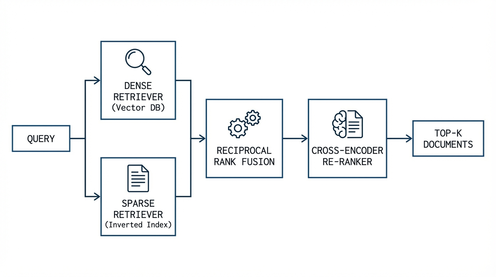
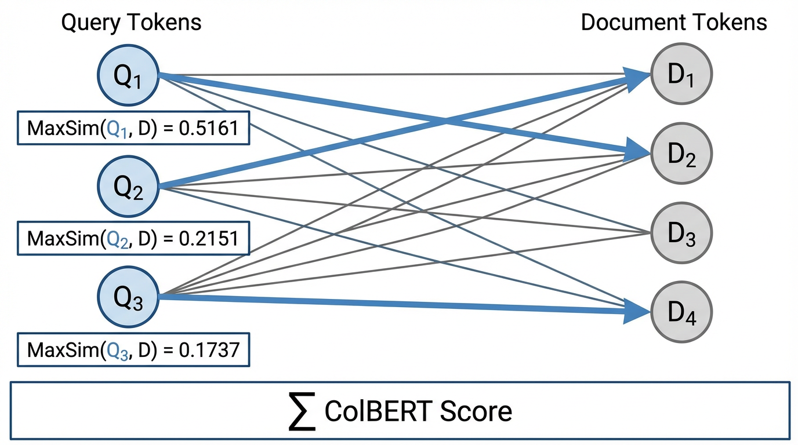

import RRFVisualizer from '../../components/chapter-14/RRFVisualizer.tsx';

# 14.3 Advanced Retrieval & Reranking

As established in the previous chapter, dense vector embeddings and HNSW indices enable sub-millisecond semantic search. However, relying exclusively on dense vectors often fails in real-world enterprise scenarios due to a lack of exact keyword matching.

Imagine a user searching for **"Error code 404 on legacy system X"**.
- **Semantic search** understands that "404" relates to "not found" or "web errors" and "legacy system" relates to "old software". It might retrieve a document about "Common web errors in old applications", which is conceptually similar but useless because it doesn't mention the specific "system X".
- **Keyword search (Lexical)** will look for the exact string "system X" and "404". It will find the exact log file or documentation for that system, even if the document uses different words like "missing resource" instead of "not found".

To get the best of both worlds, we need **Hybrid Search**. We combine the conceptual understanding of dense vectors with the exact precision of keyword search. This chapter dissects how we combine these signals using **Rank Fusion** and how we further refine them using **Re-ranking** models.

---

## 1. Sparse Vectors and SPLADE

Historically, exact-match retrieval relied on **BM25**, an algorithm based on Term Frequency-Inverse Document Frequency (TF-IDF). BM25 represents documents as highly sparse vectors where the dimensionality equals the size of the vocabulary. If a word does not appear in the document, its vector dimension is strictly zero. 

While BM25 solves the exact-match problem, it suffers from *Vocabulary Mismatch*. If a user searches for "automobile" and the document only contains "car", BM25 yields a score of zero.

To bridge this gap, researchers introduced **Learned Sparse Representations**, with **SPLADE** (Sparse Lexical and Expansion Model) [[1]](#ref-1) becoming the industry standard.

### How SPLADE Works

Instead of relying on raw term frequencies, SPLADE passes the document through a BERT-like encoder and utilizes the Masked Language Modeling (MLM) head. The MLM head outputs a probability distribution over the entire tokenizer vocabulary (e.g., 30,000 dimensions). 

SPLADE applies a `ReLU` activation and a log-saturation function to these logits, followed by heavy $L_1$ regularization during training. This forces the model to push 95% of the vocabulary dimensions to exactly zero, creating a sparse vector that can be indexed in a traditional Inverted Index (like Elasticsearch or Lucene).

**The Magic of Document Expansion:** Because SPLADE uses the MLM head, it can assign non-zero weights to words that *do not actually exist in the document*. If the input is "car", the neural network activates the vocabulary dimension for "automobile" with a weight of 1.2. This achieves semantic expansion while maintaining the extreme retrieval speed of sparse inverted indexes.

---

## 2. Hybrid Search and Reciprocal Rank Fusion (RRF)

With both a Dense Retriever (HNSW) and a Sparse Retriever (BM25 or SPLADE) operating in parallel, we face a mathematical dilemma: How do we combine their scores?

A dense Cosine Similarity score typically ranges from $-1.0$ to $1.0$, whereas a BM25 score is unbounded and heavily dependent on document length, often ranging from $0$ to $50+$. Normalizing these scores (e.g., Min-Max scaling) is notoriously brittle because the score distributions change dynamically based on the specific query.

Instead of fusing *scores*, modern systems fuse *ranks* using **Reciprocal Rank Fusion (RRF)** [[2]](#ref-2). 

For a given document $d$, its RRF score is calculated by taking the inverse of its rank position $r(d)$ across all retrieval methods $M$:

$$ \text{RRF\_Score}(d) = \sum_{m \in M} \frac{1}{k + r_m(d)} $$

### The Role of the $k$ Parameter

The constant $k$ (traditionally set to $60$) acts as a critical smoothing factor. 
*   If $k=0$, the formula becomes extremely sensitive to the top positions. A document ranked #1 by a weak retriever and #1000 by a strong retriever would still get a massive score ($1/1 = 1.0$).
*   By setting $k=60$, the difference between rank 1 ($1/61 \approx 0.0163$) and rank 10 ($1/70 \approx 0.0142$) is compressed. This requires a document to perform consistently well across *multiple* independent retrievers to bubble up to the top of the final fused list.



---

## 3. Query Transformation: HyDE and Expansion

Before searching the index, we can improve recall by transforming the user's query. This helps overcome the "query-document asymmetry" where a short query is compared to a long document.

### A. Query Expansion
An LLM generates multiple variations or synonyms of the user's query. Searching for all variations increases the chance of finding relevant documents that might use different wording.

### B. HyDE (Hypothetical Document Embeddings) [[5]](#ref-5)
Instead of searching with the query, an LLM generates a *hypothetical answer*. We then embed this fake answer and use it to search the vector DB. This works because the fake answer is in the same semantic space as real answers, often yielding better matches than the short query.

---

## 4. The Two-Stage Pipeline: Enter the Re-ranker

First-stage retrieval (Hybrid Search) is optimized for **Recall** and **Latency**. It quickly filters billions of documents down to a candidate pool of ~100. However, because Bi-Encoders compress the entire document into a single vector, they lose complex syntactic relationships.

The second stage is optimized purely for **Precision**. We take the top 100 candidates and pass them through a **Re-ranker**. Because the candidate pool is small, we can afford to use computationally expensive architectures.

### Cross-Encoders vs. Bi-Encoders (Connection to BERT)

In a **Bi-Encoder**, the query and document are processed independently to generate separate vectors, which are then compared using Cosine Similarity. In a **Cross-Encoder**, the query and document are concatenated into a single sequence: `[CLS] Query [SEP] Document [SEP]` and passed through the Transformer layers together.

This allows the self-attention mechanism to perform *all-to-all* comparisons. The 3rd word of the query can directly attend to the 50th word of the document at every layer of the network. While this provides state-of-the-art accuracy, its time complexity is $O(N)$ at inference time, making it impossible to use for first-stage retrieval over millions of documents.

This connects directly to the **Encoder-only architectures** discussed in **Chapter 4.1**. Models like **BERT**, which use self-attention across the entire input, are perfect for Cross-Encoders because they allow every token in the query to attend to every token in the document at every layer.

---

## 5. Late Interaction: ColBERT

Is there a middle ground between the speed of Bi-Encoders and the accuracy of Cross-Encoders? In 2020, researchers introduced **ColBERT (Contextualized Late Interaction over BERT)** [[3]](#ref-3).

ColBERT fundamentally changes how document embeddings are stored. Instead of pooling the document tokens into a single vector, ColBERT stores a matrix of embeddings—one $d$-dimensional vector for *every single token* in the document.

At query time, ColBERT computes the **MaxSim** operation. For every token in the query, it calculates the dot product against all tokens in the document, takes the maximum value, and sums these maximums together.

$$ S(q, d) = \sum_{i=1}^{|q|} \max_{j=1}^{|d|} (E_{q_i} \cdot E_{d_j}) $$



### Engineering the MaxSim Operation

Implementing MaxSim efficiently requires careful tensor manipulation to leverage GPU parallelism. Below is a production-grade PyTorch implementation of batched MaxSim.

```python
import torch
import torch.nn.functional as F

def batched_colbert_maxsim(
    queries: torch.Tensor, 
    documents: torch.Tensor, 
    query_mask: torch.Tensor
) -> torch.Tensor:
    """
    Computes batched ColBERT MaxSim scores.
    
    Args:
        queries: Tensor of shape (batch_size, Q_len, dim)
        documents: Tensor of shape (batch_size, D_len, dim)
        query_mask: Tensor of shape (batch_size, Q_len), 1 for valid tokens, 0 for padding.
        
    Returns:
        scores: Tensor of shape (batch_size,) containing the scalar relevance scores.
    """
    # 1. L2 Normalize tokens (Dot product of L2 normalized vectors = Cosine Similarity)
    q_norm = F.normalize(queries, p=2, dim=2)
    d_norm = F.normalize(documents, p=2, dim=2)
    
    # 2. Compute token-wise similarity matrix via Batch Matrix Multiplication
    # Shape: (batch_size, Q_len, dim) x (batch_size, dim, D_len) -> (batch_size, Q_len, D_len)
    sim_matrix = torch.bmm(q_norm, d_norm.transpose(1, 2))
    
    # 3. Max pooling over the document token dimension
    # For every query token, find the highest similarity score among all document tokens
    # Shape: (batch_size, Q_len)
    max_sims, _ = torch.max(sim_matrix, dim=2)
    
    # 4. Mask out padding tokens in the query so they don't contribute to the final score
    max_sims = max_sims * query_mask
    
    # 5. Sum the maximum similarities across all valid query tokens
    # Shape: (batch_size,)
    scores = torch.sum(max_sims, dim=1)
    
    return scores

# --- Example Execution ---
batch_size = 32
dim = 128
q_len = 16
d_len = 256

# Simulated representations
queries = torch.randn(batch_size, q_len, dim)
documents = torch.randn(batch_size, d_len, dim)
query_mask = torch.ones(batch_size, q_len) # Assuming no padding for simplicity

scores = batched_colbert_maxsim(queries, documents, query_mask)
print(f"MaxSim Scores shape: {scores.shape}") # Output: torch.Size([32])
```

---

## 6. LLM as a Re-ranker (RankGPT)

With the rise of highly capable Instruction-Tuned LLMs, the latest paradigm shift in second-stage retrieval is discarding specialized Cross-Encoders entirely and using the LLM itself to rank documents.

Early attempts used **Pointwise** ranking (asking the LLM to score a document from 1-10) or **Pairwise** ranking (asking the LLM if Document A is better than Document B). Both approaches are flawed: Pointwise scoring suffers from calibration drift, and Pairwise scoring requires $O(N^2)$ comparisons.

The current State-of-the-Art is **Listwise Ranking**, popularized by architectures like **RankGPT** [[4]](#ref-4). In this approach, the query and *all* candidate documents are packed into the LLM's massive context window. The model is prompted to directly output a permuted list of document identifiers.

**Example Prompt:**
```text
I will provide you with 10 passages, each indicated by a numerical identifier []. 
Rank the passages based on their relevance to the search query: "How to optimize PyTorch DDP?"

[1] {Passage 1 text...}
[2] {Passage 2 text...}
...
[10] {Passage 10 text...}

Output the ranking in descending order of relevance using identifiers, e.g., [4] > [1] > [7]...
```

By viewing all candidates simultaneously, the attention mechanism inherently performs multi-document comparative reasoning, yielding superior nDCG@10 metrics compared to traditional Cross-Encoders, albeit at the cost of higher token consumption and latency.

---

## 7. Interactive Concept: Reciprocal Rank Fusion

To build an intuition for why RRF is so robust, interact with the visualizer below. Adjust the $k$ parameter to see how it acts as a smoothing factor. Notice how a document must perform reasonably well in *both* the Sparse and Dense lists to claim the top spot, preventing a single hallucinated result in one retriever from hijacking the final output.

<RRFVisualizer client:load />

---

## 8. Summary and Open Questions

Advanced retrieval acknowledges that no single vector representation can capture both deep semantic intent and strict lexical precision. By executing a Hybrid Search (combining SPLADE and HNSW via Reciprocal Rank Fusion), systems achieve maximum recall. Passing these candidates through a Late-Interaction model (ColBERT) or a Listwise LLM (RankGPT) maximizes precision, ensuring the generative model receives the highest quality context possible.

However, even with perfect retrieval, a linear list of text chunks often fails to answer complex, multi-hop questions (e.g., "Which company acquired the startup founded by the author of the Attention paper?"). To answer this, the retrieval system must understand relationships and entities, not just text similarity. 

How do we represent and traverse relational knowledge? We will explore this in **14.5 GraphRAG & Practical Ontology**.

---

## Quizzes

<details>
<summary>Quiz 1: Why is score normalization (e.g., Min-Max scaling) generally avoided when combining BM25 and Dense vector scores in production systems?</summary>
*BM25 scores are unbounded and highly dependent on the specific query length and corpus statistics, making their distribution wildly inconsistent from one query to the next. Normalizing these scores leads to unpredictable weighting. RRF avoids this entirely by relying purely on ordinal ranks, which are stable regardless of the underlying score distribution.*
</details>

<details>
<summary>Quiz 2: In ColBERT's MaxSim operation, why do we take the *maximum* similarity across document tokens for each query token, rather than the average?</summary>
*A specific query token (e.g., "PyTorch") usually aligns with only one or two specific words in a long document. If we took the average similarity across all document tokens, the strong signal from the exact match would be entirely diluted by the hundreds of irrelevant background tokens in the document.*
</details>

<details>
<summary>Quiz 3: What is the primary computational bottleneck that prevents Cross-Encoders from being used for first-stage retrieval over a large corpus?</summary>
*A Cross-Encoder requires the query and document to be concatenated and passed through the Transformer layers together. This means the document representation cannot be pre-computed offline. For a corpus of 1 million documents, the system would need to perform 1 million massive neural network forward passes at query time, resulting in impossible latency.*
</details>

<details>
<summary>Quiz 4: How does SPLADE solve the "Vocabulary Mismatch" problem that traditionally plagues sparse retrieval algorithms like BM25?</summary>
*SPLADE utilizes the Masked Language Modeling (MLM) head of a BERT-like encoder to perform neural document expansion. It can assign non-zero weights to vocabulary dimensions for synonyms and related terms that do not explicitly appear in the original text, allowing exact-match infrastructure to achieve semantic retrieval.*
</details>

<details>
<summary>Quiz 5: Provide the formal mathematical sequence that dictates RRF score fusion for a document $d$ across multiple retriever outputs $M$, and formalize its theoretical upper bound.</summary>
*The RRF score for document $d \in D$ is defined as $RRF(d; M) = \sum_{m=1}^{|M|} \frac{1}{k + r_m(d)}$, where $r_m(d) \in [1, |D|]$ is the rank order in retriever $m$, and $k$ is the smoothing parameter. The theoretical upper bound for a document ranked #1 in all retrievers is $RRF_{max} = \frac{|M|}{k + 1}$. Conversely, the lower bound for a document completely unranked in all candidate pools is mathematically bounded by $0$. This formal sequence allows engineers to derive predictable boundaries for rank fusion independent of dynamic underlying scores.*
</details>

---

## References

1. <a id="ref-1"></a>Formal, T., et al. (2021). *SPLADE v2: Sparse Lexical and Expansion Model for Information Retrieval.* [arXiv:2109.10086](https://arxiv.org/abs/2109.10086).
2. <a id="ref-2"></a>Cormack, G. V., Clarke, C. L. A., & Buettcher, S. (2009). *Reciprocal Rank Fusion outperforms Condorcet and individual Rank Learning Methods.* SIGIR.
3. <a id="ref-3"></a>Khattab, O., & Zaharia, M. (2020). *ColBERT: Efficient and Effective Passage Search via Contextualized Late Interaction over BERT.* [arXiv:2004.12832](https://arxiv.org/abs/2004.12832).
4. <a id="ref-4"></a>Sun, W., et al. (2023). *Is ChatGPT Good at Search? Investigating Large Language Models as Re-Ranking Agents.* [arXiv:2304.09542](https://arxiv.org/abs/2304.09542).
5. <a id="ref-5"></a>Gao, L., et al. (2022). *Precise Zero-Shot Dense Retrieval without Relevance Labels.* [arXiv:2212.10496](https://arxiv.org/abs/2212.10496).