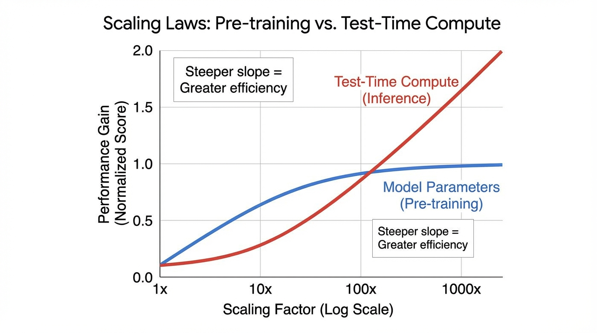

import InferenceScalingVisualizer from '../../components/chapter-15/InferenceScalingVisualizer.tsx';

# 15.3 Search-time Compute

In the previous section, we explored how Tree and Graph of Thoughts externalize reasoning. A Python orchestrator forces the model to generate, evaluate, and search through discrete states. While effective, this approach is fundamentally bolted-on. The model remains a passive generator, oblivious to the overarching search algorithm.

In late 2024 and early 2025, the paradigm shifted. Instead of relying on external scripts to manage search trees, researchers discovered how to make the model internalize the search process. By allowing models to "think" for extended periods before emitting a final answer, we unlocked a new dimension of performance scaling: **Inference-Time Scaling Laws** (or Test-Time Compute).

This section explores the mechanics of search-time compute, the economic shift from pre-training to inference, and the internal architectures of reasoning models like OpenAI's o1 and DeepSeek-R1.

---

## 1. The Inference-Time Scaling Law

Historically, the AI industry adhered to a single scaling axis: **Pre-training Compute**. To get a smarter model, you trained a larger parameter matrix on a larger dataset for more GPU hours (as dictated by the Power Law and Chinchilla scaling laws, covered in Chapter 8). 

However, pre-training scaling faces severe diminishing returns. Pushing a model from 70 billion to 1 trillion parameters requires exponential capital expenditure. 

Inference-time scaling offers an orthogonal vector. Research by Snell et al. (2024) [[1]](#ref-1) demonstrated that intelligently allocating additional compute *during inference* can yield performance gains exceeding those of purely scaling model size. In a FLOPs-matched evaluation, a smaller base model utilizing heavy test-time compute can outperform a model $14\times$ larger that relies solely on standard zero-shot generation.



This is the AI equivalent of Daniel Kahneman's **System 1 vs. System 2 thinking**. Standard autoregressive decoding is System 1: fast, reflexive, and prone to hallucination on complex logic. Search-time compute is System 2: slow, deliberate, evaluating multiple paths, and self-correcting before speaking.

---

## 2. Mechanisms of Test-Time Compute

How exactly do we "spend" compute at inference time? There are three primary mechanisms, ranging from brute-force external wrappers to native internal processes.

### Parallel Scaling (Best-of-N)
The simplest way to scale test-time compute is to generate $N$ independent solutions in parallel using a high temperature, and then use a separate **Reward Model** (or Verifier) to score them and select the best one. 

While Best-of-$N$ reliably improves performance (scaling logarithmically with $N$), it is highly inefficient. If the model makes a critical logical error in the first step of a math proof, it will waste hundreds of tokens generating a fundamentally flawed solution.

```python
import torch
import torch.nn as nn
from transformers import PreTrainedModel, PreTrainedTokenizer

class BestOfNInference(nn.Module):
    def __init__(self, generator: PreTrainedModel, verifier: PreTrainedModel, tokenizer: PreTrainedTokenizer):
        super().__init__()
        self.generator = generator
        self.verifier = verifier
        self.tokenizer = tokenizer

    @torch.no_grad()
    def generate_and_select(self, prompt: str, n: int = 64, max_new_tokens: int = 512) -> str:
        """
        Executes Best-of-N sampling.
        generator: The base LLM producing candidate solutions.
        verifier: An Outcome Reward Model (ORM) trained to score final answers.
        """
        input_ids = self.tokenizer(prompt, return_tensors="pt").input_ids.to(self.generator.device)
        
        # 1. Expand input for parallel generation: Shape [N, seq_len]
        input_ids_expanded = input_ids.repeat(n, 1)
        
        # 2. Generate N diverse candidates using temperature scaling
        outputs = self.generator.generate(
            input_ids_expanded,
            max_new_tokens=max_new_tokens,
            do_sample=True,
            temperature=0.7,
            top_p=0.95,
            pad_token_id=self.tokenizer.pad_token_id
        )
        
        prompt_len = input_ids.shape[1]
        responses = outputs[:, prompt_len:]
        
        # 3. Score candidates using the Verifier
        # The verifier outputs a scalar logit representing the reward
        rewards = self.verifier(outputs).logits.squeeze(-1) # Shape: [N]
        
        # 4. Select the candidate with the highest reward
        best_idx = torch.argmax(rewards)
        best_response = responses[best_idx]
        
        return self.tokenizer.decode(best_response, skip_special_tokens=True)
```

### Sequential Scaling (Step-Level Search)
To fix the inefficiency of Best-of-$N$, we can use a **Process Reward Model (PRM)** that evaluates intermediate steps rather than final outcomes. Algorithms like Beam Search or Lookahead Search use the PRM to prune bad reasoning branches early, reallocating compute to promising paths. (We will dive deep into PRMs in the next section, 15.4).

### Internal Scaling (The o1 Paradigm)
The most advanced form of test-time compute eliminates external orchestrators entirely. Models like OpenAI's o1 and DeepSeek-R1 [[2]](#ref-2) are trained to internalize the search process within a continuous stream of tokens. 

When given a prompt, the model generates a long sequence of "thinking tokens" (a hidden Chain-of-Thought) before outputting the final answer. During this phase, the model autonomously proposes strategies, executes them, recognizes its own errors, backtracks, and verifies its logic. 

---

## 3. Training for Internal Search: The DeepSeek-R1 Approach

If internalizing search is the goal, how do we train a model to do it? Standard Supervised Fine-Tuning (SFT) is insufficient. If you train a model on human-written reasoning traces, it merely learns to mimic the *style* of reasoning, not the actual *process* of exploration and self-correction.

The breakthrough is large-scale **Reinforcement Learning (RL)** applied specifically to reasoning tasks where the final answer can be objectively verified (e.g., math, coding). 

DeepSeek-R1 demonstrated that you can take a base model and apply pure RL using an algorithm like **Group Relative Policy Optimization (GRPO)**. Unlike PPO (Proximal Policy Optimization), GRPO does not require a separate, memory-heavy Value Model. Instead, it generates a group of outputs for the same prompt, scores them using a rule-based verifier (e.g., "Did the code pass the unit tests?"), and normalizes the rewards within the group to calculate advantages.

During this RL phase, a fascinating phenomenon occurs. Without explicit human prompting, the model experiences "Aha!" moments. It naturally learns that allocating more tokens to verify its previous steps increases its final reward. The model spontaneously develops behaviors like:
- *"Wait, that calculation seems wrong. Let me re-evaluate..."*
- *"Let's try a different approach..."*

The length of the thinking phase becomes a proxy for search depth. By simply running the autoregressive engine longer, the model explores a wider state space natively.

<InferenceScalingVisualizer client:load lang="en" />

---

## 4. Compute-Optimal Allocation

A critical engineering challenge in test-time compute is allocation efficiency. Applying 10,000 thinking tokens to a simple query like *"What is the capital of France?"* is a massive waste of FLOPs. Conversely, allocating only 100 tokens to a complex physics problem will result in failure.

Snell et al. [[1]](#ref-1) formalized the concept of **Compute-Optimal Inference**. The effectiveness of test-time compute is heavily dependent on the prompt's difficulty relative to the base model's capability.
- **Easy Prompts:** The base model already has a high probability of success. Extra compute yields marginal gains.
- **Impossible Prompts:** The required knowledge is entirely absent from the model's weights. No amount of test-time search will conjure facts it does not know.
- **The "Sweet Spot" (Challenging Prompts):** The model possesses the necessary primitives but requires deep logical chaining to connect them. This is where test-time compute yields exponential returns.

Modern infrastructure relies on adaptive routing. A lightweight classifier (or the model's own initial entropy) determines the difficulty of the prompt and dynamically sets the maximum thinking token budget.

---

## 5. Summary and Open Questions

Inference-time scaling has fundamentally altered the economics of AI. We are transitioning from a world constrained by pre-training clusters to one constrained by inference infrastructure. If a 7B model can match a 70B model simply by "thinking longer," the deployment strategies for edge devices and cloud APIs must be entirely re-architected to support asynchronous, long-running generation tasks.

However, internalizing search via RL relies heavily on domains where automated verification is possible (math, code). The next frontier—and a major open question—is how to apply inference-time scaling to open-ended, subjective domains like creative writing or strategic planning, where rule-based reward functions do not exist. 

To bridge this gap, we need robust models capable of evaluating complex logic. In the next section, we will examine the engineering behind **Verifiers and Process Reward Models (PRMs)**.

---

## Quizzes

<details>
<summary>Quiz 1: Why is Best-of-$N$ sampling considered computationally inefficient compared to internalizing search (like OpenAI o1), even if both utilize large amounts of test-time compute?</summary>
*Best-of-$N$ generates $N$ complete, independent sequences from start to finish. If a candidate makes a logical error at token 10, the model still wastes compute generating the remaining 500 tokens of a flawed solution. Internalized search (like o1) allows the model to recognize errors mid-generation, backtrack, and reallocate its token budget to promising paths, effectively pruning bad branches natively.*
</details>

<details>
<summary>Quiz 2: According to the concept of Compute-Optimal Inference, on what type of prompts does test-time scaling yield the lowest return on investment (ROI) in terms of FLOPs?</summary>
*Test-time compute yields the lowest ROI on two extremes: "Easy" prompts (where the base model already achieves near 100% accuracy via zero-shot System 1 thinking, making extra compute redundant) and "Impossible" prompts (where the model fundamentally lacks the pre-trained knowledge required, meaning no amount of search will uncover the answer).*
</details>

<details>
<summary>Quiz 3: How does Group Relative Policy Optimization (GRPO), used in DeepSeek-R1, reduce the memory overhead during reasoning RL compared to traditional PPO?</summary>
*Traditional PPO requires maintaining a separate Value Model (often the same size as the policy model) in VRAM to estimate the baseline for advantage calculations. GRPO eliminates the Value Model. Instead, it generates a group of responses for a single prompt, scores them, and uses the mean and standard deviation of those scores to calculate the baseline and advantages directly.*
</details>

<details>
<summary>Quiz 4: In the provided PyTorch implementation of Best-of-$N$, why do we apply `temperature=0.7` and `do_sample=True` instead of greedy decoding?</summary>
*Greedy decoding is deterministic; it would generate the exact same sequence $N$ times, completely defeating the purpose of Best-of-$N$. Sampling with temperature ensures diversity in the generated candidates, allowing the model to explore different reasoning paths so the Verifier has a varied pool of solutions to score.*
</details>

<details>
<summary>Quiz 5: In MCTS for reasoning sequence search, how does the UCT formula balance exploration and exploitation? Formulate the UCT equation and explain how the trade-off varies with the generated token sequence length $T$.</summary>
*The UCT formula is defined as: $\text{UCT}(s, a) = Q(s, a) + c \sqrt{\frac{\ln N(s)}{N(s, a)}}$, where $Q(s, a)$ is the exploitation term (mean process reward), $N(s)$ is the visit count of the parent node $s$, $N(s, a)$ is the visit count of node $s$ after taking action (token/step) $a$, and $c$ is the exploration constant. In token sequence searches, as the generated sequence length $T$ increases, the depth of the tree expands exponentially. This makes the exploration term $c \sqrt{\ln N(s) / N(s, a)}$ critical for preventing the search algorithm from getting stuck in early, high-reward but ultimately incorrect sub-branches. However, allocating too much compute to exploration in deep branches can severely inflate the test-time token budget without improving the final answer.*
</details>

---

## References

1. <a id="ref-1"></a>Snell, C., Lee, J., Xu, K., & Kumar, A. (2024). *Scaling LLM Test-Time Compute Optimally can be More Effective than Scaling Model Parameters.* [arXiv:2408.03314](https://arxiv.org/abs/2408.03314).
2. <a id="ref-2"></a>DeepSeek-AI. (2025). *DeepSeek-R1: Incentivizing Reasoning Capability in LLMs via Reinforcement Learning.* [arXiv:2501.12948](https://arxiv.org/abs/2501.12948).
3. <a id="ref-3"></a>Brown, N., et al. (2024). *Large Language Monkeys: Scaling Inference Compute with Repeated Sampling.* [arXiv:2407.21787](https://arxiv.org/abs/2407.21787).