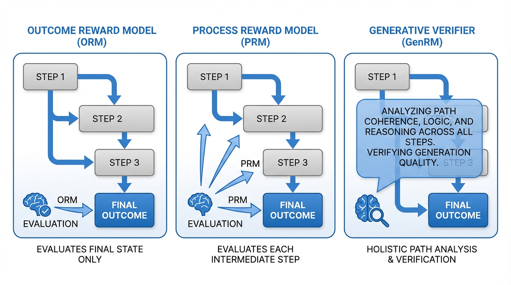

import VerifierFlowVisualizer from '../../components/chapter-15/VerifierFlowVisualizer.tsx';

# 15.4 Verifiers & Reward Models

If test-time compute is the engine of reasoning, the **Verifier** (or Reward Model) is the steering wheel. As we saw in the previous section, giving a model more time to "think" or generate multiple candidate solutions only improves performance if the system can accurately identify which of those thoughts is actually correct. 

Without a robust verification mechanism, scaling test-time compute simply allows a model to confidently hallucinate at scale. The model will generate thousands of flawed reasoning paths and arbitrarily select one.

In this section, we will trace the evolution of verification systems. We will move from the foundational **Outcome Reward Models (ORM)** to the granular **Process Reward Models (PRM)** introduced by OpenAI, and finally explore the 2024–2025 state-of-the-art: **Generative Verifiers (GenRM)** and intrinsic **Self-Correction (SCoRe)**.

---

## 1. The Baseline: Discriminative Reward Models

Historically, Reward Models (RMs) were built as **discriminative classifiers**. You take a pre-trained LLM, remove its language modeling head (which predicts the next token over a vocabulary of 100,000 words), and replace it with a simple linear regression head that outputs a single scalar value. 

### Outcome Reward Models (ORM)
An Outcome Reward Model evaluates only the final answer. If the model is asked to solve a complex math problem, the ORM looks at the final output and assigns a score between 0 and 1. 

While ORMs are relatively easy to train (requiring only final answer labels), they suffer from the **sparse reward problem**. If a model executes 9 brilliant logical steps but makes a minor arithmetic error on the 10th step, the ORM gives the entire sequence a score of 0. This makes it incredibly difficult for the reinforcement learning algorithm to perform proper credit assignment. The model doesn't know *which* part of its reasoning was flawed.

### Process Reward Models (PRM)
To solve the sparse reward problem, researchers at OpenAI introduced the **Process Reward Model** in their seminal paper, *"Let's Verify Step by Step"* (Lightman et al., 2023) [[1]](#ref-1). 

Instead of scoring the final outcome, a PRM scores *every single intermediate step* in a Chain-of-Thought (CoT). To train a PRM, human annotators (or stronger AI models) must manually label each step of a solution as positive, negative, or neutral (e.g., the PRM800K dataset).

The advantage of a PRM is that it acts as an early-stopping mechanism during search. If you are running a Tree of Thoughts (ToT) algorithm, the PRM can evaluate step 3. If step 3 is logically flawed, the PRM assigns a low score, and the search algorithm prunes that branch immediately—saving precious compute that would have been wasted generating steps 4 through 10.

#### Engineering a Process Reward Model in PyTorch
Under the hood, a PRM extracts the hidden state of the transformer at the exact token where a "step" concludes (usually a newline `\n` or a specific delimiter token), and passes that single vector through the classification head.

```python
import torch
import torch.nn as nn
from transformers import PreTrainedModel

class ProcessRewardModel(nn.Module):
    def __init__(self, base_llm: PreTrainedModel):
        super().__init__()
        self.base_llm = base_llm
        self.hidden_size = base_llm.config.hidden_size
        
        # Replace the vocabulary head with a scalar regression head
        # Outputting a single logit representing the "correctness" of the step
        self.score_head = nn.Linear(self.hidden_size, 1)
        
    def forward(self, input_ids: torch.Tensor, step_end_indices: torch.Tensor):
        """
        input_ids: [batch_size, seq_len]
        step_end_indices: [batch_size, num_steps] - Token indices where each step ends
        """
        # 1. Forward pass through the base LLM
        outputs = self.base_llm(input_ids, output_hidden_states=True)
        
        # Extract the final layer's hidden states: Shape [batch, seq_len, hidden_size]
        last_hidden_states = outputs.hidden_states[-1] 
        
        batch_size, num_steps = step_end_indices.shape
        
        # 2. Gather the hidden states specifically at the step boundaries
        # We create a batch index grid to correctly index into the 3D tensor
        batch_indices = torch.arange(batch_size, device=input_ids.device).unsqueeze(1).expand(-1, num_steps)
        
        # Shape: [batch, num_steps, hidden_size]
        step_hidden_states = last_hidden_states[batch_indices, step_end_indices, :] 
        
        # 3. Compute process rewards
        # Shape: [batch, num_steps]
        step_logits = self.score_head(step_hidden_states).squeeze(-1) 
        
        # 4. Apply sigmoid to convert logits into probabilities (0.0 to 1.0)
        step_probabilities = torch.sigmoid(step_logits)
        
        return step_probabilities
```

---

## 2. The Paradigm Shift: Generative Verifiers (GenRM)

While PRMs were a massive leap forward, they harbor a fundamental architectural flaw. By replacing the language modeling head with a linear regression head, we strip the LLM of its primary superpower: **text generation**.

When a human teacher grades a math test, they don't just stare at a line of math and instantly output a probability score of `0.14`. They *read* the line, *think* about the rules of algebra, *verbalize* the error in their head ("Wait, moving +5 across the equals sign should make it -5"), and *then* assign a grade.

In 2024, Zhang et al. introduced **Generative Verifiers (GenRM)** [[2]](#ref-2), which reframe reward modeling as a **next-token prediction task**. 

Instead of outputting a scalar, a GenRM is prompted with the question and the candidate solution, and is asked to generate a text-based critique. It generates a **Verification Rationale** (a Chain-of-Thought explaining why the solution is right or wrong), ending with a final token: "Yes" or "No". The "score" of the solution is simply the probability mass assigned to the "Yes" token.



### The Advantages of GenRM
1. **Implicit Reasoning:** By generating a rationale before the verdict, the model utilizes its own working memory (the KV cache) to compute the correctness of the logic, leading to vastly superior accuracy on complex proofs.
2. **Easy-to-Hard Generalization:** Discriminative RMs often overfit to surface-level features (e.g., "solutions that are longer are usually correct"). GenRMs, forced to articulate *why* a solution is correct, generalize much better to problems harder than those they were trained on.
3. **Test-Time Compute on Verification:** Because GenRM is generative, we can apply test-time compute to the *verifier itself*. By sampling 16 different verification rationales for the same candidate solution and taking a majority vote on the final "Yes/No" tokens, verification accuracy skyrockets.

<VerifierFlowVisualizer client:load />

---

## 3. The Holy Grail: Intrinsic Self-Correction (SCoRe)

If a model can verify text via GenRM, can it simply correct its own mistakes? 

Surprisingly, the answer has historically been **no**. A well-documented paradox in LLM research is that models are terrible at intrinsic self-correction. If you prompt an LLM with *"Are you sure? Please review your answer and fix any mistakes,"* the model is highly likely to succumb to **sycophancy**. It will apologize, assume it must be wrong because the user is questioning it, and change a correct answer into an incorrect one. Conversely, if the initial answer is wrong, it often lacks the logical grounding to find the specific error and merely hallucinates a different wrong answer.

Standard Supervised Fine-Tuning (SFT) fails to fix this because SFT relies on offline, human-generated correction traces. The model learns to mimic the *style* of an apology and a correction, but it doesn't learn the *policy* of actual self-correction under its own distribution of errors.

### Multi-Turn RL and the Delta Reward
To solve this, Kumar et al. (2024) introduced **SCoRe (Self-Correction via Reinforcement Learning)** [[3]](#ref-3). SCoRe treats self-correction as a multi-turn Reinforcement Learning problem entirely on the model's own generated data.

The training loop works in two turns:
1. **Turn 1:** The model generates an initial attempt ($y_1$).
2. **Turn 2:** The model is prompted to review $y_1$ and generate a corrected attempt ($y_2$).

The genius of SCoRe lies in its **Reward Shaping**. If you simply reward the model for getting the final answer right in $y_2$, the RL algorithm will "collapse." The model will realize that the easiest way to maximize reward is to just generate the perfect answer in $y_1$, ignore the correction phase, and repeat the perfect answer in $y_2$. 

To force the model to learn the *skill of correction*, SCoRe applies a **Delta Reward**. The model receives a massive bonus if $y_2$ is correct *and* $y_1$ was incorrect. 
$$ R(y_1, y_2) = \left\{ \begin{array}{ll} +r_{\text{bonus}} & \text{if } y_1 \text{ is wrong and } y_2 \text{ is right (Successful Correction)} \\ +r_{\text{base}} & \text{if } y_1 \text{ is right and } y_2 \text{ is right (Maintained Correctness)} \\ -r_{\text{penalty}} & \text{if } y_1 \text{ is right and } y_2 \text{ is wrong (Sycophancy Degradation)} \\ 0 & \text{otherwise} \end{array} \right. $$

The key lesson is not a specific product claim, but the training signal itself: when the model is trained on its own actual mistakes and is rewarded for the *delta* (fixing a flaw without breaking what is already working), intrinsic self-correction becomes a learnable behavior rather than a prompt-only illusion.

---

## 4. Synthetic Data & The Verification Loop

A recurring theme in modern Foundation Model engineering is the exhaustion of human data. There are not enough PhD mathematicians in the world to manually write millions of step-by-step verification rationales to train GenRMs or PRMs.

The SOTA pipeline for training verifiers now relies entirely on **Synthetic Data Loops**:
1. Take a base model and generate 100 solutions for a math problem.
2. Use a deterministic rule-based checker (e.g., a Python script checking the final answer) to separate the correct solutions from the incorrect ones.
3. For the incorrect solutions, prompt a massive, highly capable "Teacher" model (like GPT-4o or Claude 3.5 Sonnet) to act as a critic: *"Here is a math problem and an incorrect solution. Find the exact step where the logic fails, explain why it fails, and output 'No'."*
4. Use these synthetic critiques to fine-tune a smaller, efficient "Student" model into a GenRM.

This loop allows the industry to distill the reasoning capabilities of massive frontier models into highly efficient, specialized verifiers that can be deployed at scale to guide search-time compute algorithms.

---

## 5. Summary and Next Steps

We have transitioned from an era where models were passive generators to an era where they are active searchers. 
- **Outcome RMs** gave us basic Best-of-N selection.
- **Process RMs** allowed us to prune search trees efficiently.
- **Generative Verifiers** unlocked the ability to use Chain-of-Thought for evaluation.
- **SCoRe** proved that models can be trained to intrinsically recognize and correct their own flaws.

But what happens when the tasks are no longer just math problems or code snippets with objective right/wrong answers? What happens when we want the model to search through a space of real-world actions, interacting with APIs, databases, and web browsers? 

To achieve this, the model must evolve from a reasoning engine into an autonomous actor. In **Chapter 16: Agentic AI & Tools**, we will explore how Foundation Models are engineered to use external tools, manage long-term memory, and orchestrate multi-agent collaborations.

---

## Quizzes

<details>
<summary>Quiz 1: Why does an Outcome Reward Model (ORM) struggle to provide useful gradients for Reinforcement Learning on long, multi-step reasoning tasks compared to a Process Reward Model (PRM)?</summary>
*ORMs suffer from the sparse reward problem. If a model generates a 20-step proof and makes a sign error on step 19, the ORM assigns a final score of 0. The RL algorithm cannot easily determine which of the 20 steps caused the failure, making credit assignment highly inefficient. A PRM scores each step individually, providing dense, localized feedback that tells the model exactly where it went wrong.*
</details>

<details>
<summary>Quiz 2: In the context of Generative Verifiers (GenRM), why is it critical that the model generates the "Verification Rationale" (the explanation) BEFORE it outputs the final "Yes" or "No" token?</summary>
*Because autoregressive LLMs cannot "look ahead" or think in hidden states before generating a token. If the model outputs "Yes" or "No" first, it is forced to make a snap judgment based purely on its System 1 forward pass. By generating the rationale first, it uses the generated text as a scratchpad (expanding its KV cache), effectively performing System 2 computation to logically deduce the correctness before committing to a final verdict.*
</details>

<details>
<summary>Quiz 3: Why does standard Supervised Fine-Tuning (SFT) on human-written correction traces fail to teach an LLM how to reliably self-correct its own mistakes?</summary>
*SFT suffers from a distribution mismatch. Human-written corrections fix human mistakes, not the specific, idiosyncratic hallucinations the model makes. When trained via SFT, the model learns the superficial "style" of correcting (e.g., saying "I apologize, let me fix that"), but it does not learn the underlying policy of identifying its own actual logical flaws. It requires RL on its own generated trajectories (like SCoRe) to learn true self-correction.*
</details>

<details>
<summary>Quiz 4: In the SCoRe algorithm, what would likely happen if the reward function only incentivized the correctness of the final turn ($y_2$), without penalizing the model for changing a correct $y_1$ into an incorrect $y_2$?</summary>
*The model would succumb to behavior collapse and sycophancy. It would learn that the easiest way to maximize reward is to simply output the correct answer on the second turn, regardless of the first turn. Worse, if the prompt implies there is an error, the model might learn to always change its first answer, leading to the degradation of initially correct responses (changing right answers to wrong ones just to satisfy the "correction" instruction).*
</details>

<details>
<summary>Quiz 5: Derive the gradient of the Binary Cross Entropy (BCE) pairwise loss commonly used in Reward Modeling. The loss is defined as $\mathcal{L}(\theta) = -\ln \sigma(r_\theta(x, y_w) - r_\theta(x, y_l))$, where $y_w$ is the winning response and $y_l$ is the losing response. Show the explicit gradient with respect to the reward model parameters $\theta$.</summary>
*Let $d = r_\theta(x, y_w) - r_\theta(x, y_l)$. The loss is $\mathcal{L}(\theta) = -\ln \sigma(d)$. Recall that the derivative of $\ln \sigma(d)$ is $\frac{1}{\sigma(d)} \sigma(d)(1 - \sigma(d)) = 1 - \sigma(d)$. Therefore, $\frac{\partial \mathcal{L}}{\partial d} = -(1 - \sigma(d)) = \sigma(d) - 1$. Using the chain rule, the gradient with respect to $\theta$ is: $\nabla_\theta \mathcal{L}(\theta) = (\sigma(r_\theta(x, y_w) - r_\theta(x, y_l)) - 1) \left[ \nabla_\theta r_\theta(x, y_w) - \nabla_\theta r_\theta(x, y_l) \right]$. This shows that when the model incorrectly scores $y_l > y_w$, the scalar term $(\sigma(d) - 1)$ approaches $-1$, maximizing the gradient magnitude to update parameters, while it approaches $0$ when the model perfectly separates the pair ($y_w \gg y_l$).*
</details>

---

## References

1. <a id="ref-1"></a>Lightman, H., et al. (2023). *Let's Verify Step by Step.* [arXiv:2305.20050](https://arxiv.org/abs/2305.20050).
2. <a id="ref-2"></a>Zhang, L., et al. (2024). *Generative Verifiers: Reward Modeling as Next-Token Prediction.* [arXiv:2408.15240](https://arxiv.org/abs/2408.15240).
3. <a id="ref-3"></a>Kumar, A., et al. (2024). *Training Language Models to Self-Correct via Reinforcement Learning.* [arXiv:2409.12917](https://arxiv.org/abs/2409.12917).
