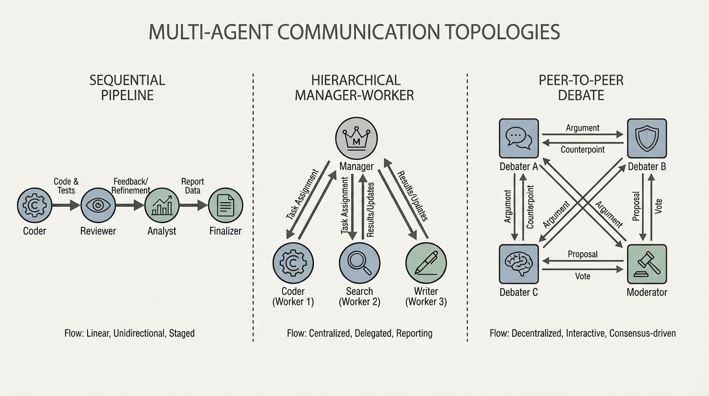

import MultiAgentTopologyVisualizer from '../../components/chapter-16/MultiAgentTopologyVisualizer.tsx';

# 16.3 Multi-agent Collaboration

In the previous section, we explored how a single autonomous agent uses planning architectures like LATS and reflective memory to navigate complex environments. However, a solitary agent inevitably hits a cognitive ceiling. As tasks scale in complexity, a single context window becomes polluted with disparate instructions, intermediate scratchpads, and conflicting objectives. 

More critically, monolithic agents suffer from **persona collapse**. If you prompt a single LLM to simultaneously act as a "Creative Developer" and a "Strict Security Auditor," the model will struggle to maintain the tension between these opposing goals. It will often compromise, producing code that is neither highly innovative nor fully secure.

To solve this, we move from the psychology of a single mind to the sociology of multiple minds. **Multi-agent collaboration** distributes cognitive load, enforces strict role specialization, and leverages debate to filter out hallucinations. Just as a software company relies on product managers, engineers, and QA testers working in concert, multi-agent systems orchestrate specialized LLMs to achieve objectives far beyond the reach of a single model.

---

## 1. The Sociology of AI: Communication Topologies

When multiple agents interact, the architecture of their communication—the topology—dictates the efficiency and capability of the system. Early frameworks like AutoGen [[1]](#ref-1) and MetaGPT [[2]](#ref-2) formalized these interaction patterns.

### 1.1 Sequential Pipelines
The simplest topology is a linear chain. Agent A completes a task and passes the output to Agent B. 
* **Mechanism**: A Planner agent drafts a specification $\rightarrow$ a Coder agent writes the implementation $\rightarrow$ a QA agent writes the tests.
* **Pros**: Highly deterministic. Low context overhead, as each agent only sees the output of the previous step.
* **Cons**: Brittle. If the Planner makes a fundamental error, the QA agent at the end of the pipeline cannot easily send feedback all the way back to the beginning without complex reverse-routing logic.

### 1.2 Hierarchical (Manager-Worker)
Inspired by corporate structures, a central "Manager" agent decomposes a task and delegates sub-tasks to specialized "Worker" agents.
* **Mechanism**: The Manager maintains the global state and objective. It invokes Workers (e.g., a Web Searcher, a Python Executor) asynchronously, aggregates their responses, and synthesizes the final output.
* **Pros**: Excellent for parallelizable tasks. The Manager maintains a clean, high-level context window.
* **Cons**: The Manager becomes a bottleneck. If the Manager's reasoning fails, the entire system collapses.

### 1.3 Joint Debate and Peer-to-Peer
Instead of a strict hierarchy, agents with different system prompts (e.g., "Proponent" vs. "Skeptic") are placed in a shared environment to debate a solution until a provisional decision is reached. Some studies report improvements in factuality and mathematical reasoning under this setup [[3]](#ref-3).
* **Mechanism**: Given a complex math problem, three agents independently generate solutions. They then read each other's solutions and critique them iteratively. 
* **Mathematics of Consensus**: The system reaches convergence when the semantic distance between the agents' outputs falls below a threshold $\epsilon$, or a designated "Judge" agent dictates that the debate has resolved.


*Source: AI-generated illustration*

### Comparison of Topologies

| Topology | Best Usecase | Context Efficiency | Error Recovery |
| :--- | :--- | :--- | :--- |
| **Sequential** | Standardized, predictable workflows (e.g., ETL pipelines). | High | Low |
| **Hierarchical** | Broad, multi-domain research and parallel execution. | Medium | Medium |
| **Debate (P2P)** | High-stakes reasoning, math, and fact-checking. | Low (Token heavy) | High |

---

## 2. State Management: The Blackboard Pattern

In a naive multi-agent system, agents communicate by passing raw chat histories back and forth. This leads to an exponential explosion of tokens. If Agent A and Agent B exchange 5 messages of 1,000 tokens each, Agent C (the reviewer) is suddenly burdened with a 10,000-token transcript, much of which is conversational noise ("Sure, I will write the code now").

To solve this, advanced frameworks utilize the **Blackboard Pattern**. 
Instead of direct agent-to-agent messaging, agents post structured artifacts to a centralized "Blackboard" (a shared memory space). Agents subscribe only to the partitions of the blackboard relevant to their role. 

MetaGPT pioneered this by enforcing **Standard Operating Procedures (SOPs)**. Agents do not exchange free-form text; they exchange strongly typed artifacts (e.g., a `ProductRequirementDocument` object or an `APISpecification` JSON). This enforces rigorous state management and prevents context degradation.

---

## 3. Engineering Latent-Space Communication

For tightly coupled multi-agent systems, relying solely on text-based JSON passing can become computationally inefficient. Decoding intermediate thoughts into text and then re-encoding them in the next agent's context window adds avoidable overhead.

The state-of-the-art approach is **Latent-Space Communication** (or Neural Message Passing). Instead of generating text, Worker agents output dense hidden representations (embeddings or KV cache blocks). The Manager agent then uses a Cross-Attention mechanism to dynamically query these latent states, aggregating only the features relevant to its current objective.

### PyTorch Implementation: Multi-Agent Attention Router

Below is a PyTorch implementation of a latent-space router. It demonstrates how a Manager agent can attend to the continuous latent states of $N$ Worker agents. This bypasses the text bottleneck, allowing the Manager to "read the minds" of the workers directly.

```python
import torch
import torch.nn as nn
import torch.nn.functional as F

class MultiAgentAttentionRouter(nn.Module):
    """
    A neural router for latent-space multi-agent communication.
    Allows a Manager agent to query the hidden states of multiple Worker agents
    using Cross-Attention, aggregating insights without decoding to text.
    """
    def __init__(self, hidden_dim: int = 1024, num_heads: int = 8):
        super().__init__()
        self.hidden_dim = hidden_dim
        
        # Cross-Attention: Manager queries, Workers provide Keys and Values
        self.cross_attention = nn.MultiheadAttention(
            embed_dim=hidden_dim, 
            num_heads=num_heads, 
            batch_first=True
        )
        
        # Feed-forward network to process the aggregated latent state
        self.ffn = nn.Sequential(
            nn.Linear(hidden_dim, hidden_dim * 4),
            nn.GELU(),
            nn.Linear(hidden_dim * 4, hidden_dim)
        )
        
        self.layer_norm1 = nn.LayerNorm(hidden_dim)
        self.layer_norm2 = nn.LayerNorm(hidden_dim)

    def forward(self, manager_query: torch.Tensor, worker_states: torch.Tensor) -> torch.Tensor:
        """
        Args:
            manager_query: Tensor of shape (Batch, Seq_Len_M, Hidden_Dim)
                           The current latent state of the Manager agent.
            worker_states: Tensor of shape (Batch, Num_Workers * Seq_Len_W, Hidden_Dim)
                           The concatenated latent states of all Worker agents.
                           
        Returns:
            aggregated_state: Tensor of shape (Batch, Seq_Len_M, Hidden_Dim)
                              The updated Manager state infused with Worker insights.
        """
        # Manager queries the workers' states
        attn_output, attn_weights = self.cross_attention(
            query=manager_query,
            key=worker_states,
            value=worker_states
        )
        
        # Residual connection and LayerNorm
        x = self.layer_norm1(manager_query + attn_output)
        
        # FFN with residual connection
        ffn_output = self.ffn(x)
        aggregated_state = self.layer_norm2(x + ffn_output)
        
        return aggregated_state, attn_weights

# --- Execution Example ---
if __name__ == "__main__":
    batch_size = 2
    hidden_dim = 1024
    manager_seq_len = 16   # e.g., Manager's current thought vector length
    worker_seq_len = 64    # e.g., Each worker's latent scratchpad length
    num_workers = 3        # e.g., Coder, Searcher, QA

    # Initialize the Router
    router = MultiAgentAttentionRouter(hidden_dim=hidden_dim, num_heads=8)
    
    # Simulate Manager's current latent state
    manager_query = torch.randn(batch_size, manager_seq_len, hidden_dim)
    
    # Simulate latent states from 3 different workers
    worker_1_state = torch.randn(batch_size, worker_seq_len, hidden_dim)
    worker_2_state = torch.randn(batch_size, worker_seq_len, hidden_dim)
    worker_3_state = torch.randn(batch_size, worker_seq_len, hidden_dim)
    
    # Concatenate worker states along the sequence dimension to form the Key/Value pool
    combined_worker_states = torch.cat([worker_1_state, worker_2_state, worker_3_state], dim=1)
    # Shape: (2, 192, 1024)
    
    # Route and aggregate
    updated_manager_state, attention_map = router(manager_query, combined_worker_states)
    
    print(f"Manager Query Shape: {manager_query.shape}")
    print(f"Combined Worker States Shape: {combined_worker_states.shape}")
    print(f"Updated Manager State Shape: {updated_manager_state.shape}")
    print(f"Attention Map Shape: {attention_map.shape}") 
    # Attention Map Shape: (Batch, Manager_Seq, Total_Worker_Seq)
```

This architectural shift from *API-level orchestration* to *tensor-level orchestration* defines the frontier of multi-agent foundation models. It allows end-to-end backpropagation through the agent swarm during post-training, optimizing how agents attend to one another.

---

## 4. Interactive Visualizer: Agent Topologies

To build an intuition for how messages and state updates flow through different multi-agent architectures, explore the interactive visualizer below. Observe how a bottleneck forms in the Hierarchical topology compared to the redundant verification paths in the Debate topology.


<MultiAgentTopologyVisualizer client:load />

*(Note: In a production environment, graph orchestration libraries like LangGraph or temporal state machines are used to handle the asynchronous routing shown above.)*

---

## 5. Open Questions & The Path Forward

Multi-agent collaboration solves the persona collapse and narrow context issues of single agents. By enforcing SOPs, utilizing Blackboard memory, and shifting toward latent-space communication, we can build robust "societies of mind" capable of writing software, conducting research, and operating businesses autonomously.

However, as agent swarms run continuously for days or weeks, a new problem emerges. How does an agent ecosystem remember a user's preferences from a conversation that happened a month ago? How do agents manage the lifecycle of long-term factual knowledge without re-reading millions of tokens every session? 

In the next section, **16.4 Long-term Memory for Agents**, we will dive into the memory hierarchies—Vector Databases, GraphRAG integrations, and continuous lifelong learning architectures—that allow agents to persist and evolve over time.

---

## Quizzes

<details>
<summary>Quiz 1: Why is multi-agent debate more effective for reducing hallucinations than having a single agent self-reflect?</summary>
*A single agent self-reflecting often falls victim to confirmation bias; its subsequent reasoning is heavily anchored by its initial output. Multi-agent debate assigns different personas and system prompts to distinct agents, forcing physically isolated context windows to generate diverse reasoning paths. This structural independence makes it much harder for the system to collectively agree on a hallucinated fact.*
</details>

<details>
<summary>Quiz 2: In a Hierarchical (Manager-Worker) topology, what is the primary cause of context window exhaustion, and how does the Blackboard pattern mitigate it?</summary>
*Context exhaustion occurs because the Manager agent typically receives the raw, conversational transcripts from all Worker agents, flooding its context with noise. The Blackboard pattern mitigates this by replacing direct message passing with a shared memory space where agents only post structured, strongly typed artifacts (like JSON summaries or code blocks). The Manager only reads the final artifacts, drastically reducing token overhead.*
</details>

<details>
<summary>Quiz 3: What is the fundamental engineering advantage of Latent-Space Communication over text-based API message passing between agents?</summary>
*Text-based communication requires the sending agent to autoregressively decode its thoughts into tokens, and the receiving agent to re-encode those tokens back into latent space. This is computationally expensive and loses nuanced probability information. Latent-space communication bypasses text entirely, passing continuous hidden states (embeddings or KV caches) via mechanisms like Cross-Attention, which is faster and preserves richer semantic data.*
</details>

<details>
<summary>Quiz 4: How does MetaGPT's use of Standard Operating Procedures (SOPs) prevent the chaotic breakdown often seen in early conversational agent swarms?</summary>
*Early swarms (like raw AutoGen loops) allowed agents to converse freely, often leading to infinite loops of polite agreements ("Great job, I agree!") without producing work. SOPs enforce a strict corporate workflow where agents are not allowed to output unstructured chat. Instead, they must produce specific, actionable artifacts (e.g., a PRD, an API spec) before the next agent in the sequence is allowed to trigger.*
</details>

<details>
<summary>Quiz 5: In hierarchical multi-agent systems, the Manager must resolve conflicts when two Worker agents post contradictory artifacts to the Blackboard memory. Formalize the explicit logic parameters used to reconcile conflicting states.</summary>
*Conflict resolution is formalized as a weighted synthesis sequence. The semantic contradiction is scored using divergence thresholds: $\delta = 1 - \cos(E(s_a), E(s_b))$. If $\delta \ge \theta_{arbitration}$, the Cross-Attention Router triggers an Arbitration Prompt. This prompt routes both divergent partitions sequentially alongside specialist calibrated weights $w_{specialist}$, forcing the Manager to derive an aggregated vector synthesis: $W_{reconcile} = \text{LayerNorm}(\alpha \cdot E(s_a) + (1 - \alpha) \cdot E(s_b))$ that mathematically balances specialized persona priority.*
</details>

---

## References

1. <a id="ref-1"></a>Wu, Q., et al. (2023). AutoGen: Enabling Next-Gen LLM Applications via Multi-Agent Conversation. [arXiv:2308.08155](https://arxiv.org/abs/2308.08155)
2. <a id="ref-2"></a>Hong, S., et al. (2023). MetaGPT: Meta Programming for A Multi-Agent Collaborative Framework. [arXiv:2308.00352](https://arxiv.org/abs/2308.00352)
3. <a id="ref-3"></a>Du, Y., et al. (2023). Improving Factuality and Reasoning in Language Models through Multiagent Debate. [arXiv:2305.14325](https://arxiv.org/abs/2305.14325)
4. <a id="ref-4"></a>Qian, C., et al. (2023). Communicative Agents for Software Development (ChatDev). [arXiv:2307.07924](https://arxiv.org/abs/2307.07924)
