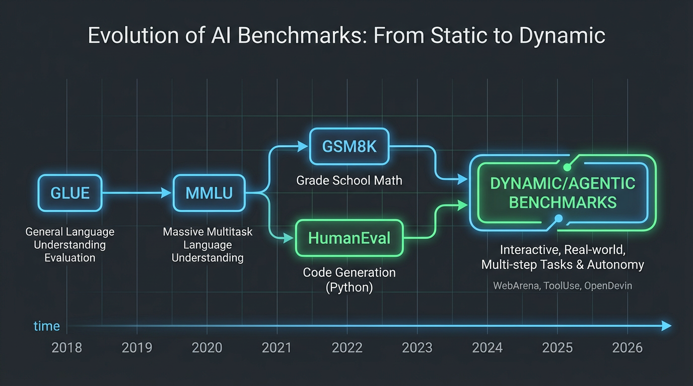

import PassAtKVisualizer from '../../components/chapter-17/PassAtKVisualizer.tsx';

# 17.1 Academic Benchmarks

In Chapter 16, we explored how to build autonomous agents capable of long-term memory, multi-step planning, and tool use. However, engineering these complex systems inevitably leads to a critical operational question: *How do we know if the model is actually getting smarter, or just getting better at memorizing?* 

Before the deep learning boom, evaluating software was deterministic—unit tests either passed or failed. Evaluating Foundation Models, however, is probabilistic and highly nuanced. We rely on **benchmarks**: standardized datasets and metrics designed to quantify intelligence. 

This section breaks down the engineering mechanics behind the industry's most prominent academic benchmarks (MMLU, GSM8K, HumanEval), the mathematical formulations used to score them, and the pervasive crisis of "data contamination" that plagues modern AI evaluation.

---

## 1. The Evolution of Evaluation

The history of NLP benchmarks is a story of moving goalposts. As models scaled, benchmarks that were designed to last a decade were saturated in months.

1. **The GLUE Era (2018-2019):** Early benchmarks like GLUE and SuperGLUE focused on basic linguistic tasks: sentiment analysis, natural language inference (NLI), and grammatical correctness. By the time BERT and RoBERTa arrived, human baselines were surpassed, rendering these benchmarks obsolete for frontier models.
2. **The Knowledge Era (2020-2022):** As models grew from millions to billions of parameters (GPT-3, Chinchilla), they began internalizing vast amounts of world knowledge. Evaluation shifted to trivia, professional exams, and reading comprehension.
3. **The Reasoning Era (2023-Present):** Mere knowledge retrieval is no longer sufficient. Modern benchmarks test multi-step logic, mathematical problem-solving, and code generation—tasks where the model must synthesize new information rather than simply recall it.


*Source: AI-generated illustration*

---

## 2. The Big Three: MMLU, GSM8K, and HumanEval

To evaluate a modern LLM, researchers typically look at three foundational pillars: General Knowledge, Mathematical Reasoning, and Coding.

### 2.1 MMLU (Massive Multitask Language Understanding)
Introduced by Hendrycks et al. [[1]](#ref-1), MMLU is the gold standard for evaluating general knowledge. It consists of multiple-choice questions across 57 subjects, ranging from elementary mathematics to professional law and quantum physics.

**The Engineering Challenge: Logit-based Evaluation**
A naive way to evaluate MMLU is to prompt the model with the question and choices, generate text, and check if the output contains "A", "B", "C", or "D". However, generative evaluation is brittle. The model might output "The answer is definitely A", or "I think it's the first one", requiring complex regex parsing.

Instead, engineers use **Logit-based Evaluation**. We format the prompt to end exactly where the answer token should be, and we measure the raw probabilities (logits) the model assigns to the specific tokens for 'A', 'B', 'C', and 'D'. The token with the highest probability is selected as the model's answer. This isolates the model's knowledge from its conversational formatting alignment.

### 2.2 GSM8K (Grade School Math 8K)
Created by OpenAI [[2]](#ref-2), GSM8K consists of 8,500 high-quality grade school math word problems. It requires multi-step arithmetic reasoning. 

Unlike MMLU, GSM8K cannot be evaluated via logits because the answer space is infinite (any number). It requires **Generative Exact Match**. The model is prompted to think step-by-step (Chain-of-Thought) and output the final answer inside a specific format, such as `#### 42`. The evaluation script extracts the string after `####` and compares it to the ground truth.

### 2.3 HumanEval
Introduced alongside Codex [[3]](#ref-3), HumanEval measures functional correctness in code generation. The model is given a Python function signature and a docstring, and must generate the function body.

Instead of checking if the generated code *looks* like the solution (which is impossible, as there are infinite ways to write a function), HumanEval executes the generated code against hidden unit tests in a sandboxed environment. If the tests pass, the model scores a point.

---

## 3. The Mathematics of Pass@k

Because LLMs sample tokens probabilistically (when temperature $> 0$), a model might fail to write correct code on the first try but succeed on the fifth. To measure this systematically, HumanEval introduced the **$pass@k$** metric.

$pass@k$ measures the probability that at least one out of $k$ generated code samples passes the unit tests. 
If we generate $n$ total samples (where $n \ge k$), and $c$ of them are correct, the true probability of passing if we randomly pick $k$ samples is:

$$ pass@k = 1 - \frac{\binom{n-c}{k}}{\binom{n}{k}} $$

*   $\binom{n}{k}$: Total number of ways to choose $k$ samples from $n$.
*   $\binom{n-c}{k}$: Number of ways to choose $k$ samples entirely from the pool of *incorrect* samples ($n-c$).
*   The ratio is the probability of failing all $k$ attempts. Subtracting it from 1 gives the probability of at least one success.

In practice, computing large combinations results in numerical overflow. Engineers compute it using the equivalent product form:

$$ pass@k = 1 - \prod_{i=0}^{k-1} \frac{n - c - i}{n - i} $$

### Interactive Visualizer: Pass@k Calculator

Adjust the parameters below to see how generation volume ($n$), model capability ($c$), and evaluation budget ($k$) affect the $pass@k$ score. Notice how a model with a low single-shot accuracy (e.g., $c=10$ out of $n=100$) can still achieve a high $pass@10$ score.


<PassAtKVisualizer client:load />

---

## 4. Engineering Logit-Based Evaluation

To truly understand how academic benchmarks are scored, we must look at the inference pipeline. Below is a PyTorch implementation demonstrating how to perform robust, logit-based multiple-choice evaluation (the standard for MMLU).

```python
import torch
import torch.nn.functional as F
from transformers import AutoModelForCausalLM, AutoTokenizer

def evaluate_multiple_choice(
    model: AutoModelForCausalLM, 
    tokenizer: AutoTokenizer, 
    question: str, 
    choices: list[str], 
    device: str = "cuda"
) -> dict:
    """
    Evaluates a multiple choice question using vocabulary logits.
    """
    # 1. Format the prompt strictly. 
    # Notice the lack of trailing space after "Answer:", we want the model to predict the next token.
    prompt = f"{question}\nChoices:\nA) {choices[0]}\nB) {choices[1]}\nC) {choices[2]}\nD) {choices[3]}\nAnswer:"
    
    inputs = tokenizer(prompt, return_tensors="pt").to(device)
    
    # 2. Get the token IDs for the valid choices.
    # Note: Depending on the tokenizer (e.g., Llama's SentencePiece vs GPT's BPE), 
    # ' A' might be a different token than 'A'. Robust evaluation scripts check multiple variants.
    choice_tokens = [" A", " B", " C", " D"]
    choice_ids = [tokenizer.encode(c, add_special_tokens=False)[-1] for c in choice_tokens]
    
    with torch.no_grad():
        # 3. Run a single forward pass
        outputs = model(**inputs)
        
        # 4. Extract the logits for the very last token in the sequence
        # Shape: (batch_size=1, vocab_size)
        next_token_logits = outputs.logits[0, -1, :]
        
        # 5. Isolate the logits for our specific choice IDs
        choice_logits = next_token_logits[choice_ids]
        
        # 6. Apply softmax to get normalized probabilities across the 4 choices
        probs = F.softmax(choice_logits, dim=0)
        
        # 7. The model's prediction is the argmax of these 4 logits
        pred_idx = torch.argmax(choice_logits).item()
        
    return {
        "predicted_choice": chr(65 + pred_idx), # Converts 0->A, 1->B, etc.
        "probabilities": {chr(65 + i): prob.item() for i, prob in enumerate(probs)},
        "raw_logits": choice_logits.tolist()
    }

# --- Execution Example ---
# Assuming `model` and `tokenizer` are loaded:
# question = "What is the capital of France?"
# choices = ["Berlin", "Madrid", "Paris", "Rome"]
# result = evaluate_multiple_choice(model, tokenizer, question, choices)
# print(f"Model chose: {result['predicted_choice']} with {result['probabilities']['C']:.2%} confidence.")
```

By bypassing the generation loop (`model.generate()`) and performing a single forward pass to inspect the logits, this method is computationally cheaper, entirely deterministic, and immune to formatting hallucinations.

---

## 5. The Contamination Crisis

Static academic benchmarks are becoming less reliable as sole measures of model quality because **Data Contamination** (or Data Leakage) is increasingly hard to rule out.

Foundation models are pre-trained on trillions of tokens scraped from the internet. Because benchmarks like MMLU and HumanEval are publicly available on GitHub and academic websites, they are inevitably ingested into the pre-training corpus. When a model scores 95% on HumanEval, is it demonstrating generalized coding intelligence, or did it simply memorize the exact solution during pre-training?

### 5.1 Detecting Contamination
Engineers use several heuristics to detect if a test set leaked into the training data:
* **N-gram Overlap:** Checking if exact 13-gram or 32-gram sequences from the benchmark exist in the training corpus.
* **Perplexity Spikes:** If a model assigns an unnaturally low perplexity (high confidence) to the prompt text of a benchmark question compared to a similarly structured novel question, it likely memorized it.
* **Canary GUIDs:** Modern benchmark creators embed unique UUIDs (Canary strings) into their datasets. If researchers find this UUID in a model's output or training data, contamination is confirmed.

### 5.2 The Mitigation: Dynamic and Private Benchmarks
To combat Goodhart's Law (*"When a measure becomes a target, it ceases to be a good measure"*), the industry is shifting away from static datasets. Modern evaluations rely on **Dynamic Benchmarks** (where numbers and variables in math problems are procedurally randomized on every run) and **Private Hold-out Sets** (like the proprietary datasets used by Scale AI or LMSYS) that are never published to the internet.

---

## 6. Open Questions & Transition

Academic benchmarks provide a necessary baseline for general knowledge and discrete logic. However, they fail to capture how a model interacts with human users in open-ended conversations. A model might ace MMLU but be overly verbose, refuse safe prompts, or format its answers poorly. 

How do we evaluate the *vibe*, helpfulness, and conversational alignment of a model when there is no objective "ground truth"? In the next section, **17.2 LLM-as-a-Judge**, we will explore how researchers use frontier models to qualitatively evaluate other models, bridging the gap between rigid academic tests and human preference.

---

## Quizzes

<details>
<summary>Quiz 1: Why is logit-based evaluation preferred over generative evaluation for multiple-choice benchmarks like MMLU?</summary>
*Generative evaluation requires the model to output text, which introduces variability and formatting issues (e.g., the model might output "I believe the answer is A" instead of just "A"), requiring brittle regex parsing. Logit-based evaluation bypasses text generation entirely by measuring the raw probability distribution over the specific tokens (A, B, C, D) at the exact position the answer is expected, providing a deterministic and format-agnostic measure of the model's internal knowledge.*
</details>

<details>
<summary>Quiz 2: In the context of the HumanEval benchmark, why is the $pass@k$ metric used instead of standard accuracy (where $k=1$)?</summary>
*LLMs generate outputs probabilistically based on a temperature parameter. Coding is a complex task where a single missing character can cause a failure. Standard accuracy (pass@1) might severely underestimate a model's true capability if it just got unlucky on the first sample. $pass@k$ measures the probability that at least one out of $k$ generated solutions passes the unit tests, which better reflects the model's ability to explore the solution space and is more representative of real-world workflows where developers generate multiple candidates.*
</details>

<details>
<summary>Quiz 3: If a model achieves an exceptionally high score on a static benchmark like GSM8K, but performs poorly on novel math problems provided by users, what is the most likely engineering cause?</summary>
*Data contamination (or data leakage). The static benchmark dataset was likely included (either intentionally or accidentally via web scraping) in the model's massive pre-training corpus. The model simply memorized the specific questions and answers rather than learning generalized mathematical reasoning.*
</details>

<details>
<summary>Quiz 4: Look at the PyTorch code for logit evaluation. Why is it critical to use `tokenizer.encode(" A")` instead of `tokenizer.encode("A")` depending on the tokenizer?</summary>
*Tokenizers like SentencePiece (used in Llama) treat spaces as part of the token (often represented by a special character like ' '). In a prompt formatted as `\nA) Choice\nAnswer: A`, the model is actually predicting a space followed by 'A'. If you query the logits for the token ID of "A" (without the space), you are looking at the wrong part of the probability distribution, which will artificially tank the model's benchmark score.*
</details>

<details>
<summary>Quiz 5: Formulate the explicit mathematical boundary logic for $pass@k$ when the number of incorrect samples $(n-c)$ is strictly less than $k$. What does this mean for the combinatorial formulation?</summary>
*When $n-c < k$, the combinatorial subset $\binom{n-c}{k}$ is inherently zero because subset $k$ cannot be drawn from a pool smaller than $k$. In the formulation $1 - \frac{\binom{n-c}{k}}{\binom{n}{k}}$, the ratio drops to zero. Therefore, $pass@k = 1.0$ deterministically. This boundary optimization allows engineers to short-circuit compute pipelines: if failure subsets sit below $k$, a perfect $1.0$ score is flagged immediately without sequential combinatorial processing.*
</details>

---

## References

1. <a id="ref-1"></a>Hendrycks, D., et al. (2020). *Measuring Massive Multitask Language Understanding.* [arXiv:2009.03300](https://arxiv.org/abs/2009.03300).
2. <a id="ref-2"></a>Cobbe, K., et al. (2021). *Training Verifiers to Solve Math Word Problems.* [arXiv:2110.14168](https://arxiv.org/abs/2110.14168).
3. <a id="ref-3"></a>Chen, M., et al. (2021). *Evaluating Large Language Models Trained on Code.* [arXiv:2107.03374](https://arxiv.org/abs/2107.03374).
