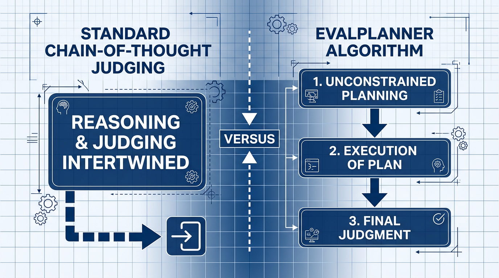

import JudgeBiasVisualizer from '../../components/chapter-17/JudgeBiasVisualizer.tsx';

# 17.2 LLM-as-a-Judge

In the previous section, we explored academic benchmarks like MMLU and HumanEval. While these static datasets are excellent for testing discrete logic and factual recall, they suffer from two fatal flaws in the modern AI era: they are highly susceptible to data contamination, and they completely fail to measure the *qualitative* nuances of human conversation. 

How do you programmatically evaluate if a model's tone is "helpful but not overly polite"? How do you score a creative writing prompt where there is no single objective ground truth? Traditional NLP metrics like BLEU or ROUGE, which measure n-gram overlap with a reference text, are notoriously useless for open-ended generation.

To solve this, the industry has shifted toward a paradigm known as **LLM-as-a-Judge**. By leveraging frontier models (like GPT-4, Claude 3.5, or Llama 3) to evaluate the outputs of other models, engineers can scale qualitative human-like evaluation without the prohibitive cost of actual human annotators. This section dives into the taxonomy of automated judgment, the engineering required to build robust evaluation pipelines, and the insidious biases that threaten this paradigm.

---

## 1. The Taxonomy of Judgment

According to recent comprehensive surveys on the LLM-as-a-Judge paradigm [[1]](#ref-1), evaluation tasks are generally structured along three dimensions: **What to judge**, **How to judge**, and **How to benchmark**.

### 1.1 What to Judge (The Output Format)
Depending on the engineering objective, we ask the Judge LLM to produce one of three types of outputs:
1. **Scoring (Pointwise):** The judge evaluates a single response in isolation and assigns an absolute score (e.g., 1 to 10) based on a specific rubric. This is useful for tracking a single model's degradation over time, but LLMs are notoriously bad at absolute calibration (a "7" today might be an "8" tomorrow).
2. **Ranking (Pairwise / Listwise):** The judge is given a prompt and two or more competing responses, and must declare a winner or rank them. Pairwise evaluation is the industry standard because LLMs, much like humans, are significantly better at relative comparison than absolute scoring.
3. **Selection:** The judge selects the best response from a pool, often used in routing architectures where multiple smaller models generate candidates and a larger judge selects the final output.

### 1.2 How to Judge (The Input Context)
* **Reference-based:** The judge is provided with a "gold standard" human answer. Its job is simply to evaluate how well the candidate model's response aligns with the facts of the reference.
* **Reference-free:** The judge must rely entirely on its own internal world knowledge to determine if the candidate's response is factually correct, safe, and helpful. This is the most common setup for evaluating open-ended chat models.

---

## 2. Engineering a Pairwise Judge Pipeline

Building an LLM-as-a-Judge system is not as simple as asking "Which is better?" LLMs are highly sensitive to prompt formatting and exhibit severe **Position Bias**—they disproportionately favor the first response they read (Model A), regardless of quality.

To engineer a robust pipeline, we must implement **Position Swapping**. We ask the judge to evaluate Model A vs Model B, and then in a separate inference pass, evaluate Model B vs Model A. Only if the judge consistently prefers one model across both permutations do we declare a definitive winner.

Below is a realistic PyTorch and Hugging Face `transformers` implementation of a pairwise judge that mitigates position bias and enforces structured JSON output.

```python
import torch
import json
from transformers import AutoModelForCausalLM, AutoTokenizer

def pairwise_judge(
    model: AutoModelForCausalLM, 
    tokenizer: AutoTokenizer, 
    prompt: str, 
    response_1: str, 
    response_2: str,
    device: str = "cuda"
) -> dict:
    """
    Executes a pairwise LLM-as-a-Judge evaluation with position swapping to mitigate bias.
    """
    
    # The system prompt enforces a strict rubric and JSON output
    system_prompt = (
        "You are an impartial expert judge evaluating AI models. "
        "Evaluate which response better addresses the user's prompt based on helpfulness, "
        "clarity, and accuracy. You must output a valid JSON object with two keys: "
        "'reasoning' (a brief step-by-step explanation) and 'winner' (either 'Response A', "
        "'Response B', or 'Tie')."
    )
    
    def get_verdict(res_a: str, res_b: str) -> str:
        user_content = f"[User Prompt]\n{prompt}\n\n[Response A]\n{res_a}\n\n[Response B]\n{res_b}"
        messages = [
            {"role": "system", "content": system_prompt},
            {"role": "user", "content": user_content}
        ]
        
        inputs = tokenizer.apply_chat_template(
            messages, return_tensors="pt", add_generation_prompt=True
        ).to(device)
        
        with torch.no_grad():
            outputs = model.generate(
                inputs, 
                max_new_tokens=256, 
                temperature=0.0, # Greedy decoding for deterministic judgment
                pad_token_id=tokenizer.eos_token_id
            )
            
        # Extract only the newly generated tokens
        generated_ids = outputs[0, inputs.shape[1]:]
        output_text = tokenizer.decode(generated_ids, skip_special_tokens=True)
        
        try:
            # In production, use constrained decoding (e.g., Outlines or Guidance) 
            # to guarantee JSON format. Here we parse the string.
            return json.loads(output_text).get("winner", "Error")
        except json.JSONDecodeError:
            return "Error"

    # Pass 1: Model 1 is A, Model 2 is B
    verdict_forward = get_verdict(response_1, response_2)
    
    # Pass 2: Position Swap (Model 2 is A, Model 1 is B)
    verdict_backward = get_verdict(response_2, response_1)
    
    # Resolve the final winner
    final_winner = "Tie"
    if verdict_forward == "Response A" and verdict_backward == "Response B":
        final_winner = "Model 1"
    elif verdict_forward == "Response B" and verdict_backward == "Response A":
        final_winner = "Model 2"
    elif verdict_forward == verdict_backward:
        final_winner = "Inconsistent (Position Bias Detected)"
        
    return {
        "forward_verdict": verdict_forward,
        "backward_verdict": verdict_backward,
        "final_winner": final_winner
    }
```

---

## 3. The State-of-the-Art: Thinking Judges (EvalPlanner)

Historically, researchers forced judges to use standard **Chain-of-Thought (CoT)** prompting (e.g., *"Think step-by-step before deciding"*). However, standard CoT intertwines the *planning* of the evaluation with the *execution* of the evaluation, leading the model to hallucinate criteria halfway through its reasoning.

The current state-of-the-art approach separates these cognitive steps. Introduced in 2025, the **EvalPlanner** algorithm [[2]](#ref-2) transforms the judge into a "Thinking LLM" via a strict three-stage pipeline:

1. **Unconstrained Planning:** The judge first writes a customized rubric specifically for the prompt (e.g., *"Step 1: Verify the Python code runs. Step 2: Check if the tone is professional. Step 3: Ensure no extra libraries were imported."*).
2. **Execution:** The judge executes its own plan step-by-step against the candidate responses.
3. **Final Judgment:** Based strictly on the execution trace, the judge renders a verdict.


*Source: Concept adapted from Saha et al., 2025 [[2]](#ref-2).*

By optimizing models using synthetic preference pairs of these (Plan $\rightarrow$ Execution $\rightarrow$ Verdict) triplets, researchers achieved a SOTA score of **93.9 on RewardBench**, proving that *how* a judge structures its thoughts is just as important as the size of its parameters.

---

## 4. Practical Guide: Engineering to Fix Inconsistent Evaluations

When deploying LLM-as-a-Judge in production, the biggest challenges are **evaluation variance** and **score extremism** (or bias toward extreme scores like 1 or 10). A model might give a 5 to a response in one run and a 1 in another, or it might fail to use the middle ground of the scale.

Here are practical strategies and examples to mitigate these issues and build a reliable judgment system.

### 4.1 Configuration Examples by Task

| Task | Evaluation Mode | Recommended Configuration & Prompt Strategy |
| :--- | :--- | :--- |
| **Summarization** | Pointwise or Reference-based | - **Key Criteria**: Informativeness, Accuracy, Conciseness.<br/>- **Strategy**: Provide gold standard data (reference answer) and ask the judge to verify using a checklist (e.g., "Are there facts not in the reference?" or "Are key points missing?"). |
| **Helpfulness (Chatbot)** | Pairwise | - **Key Criteria**: Intent understanding, politeness, solution relevance.<br/>- **Strategy**: Avoid absolute scores; instead, have the judge pick the better of two responses. Use position swapping to mitigate position bias. |
| **Code Review** | Rubric-based Pointwise | - **Key Criteria**: Correctness, Efficiency, Readability, Security.<br/>- **Strategy**: Use a 1-5 scale, but explicitly define what each score means (e.g., "5 means optimal algorithm with no security flaws"). |

### 4.2 Strategies to Mitigate Inconsistency & Extremism

Here are recommended strategies from recent research and engineering practices to reduce variance:

1. **Provide Detailed Rubrics (G-Eval Approach [[4]](#ref-4))**
   Instead of just asking the model to "score from 1 to 5," define exactly what each score level means in text. This prevents the model from applying subjective and shifting criteria.
   *Example: "Score 3: The answer is present but explanation is vague or lacks examples."*

2. **Few-Shot Calibration**
   Include examples of high (5), medium (3), and low (1) quality responses along with their scores and explanations in the prompt. This anchors the model's evaluation criteria to your specific expectations.

3. **Ensemble of Judges**
   Aggregate opinions from multiple judgments to reduce variance.
   - **Self-Ensemble**: Call the same model 3-5 times with a higher temperature (e.g., `temperature=0.7`) and average the scores or take a majority vote.
   - **Cross-Model Ensemble**: Use different models (e.g., GPT-4 and Claude) as co-judges to balance out model-specific biases.

4. **Allow Float Scores or Use Logprobs**
   Allowing fractional scores (e.g., 3.5) can prevent the model from clustering around integer boundaries. Alternatively, extracting token probabilities (logprobs) for score tokens can yield a more continuous and stable expected value.

---

## 5. The Dark Side: Biases and Preference Leakage

While LLM-as-a-Judge scales beautifully, it introduces systematic biases that can severely skew leaderboards. We already discussed **Position Bias** (favoring the first option), but judges also suffer from **Verbosity Bias**—a strong tendency to equate "longer responses" with "better responses," even if the extra text is fluff.

However, the most insidious threat discovered recently is **Preference Leakage** [[3]](#ref-3). 

As the industry moves toward "LLM-in-the-loop" development, frontier models are frequently used to generate synthetic training data for smaller models, and then those *same* frontier models are used as judges to evaluate them. This creates a massive conflict of interest.

Preference Leakage occurs because judges exhibit a systematic bias toward models they are related to. This relatedness is categorized into three levels:
* **Same Model:** A model judging its own outputs will artificially inflate its score.
* **Inheritance:** A massive teacher model (e.g., GPT-4) will inherently prefer the outputs of a smaller student model (e.g., GPT-4o-mini) that was distilled from it, because the student mimics the teacher's latent "thought patterns" and vocabulary distribution.
* **Family:** Models trained on the same foundational datasets by the same organization (e.g., Llama 3 judging Llama 2) will show unjustified favoritism toward each other.

Because related models share similar latent representations, the judge finds the related candidate's output more "natural" or "correct," leading to an echo chamber of circular validation.

### Interactive Visualizer: The Judge Bias Simulator

To understand how drastically these biases alter benchmark results, use the simulator below. Set the true underlying quality of two competing models, and then toggle various biases to see how an LLM Judge's final verdict is distorted from reality.


<JudgeBiasVisualizer client:load />

---

## 6. Evaluating the Evaluator

If we use an LLM to judge other LLMs, how do we evaluate the judge itself? The reliability of a judge is typically quantified using three metrics:

1. **Consistency:** Does the judge output the same verdict if we swap the order of the responses (Position Swap), or if we slightly paraphrase the prompt?
2. **Robustness:** Can the judge resist adversarial perturbations, such as a candidate model intentionally padding its answer with irrelevant text to trigger Verbosity Bias?
3. **Human Alignment:** The ultimate metric. We measure how frequently the LLM judge agrees with a consensus of expert human annotators. 

Human alignment is often calculated using **Cohen's Kappa ($\kappa$)**, a statistical measure that accounts for the possibility of the judge and the human agreeing by pure chance:

$$ \kappa = \frac{P_o - P_e}{1 - P_e} $$

Where:
* $P_o$ is the relative observed agreement among raters (e.g., the judge and human agreed 85% of the time).
* $P_e$ is the hypothetical probability of chance agreement.
* A $\kappa$ score above $0.80$ is generally considered excellent alignment.

---

## 7. Open Questions & Transition

LLM-as-a-Judge has democratized the evaluation of generative AI, allowing open-source researchers to evaluate models at a scale previously reserved for massive corporations with thousands of human annotators. However, the discovery of Preference Leakage warns us that we cannot rely on a single "God Model" to act as an impartial referee. 

If individual judges are biased, how do we aggregate the opinions of hundreds of different models and thousands of human users into a single, trustworthy leaderboard? In the next section, **17.3 Elo Rating & Leaderboards**, we will explore the mathematics behind the LMSYS Chatbot Arena and how the chess ranking system became the most trusted metric in artificial intelligence.

---

## Quizzes

<details>
<summary>Quiz 1: Why is "Pairwise Ranking" generally preferred over "Pointwise Scoring" when using LLMs as judges?</summary>
*LLMs struggle with absolute calibration. A score of "8/10" might mean something different depending on the system prompt, the temperature, or the specific model version, making it hard to compare scores across different evaluation runs. Pairwise ranking (A vs B) relies on relative comparison, which LLMs handle much more reliably, mirroring human psychology where it is easier to say "this is better than that" than to assign a perfectly objective numerical grade.*
</details>

<details>
<summary>Quiz 2: If an LLM judge evaluates Model A vs Model B and chooses Model A, but upon position swapping (evaluating B vs A) it chooses Model B, what specific bias is occurring and what is the standard engineering resolution?</summary>
*The judge is exhibiting Position Bias, specifically favoring the first response presented in the prompt context regardless of its actual quality. The standard engineering resolution is to declare the result a "Tie" or "Inconsistent" and exclude it from the final win-rate calculation, ensuring that only robust preferences are counted.*
</details>

<details>
<summary>Quiz 3: How does the EvalPlanner algorithm improve upon standard Chain-of-Thought (CoT) prompting for LLM judges?</summary>
*Standard CoT intertwines the formulation of evaluation criteria with the actual evaluation of the text, which can cause the model's logic to drift. EvalPlanner strictly separates the process into three distinct stages: Unconstrained Planning (creating a specific rubric for the prompt), Execution (applying the rubric step-by-step), and Final Judgment (rendering a verdict based solely on the execution trace). This separation of strategy from analysis significantly improves reasoning robustness.*
</details>

<details>
<summary>Quiz 4: A startup trains a small 8B parameter model by distilling outputs from GPT-4o. They then use GPT-4o as an automated judge to compare their new 8B model against an open-source Llama-3-8B model. GPT-4o overwhelmingly declares the startup's model the winner. Why should these results be heavily scrutinized?</summary>
*This is a textbook case of Preference Leakage via "Inheritance." Because the startup's model was trained on GPT-4o's data, it has learned to mimic GPT-4o's specific vocabulary, tone, and formatting preferences. When GPT-4o acts as the judge, it inherently favors the model that sounds most like itself, artificially inflating the distilled model's score compared to an independent model like Llama 3.*
</details>

<details>
<summary>Quiz 5: Formulate the explicit positional bias parameter within soft-logits when an LLM acts as a pairwise judge. Provide explicit mathematical equations to calibrate this bias in a single inference pass.</summary>
*Positional bias is modeled by isolating context bias parameter $\gamma$ in the soft-logit sequence for Response A over B: $P(Winner=A) = \sigma(s_A - s_B + \gamma)$, where $s_A, s_B$ are continuous quality vectors and $\gamma > 0$ dictates first-position priority. To neutralize this in a single inference pass without dual inference overhead, engineers set boundaries via a logit calibration sequence: $s_{calibrated} = \ln \frac{P(A)}{1 - P(A)} - \gamma_{measured}$. Calibrating $\gamma$ off a control dataset allows deterministic priority neutralize boundaries without inflating token compute by $2\times$.*
</details>

---

## References

1. <a id="ref-1"></a>Li, D., et al. (2024). *From Generation to Judgment: Opportunities and Challenges of LLM-as-a-judge*. [arXiv:2411.16594](https://arxiv.org/abs/2411.16594).
2. <a id="ref-2"></a>Saha, S., et al. (2025). *Learning to Plan & Reason for Evaluation with Thinking-LLM-as-a-Judge*. [arXiv:2501.18099](https://arxiv.org/abs/2501.18099).
3. <a id="ref-3"></a>Li, D., et al. (2025). *Preference Leakage: A Contamination Problem in LLM-as-a-judge*. [arXiv:2502.01534](https://arxiv.org/abs/2502.01534).
4. <a id="ref-4"></a>Liu, Y., et al. (2023). *G-Eval: NLG Evaluation using GPT-4 with Better Human Alignment*. [arXiv:2303.16634](https://arxiv.org/abs/2303.16634).