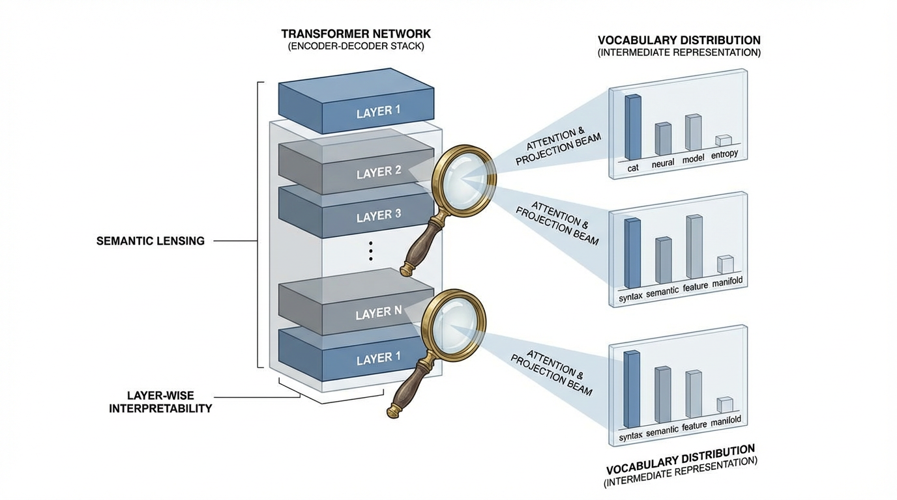
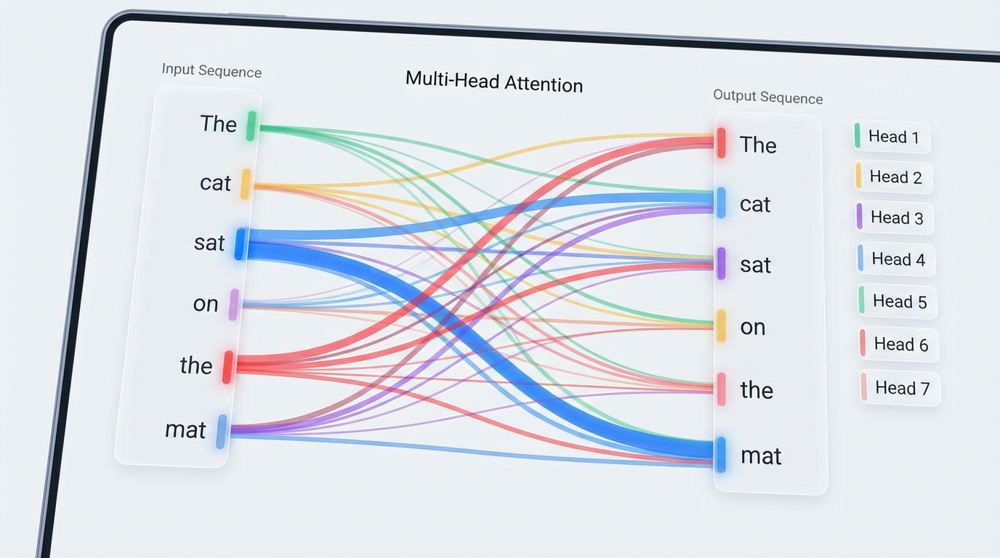

import LogitLensVisualizer from '../../components/chapter-19/LogitLensVisualizer.tsx';

# 19.2 Logit Lens & Attention Visualization

In the previous section, we decomposed the Transformer into circuits and induction heads, analyzing *how* information is mechanically routed across tokens. However, identifying a circuit only tells us the operational mechanics. It doesn't tell us what the model actually *believes* at a specific point in its processing. 

If we pause a 24-layer Large Language Model at layer 12, what is it thinking? Has it already figured out the next word, or does the realization only crystallize in the final layer? 

To answer these questions, we move from looking at the *weights* to looking at the *activations*. By utilizing techniques like the **Logit Lens** and **Attention Visualization**, we can peer into the continuous, high-dimensional residual stream and translate the model's alien internal state into human-readable concepts.

---

## 1. The Logit Lens: Reading the Residual Stream

In a standard decoder-only Transformer, the final prediction is made by taking the residual stream from the very last layer ($h_L$), applying a final Layer Normalization, and projecting it through the unembedding matrix ($W_U$) to yield a probability distribution over the vocabulary:

$$
P(x_{t+1}) = \text{softmax}(W_U \cdot \text{LN}(h_L))
$$

In 2020, an independent AI alignment researcher known as *nostalgebraist* proposed a radically simple idea [[1]](#ref-1). Since the residual stream acts as a central communication channel that accumulates information additively, what if we just apply the final unembedding matrix to the *intermediate* layers?

$$
P_l(x_{t+1}) = \text{softmax}(W_U \cdot \text{LN}(h_l)) \quad \text{for } l < L
$$

This technique is called the **Logit Lens**. It acts as a decoder ring, translating the dense vector $h_l \in \mathbb{R}^d$ back into the vocabulary space at any arbitrary layer $l$.

### What the Logit Lens Revealed
When applied to models like GPT-2, the Logit Lens yielded profound insights into the iterative nature of LLM inference:
1. **Early Convergence for Easy Tokens**: For grammatically obvious tokens (e.g., stop words, strong bigrams like `New` $\rightarrow$ `York`), the model often converges on the correct prediction within the first few layers. The remaining layers simply pass the prediction forward untouched.
2. **Iterative Refinement**: For complex factual queries, early layers might output generic guesses (e.g., predicting a common noun), while middle layers narrow it down to a category, and the final layers pinpoint the exact entity.
3. **Immediate Representation**: The model does not keep the raw input tokens around. By layer 1, the input representation is immediately converted into a *predictive* representation of the future token.


*Source: AI-generated illustration*

---

## 2. Engineering the Extraction (PyTorch)

To implement the Logit Lens, we must extract intermediate hidden states during the forward pass. Standard HuggingFace APIs usually provide an `output_hidden_states=True` flag, but understanding how to extract these manually using PyTorch hooks is critical for custom architectures or memory-constrained environments where you don't want to store the entire computational graph.

Here is a robust engineering pattern for extracting intermediate logits from a modern LLM (e.g., LLaMA or Mistral):

```python
import torch
import torch.nn as nn
from transformers import AutoModelForCausalLM, AutoTokenizer
from typing import List

def compute_logit_lens(model_name: str, prompt: str) -> List[torch.Tensor]:
    """
    Extracts vocabulary logits from every intermediate layer of an LLM.
    """
    tokenizer = AutoTokenizer.from_pretrained(model_name)
    model = AutoModelForCausalLM.from_pretrained(model_name, device_map="auto")
    
    inputs = tokenizer(prompt, return_tensors="pt").to(model.device)
    hidden_states = []
    
    # Define a hook to capture the output of each transformer block
    def hook_fn(module, input, output):
        # output[0] contains the hidden states of shape (batch, seq_len, hidden_dim)
        hidden_states.append(output[0].detach())
        
    # Register hooks on all layers
    # Note: Architecture paths vary. For LLaMA/Mistral it is `model.model.layers`.
    # For GPT-2 it would be `model.transformer.h`.
    hooks = []
    for layer in model.model.layers: 
        hooks.append(layer.register_forward_hook(hook_fn))
        
    # Forward pass (no gradients needed)
    with torch.no_grad():
        _ = model(**inputs)
        
    # Cleanup hooks to prevent memory leaks
    for hook in hooks:
        hook.remove()
        
    intermediate_logits = []
    
    # Project each intermediate state to the vocabulary
    for h in hidden_states:
        # Crucial: We must apply the final LayerNorm before the lm_head
        # For LLaMA: model.model.norm(h)
        h_norm = model.model.norm(h) 
        
        # Project using the unembedding matrix
        logits = model.lm_head(h_norm)
        intermediate_logits.append(logits)
        
    return intermediate_logits

# Example Usage:
# logits_per_layer = compute_logit_lens("meta-llama/Llama-2-7b-hf", "The capital of France is")
# logits_per_layer[10] -> Contains the vocabulary distribution at Layer 10
```

---

## 3. The Tuned Lens: Overcoming Basis Shift

While the Logit Lens works remarkably well on GPT-2, researchers noticed it produced garbage outputs on other models like BLOOM and Pythia. 

Why? The standard Logit Lens assumes that the vector space of the residual stream at Layer 5 is aligned with the vector space of the final Layer $L$. In GPT-2, this happens naturally due to **tied embeddings** (where the input embedding matrix and final unembedding matrix share the same weights). In models without tied embeddings, the network freely rotates and shifts the basis of the residual stream from layer to layer. 

To solve this, Belrose et al. (2023) introduced the **Tuned Lens** [[2]](#ref-2). Instead of directly applying $W_U$, they train a small affine transformation (a translator) consisting of a matrix $A_l$ and a bias $b_l$ for each layer $l$:

$$
P_l(x_{t+1}) = \text{softmax}(W_U \cdot (A_l h_l + b_l))
$$

### The Objective Function
Crucially, the Tuned Lens is *not* trained to predict the ground-truth next token. It is trained to minimize the KL divergence between its prediction and the **final layer's prediction**:

$$
\mathcal{L} = D_{KL}(P_L \parallel P_l)
$$

This distinction is vital for interpretability. We are not trying to build an early-exit classifier that predicts the right answer; we are trying to build a probe that faithfully reports what the model *currently believes*. If the model is going to hallucinate and predict "Rome" instead of "Paris", a faithful Tuned Lens should show the probability mass shifting toward "Rome" in the intermediate layers.

---

## 4. Attention Visualization: The "Where" of Information

If the Logit Lens tells us *what* the model is thinking, **Attention Visualization** tells us *where* it is looking to form those thoughts.

Tools like BertViz [[3]](#ref-3) allow researchers to inspect the otherwise opaque $QK^V$ matrix multiplications. Visualizing attention typically happens at three scales:

1. **Neuron View**: Visualizes the dot product between specific Query and Key vectors. This is useful for seeing exactly which features trigger an attention match.
2. **Head View**: Displays a bipartite graph connecting input tokens to context tokens based on the attention weights $\alpha_{ij}$ of a specific head. This is where we spot Induction Heads or grammatical routing (e.g., pronouns attending to nouns).
3. **Model View**: A macroscopic grid showing the attention patterns of all heads across all layers simultaneously.


*Source: AI-generated illustration*

### The "Attention is Not Explanation" Caveat
While visualizing attention is powerful, it is a common trap to equate attention weights directly with feature importance. As Jain & Wallace (2019) demonstrated [[4]](#ref-4), **Attention is not Explanation**. 

Just because Head $H$ attends heavily to the token `apple`, it does not mean the model is extracting the semantic meaning of "apple". 
* The model might be using `apple` purely as a positional anchor.
* The attention might be directed to an **Attention Sink** (like the `<s>` or `[BOS]` token). Because attention weights must sum to 1, heads that have nothing useful to contribute will "dump" their attention mass onto the first token to avoid pulling in noisy data.

Attention tells us the routing topology, but we still need the Logit Lens or SAEs to understand the *payload* being routed.

---

## 5. Interactive: The Logit Lens in Action

To build an intuition for how predictions evolve across layers, explore the interactive Logit Lens table below. It simulates the intermediate top predictions of a 12-layer model processing the prompt: *"The capital of France is"*.

Notice how the prediction for the final token transitions from generic syntactic guesses to the specific factual answer as depth increases.


<LogitLensVisualizer client:load />

---

## 7. Summary and Open Questions

The Logit Lens and Attention Visualization provide us with the macro-level tools to observe the life cycle of a token prediction. We can watch a model's confidence gradually build in the residual stream, and we can map the attention highways that transport the context required to make that prediction.

However, these tools treat the MLP layers—which contain roughly two-thirds of the model's parameters—as opaque black boxes that merely "update" the residual stream. If Attention routes the data, the MLPs act as the key-value memory banks that store facts and concepts. 

* How do we read the specific knowledge stored inside an MLP? 
* Can we test if a model "knows" a fact even if it chooses not to output it?

To answer these questions, we must move beyond passive lenses and introduce active interventions, leading us to our next topic: **19.3 Probing Classifiers**.

## Quizzes

<details>
<summary>Quiz 1: Why does the standard Logit Lens often output nonsensical tokens in the very first few layers (e.g., layers 0-2)?</summary>
*Early layers are primarily concerned with detokenization and building local context (e.g., merging subwords, establishing part-of-speech), rather than predicting the final semantic output. Their representations have not yet aligned with the final vocabulary basis, making direct projection via $W_U$ unreliable.*
</details>

<details>
<summary>Quiz 2: In the Tuned Lens, why do we minimize the KL divergence between the intermediate prediction and the *final layer's* prediction, rather than the ground truth token?</summary>
*The goal of mechanistic interpretability is to understand the model's internal beliefs and computational processes. If we train the probe on ground truth, we build a new classifier that might extract features the model itself ignores. Matching the final layer ensures we are faithfully decoding the model's actual trajectory, even when it hallucinates.*
</details>

<details>
<summary>Quiz 3: When visualizing attention, you notice an attention head consistently assigns 90% of its weight to the `[BOS]` (Beginning of Sequence) token. What is the most likely mechanical reason for this?</summary>
*This is known as an "attention sink". Because the softmax function requires attention weights to sum to 1, heads that do not find any relevant information in the current context must dump their attention mass somewhere harmless. The `[BOS]` token serves as this universal, safe anchor.*
</details>

<details>
<summary>Quiz 4: How does the presence of tied embeddings (where the input embedding matrix is the same as the final unembedding matrix) affect the performance of the standard Logit Lens?</summary>
*Tied embeddings force the input and output representations to share a common vector space. This naturally aligns the intermediate residual stream closer to the vocabulary basis, making the standard Logit Lens much more effective without the need for the affine transformations used in the Tuned Lens.*
</details>

---

## References

1. <a id="ref-1"></a>nostalgebraist. (2020). *interpreting GPT: the logit lens*. AI Alignment Forum. [Link](https://www.alignmentforum.org/posts/AcKRB8wDpdaN6v6ru/interpreting-gpt-the-logit-lens).
2. <a id="ref-2"></a>Belrose, N., et al. (2023). *Eliciting Latent Predictions from Transformers with the Tuned Lens*. [arXiv:2303.08112](https://arxiv.org/abs/2303.08112).
3. <a id="ref-3"></a>Vig, J. (2019). *A Multiscale Visualization of Attention in the Transformer Model*. [arXiv:1906.05714](https://arxiv.org/abs/1906.05714).
4. <a id="ref-4"></a>Jain, S., & Wallace, B. C. (2019). *Attention is not Explanation*. [arXiv:1902.10186](https://arxiv.org/abs/1902.10186).
```