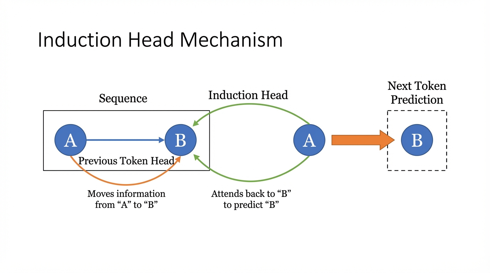

import InductionHeadVisualizer from '../../components/chapter-19/InductionHeadVisualizer.tsx';

# 19.1 Mechanistic Interpretability

Modern Large Language Models (LLMs) are often described as "black boxes." We feed them terabytes of data, optimize a simple objective function (next-token prediction) using gradient descent, and somehow, complex behaviors like logical reasoning, translation, and coding emerge. 

**Mechanistic Interpretability (MechInterp)** is the ambitious scientific endeavor to reverse-engineer these black boxes. Instead of treating the model as an opaque statistical engine, MechInterp views it as a compiled computer program. The goal is to decompile the billions of continuous weights back into human-understandable algorithms, data structures, and logical circuits.

Think of it as neuroscience for artificial brains, or reverse-engineering an alien spacecraft. We have the hardware (the weights), but we lack the source code.

---

## 1. Motivation and History

Historically, deep learning focused on *capability*—making models larger and more accurate. However, as models transition from research artifacts to critical infrastructure, understanding *how* they work becomes a non-negotiable safety requirement.

### Why do we need Mechanistic Interpretability?
1. **Alignment and Safety**: If we don't understand how a model makes decisions, we cannot guarantee it won't act maliciously (e.g., deceptive alignment, where a model pretends to be aligned during training but acts destructively in deployment).
2. **Debugging Hallucinations**: Knowing exactly which circuit retrieves a specific fact allows us to pinpoint why a model hallucinates and surgically edit its knowledge.
3. **Auditing**: Regulatory compliance in high-stakes domains (medical, legal) requires explainable decision-making.

The field traces its modern roots back to feature visualization in Convolutional Neural Networks (CNNs), spearheaded by researchers like Chris Olah (Distill, OpenAI, Anthropic). Early work visualized how early CNN layers detected edges, while deeper layers detected complex concepts like dog snouts or car wheels [[1]](#ref-1). 

With the advent of the Transformer, the focus shifted from spatial feature maps to residual streams and attention matrices. Anthropic's foundational paper, *A Mathematical Framework for Transformer Circuits* [[2]](#ref-2), established the modern lexicon of MechInterp, viewing Transformers not as monolithic blocks, but as networks of interacting "heads" communicating via a shared memory bandwidth (the residual stream).

---

## 2. The Linear Representation Hypothesis

Before we can find circuits, we must understand how a neural network stores concepts. The prevailing theory in MechInterp is the **Linear Representation Hypothesis**.

It posits that neural networks represent concepts (features) as **directions in the activation space**, rather than as individual neurons. 

If the residual stream of a Transformer is a high-dimensional vector space $\mathbb{R}^d$, a feature like "gender", "plurality", or "the concept of a dog" is a specific unit vector $v \in \mathbb{R}^d$. The presence or absence of this feature is determined by the projection of the activation vector $h$ onto this direction:

$$
\text{Activation of Feature } i = h \cdot v_i
$$

### The Problem of Arbitrary Basis
Because the residual stream is transformed by dense weight matrices (which can be rotated arbitrarily without changing the network's capacity), the individual basis dimensions (the literal neurons $h_1, h_2, \dots, h_d$) rarely correspond to clean, single concepts. 

This leads to **Polysemanticity**—a single neuron firing for multiple, unrelated concepts (e.g., a neuron that fires for both "spiders" and "the French language"). We will explore how to disentangle this using Sparse Autoencoders (SAEs) in Chapter 19.4, but for now, understand that *features are directions, not neurons*.

---

## 3. Circuits and Induction Heads

A **Circuit** is a subgraph of the neural network—a specific set of attention heads and MLP neurons—that implements a recognizable algorithm. 

The most famous and fundamental circuit discovered in LLMs is the **Induction Head** [[3]](#ref-3). Induction heads are the mechanical explanation for **In-Context Learning (ICL)**—the ability of an LLM to learn a new pattern purely from the prompt without weight updates.

### The Algorithm of an Induction Head
An induction head looks for a simple pattern: `[A] [B] ... [A] -> [B]`. 
If it sees the token `[A]`, it searches the past context for previous instances of `[A]`, looks at the token that immediately followed it (`[B]`), and promotes `[B]` as the next predicted token.

This requires the coordination of at least two attention heads across different layers:

1. **Previous Token Head (Layer $L_1$)**: 
   This head simply attends to the token immediately preceding the current one. It moves the information of `[A]` into the residual stream position of `[B]`. Now, the token `[B]` contains a feature saying "I am preceded by A".
   
2. **Induction Head (Layer $L_2$, where $L_2 > L_1$)**:
   When the model processes the second instance of `[A]`, the Induction Head's Query ($Q$) searches for Keys ($K$) that contain the feature "I am preceded by A". It finds the earlier `[B]`, attends to it, and its Value ($V$) projection copies the "B-ness" into the final residual stream to predict `[B]`.



### The QK and OV Circuits
MechInterp mathematically decomposes Attention into two independent operations:
* **The QK Circuit ($W_Q W_K^T$)**: Determines *where* to move information (the attention weights).
* **The OV Circuit ($W_V W_O$)**: Determines *what* information to move once attention is paid.

For an Induction Head, the QK circuit computes the match between "current token A" and "token preceded by A". The OV circuit acts as a copy operation, extracting the identity of `[B]` and writing it to the output logits.

---

## 4. Engineering the Interception: PyTorch Hooks

To perform Mechanistic Interpretability, we cannot just look at the final loss. We must extract the intermediate activations (the residual stream, attention matrices, and MLP hidden states) during the forward pass. 

In PyTorch, this is elegantly handled using `register_forward_hook`. Below is a robust engineering pattern for intercepting and analyzing attention matrices to hunt for Induction Heads.

```python
import torch
import torch.nn as nn
from typing import Tuple

class InterceptHook:
    """
    A reusable PyTorch hook to capture intermediate activations.
    """
    def __init__(self, module: nn.Module):
        self.activations = None
        self.hook_handle = module.register_forward_hook(self._hook_fn)

    def _hook_fn(self, module: nn.Module, input: Tuple[torch.Tensor], output: torch.Tensor):
        # MultiheadAttention returns (attn_output, attn_weights)
        # We want to capture the attn_weights (shape: batch_size, num_heads, seq_len, seq_len)
        if isinstance(output, tuple) and len(output) == 2:
            self.activations = output[1].detach().cpu()
        else:
            self.activations = output.detach().cpu()

    def remove(self):
        self.hook_handle.remove()

def analyze_attention_patterns(
    model: nn.Module, 
    input_ids: torch.Tensor, 
    layer_idx: int
) -> torch.Tensor:
    """
    Executes a forward pass and extracts the attention matrix for a specific layer.
    """
    # Assuming standard HuggingFace/PyTorch Transformer architecture naming
    target_module = model.transformer.h[layer_idx].attn
    
    # Register the hook
    hook = InterceptHook(target_module)
    
    # Forward pass (no gradients needed for interpretability extraction)
    with torch.no_grad():
        _ = model(input_ids)
        
    # Retrieve captured attention weights
    attn_weights = hook.activations
    hook.remove()
    
    return attn_weights

# Example Usage (Simulated):
# input_ids shape: [1, seq_len] representing "Harry Potter is a wizard. Harry Potter"
# attn_weights shape: [1, num_heads, seq_len, seq_len]
# 
# To find an induction head, we would look for a head in 'attn_weights' where 
# the row corresponding to the second "Harry" has a high value in the column 
# corresponding to the first "Potter".
```

By aggregating these hooks across all layers and heads over a large dataset of repeating sequences, researchers can systematically map out exactly which heads are responsible for in-context learning.

---

## 5. Interactive: Visualizing an Induction Head

To truly grasp how an induction head operates, interact with the attention matrix below. This visualization simulates the attention weights of an Induction Head processing a repeating sequence.

Notice how the Query for the second occurrence of a token attends strongly to the token *following* its first occurrence.


<InductionHeadVisualizer client:load />

*(In a real model, the attention matrix is noisier, but the distinct diagonal offset pattern remains the unmistakable signature of an induction head.)*

---

## 7. Summary and Open Questions

Mechanistic Interpretability provides a rigorous, mathematical framework for understanding the internal machinery of Large Language Models. By decomposing the network into the Linear Representation Hypothesis, QK/OV circuits, and algorithmic subgraphs like Induction Heads, we transition from treating AI as alchemy to treating it as software engineering.

However, as models scale to trillions of parameters, manual circuit discovery becomes computationally and cognitively intractable. 
* How can we automate the discovery of circuits? 
* How do we interpret the massive MLP layers that contain the bulk of the model's world knowledge?
* What happens when multiple concepts are crammed into the same set of neurons?

To answer these questions, we must look at advanced visualization techniques and the problem of Superposition, which we will explore next in **19.2 Logit Lens & Attention Visualization** and **19.4 Sparse Autoencoders (SAE)**.

## Quizzes

<details>
<summary>Quiz 1: According to the Linear Representation Hypothesis, why are concepts represented as directions in the residual stream rather than by individual neurons?</summary>
*Because the residual stream is a continuous vector space transformed by dense weight matrices. A neural network can represent more features than it has dimensions (superposition) by utilizing almost-orthogonal directions in high-dimensional space. Tying a concept to a single basis vector (neuron) is a highly inefficient use of the vector space capacity.*
</details>

<details>
<summary>Quiz 2: If you completely remove positional encodings (like RoPE or Sinusoidal) from a Transformer, will an Induction Head still be able to function?</summary>
*No. The Previous Token Head, which is a prerequisite for the Induction Head, relies entirely on positional information to know which token is "previous". Without positional encodings, the model treats the sequence as a bag of words, making it impossible to form the `[A] -> [B]` sequential relationship.*
</details>

<details>
<summary>Quiz 3: Why is Mechanistic Interpretability currently much more successful at reverse-engineering Attention Heads compared to MLP layers?</summary>
*Attention heads have a natural, interpretable bottleneck: the attention matrix. The QK circuit explicitly tells us which tokens are communicating, and the OV circuit tells us what is being communicated. MLP layers, on the other hand, act as massive, dense key-value memories with highly polysemantic neurons, making their specific logical routing much harder to disentangle without advanced techniques like Sparse Autoencoders.*
</details>

<details>
<summary>Quiz 4: In the context of the OV and QK circuits, if a model learns to consistently copy a specific token (e.g., repeating a name), which matrix product is likely to have eigenvalues close to 1?</summary>
*The OV matrix ($W_V W_O$). If the OV circuit acts as a direct copy operation, it must preserve the direction of the token's embedding in the residual stream. Therefore, the transformation matrix $W_V W_O$ acts roughly like an identity matrix for that specific subspace, meaning its dominant eigenvalues will be close to 1.*
</details>

---

## References

1. <a id="ref-1"></a>Olah, C., et al. (2020). *Zoom In: An Introduction to Circuits*. Distill. [Link](https://distill.pub/2020/circuits/zoom-in/).
2. <a id="ref-2"></a>Elhage, N., et al. (2021). *A Mathematical Framework for Transformer Circuits*. Anthropic. [Link](https://transformer-circuits.pub/2021/framework/index.html).
3. <a id="ref-3"></a>Olsson, C., et al. (2022). *In-context Learning and Induction Heads*. [arXiv:2209.11895](https://arxiv.org/abs/2209.11895).
4. <a id="ref-4"></a>Park, K., et al. (2023). *The Linear Representation Hypothesis and the Geometry of Large Language Models*. [arXiv:2311.03658](https://arxiv.org/abs/2311.03658).