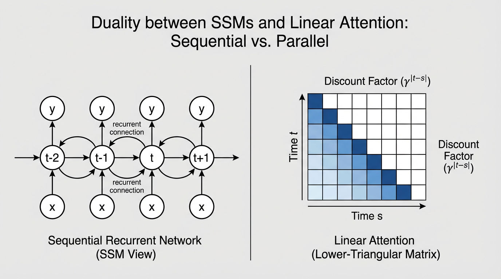

import SSMDualityVisualizer from '../../components/chapter-20/SSMDualityVisualizer.tsx';

# 20.2 Mamba & S6: The Technical Evolution

While the concept of State Space Models (SSMs) provided a theoretical pathway to linear-time sequence modeling, making it competitive with the Transformer required rigorous algorithm-hardware co-design. The Mamba line of work is best read as a rapid sequence of evolving ideas rather than a single finished destination.

This section dissects the progression from Mamba-1's **Selective Scan (S6)** to Mamba-2's **Structured State Space Duality (SSD)**, then briefly discusses later follow-on work reported in the cited preprint as **Mamba-3 (MIMO)**.

---

## 1. The S6 Foundation (Mamba-1)

The original Mamba architecture introduced the **S6 (Selective Structured State Space Sequence)** model [[1]](#ref-1). Its primary breakthrough was making the state transition parameters ($B$, $C$, and $\Delta$) functions of the input $x_t$, allowing the model to selectively remember or forget information.

Mathematically, the S6 core relies on a diagonal state transition matrix $A \in \mathbb{R}^{D \times N}$, where $D$ is the model dimension and $N$ is the state size. Because $A$ is diagonal, the hidden state $h_t$ updates independently across dimensions. 

However, S6 harbored a fundamental hardware limitation. The input-dependent nature of the recurrence meant it could no longer use the fast Fourier transforms of earlier LTI models. Instead, Mamba-1 utilized a custom **parallel associative scan** written in CUDA. 
While this prefix-sum algorithm was heavily optimized to keep the state $h$ in the GPU's ultra-fast SRAM, it was ultimately bound by **memory bandwidth**, not compute. Associative scans cannot be expressed as dense matrix multiplications (MatMuls), meaning Mamba-1 could not leverage the massive FLOPs provided by modern GPU Tensor Cores.

---

## 2. Structured State Space Duality (Mamba-2)

In mid-2024, researchers introduced **Mamba-2**, built upon the theoretical framework of **Structured State Space Duality (SSD)** [[2]](#ref-2). SSD provided a profound mathematical revelation: *Selective SSMs and Linear Attention are two sides of the same coin.*

To bridge this gap, Mamba-2 made a deliberate architectural compromise: it restricted the diagonal matrix $A$ to a **scalar-times-identity** structure ($A = a \cdot I$). By forcing all elements on the diagonal to be identical, the state update becomes uniform across the state dimension $N$.

This slight reduction in expressivity unlocked a massive computational advantage. With a scalar $A$, the sequential SSM update can be perfectly rewritten as a specialized attention mechanism. Specifically, it is equivalent to Linear Attention applied over a sequence, but multiplied by a **semi-separable causal mask** $\mathbf{L}$, where the discount factor between token $i$ and token $j$ is the cumulative product of the state transitions:

$$ \mathbf{L}_{ij} = \prod_{k=j+1}^i a_k $$

### The Tensor Core Unlock
Because SSD reformulates the recurrence as an attention matrix, the computation can be executed using **chunkwise matrix multiplication**. The sequence is divided into blocks (e.g., chunks of 64 tokens). 
1. **Intra-chunk:** Token interactions *within* the chunk are computed using standard MatMul (Linear Attention).
2. **Inter-chunk:** The final hidden state of the chunk is passed to the next chunk sequentially.

This shift from bandwidth-bound associative scans to compute-bound MatMuls allowed Mamba-2 to fully saturate Tensor Cores. Training speeds increased by 2–8x, and the state size $N$ could be safely expanded from 16 to 256, vastly improving the model's capacity for associative recall.




<SSMDualityVisualizer client:load />

---

## 3. Implementing the Duality in PyTorch

To understand exactly how Mamba-2 transforms a recurrent loop into a matrix multiplication, examine the educational PyTorch implementation below. It demonstrates the chunkwise intra-block attention mechanism derived from the SSD framework.

```python
import torch
import torch.nn as nn
import torch.nn.functional as F

class SimplifiedSSD(nn.Module):
    """
    An educational implementation of Structured State Space Duality (Mamba-2).
    Demonstrates the chunkwise matrix multiplication (MatMul) approach.
    """
    def __init__(self, d_model: int, d_state: int, chunk_size: int = 64):
        super().__init__()
        self.d_model = d_model
        self.d_state = d_state
        self.chunk_size = chunk_size
        
        # Mamba-2 restricts A to a scalar-times-identity structure.
        # We learn one scalar per channel.
        self.A_log = nn.Parameter(torch.randn(d_model))
        
        # In Mamba-2, X, B, C, and dt are projected in parallel
        self.in_proj = nn.Linear(d_model, d_model * 2 + d_state * 2)
        self.out_proj = nn.Linear(d_model, d_model)

    def forward(self, x: torch.Tensor) -> torch.Tensor:
        B_batch, L, D = x.shape
        
        # Pad sequence length to be a multiple of chunk_size
        pad_len = (self.chunk_size - (L % self.chunk_size)) % self.chunk_size
        if pad_len > 0:
            x = F.pad(x, (0, 0, 0, pad_len))
        
        L_padded = x.shape[1]
        num_chunks = L_padded // self.chunk_size
        
        # 1. Parallel Projection
        proj = self.in_proj(x)
        x_proj, dt_raw, B_mat, C_mat = torch.split(
            proj, 
            [self.d_model, self.d_model, self.d_state, self.d_state], 
            dim=-1
        )
        dt = F.softplus(dt_raw)
        
        # 2. Discretize A (Scalar-times-identity)
        A = -torch.exp(self.A_log) # (D,)
        dA = torch.exp(dt * A)     # (B, L, D)
        
        # Reshape into chunks: (Batch, Chunks, ChunkSize, Dim)
        x_chunks = x_proj.view(B_batch, num_chunks, self.chunk_size, D)
        B_chunks = B_mat.view(B_batch, num_chunks, self.chunk_size, self.d_state)
        C_chunks = C_mat.view(B_batch, num_chunks, self.chunk_size, self.d_state)
        dA_chunks = dA.view(B_batch, num_chunks, self.chunk_size, D)
        
        # 3. Compute the semi-separable distance mask for the chunk
        # L_{i,j} = \prod_{k=j+1}^i dA_k
        # [NOTE]: In production, this O(C^2) operation is fused natively in Triton.
        mask = torch.ones(B_batch, num_chunks, self.chunk_size, self.chunk_size, D, device=x.device)
        for i in range(self.chunk_size):
            for j in range(i):
                mask[:, :, i, j, :] = torch.prod(dA_chunks[:, :, j+1:i+1, :], dim=2)
                
        # Apply causal masking (lower triangular)
        causal_mask = torch.tril(torch.ones(self.chunk_size, self.chunk_size, device=x.device))
        mask = mask * causal_mask.view(1, 1, self.chunk_size, self.chunk_size, 1)
        
        # 4. Discretize B and Compute State V
        dB_chunks = dt.view(B_batch, num_chunks, self.chunk_size, D).unsqueeze(-1) * B_chunks.unsqueeze(-2)
        V = dB_chunks * x_chunks.unsqueeze(-1) # (B, Chunks, ChunkSize, D, d_state)
        
        # 5. Intra-chunk Attention: Y = C * (Mask @ V)
        # We multiply V by the mask along the sequence dimension 'j'
        attn_out = torch.einsum('bnijd,bnjde->bnide', mask, V) 
        Y_intra = torch.einsum('bnide,bnie->bnid', attn_out, C_chunks) # (B, Chunks, ChunkSize, D)
        
        # [NOTE]: Inter-chunk recurrence (passing the hidden state between chunks)
        # is omitted here for brevity, but follows a similar block-wise update.
        
        y = Y_intra.view(B_batch, L_padded, D)
        if pad_len > 0:
            y = y[:, :L, :]
            
        return self.out_proj(y)
```

---

## 4. Mamba-3: The Inference-First Frontier

Mamba-2's success came at a subtle cost: by reducing $A$ to a scalar to maximize training throughput, the model sacrificed some of its inherent state-tracking expressivity. As the AI industry shifted focus from pre-training speed to inference efficiency—driven by agentic workflows, long-context retrieval, and RL rollouts—the architecture needed to evolve again.

One reported follow-on direction, described in the cited preprint as **Mamba-3** [[3]](#ref-3), pivots back toward expressivity and inference-oriented trade-offs. In that framing, the scalar $A$ constraint is relaxed and three ideas are emphasized:

### Complex-Valued State Updates
To recover the state-tracking power lost in Mamba-2, Mamba-3 transitions the hidden state from real numbers to the complex domain ($h \in \mathbb{C}^N$). Complex-valued SSMs can naturally model oscillatory behaviors, rotations, and phase-dependent information. This is critical for synthetic state-tracking tasks and exact associative recall, where pure linear attention often struggles to maintain precise positional relationships over long horizons.

### Multi-Input Multi-Output (MIMO)
Standard SSMs (including Mamba-1 and 2) are Single-Input Single-Output (SISO) systems. Mamba-3 introduces a **MIMO** formulation, expanding the $B$ and $C$ projections to process multiple inputs and outputs simultaneously in parallel streams.
*   **Information Density:** MIMO increases the modeling power of the state without expanding the sequence length. At the 1.5B parameter scale, the MIMO variant improves downstream accuracy by 1.8 points over Mamba-2.
*   **Hardware Utilization:** Because the MIMO expansion occurs along the channel dimensions, it significantly increases the arithmetic intensity (FLOPs per byte) during auto-regressive decoding. This allows Mamba-3 to achieve higher accuracy without increasing the wall-clock latency of generation.

### Exponential-Trapezoidal Discretization
Mamba-3 replaces the standard Zero-Order Hold (ZOH) discretization with an **exponential-trapezoidal** scheme. This provides a more stable and expressive recurrence formula that better approximates the underlying continuous dynamical system.

If those reported results hold under broader replication, the implication is that later SSM variants may recover more expressivity without giving up the deployment advantages that made the line attractive in the first place.

---

## 5. Architectural Comparison

| Feature | Mamba-1 (S6) | Mamba-2 (SSD) | Mamba-3 (MIMO) |
| :--- | :--- | :--- | :--- |
| **State Matrix ($A$)** | Diagonal | Scalar times Identity | Complex-valued |
| **Recurrence Mode** | Selective Scan (Prefix-Sum) | Chunkwise MatMul (SSD) | Optimized MIMO MatMuls |
| **State Size ($N$)** | Small (typically 16) | Large (64–256) | Highly Dense (matches Mamba-2 at 50% size) |
| **Key Optimization** | Linear scaling | Training speed & Tensor Cores | State tracking & Inference Pareto |
| **Theoretical Focus** | Continuous Discretization | Duality with Linear Attention | Exponential-Trapezoidal Discretization |

---

## 7. Summary and Open Questions

The evolution from Mamba-1 to Mamba-3 perfectly illustrates the realities of Foundation Model engineering: theoretical elegance must constantly be balanced against hardware constraints. Mamba-1 proved linear scaling was possible. Mamba-2 compromised slightly on expressivity to unlock the raw speed of GPU Tensor Cores. Finally, Mamba-3 reclaimed that expressivity, optimizing specifically for the bottlenecks of production inference through complex states and MIMO architectures.

**Open Questions:** 
As state sizes become denser and more complex, how will quantization techniques (like FP8 or INT4) affect the stability of complex-valued recurrent states? Furthermore, if Mamba-3 can match Transformer performance with constant memory, how will this alter the design of multi-agent systems that require infinite-horizon memory loops? In the next sections, we will explore alternative linear attention mechanisms and how neural networks are evolving to execute logic directly as programs.

## Quizzes

<details>
<summary>Quiz 1: Why did Mamba-1's S6 architecture struggle to fully utilize modern GPU Tensor Cores during training?</summary>
*Mamba-1 relied on a parallel associative scan algorithm. While highly optimized for memory bandwidth and SRAM caching, associative scans cannot be expressed as dense matrix multiplications. Because GPU Tensor Cores are explicitly designed to accelerate MatMuls, Mamba-1 left a significant portion of the GPU's raw compute power unutilized.*
</details>

<details>
<summary>Quiz 2: How does the Structured State Space Duality (SSD) framework in Mamba-2 reformulate the SSM update?</summary>
*By restricting the state matrix $A$ to a scalar-times-identity structure, SSD proves that the sequential SSM update is mathematically equivalent to Linear Attention with a semi-separable distance mask. This allows the recurrence to be computed via chunkwise matrix multiplications, fully unlocking Tensor Core performance.*
</details>

<details>
<summary>Quiz 3: What is the primary advantage of the Multi-Input Multi-Output (MIMO) formulation introduced in Mamba-3?</summary>
*MIMO expands the $B$ and $C$ projections to process multiple inputs and outputs simultaneously. This increases the model's expressivity and hardware utilization (FLOPs per byte) during auto-regressive decoding, boosting downstream accuracy without increasing wall-clock inference latency.*
</details>

<details>
<summary>Quiz 4: Why does Mamba-3 transition from real-valued to complex-valued hidden states?</summary>
*Complex-valued states allow the model to naturally track oscillatory behaviors and phase-dependent information. This restores and enhances the advanced state-tracking capabilities that were partially lost when Mamba-2 simplified the $A$ matrix to a uniform scalar.*
</details>

---

## References

1. <a id="ref-1"></a>Gu, A., & Dao, T. (2023). *Mamba: Linear-Time Sequence Modeling with Selective State Spaces*. [arXiv:2312.00752](https://arxiv.org/abs/2312.00752).
2. <a id="ref-2"></a>Dao, T., & Gu, A. (2024). *Transformers are SSMs: Generalized Models and Efficient Algorithms Through Structured State Space Duality*. [arXiv:2405.21060](https://arxiv.org/abs/2405.21060).
3. <a id="ref-3"></a>Lahoti, A., Li, K. Y., Chen, B., Wang, C., Bick, A., Kolter, J. Z., Dao, T., & Gu, A. (2026). *Mamba-3: Improved Sequence Modeling using State Space Principles*. [arXiv:2603.15569](https://arxiv.org/abs/2603.15569).

---
