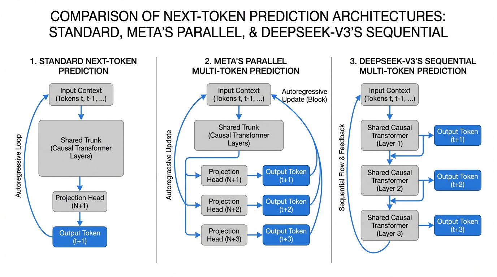

import MTPVisualizer from '../../components/chapter-20/MTPVisualizer.tsx';

# 20.5 Multi-Token Prediction (MTP)

For years, the fundamental axiom of autoregressive language modeling has been the Next-Token Prediction (NTP) objective. We train models to maximize the likelihood of $x_{t+1}$ given the historical context $x_{1:t}$. While mathematically elegant, this approach enforces a severe structural bottleneck: the model must compress all its "planning" for future syntax, logic, and reasoning into a single dense vector representing the very next step. 

Think of standard NTP as driving a car in pitch darkness with headlights that only illuminate one meter ahead. You can stay in your lane by making continuous micro-adjustments, but anticipating a sharp turn requires implicit, latent foresight that is notoriously difficult for models to maintain over long horizons.

**Multi-Token Prediction (MTP)** shatters this bottleneck. By explicitly forcing the model to predict $n$ tokens into the future during training, we densify the supervision signal and force the hidden representations to encode long-range structural dependencies [2]. In this section, we will deconstruct the MTP paradigm, comparing the foundational parallel architecture introduced by Meta with the sequential causal architecture deployed in DeepSeek-V3 [1].

---

## 1. The Architectural Evolution

Historically, multi-token decoding was treated merely as an inference-time trick. Frameworks like Medusa or Eagle grafted auxiliary prediction heads onto pre-trained models, fine-tuning them to act as draft models for speculative decoding. While this accelerated inference, it did nothing to improve the base model's intrinsic reasoning capabilities.

The paradigm shifted when researchers began applying MTP as a **pre-training objective**.



### Meta's Parallel Heads (Gloeckle et al., 2024)
Meta FAIR demonstrated that training a model from scratch to predict multiple future tokens simultaneously yields superior representations [2]. In this architecture, the main Transformer trunk outputs a hidden state $h_t$. Instead of a single LM head, the model features $n$ independent projection blocks. Each block takes $h_t$ and independently predicts $x_{t+1}, x_{t+2}, \dots, x_{t+n}$. 

### DeepSeek-V3's Sequential Heads (Liu et al., 2024)
DeepSeek-V3 refined this by introducing a sequential, causal MTP module [1]. Instead of parallel independent heads predicting the future in isolation, DeepSeek's MTP maintains the causal chain. To predict $x_{t+2}$, the module takes the hidden state used to predict $x_{t+1}$ and combines it with the actual embedding of $x_{t+1}$ (which is known during training), passing them through an additional shared Transformer layer [1]. This ensures that the prediction of token $t+k$ is causally conditioned on the representations of all preceding tokens.

---

## 2. Mathematical Formulation and PyTorch Implementation

Let's formalize the parallel MTP approach. In standard NTP, the cross-entropy loss at step $t$ is:

$$ \mathcal{L}_{NTP} = -\log P(x_{t+1} | x_{1:t}) $$

In an $n$-token MTP setup, we compute the loss for the next token, plus the auxiliary losses for the $n-1$ future tokens, weighted by a hyperparameter $\lambda_k$ (often set to 1.0 or decayed for distant tokens) [2]:

$$ \mathcal{L}_{MTP} = - \sum_{k=1}^{n} \lambda_k \log P(x_{t+k} | x_{1:t}) $$

To implement this efficiently in PyTorch without destroying training throughput, we share the main LM head (which maps $d_{model} \to \text{Vocab}$) across all $n$ predictions, but introduce lightweight projection blocks to shift the hidden state $h_t$ into the future latent spaces $z_t^{(k)}$.

```python
import torch
import torch.nn as nn
import torch.nn.functional as F

class ParallelMTPModule(nn.Module):
    """
    Implementation of Multi-Token Prediction (Parallel Heads) 
    Reference: Gloeckle et al., 2024 (Meta FAIR)
    """
    def __init__(self, d_model: int, vocab_size: int, num_future_tokens: int = 4):
        super().__init__()
        self.num_future_tokens = num_future_tokens
        
        # Shared LM head for all predictions to conserve VRAM
        self.shared_lm_head = nn.Linear(d_model, vocab_size, bias=False)
        
        # MTP projection blocks (for k=2 to n)
        # k=1 is the standard next-token prediction, handled directly by the trunk
        self.mtp_projections = nn.ModuleList([
            nn.Sequential(
                nn.RMSNorm(d_model),
                nn.Linear(d_model, d_model * 2, bias=False),
                nn.SiLU(),
                nn.Linear(d_model * 2, d_model, bias=False)
            ) for _ in range(num_future_tokens - 1)
        ])

    def forward(self, hidden_states: torch.Tensor) -> torch.Tensor:
        """
        hidden_states: [batch_size, seq_len, d_model] from the main trunk
        Returns: logits of shape [batch_size, num_future_tokens, seq_len, vocab_size]
        """
        # 1. Standard next-token prediction (k=1)
        logits_k1 = self.shared_lm_head(hidden_states) # [B, S, V]
        all_logits = [logits_k1]
        
        # 2. Future token predictions (k=2 to n)
        for proj in self.mtp_projections:
            # Project the trunk's hidden state for the k-th future token
            # We use a residual connection to anchor the representation
            z_k = proj(hidden_states) + hidden_states 
            logits_k = self.shared_lm_head(z_k)
            all_logits.append(logits_k)
            
        return torch.stack(all_logits, dim=1) # [B, n, S, V]

def compute_mtp_loss(logits: torch.Tensor, targets: torch.Tensor, loss_weights: list[float]) -> torch.Tensor:
    """
    Aligns the shifted predictions with the target sequence and computes CE loss.
    logits:  [B, n, S, V]
    targets: [B, S]
    """
    B, n, S, V = logits.shape
    total_loss = 0.0
    
    for k in range(n):
        shift = k + 1 # k=0 predicts t+1, k=1 predicts t+2, etc.
        
        # Truncate invalid positions at the end of the sequence
        valid_logits = logits[:, k, :-shift, :].reshape(-1, V)
        valid_targets = targets[:, shift:].reshape(-1)
        
        step_loss = F.cross_entropy(valid_logits, valid_targets)
        total_loss += loss_weights[k] * step_loss
        
    return total_loss
```

### The Target Alignment Challenge
Notice the `shift = k + 1` logic in the loss function. In standard autoregressive training, the logits at index `t` are evaluated against the target at `t+1`. For the second MTP head ($k=1$), the logits at index `t` are evaluated against the target at `t+2`. This shifting means that as $k$ increases, we lose $k$ valid training tokens at the end of the sequence. For sequences of length 4096 and $n=4$, this truncation is negligible, but it requires careful tensor slicing to avoid out-of-bounds errors.

---

## 3. Inference: The "Free Lunch" of Speculative Decoding

MTP is inherently a training objective designed to improve the model's internal representations. However, it yields a massive secondary benefit: **built-in Speculative Decoding** [2].

Standard speculative decoding requires loading a separate, smaller "draft model" into VRAM to generate candidate tokens, which the large "target model" then verifies. This dual-model setup is computationally awkward, wastes memory bandwidth, and suffers from feature misalignment (the draft model often predicts tokens the target model would never choose).

With MTP, the auxiliary heads trained to predict $x_{t+2}, \dots, x_{t+n}$ are retained during inference. Because they share the exact same transformer trunk and vocabulary as the main model, they act as an ideal, zero-overhead draft model [1]. At inference step $t$, the MTP heads generate a sequence of $n-1$ draft tokens. In the next step, the main model verifies these drafts in a single parallel forward pass. 

<MTPVisualizer client:load />

If the main model agrees with the drafts, generation skips ahead by $n$ tokens in a single step, resulting in up to a 3x speedup in wall-clock time [2].

---

## 4. Scaling Laws and Trade-offs

MTP is not a universal silver bullet; it obeys strict scaling laws and introduces specific engineering trade-offs [2].

1. **The Capacity Threshold**: MTP actively degrades the performance of small models (under 7B parameters). Forcing a small network to predict multiple future tokens overwhelms its limited parameter capacity, causing it to underfit the primary next-token objective. The benefits of MTP only emerge at scale, showing significant gains for models in the 70B+ regime [2].
2. **Reasoning vs. Fact Retrieval**: MTP heavily biases the model towards structural planning. Consequently, MTP-trained models dominate on Code Generation (HumanEval) and Mathematical Reasoning (GSM8K) benchmarks, where foreseeing the structure of a function or proof is critical [2]. However, this comes at a slight cost to pure factual retrieval tasks (e.g., TriviaQA). The latent space compresses future syntax rather than deep, static memorization.

---

## 5. Summary and Open Questions

Multi-Token Prediction represents a shift from reactive sequence modeling to proactive structural planning. By densifying the training signal and forcing the model to explicitly model future states, MTP improves reasoning capabilities while providing a native mechanism for inference acceleration.

As we look toward the future of foundation models, consider the following open questions:
- If MTP forces a trade-off between reasoning and factual retrieval, can we dynamically route tokens during training so that code blocks receive MTP supervision while factual text receives standard NTP?
- How does MTP interact with advanced positional embeddings like RoPE when predicting tokens that technically occupy future sequence positions?

---

## Quizzes

<details>
<summary>Quiz 1: Why does MTP require shifting the target sequences differently for each projection head during loss computation?</summary>
*Because each head predicts a token at a different future offset. The base trunk at position $t$ predicts $t+1$, so we shift targets by 1. The first MTP head at position $t$ predicts $t+2$, so we must compare its output against the target sequence shifted by 2. If we do not shift correctly, we would penalize the model for predicting the future correctly.*
</details>

<details>
<summary>Quiz 2: How does DeepSeek-V3's sequential MTP architecture conceptually differ from Meta's parallel MTP architecture?</summary>
*Meta's parallel MTP uses independent projection heads branching off the same hidden state $h_t$, meaning the prediction of $t+2$ does not condition on the prediction of $t+1$. DeepSeek-V3 uses sequential Transformer blocks that maintain the causal chain; the MTP module for $t+2$ takes the hidden state of $t+1$ and the actual embedding of token $t+1$, ensuring the future prediction is grounded in the full causal context.*
</details>

<details>
<summary>Quiz 3: Why is an MTP-trained model superior to a standard NTP model paired with a separate draft model for speculative decoding?</summary>
*A separate draft model consumes additional VRAM, requires separate memory bandwidth to load its weights, and often suffers from vocabulary or representation misalignment with the target model, leading to low draft acceptance rates. An MTP model uses its own projection heads as the drafter, guaranteeing perfect latent space alignment, reusing the main trunk's KV cache, and requiring almost zero extra memory overhead.*
</details>

<details>
<summary>Quiz 4: What explains the phenomenon where MTP degrades performance on 1B parameter models but significantly improves 70B parameter models?</summary>
*MTP acts as a heavy regularization and structural constraint. Small models lack the parameter capacity to simultaneously memorize next-token probabilities and compress long-range structural plans, leading to underfitting. Large models have excess capacity; MTP utilizes this latent capacity to force better internal representations, preventing overfitting on local syntax and improving global reasoning.*
</details>

---

## References

1. <a id="ref-1"></a>DeepSeek-AI. (2024). *DeepSeek-V3 Technical Report*. [arXiv:2412.19437](https://arxiv.org/abs/2412.19437).
2. <a id="ref-2"></a>Gloeckle, F., et al. (2024). *Better & Faster Large Language Models via Multi-token Prediction*. Meta FAIR. [arXiv:2404.19737](https://arxiv.org/abs/2404.19737).
