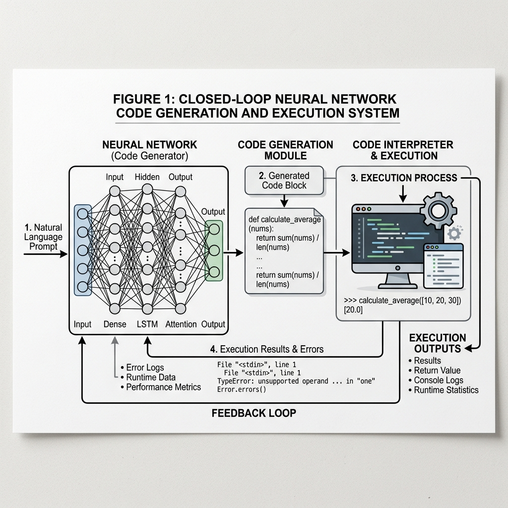

# 20.4 Neural Networks as Programs: The Future of Execution

The evolution of artificial intelligence has largely been a journey from static, rule-based systems to dynamic, data-driven models. However, the next frontier in Foundation Models is blurring the line between data and code. We are moving towards a paradigm where neural networks are not just function approximators, but **program generators and executors**.

This chapter explores the concept of "Neural Networks as Programs"—a useful framing for systems in which models generate, manipulate, or partially simulate structured procedures to solve reasoning tasks.

## From Static Weights to Dynamic Execution

Traditionally, a neural network is viewed as a fixed computation graph with learned weights. It takes an input, passes it through layers of matrix multiplications and non-linearities, and produces an output. While powerful, this approach struggles with tasks that require explicit algorithmic logic, long-term state management, or exact precision (e.g., executing a multi-step mathematical algorithm).

The concept of Neural Networks as Programs shifts this perspective in two major ways:

1.  **Neural Networks as Program Generators**: The model generates explicit code (e.g., Python, SQL) or domain-specific languages (DSLs) to solve a problem, which is then executed by an external interpreter.
2.  **Neural Networks as Program Executors**: The model itself learns to simulate the execution of a program, maintaining state and memory dynamically, similar to a traditional CPU or virtual machine.

### The Evolution: NTMs to Modern LLMs

The idea of neural networks with program-like capabilities is not new. Early research laid the groundwork for modern approaches:

-   **Neural Turing Machines (NTMs)**: Introduced by Graves et al. (2014) [[1]](#ref-1), NTMs coupled a neural network controller with an external memory bank. This allowed the network to learn basic algorithms like copying, sorting, and associative recall, effectively acting as a differentiable computer.
-   **Differentiable Neural Computers (DNCs)**: An evolution of NTMs [[2]](#ref-2), offering more complex memory addressing mechanisms and better performance on structured tasks like graph traversal.

While these models proved that neural networks *could* learn algorithmic logic, they were difficult to train and scale. The breakthrough came with the scale of Large Language Models (LLMs) and their emergent ability to generate high-quality code.

## LLMs as Program Generators: Execution-Guided Synthesis

One of the most practical manifestations of this concept today is **Execution-Guided Synthesis** (often seen in code execution environments or data-analysis assistants). Instead of attempting to solve a complex mathematical or logical problem entirely inside its weights, the LLM writes a Python program to solve it.

This creates a powerful feedback loop:
1.  **Generate**: The model writes a program based on the user's prompt.
2.  **Execute**: An external environment executes the program and returns the results or error logs.
3.  **Refine**: If the execution fails or produces an error, the model reads the error logs and generates a corrected version of the program.


*Source: Generated by Gemini*

This approach shifts the burden of precise computation from the neural network to a deterministic execution environment, drastically increasing the accuracy and capabilities of the system.

## Simulating Execution: The Neural Interpreter

Beyond generating code for external execution, another research direction is training models to *simulate* execution internally. This is especially relevant when an external interpreter is unavailable, too slow, or too expensive to call repeatedly.

Consider a model trained to predict the output of a Python script. To do this accurately, the model must maintain a mental model of the variable states and the flow of control.

### PyTorch Example: A Simple Neural State Machine

While full program synthesis is beyond a simple example, we can demonstrate how a neural network can be trained to act as a simple state machine or program executor. Here, we implement a simple Recurrent Neural Network (RNN) that learns to simulate a counter that increments or decrements based on input instructions, demonstrating state retention and execution logic.

```python
import torch
import torch.nn as nn
import torch.optim as optim

class NeuralCounter(nn.Module):
    def __init__(self, input_size, hidden_size, output_size):
        super(NeuralCounter, self).__init__()
        self.hidden_size = hidden_size
        # RNN layer to maintain state
        self.rnn = nn.RNN(input_size, hidden_size, batch_first=True)
        # Linear layer to map hidden state to output value
        self.fc = nn.Linear(hidden_size, output_size)
        
    def forward(self, x, initial_state=None):
        # x shape: (batch_size, sequence_length, input_size)
        if initial_state is None:
            initial_state = torch.zeros(1, x.size(0), self.hidden_size).to(x.device)
            
        out, hidden = self.rnn(x, initial_state)
        # Map output of all time steps
        out = self.fc(out)
        return out, hidden

# Hyperparameters
input_size = 2  # [Increment, Decrement] one-hot encoded
hidden_size = 16
output_size = 1 # The current count
seq_length = 10
batch_size = 32

# Model instantiation
model = NeuralCounter(input_size, hidden_size, output_size)
criterion = nn.MSELoss()
optimizer = optim.Adam(model.parameters(), lr=0.01)

# Dummy Training Data Generation
# Input: Sequence of increments (1,0) and decrements (0,1)
# Target: Cumulative sum
inputs = torch.randint(0, 2, (batch_size, seq_length, 1))
# Convert to one-hot: shape (batch_size, seq_length, 2)
inputs_one_hot = torch.zeros(batch_size, seq_length, 2)
inputs_one_hot.scatter_(2, inputs, 1.0)

# Calculate targets (cumulative sum of increments - decrements)
targets = torch.zeros(batch_size, seq_length, 1)
for i in range(batch_size):
    current_count = 0.0
    for t in range(seq_length):
        if inputs[i, t, 0] == 0: # Increment
            current_count += 1.0
        else: # Decrement
            current_count -= 1.0
        targets[i, t, 0] = current_count

# Training Loop
for epoch in range(100):
    optimizer.zero_grad()
    outputs, _ = model(inputs_one_hot)
    loss = criterion(outputs, targets)
    loss.backward()
    optimizer.step()
    
    if (epoch + 1) % 20 == 0:
        print(f'Epoch [{epoch+1}/100], Loss: {loss.item():.4f}')

print("Training complete. The model has learned to simulate a simple program (counter).")
```

In this example, the RNN hidden state acts as the "memory" or "register" holding the current count, and the network learns to update this state based on the input instructions.

## The Future: Neuro-Symbolic AI and Self-Evolving Systems

The ultimate realization of Neural Networks as Programs lies in **Neuro-Symbolic AI**, which combines the robust learning capabilities of deep neural networks with the rigorous logic of symbolic AI.

Future systems may not just generate code for specific tasks but create entire new algorithms and data structures to optimize their own performance. This leads to the concept of **Self-Evolving Systems**, where the AI continuously rewrites its own "software" to adapt to new challenges, effectively becoming a self-programming entity.

---

## Quizzes

<details>
<summary>Quiz 1: What is the primary advantage of Execution-Guided Synthesis over pure neural generation for complex reasoning?</summary>
*The primary advantage is precision and reliability. By offloading deterministic computation to an external interpreter, the system avoids the hallucination and calculation errors inherent in neural network weights, ensuring exact results for logical and mathematical tasks.*
</details>

<details>
<summary>Quiz 2: How do Neural Turing Machines (NTMs) differ from standard Recurrent Neural Networks (RNNs)?</summary>
*While RNNs maintain state in a fixed-size hidden vector, NTMs decouple the controller (the neural net) from an external, addressable memory bank. This allows NTMs to read and write to specific locations, enabling them to learn algorithms that scale to longer sequences than seen during training.*
</details>

<details>
<summary>Quiz 3: In the context of Neuro-Symbolic AI, what does "Symbolic" refer to?</summary>
*It refers to traditional rule-based AI, logic, and discrete representations (like code or mathematical formulas). Combining this with "Neural" networks allows systems to benefit from both intuitive pattern recognition and rigorous logical deduction.*
</details>

<details>
<summary>Quiz 4: Neural Turing Machines (NTMs) use a hybrid addressing mechanism for memory access. Formulate the mathematical equations for Content-based addressing and the subsequent interpolation gating step in location-based addressing.</summary>
*NTMs use a multi-step addressing mechanism to generate the memory weight vector $w_t$.*
*1. **Content-based addressing**: The controller outputs a key vector $k_t$ and a positive scalar key strength $\beta_t$. The weight for location $i$ is determined by cosine similarity with the memory matrix $M_t$:*
$$w_t^c(i) = \frac{\exp(\beta_t K(k_t, M_t(i)))}{\sum_j \exp(\beta_t K(k_t, M_t(j)))}$$
*where $K(u, v) = \frac{u \cdot v}{\|u\| \|v\|}$ is the cosine similarity.*
*2. **Interpolation Gate**: To blend the content-based address with the addressing vector from the previous time step $w_{t-1}$, NTM uses a scalar interpolation gate $g_t \in (0, 1)$ output by the controller:*
$$w_t^g = g_t w_t^c + (1 - g_t) w_{t-1}$$
*This enables the network to either focus on similar content or iterate sequentially based on past focus.*
</details>


---

## References

1. <a id="ref-1"></a>Graves, A., Wayne, G., & Danihelka, Ivo. (2014). *Neural Turing Machines*. [arXiv:1410.5401](https://arxiv.org/abs/1410.5401).
2. <a id="ref-2"></a>Graves, A., et al. (2016). *Hybrid computing using a neural network with dynamic external memory*. [Nature, 538(7626), 471-476](https://www.nature.com/articles/nature20101).
