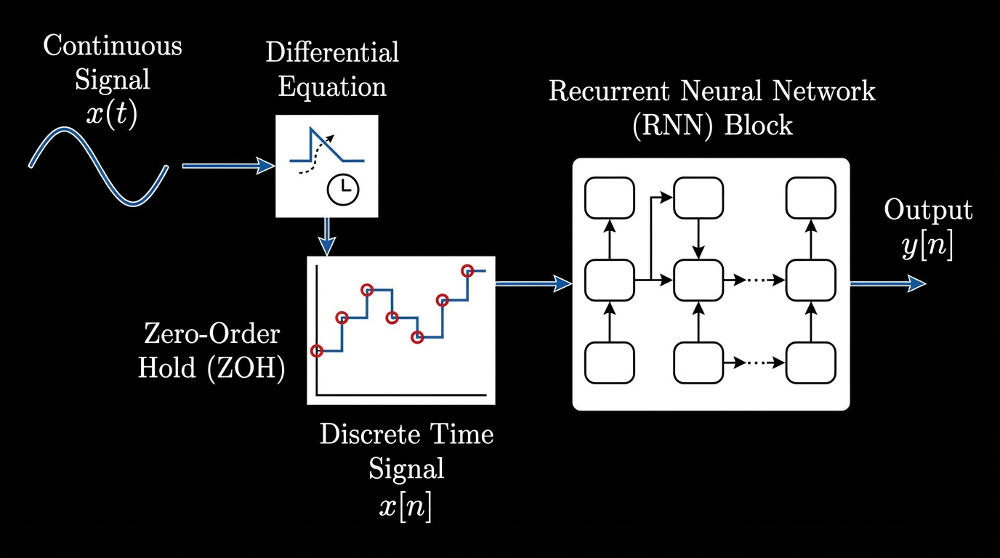
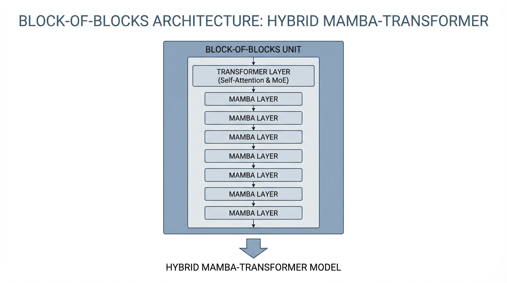

import SSMVsTransformerVisualizer from '../../components/chapter-20/SSMVsTransformerVisualizer.tsx';

# 20.1 State Space Models (SSM)

For years, the deep learning community operated under a singular, unchallenged paradigm: *Attention is All You Need*. The Transformer's ability to route information globally across a sequence made it the undisputed king of Foundation Models. 

However, the Transformer harbors a fatal flaw: the **Quadratic Bottleneck**. Because every token must attend to every previous token, computational complexity scales as $O(N^2)$ with sequence length $N$. Worse, during inference, the Key-Value (KV) cache grows linearly, gobbling up GPU VRAM and severely limiting context windows. 

If we want to process million-token contexts—entire codebases, genomic sequences, or hour-long videos—we cannot rely on a mechanism that must "re-read" the entire history at every step. We need a model that maintains a fixed-size memory of the past, updating it efficiently as new information arrives. Historically, this was the domain of Recurrent Neural Networks (RNNs). But RNNs were abandoned because their sequential nature prevented parallel training on GPUs.

Enter the **State Space Model (SSM)** renaissance. By combining the continuous-time mathematics of control theory with hardware-aware GPU algorithms, modern SSMs—most notably **Mamba**—have achieved the holy grail: linear-time $O(N)$ scaling, constant $O(1)$ inference memory, and Transformer-level language modeling performance.

---

## 1. From Continuous to Discrete: The Math of SSMs

State Space Models are not entirely new; they are foundational to control engineering (e.g., Kalman filters). The core idea is to map a 1-dimensional input signal $x(t)$ to an output signal $y(t)$ through an implicit latent state $h(t)$. 

In continuous time, this is defined by a system of linear differential equations:

$$ h'(t) = \mathbf{A}h(t) + \mathbf{B}x(t) $$
$$ y(t) = \mathbf{C}h(t) + \mathbf{D}x(t) $$

Where:
*   $\mathbf{A}$ is the state transition matrix (how the hidden state evolves).
*   $\mathbf{B}$ projects the input into the state space.
*   $\mathbf{C}$ projects the state back to the output space.
*   $\mathbf{D}$ is a direct skip connection (often omitted or treated as a simple residual).

To use this in a neural network processing discrete tokens (like words in a sentence), we must discretize the continuous system. We introduce a timescale parameter $\Delta$, which represents the step size. Using a technique called **Zero-Order Hold (ZOH)**, we convert the continuous matrices $(\mathbf{A}, \mathbf{B})$ into discrete matrices $(\bar{\mathbf{A}}, \bar{\mathbf{B}})$:

$$ \bar{\mathbf{A}} = \exp(\Delta \mathbf{A}) $$
$$ \bar{\mathbf{B}} = (\exp(\Delta \mathbf{A}) - \mathbf{I}) \mathbf{A}^{-1} \mathbf{B} \approx \Delta \mathbf{B} $$

This yields the discrete recurrent update rule:

$$ h_t = \bar{\mathbf{A}} h_{t-1} + \bar{\mathbf{B}} x_t $$
$$ y_t = \mathbf{C} h_t $$



Early deep SSMs (like S4) used this exact formulation. However, they failed to match Transformers in language modeling. Why? Because they were **Linear Time-Invariant (LTI)**. The matrices $\mathbf{A}, \mathbf{B}, \mathbf{C}$ were fixed across all time steps. The model applied the exact same dynamic to every token, completely lacking the ability to perform content-based reasoning (e.g., "I should remember this specific name, but forget this filler word").

---

## 2. The Mamba Breakthrough: Selective State Spaces

In late 2023, researchers Tri Dao and Albert Gu introduced **Mamba**, which solved the LTI limitation by introducing the **Selective Scan** mechanism [[1]](#ref-1). 

Instead of keeping the matrices fixed, Mamba makes $\mathbf{B}$, $\mathbf{C}$, and the step size $\Delta$ **functions of the input $x_t$**:

$$ \mathbf{B}_t = \text{Linear}_B(x_t) $$
$$ \mathbf{C}_t = \text{Linear}_C(x_t) $$
$$ \Delta_t = \text{Softplus}(\text{Linear}_\Delta(x_t)) $$

This simple change is profound. By making the parameters input-dependent, the model gains **selectivity**. 
*   If $x_t$ is a useless filler word, the model can output a small $\Delta_t$, effectively freezing the hidden state ($h_t \approx h_{t-1}$) and ignoring the token.
*   If $x_t$ is a crucial entity, the model can output a large $\Delta_t$ and a specific $\mathbf{B}_t$ to forcefully overwrite the relevant parts of the hidden state.

Mamba effectively learns to filter information dynamically, mimicking the Transformer's ability to attend to specific tokens, but doing so within a fixed-size recurrent state.

### Engineering the Hardware Bottleneck
Making the matrices input-dependent meant Mamba could no longer use the fast Convolutional Fourier transforms that powered earlier LTI SSMs. It had to be computed sequentially. 

To prevent the model from becoming as slow as an RNN during training, the authors engineered a **hardware-aware parallel associative scan**. By keeping the hidden state $h$ entirely in the GPU's ultra-fast SRAM and utilizing prefix-sum algorithms, Mamba computes the sequential recurrence in parallel across the sequence length, achieving training throughput up to 5x faster than equivalent Transformers.


<SSMVsTransformerVisualizer client:load />

---

## 3. Mamba-2 and Structured State Space Duality (SSD)

While Mamba-1 proved that selective SSMs could match Transformers, the custom parallel scan kernel was difficult to optimize further. In 2024, the authors released **Mamba-2**, introducing the theoretical framework of **Structured State Space Duality (SSD)** [[2]](#ref-2).

SSD proved mathematically that Selective SSMs and Linear Attention are two sides of the same coin. By restricting the structure of the $\mathbf{A}$ matrix (making it a scalar times the identity matrix), the recurrent SSM update can be perfectly rewritten as a specialized matrix multiplication.

Why does this matter? **Tensor Cores**.
Modern GPUs (like the NVIDIA H100) are heavily optimized for matrix multiplication (MatMul). The H100 delivers nearly 1,000 TFLOPS for MatMul, but only a fraction of that for custom associative scans. By reformulating the SSM as a block-matrix multiplication, Mamba-2 unlocked Tensor Core acceleration, allowing the state dimension to be massively expanded (from $N=16$ in Mamba-1 to $N=256$ in Mamba-2) while training significantly faster.

---

## 4. Engineering the SOTA: Hybrid MoE-SSM Architectures

Despite the elegance of pure SSMs, empirical deployments in 2024 and 2025 revealed a subtle limitation: **State Decay**. Because an SSM compresses the entire sequence into a fixed-size vector, it can struggle with "needle in a haystack" retrieval over massive contexts. Transformers, with their explicit KV cache, possess perfect "associative memory"—they can look back at exact tokens.

The industry's solution is the **Hybrid Architecture**. Models like **Jamba** (AI21 Labs) [[3]](#ref-3) and **Nemotron-Nano/H** (NVIDIA) [[4]](#ref-4) interleave Transformer layers with Mamba layers.



### The "Block-of-Blocks" Strategy
In Jamba, the network is composed of repeating blocks. A standard configuration is a 1:7 ratio: **1 Transformer layer followed by 7 Mamba layers**. 
*   The **Mamba layers** handle the heavy lifting of sequence propagation, efficiently passing context forward with $O(1)$ memory.
*   The **Transformer layer** acts as an associative memory checkpoint, performing dense, content-based routing across the sequence.

To push parameter counts higher without increasing compute, these architectures integrate **Mixture of Experts (MoE)** into the Transformer's Feed-Forward layers. A model might have 52B total parameters but only 12B active parameters per token. This allows a massive hybrid model to easily fit on a single 80GB GPU while processing a 256k context window—a feat mathematically impossible for a pure dense Transformer.

### Architectural Trade-offs

| Feature | Dense Transformer (Baseline) | Pure SSM (Mamba-2) | Hybrid MoE-SSM (Jamba/Nemotron) |
| :--- | :--- | :--- | :--- |
| **Compute Scaling** | Quadratic $O(L^2)$ | Linear $O(L)$ | Linear-leaning Hybrid |
| **Inference Memory** | Grows with sequence (KV Cache) | Constant $O(1)$ | Significantly Reduced |
| **Associative Memory** | Perfect (Explicit lookup) | Degrades over long horizons | High (Checkpoint lookups) |
| **Best Use Case** | Short-medium context, max precision | Infinite-stream telemetry, audio | Enterprise Agentic AI, Long-context RAG |

---

## 5. Engineering the Dispatcher: The Selective Scan in PyTorch

To truly understand the mechanics of Mamba, we must look at the code. Below is a simplified, educational PyTorch implementation of the Selective SSM forward pass. 

*(Note: In a production environment, the sequential `for` loop is replaced by the hardware-aware SSD matrix multiplication kernel. However, writing it sequentially is the best way to understand the underlying math).*

```python
import torch
import torch.nn as nn
import torch.nn.functional as F

class SimplifiedSelectiveSSM(nn.Module):
    """
    A simplified, educational implementation of a Selective State Space Model.
    Demonstrates input-dependent parameter generation and ZOH discretization.
    """
    def __init__(self, d_model: int, d_state: int):
        super().__init__()
        self.d_model = d_model
        self.d_state = d_state
        
        # Projections for the input-dependent parameters (The "Selective" part)
        # dt: step size, B and C: state transition matrices
        self.dt_proj = nn.Linear(d_model, d_model)
        self.B_proj = nn.Linear(d_model, d_state)
        self.C_proj = nn.Linear(d_model, d_state)
        
        # A is typically initialized to a specific structure (e.g., HiPPO matrix) 
        # to memorize history, and is kept fixed or slowly updated.
        # We represent log(A) to ensure A remains strictly negative (for stability).
        self.A_log = nn.Parameter(torch.randn(d_model, d_state))
        
        # Skip connection
        self.D = nn.Parameter(torch.randn(d_model)) 

    def forward(self, x: torch.Tensor) -> torch.Tensor:
        # x shape: (batch_size, seq_len, d_model)
        B, L, D = x.shape
        
        # 1. Compute input-dependent parameters across the whole sequence
        # Softplus ensures the step size (\Delta) is strictly positive
        dt = F.softplus(self.dt_proj(x)) # (B, L, D) 
        B_mat = self.B_proj(x)           # (B, L, d_state)
        C_mat = self.C_proj(x)           # (B, L, d_state)
        
        # A is strictly negative to ensure state decay (bounded stability)
        A = -torch.exp(self.A_log)       # (D, d_state)
        
        # 2. Discretize and compute state updates
        # [EDUCATIONAL NOTE]: This loop is sequential for clarity.
        # Mamba-1 uses a parallel associative scan here. Mamba-2 uses SSD block-matmul.
        y = torch.zeros_like(x)
        h = torch.zeros(B, D, self.d_state, device=x.device) # Initial hidden state
        
        for t in range(L):
            x_t = x[:, t, :]       # (B, D)
            dt_t = dt[:, t, :]     # (B, D)
            B_t = B_mat[:, t, :]   # (B, d_state)
            C_t = C_mat[:, t, :]   # (B, d_state)
            
            # Zero-Order Hold (ZOH) Discretization
            # \bar{A} = exp(dt * A)
            # \bar{B} \approx dt * B
            dA = torch.exp(dt_t.unsqueeze(-1) * A)                 # (B, D, d_state)
            dB = dt_t.unsqueeze(-1) * B_t.unsqueeze(1)             # (B, D, d_state)
            
            # State update: h_t = \bar{A} h_{t-1} + \bar{B} x_t
            h = dA * h + dB * x_t.unsqueeze(-1)                    # (B, D, d_state)
            
            # Output projection: y_t = C h_t + D x_t
            y_t = torch.sum(h * C_t.unsqueeze(1), dim=-1) + self.D * x_t # (B, D)
            y[:, t, :] = y_t
            
        return y

# Example usage simulating a forward pass
# Batch=2, Seq_len=128, D_model=512, D_state=16
model = SimplifiedSelectiveSSM(d_model=512, d_state=16)
dummy_input = torch.randn(2, 128, 512)
output = model(dummy_input)

print(f"Input shape: {dummy_input.shape}")   # torch.Size([2, 128, 512])
print(f"Output shape: {output.shape}")       # torch.Size([2, 128, 512])
```

---

## 7. Summary and Open Questions

State Space Models represent the most viable challenge to the Transformer's dominance since its inception. By discretizing continuous control theory equations and injecting input-dependent selectivity, Mamba solved the efficiency-expressivity trade-off. The evolution from custom associative scans (Mamba-1) to Tensor Core-friendly matrix multiplications via State Space Duality (Mamba-2) proves that algorithm-hardware co-design is the key to scaling Foundation Models.

One pragmatic middle ground is to combine SSM-style sequence propagation with attention-based layers. In that hybrid view, SSM components handle efficient context propagation while Transformer layers preserve more exact associative interactions where needed.

**Open Questions for the Next Era:**
As we look beyond sequence modeling, how do we apply these linear-time architectures to modalities that don't have a strict 1D temporal order? Can SSMs effectively model the 2D spatial relationships in high-resolution images, or the complex graph structures of molecular biology? In the next section, we will explore how these concepts extend into **Linear Attention** and alternative post-Transformer architectures.

## Quizzes

<details>
<summary>Quiz 1: Why did early Continuous-Time State Space Models (like S4) fail to match Transformers in language modeling tasks?</summary>
*Early SSMs were Linear Time-Invariant (LTI). Their transition matrices ($A, B, C$) were fixed and applied the exact same dynamics to every token. Language requires content-aware filtering—the ability to selectively remember important entities and forget filler words. LTI models lacked this selectivity.*
</details>

<details>
<summary>Quiz 2: If Mamba introduces an input-dependent sequential recurrence, how does it avoid the massive training slowdowns that plagued traditional RNNs?</summary>
*Mamba avoids sequential training bottlenecks by utilizing a hardware-aware parallel associative scan. By keeping the hidden state entirely within the GPU's ultra-fast SRAM and avoiding materializing large intermediate tensors in HBM, it computes the recurrence in parallel using prefix-sum algorithms.*
</details>

<details>
<summary>Quiz 3: What is the primary architectural advantage of the State Space Duality (SSD) framework introduced in Mamba-2?</summary>
*SSD mathematically unifies Selective SSMs with Linear Attention. By slightly restricting the structure of the $A$ matrix, the SSM update can be rewritten as a block-matrix multiplication. This allows the model to fully utilize GPU Tensor Cores (which are optimized for MatMul, not associative scans), enabling much larger state dimensions and faster training.*
</details>

<details>
<summary>Quiz 4: Why do modern production models like Jamba and Nemotron use a Hybrid (SSM + Transformer) architecture instead of a pure SSM?</summary>
*While pure SSMs excel at throughput and maintaining a constant memory footprint, they suffer from "state decay" over extremely long contexts, making precise "needle in a haystack" retrieval difficult. Interleaving a few Transformer layers provides explicit KV-cache associative memory, creating a "best of both worlds" scenario: the efficiency of SSMs with the exact recall of Transformers.*
</details>

---

## References

1. <a id="ref-1"></a>Gu, A., & Dao, T. (2023). *Mamba: Linear-Time Sequence Modeling with Selective State Spaces*. [arXiv:2312.00752](https://arxiv.org/abs/2312.00752).
2. <a id="ref-2"></a>Dao, T., & Gu, A. (2024). *Transformers are SSMs: Generalized Models and Efficient Algorithms Through Structured State Space Duality (Mamba-2)*. [arXiv:2405.21060](https://arxiv.org/abs/2405.21060).
3. <a id="ref-3"></a>Lieber, O., et al. (2024). *Jamba: A Hybrid Transformer-Mamba Language Model*. AI21 Labs. [arXiv:2403.19887](https://arxiv.org/abs/2403.19887).
4. <a id="ref-4"></a>NVIDIA. (2025). *Nemotron-Nano: An Accurate and Efficient Hybrid Mamba-Transformer Reasoning Model*. [arXiv:2504.03624](https://arxiv.org/abs/2504.03624).
