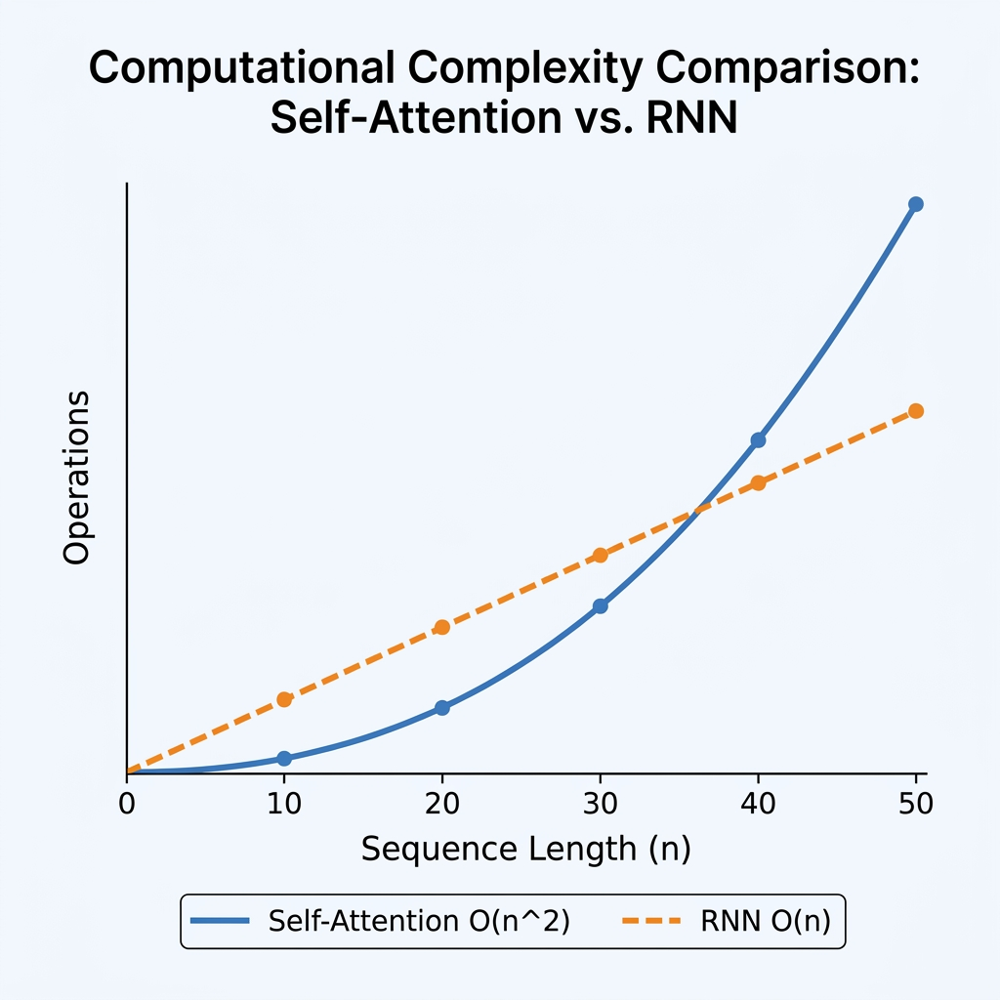

import ComplexityVisualizer from '../../components/chapter-3/ComplexityVisualizer';

# 3.5 Complexity Analysis

To understand why Transformers replaced RNNs and CNNs as the foundation of modern AI, we must analyze their computational complexity. This analysis reveals the trade-offs between computation, parallelization, and the ability to model long-range dependencies.

---

### **Motivation: The Cost of Scale**
As we move towards processing entire books or long videos, the length of the sequence ($n$) grows.
*   **Computational Complexity:** How many operations does it take to process a sequence?
*   **Parallelization:** Can we compute everything at once, or must we wait for step-by-step results?
*   **Path Length:** How many steps must a signal travel between two distant words?

Analyzing these factors explains why Transformers scale better on GPUs but struggle with extremely long context windows.

---

### **The Metaphor: Finding a Book in a Library**

Imagine you are looking for a specific reference in a library.

*   **RNN Approach is like walking down the aisles.** You start at the first shelf and look at each book one by one. If the sequence is long, it takes a long time. You cannot start looking at shelf 10 until you've walked past shelves 1-9. This is $O(n)$ sequential operations.
*   **Transformer Approach is like having a teleportation device.** You can compare your query against all books in the library simultaneously. However, to do this, you must build a massive index comparing *every* book to *every other* book. This requires a lot of initial work ($O(n^2)$ operations), but once done, you can find connections instantly in 1 step.

---

## The Complexity Comparison

The authors of "Attention Is All You Need" [[1]](#ref-1) provided a comparison of self-attention against recurrent and convolutional layers.

| Layer Type | Complexity per Layer | Sequential Operations | Maximum Path Length |
| :--- | :--- | :--- | :--- |
| **Self-Attention** | $O(n^2 \cdot d)$ | $O(1)$ | $O(1)$ |
| **Recurrent** | $O(n \cdot d^2)$ | $O(n)$ | $O(n)$ |
| **Convolutional** | $O(k \cdot n \cdot d^2)$ | $O(1)$ | $O(\log_k(n))$ |

<div style={{ display: 'flex', flexDirection: 'column', alignItems: 'center', width: '100%', margin: '20px 0' }}>

<div style={{ maxWidth: '600px', width: '100%' }}>

</div>

<em style={{ marginTop: '10px', color: '#7f8c8d' }}>Source: Generated by Gemini</em>

</div>

Where:
*   $n$ is the sequence length.
*   $d$ is the representation dimension.
*   $k$ is the kernel size of convolutions.

### Analysis of the Trade-offs

1.  **Complexity per Layer:**
    *   **Self-Attention** is $O(n^2 \cdot d)$. It is quadratic in sequence length $n$. When $n < d$ (which was typical in 2017), self-attention is cheaper than recurrent layers. However, as context windows grow (e.g., $n=100,000$), $n^2$ becomes the dominant cost.
    *   **Recurrent** is $O(n \cdot d^2)$. It is linear in $n$ but quadratic in $d$.

2.  **Sequential Operations:**
    *   **Self-Attention** is $O(1)$. All operations can be performed in parallel, maximizing GPU utilization.
    *   **Recurrent** is $O(n)$. It requires $n$ sequential steps, preventing parallelization across time.

3.  **Maximum Path Length:**
    *   **Self-Attention** is $O(1)$. Any two positions can interact directly in a single step.
    *   **Recurrent** is $O(n)$. A signal must travel through $n$ hidden states to connect the first and last token, leading to vanishing gradients.
    *   **Convolutional** is $O(\log_k(n))$ with dilated convolutions, which is better than RNNs but worse than Transformers.

---

## Derivation of Complexities

To truly understand these numbers, let's derive them from the matrix operations involved.

### 1. Self-Attention: $O(n^2 \cdot d)$
Recall the formula: $\text{softmax}\left(\frac{QK^T}{\sqrt{d_k}}\right)V$. Let's assume $d_k = d$ for simplicity.
*   **$QK^T$ Operation:** We multiply matrix $Q$ ($n \times d$) by $K^T$ ($d \times n$). To compute one element of the result, we do a dot product of two $d$-dimensional vectors (cost $O(d)$). Since the result is an $n \times n$ matrix, we do this $n^2$ times. Total cost: **$O(n^2 \cdot d)$**.
*   **Softmax Operation:** Applied to each row of the $n \times n$ matrix. Cost: **$O(n^2)$**.
*   **Multiplying by $V$:** We multiply the attention weights matrix ($n \times n$) by $V$ ($n \times d$). To compute one element of the result, we do a dot product of an $n$-dimensional row and an $n$-dimensional column (cost $O(n)$). The result is $n \times d$. Total cost: **$O(n^2 \cdot d)$**.
*   Combining these, the dominant term is **$O(n^2 \cdot d)$**.

### 2. Recurrent (RNN): $O(n \cdot d^2)$
In an RNN, the hidden state at step $t$ is computed as $h_t = \sigma(W_{hh}h_{t-1} + W_{xh}x_t)$.
*   Assume the hidden state and input both have dimension $d$.
*   The matrix-vector multiplication $W_{hh}h_{t-1}$ involves a $(d \times d)$ matrix and a $(d \times 1)$ vector. This takes **$O(d^2)$** operations.
*   We must repeat this sequentially for all $n$ tokens in the sequence.
*   Total cost: **$O(n \cdot d^2)$**.

---

## Memory Complexity Simulation

Let's look at how the memory required for the self-attention matrix grows quadratically with sequence length. This PyTorch-based simulation estimates the memory needed for the attention scores matrix.

```python
import torch

def estimate_attention_memory(seq_len, d_model=512, num_heads=8, batch_size=1):
    # The attention matrix size is (batch_size, num_heads, seq_len, seq_len)
    # Each element is a float32 (4 bytes)
    element_size = 4
    
    total_elements = batch_size * num_heads * seq_len * seq_len
    memory_bytes = total_elements * element_size
    memory_mb = memory_bytes / (1024 * 1024)
    return memory_mb

lengths = [1000, 5000, 10000, 50000]
print("Estimated Attention Matrix Memory:")
for n in lengths:
    mem = estimate_attention_memory(n)
    print(f"Sequence Length: {n:,} -> {mem:.2f} MB")
```

---

## Example: Quadratic Growth Visualization

Adjust the sequence length to see how the number of operations (comparisons) grows quadratically for Self-Attention vs linearly for RNNs.

<ComplexityVisualizer client:load lang="en" />


## Looking Ahead: Beyond Quadratic Complexity

Having analyzed the complexity of the standard Transformer, we see that the $O(n^2)$ attention mechanism is the primary bottleneck for scaling to long sequences. 

**The Race for Efficiency:** This $O(n^2)$ wall triggered a massive wave of research. To achieve linear complexity $O(n)$, numerous variants called 'X-formers' were proposed, such as the Linear Transformer, Performer, and Reformer. More recently, alternative architectures like State Space Models (e.g., Mamba) have emerged as strong contenders to replace Transformers for long-sequence tasks by achieving linear scaling without attention.

As we move to the next chapters, consider these questions:
- How can we modify the attention mechanism to achieve linear complexity $O(n)$?
- Can we use external memory or compression to handle infinite sequences?
- How do modern models like Gemini or Claude handle million-token contexts?

These questions lead us to the exploration of efficient Transformers and alternative architectures in the coming chapters.

---

## Quizzes

<details>
<summary>Quiz 1: When is Self-Attention computationally cheaper than a Recurrent layer?</summary>
*Self-Attention is cheaper when the sequence length $n$ is smaller than the representation dimension $d$ ($n < d$). In early NLP tasks, sentences were short (e.g., $n=30$) and embeddings were relatively large (e.g., $d=512$), making self-attention very efficient.*
</details>

<details>
<summary>Quiz 2: What is the main bottleneck of Transformers when dealing with extremely long sequences (e.g., 100k tokens)?</summary>
*The bottleneck is the $O(n^2)$ time and memory complexity of the self-attention mechanism. As $n$ grows, the size of the attention matrix ($n \times n$) grows quadratically, leading to massive memory consumption and compute requirements.*
</details>

<details>
<summary>Quiz 3: Why do RNNs fail to utilize GPUs effectively compared to Transformers?</summary>
*RNNs require sequential processing. To compute step $t$, the output of step $t-1$ is required. This dependency prevents the model from processing all tokens in parallel. Transformers have $O(1)$ sequential operations, allowing them to process all tokens at once, making full use of GPU parallelism.*
</details>

<details>
<summary>Quiz 4: Why is the sequential complexity of RNNs $O(n)$ while for Self-Attention it is $O(1)$?</summary>
*RNNs must process tokens one by one because the hidden state at step $t$ depends on the hidden state at step $t-1$. This creates a sequential dependency of length $n$. In Self-Attention, all pairs of tokens are compared in parallel, so all operations can be performed in a constant number of steps, $O(1)$, regardless of sequence length.*
</details>

<details>
<summary>Quiz 5: In the complexity comparison table, what does $k$ represent in the Convolutional layer?</summary>
*The variable $k$ represents the kernel size (or filter width) of the convolution. It determines how many adjacent tokens the convolutional layer looks at simultaneously.*
</details>


---

## References

1. <a id="ref-1"></a>Vaswani, A., et al. (2017). *Attention is all you need*. Advances in neural information processing systems, 30. [arXiv:1706.03762](https://arxiv.org/abs/1706.03762).