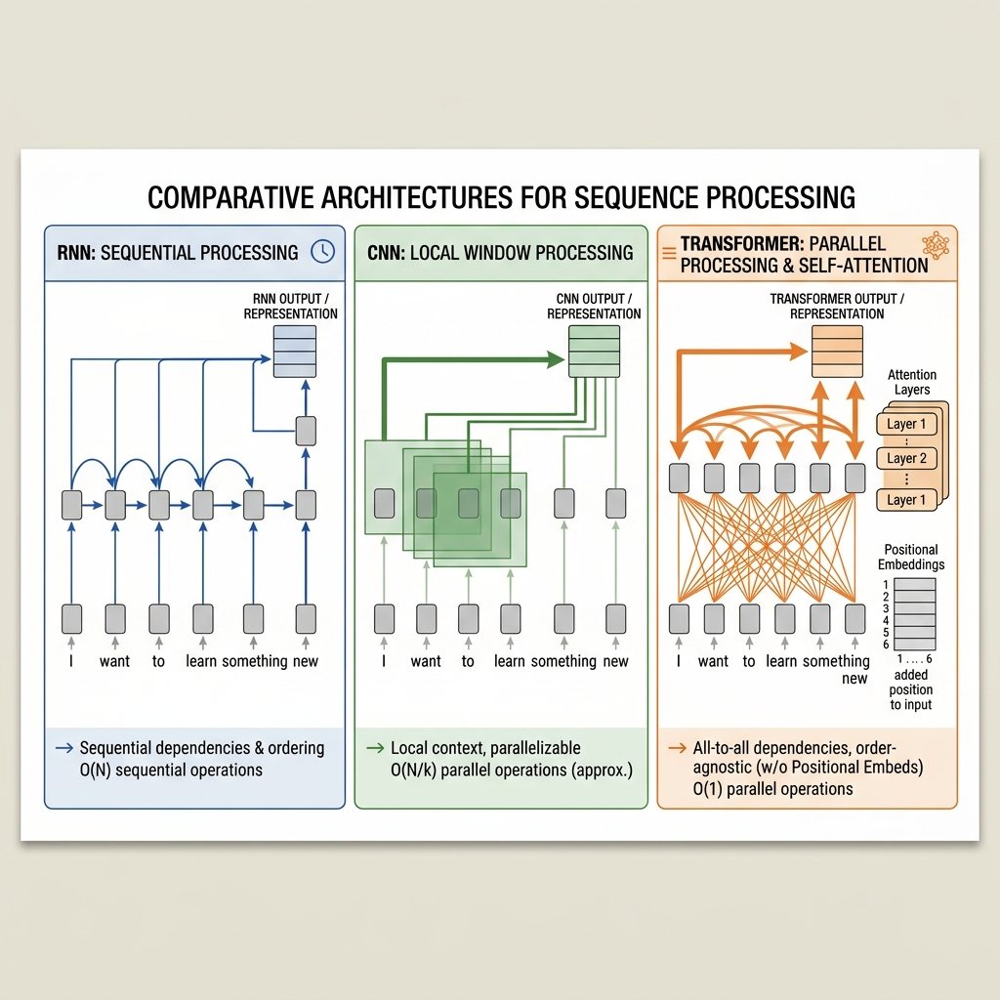

import PeVisualizer from '../../components/chapter-3/PeVisualizer';

# 3.3 Position Encoding Strategy

Since the Transformer architecture contains no recurrence and no convolution, it has no notion of word order. To give the model a sense of position, we must inject information about the relative or absolute position of the tokens in the sequence. This is where **Positional Encoding** comes in.

---

### **Motivation: The Bag-of-Words Problem**

To understand why we need positional encoding, we must contrast how Transformers process data compared to older sequence models like RNNs and CNNs.

#### 1. RNNs (Recurrent Neural Networks): Natural Order
RNNs process tokens sequentially, one by one. The model maintains a hidden state that is updated at each step: $h_t = f(h_{t-1}, x_t)$. Because it processes word A, then word B, then word C, it **naturally inherits a sense of time and order**. It knows that B came after A.

#### 2. CNNs (Convolutional Neural Networks): Local Order
CNNs apply filters to local windows of text (e.g., n-grams). By looking at words in groups of 3 or 5, the model **captures local order** and proximity. It knows which words are adjacent.

#### 3. Transformers (Self-Attention): Permutation Invariance
In contrast, Self-Attention processes all tokens in the sequence **simultaneously in parallel**.
$$Attention(Q, K, V) = softmax\left(\frac{QK^T}{\sqrt{d_k}}\right)V$$
Notice that there is no concept of index or position in this formula. If you shuffle the words in the input sentence, the output vectors will be exactly the same, just shuffled in the same way. The model treats the input as a **set of words** (or a bag of words), not a sequence.

<div style={{ display: 'flex', flexDirection: 'column', alignItems: 'center', width: '100%', margin: '20px 0' }}>
<div style={{ maxWidth: '800px', width: '100%' }}>

</div>
<em style={{ marginTop: '10px', color: '#7f8c8d' }}>Source: Generated by Gemini</em>
</div>

*   **The Metaphor:**
    *   **RNN** is like reading a sentence word-by-word, moving your finger along the line.
    *   **CNN** is like looking at the sentence through a magnifying glass that shows 3 words at a time.
    *   **Transformer** is like putting all the words into a blender and looking at the mixture. Without labels, you can't tell which word was first.

To break this symmetry and give the Transformer a sense of order, we must add **Positional Encoding**.

---

### **The Metaphor: Page Numbers on Loose Sheets**

Imagine you have a book, but all the pages are torn out and scattered on the floor.

*   If you just read the pages (pure self-attention), you can understand the content of each page, but you won't know the story's order. Is page A before page B?
*   **Positional Encoding** is like writing a **page number** at the bottom of each sheet before you throw them on the floor. Now, even if they are scattered, you can read the page number and know exactly where that page belongs in the sequence.

In Transformers, we don't just append the number; we add a complex wave pattern to the word embeddings.

---

## The Mathematics of Sinusoidal Positional Encoding

The authors of "Attention Is All You Need" [[1]](#ref-1) used sine and cosine functions of different frequencies to generate positional encodings.

For a token at position $pos$ and dimension $i$:
$$PE_{(pos, 2i)} = \sin\left(\frac{pos}{10000^{2i/d_{model}}}\right)$$
$$PE_{(pos, 2i+1)} = \cos\left(\frac{pos}{10000^{2i/d_{model}}}\right)$$

<div style={{ display: 'flex', flexDirection: 'column', alignItems: 'center', width: '100%', margin: '20px 0' }}>

<div style={{ maxWidth: '600px', width: '100%' }}>

</div>

<em style={{ marginTop: '10px', color: '#7f8c8d' }}>Source: [The Illustrated Transformer by Jay Alammar](https://jalammar.github.io/illustrated-transformer/)</em>

</div>

Where:
*   $pos$ is the position in the sequence.
*   $i$ is the dimension index ($0 \le i < d_{model}/2$).
*   $d_{model}$ is the dimension of the embedding.

### Why Sinusoidal?
The authors chose this because they hypothesized it would allow the model to easily learn to attend by **relative positions**, since for any fixed offset $k$, $PE_{pos+k}$ can be represented as a linear function of $PE_{pos}$.

### The Linear Relationship for Relative Positions

Let's look at the mathematical property that allows the model to attend to relative positions.
For a specific dimension $2i$, the positional encoding is:
$$PE_{(pos, 2i)} = \sin(\omega_i \cdot pos)$$
$$PE_{(pos, 2i+1)} = \cos(\omega_i \cdot pos)$$
where $\omega_i = 1 / 10000^{2i/d_{model}}$.

If we want to find the encoding for position $pos + k$, we can use the trigonometric angle addition formulas:
$$\sin(\omega_i(pos + k)) = \sin(\omega_i pos)\cos(\omega_i k) + \cos(\omega_i pos)\sin(\omega_i k)$$
$$\cos(\omega_i(pos + k)) = \cos(\omega_i pos)\cos(\omega_i k) - \sin(\omega_i pos)\sin(\omega_i k)$$

Notice that $\cos(\omega_i k)$ and $\sin(\omega_i k)$ are constants for a fixed offset $k$. Therefore, we can express the encoding at $pos+k$ as a linear combination of the encoding at $pos$:
$$
\begin{bmatrix}
PE_{(pos+k, 2i)} \\
PE_{(pos+k, 2i+1)}
\end{bmatrix}
=
\begin{bmatrix}
\cos(\omega_i k) & \sin(\omega_i k) \\
-\sin(\omega_i k) & \cos(\omega_i k)
\end{bmatrix}
\begin{bmatrix}
PE_{(pos, 2i)} \\
PE_{(pos, 2i+1)}
\end{bmatrix}
$$
This linear relationship makes it easy for the model to learn to attend to relative positions, regardless of the absolute position.

---

## Beyond Sinusoidal: Evolution of Position Encodings

While the sinusoidal approach was a brilliant starting point, the field has developed various methods to better capture position information. Here is a comparison of the most prominent techniques:

### 1. Absolute Positional Encodings (Sinusoidal & Learned)
- **Sinusoidal**: Fixed functions. Theoretically allows extrapolation to longer sequences, but in practice, performance degrades.
- **Learned**: Treats position as a learnable embedding (like word embeddings). Used in BERT and GPT-2/3. It is simple but cannot extrapolate beyond the maximum sequence length defined during training.

### 2. Relative Positional Encodings
Instead of giving each token an absolute position, these methods encode the *distance* between tokens.
- **Shaw et al. (2018)**: Modifies self-attention to include relative position representations in keys and values.

### 3. Modern SOTA Encodings
- **RoPE (Rotary Position Embedding)**: Applies a rotation matrix to Query and Key vectors based on their position. It naturally captures relative distance and is used in Llama, Gemma, DeepSeek, Qwen, and many modern LLMs.
- **ALiBi (Attention with Linear Biases)**: Instead of adding embeddings, it adds a static penalty to attention scores that grows linearly with distance. Extremely efficient and excellent at length extrapolation.

### Comparison Table

| Method | Type | Extrapolation | Learnable? | Used In | Pros | Cons |
| :--- | :--- | :--- | :--- | :--- | :--- | :--- |
| **Sinusoidal** | Absolute | Limited | No | Original Transformer | No parameters to learn | Fixed, not optimal for all tasks |
| **Learned** | Absolute | No | Yes | BERT, GPT-3 | Adapts to data | Cannot handle longer sequences |
| **RoPE** | Relative | Excellent | No | Llama, Gemma, DeepSeek, Qwen | Captures relative distance well | Complex implementation |
| **ALiBi** | Relative | Excellent | No | BLOOM, MPT | Very simple, great extrapolation | May require fine-tuning for very long |

### Why Sinusoidal Was Chosen (and Why We Moved On)
The original Transformer used sinusoidal encodings because:
1.  **No parameters**: It didn't increase model size.
2.  **Theoretical extrapolation**: The authors hoped it would handle longer sequences.

However, as models grew and sequence lengths became critical (e.g., handling whole books), methods like **RoPE** and **ALiBi** proved far superior in handling long-context tasks, leading to their dominance today.

---

## A Closer Look at Rotary Position Embedding (RoPE)

While sinusoidal encodings were a great start, modern state-of-the-art LLMs (such as Llama 3, Gemma 4, DeepSeek V3, Qwen 3, and GLM series) almost exclusively use **Rotary Position Embedding (RoPE)** [[2]](#ref-2). RoPE is a hybrid method that combines the best of absolute and relative positional encodings.

### The Intuition: Rotation in 2D Space

Imagine the representation of a token as a point in a multi-dimensional space. For simplicity, let's look at just 2 dimensions.
- If we have no position information, the distance and angle between two token vectors are fixed.
- RoPE injects position by **rotating** these vectors. The angle of rotation is proportional to the token's position in the sequence.

If token A is at position $m$ and token B is at position $n$, RoPE rotates token A by $m\theta$ and token B by $n\theta$.
When calculating the attention score (dot product) between them, the result depends on the *difference* in their angles, which is $(m-n)\theta$. This perfectly captures the **relative distance** between the tokens!

### The Mathematics of RoPE

RoPE operates on Query ($Q$) and Key ($K$) vectors *after* they are projected, rather than adding to the input embeddings.

For a 2D vector $x = [x_1, x_2]$, RoPE applies a rotation matrix:
$$RoPE(x, m) = \begin{bmatrix} \cos(m\theta) & -\sin(m\theta) \\ \sin(m\theta) & \cos(m\theta) \end{bmatrix} \begin{bmatrix} x_1 \\ x_2 \end{bmatrix}$$

For a $d$-dimensional vector, we group dimensions into $d/2$ pairs and apply a 2D rotation to each pair with a different frequency $\theta_i = 10000^{-2i/d}$.

The magic happens in the attention score calculation. Let $q_m$ be the query at position $m$ and $k_n$ be the key at position $n$:
$$(RoPE(q_m, m))^T (RoPE(k_n, n)) = q_m^T R_m^T R_n k_n = q_m^T R_{n-m} k_n$$
Because $R_m^T R_n = R_{n-m}$, the dot product depends only on the relative distance $n-m$.

### Why RoPE Dominates Modern LLMs (Insights)

1.  **Perfect Relative Awareness**: Unlike absolute encodings where the model has to *learn* to extract relative distance, RoPE mathematically guarantees that the attention score is a function of relative distance.
2.  **Decay with Distance**: By using different frequencies, the correlation between tokens naturally decays as the distance increases. This matches human language intuition: closer words usually matter more.
3.  **Length Extrapolation**: RoPE handles sequences longer than those seen during training much better than absolute encodings. Techniques like **RoPE Scaling** (e.g., Linear Scaling or NTK-aware scaling) allow models trained on 4K context to extend to 128K or more by simply scaling the frequencies.

---

## PyTorch Implementation

Here is how you generate the positional encoding matrix in PyTorch.

```python
import torch
import torch.nn as nn
import math

class PositionalEncoding(nn.Module):
    def __init__(self, d_model, max_len=5000):
        super(PositionalEncoding, self).__init__()
        
        # Create a matrix of shape (max_len, d_model)
        pe = torch.zeros(max_len, d_model)
        position = torch.arange(0, max_len, dtype=torch.float).unsqueeze(1)
        div_term = torch.exp(torch.arange(0, d_model, 2).float() * (-math.log(10000.0) / d_model))
        
        # Fill sine and cosine values
        pe[:, 0::2] = torch.sin(position * div_term)
        pe[:, 1::2] = torch.cos(position * div_term)
        
        # Add a batch dimension (1, max_len, d_model)
        pe = pe.unsqueeze(0)
        
        # Register as buffer (won't be updated by optimizer)
        self.register_buffer('pe', pe)

    def forward(self, x):
        # x shape: (batch_size, seq_len, d_model)
        # Add positional encoding to input embeddings
        x = x + self.pe[:, :x.size(1)]
        return x

# Example usage
d_model = 16
seq_len = 10
pe_layer = PositionalEncoding(d_model)

# Simulated input embeddings
x = torch.randn(1, seq_len, d_model)
x_encoded = pe_layer(x)

print("Original shape:", x.shape)
print("Encoded shape:", x_encoded.shape)
```

---

## Example: The Encoding Matrix

Visualize the positional encoding matrix. The horizontal axis represents the embedding dimension, and the vertical axis represents the position in the sequence. The wave patterns allow the model to distinguish positions.

<PeVisualizer client:load lang="en" />

---

## Quizzes

<details>
<summary>Quiz 1: Why doesn't the Transformer just use the absolute position number (1, 2, 3...) as encoding?</summary>
*If we just add absolute integers, the values can become very large for long sequences, dominating the word embeddings. Also, the model might not generalize well to sequence lengths longer than those seen during training. Sinusoidal encodings are bounded between -1 and 1 and provide a smooth, continuous representation of position.*
</details>

<details>
<summary>Quiz 2: What is the benefit of using both sine and cosine functions?</summary>
*Using both allows the model to represent relative positions as linear combinations. Specifically, $PE_{pos+k}$ can be computed as a linear transformation of $PE_{pos}$, making it easier for the model to learn to attend to relative positions (e.g., "the word 2 steps to the left").*
</details>

<details>
<summary>Quiz 3: Are there alternatives to sinusoidal positional encoding?</summary>
*Yes. Many modern models (like GPT-3) use **Learned Positional Embeddings**, where position vectors are treated as parameters and learned during training just like word embeddings. Another popular method is **RoPE (Rotary Position Embedding)**, used in Llama models, which applies a rotation to the query and key vectors depending on their position.*
</details>

<details>
<summary>Quiz 4: Why are different frequencies used for different dimensions in positional encoding?</summary>
*Different frequencies create a unique pattern for each position that doesn't repeat for a very long sequence length. Low dimensions have high frequencies (short wavelengths), while high dimensions have low frequencies (long wavelengths), allowing the model to capture both fine-grained and coarse-grained positional relationships.*
</details>

<details>
<summary>Quiz 5: In the PyTorch implementation, why do we use `register_buffer` for the positional encoding matrix?</summary>
*`register_buffer` is used for tensors that are part of the model state but are not parameters to be learned by the optimizer. This ensures the positional encoding matrix is saved along with the model parameters when saving the model, and moved to the GPU when `.to('cuda')` is called on the model, without calculating gradients for it.*
</details>

<details>
<summary>Quiz 6: Mathematically formulate the RoPE rotation matrix for a 2D subspace at position $m$, and prove that the inner product of a query at position $m$ and a key at position $n$ depends strictly on the relative distance $m-n$.</summary>
*For a 2D vector $x = [x_1, x_2]^T$, the RoPE matrix at position $m$ is $\mathbf{R}_m = \begin{bmatrix} \cos(m\theta) & -\sin(m\theta) \\ \sin(m\theta) & \cos(m\theta) \end{bmatrix}$. Let $\mathbf{q}$ and $\mathbf{k}$ be 2D representations of a query and a key. The inner product of their RoPE-encoded versions is $\langle \mathbf{R}_m \mathbf{q}, \mathbf{R}_n \mathbf{k} \rangle = (\mathbf{R}_m \mathbf{q})^T (\mathbf{R}_n \mathbf{k}) = \mathbf{q}^T \mathbf{R}_m^T \mathbf{R}_n \mathbf{k}$. Since $\mathbf{R}_m$ is an orthogonal matrix representing a rotation by angle $m\theta$, its transpose is its inverse, which is a rotation by $-m\theta$. Therefore, $\mathbf{R}_m^T \mathbf{R}_n$ represents a combined rotation by $n\theta - m\theta = (n-m)\theta$, which is $\mathbf{R}_{n-m}$. Thus, $\langle \mathbf{R}_m \mathbf{q}, \mathbf{R}_n \mathbf{k} \rangle = \mathbf{q}^T \mathbf{R}_{n-m} \mathbf{k}$, which explicitly depends only on the relative distance $n-m$ and perfectly preserves relative position information.*
</details>

---

## References

1. <a id="ref-1"></a>Vaswani, A., et al. (2017). *Attention is all you need*. Advances in neural information processing systems, 30. [arXiv:1706.03762](https://arxiv.org/abs/1706.03762).
2. <a id="ref-2"></a>Su, J., et al. (2021). *RoFormer: Enhanced Transformer with Rotary Position Embedding*. [arXiv:2104.09864](https://arxiv.org/abs/2104.09864).