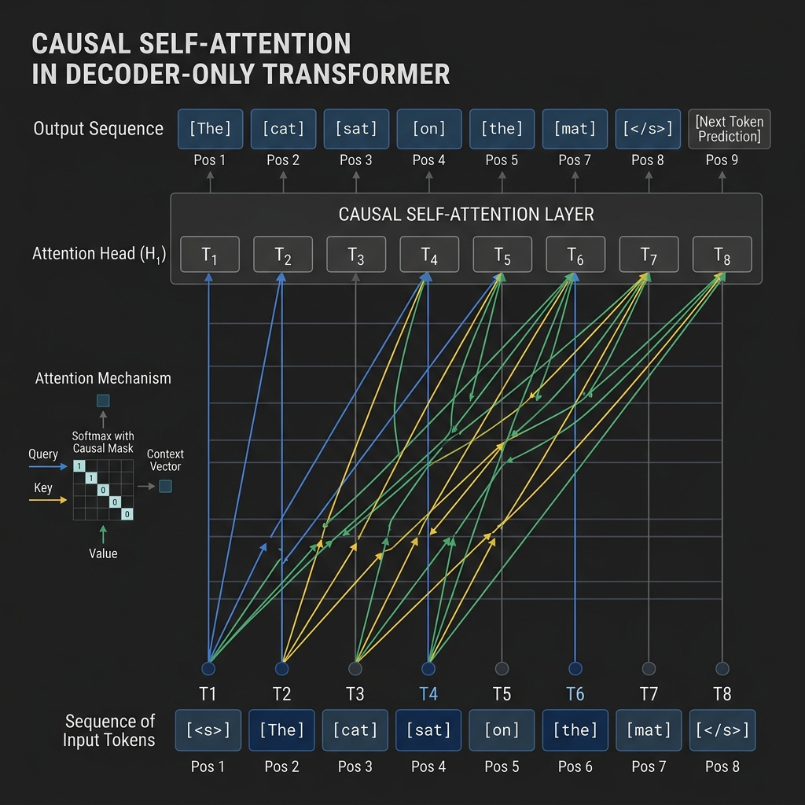

# 4.2 Decoder-only (GPT-style)

If Encoder-only models are the detectives of the AI world, **Decoder-only** models are the improvisational storytellers. They never get to see the full script in advance. They only see the words already written, and from that partial history they must decide what comes next.

That constraint turns out to be extraordinarily powerful. Popularized by the GPT family and later adopted across much of the LLM landscape, decoder-only models became dominant not because they are the only possible Transformer architecture, but because the autoregressive setup scales cleanly, serves well, and matches the interface people actually use: prompt first, continuation next.

This chapter explains that architecture, the logic of autoregressive generation, and why decoder-only models won so much of the scaling race.

---

## The Metaphor: The Autoregressive Storyteller

Imagine writing a story where you are only allowed to see what you have written so far, and your goal is to predict the very next word. Once you predict that word, it becomes part of the history, and you use it to predict the word after that.

This is **Autoregressive Generation**. Decoder-only models operate on this principle. They cannot look into the future; they only have access to the past. This makes them exceptionally good at generating fluent, coherent, and creative text.

---

## Causal Self-Attention: Masking the Future

The core mechanism that enables this behavior is **Causal Self-Attention** (or masked self-attention). Unlike the all-to-all connectivity of Encoder-only models, Causal Attention applies a mask to the attention matrix to ensure that token $i$ can only attend to tokens at positions $\le i$.

<div style={{ display: 'flex', flexDirection: 'column', alignItems: 'center', width: '100%', margin: '20px 0' }}>

<div style={{ maxWidth: '600px', width: '100%' }}>

</div>

<em style={{ marginTop: '10px', color: '#7f8c8d' }}>Source: Generated by Gemini</em>

</div>

As shown in the diagram, the attention connections only go from right to left (past to present) or to the token itself. This prevents information from flowing backward from future tokens during training.

---

## Core Training Objective: Causal Language Modeling (CLM)

Decoder-only models are trained on the task of **Causal Language Modeling (CLM)**, also known as next-token prediction.

Given a sequence of tokens $X = (x_1, x_2, \dots, x_T)$, the goal is to maximize the likelihood of the sequence, which can be factorized using the chain rule of probability:

$$P(X) = \prod_{t=1}^{T} P(x_t | x_1, \dots, x_{t-1})$$

### The Mathematics of CLM

The loss function is the negative log-likelihood of the correct next token at each position:

$$\mathcal{L}_{CLM} = - \sum_{t=1}^{T} \log P(x_t | x_{<t})$$

Where $x_{<t}$ represents all tokens before position $t$. This objective is simple yet incredibly powerful when scaled up with massive amounts of data and compute.

---


## Evolution and Key Models

### 1. GPT-3 (2020)
**Motivation**: Before GPT-3, the dominant paradigm was to pre-train a model on a large corpus and then fine-tune it on a specific task with task-specific data. The creators of GPT-3 wanted to test the hypothesis that a sufficiently large language model could perform "in-context learning"—learning to perform tasks with little to no task-specific data, just by understanding the prompt [[1]](#ref-1).

**Key Innovations**:
- **Massive Scale**: Scaled the Decoder-only architecture to 175 billion parameters, a 100x increase over GPT-2.
- **In-Context Learning**: Demonstrated that large models can perform zero-shot, one-shot, and few-shot learning without any gradient updates or fine-tuning.
- **Prompting Paradigm**: Shifted the focus from fine-tuning to prompt engineering, where the model's behavior is guided by the input text.

---

### 2. Llama 3 (2024)
**Motivation**: While large proprietary models dominated the landscape, Meta aimed to democratize AI research by releasing high-quality open-weights models. The goal of Llama 3 was to prove that smaller models, when trained on significantly more data, could match or exceed the performance of much larger models, offering better efficiency for deployment.

**Key Innovations**:
- **Trillion-Scale Pre-training**: Trained on over 15 trillion tokens of data (compared to GPT-3's ~300 billion), showing that most models were undertrained relative to their parameter count [[2]](#ref-2).
- **Grouped Query Attention (GQA)**: Used GQA to improve inference efficiency and reduce memory bandwidth requirements.
- **High-Quality Tokenizer**: Used a tokenizer with a vocabulary of 128k tokens, improving text encoding efficiency.

---

### Comparison of Decoder-only Models

| Feature | GPT-3 (175B) | Llama 3 (8B/70B) |
| :--- | :--- | :--- |
| **Parameters** | 175 Billion | 8B / 70B |
| **Training Tokens** | ~300 Billion | 15+ Trillion |
| **Access** | Closed (API) | Open Weights |
| **Attention** | Standard | Grouped Query Attention (GQA) |
| **Context Length** | 2,048 tokens | 8,192 tokens |

---

## Why Decoder-Only Won the Scaling War

In the early days of Transformers, Encoder-Decoder models (like T5) were considered more versatile. However, the current Generative AI market is completely dominated by Decoder-only models. A deep analysis of the reasons is as follows:

### 1. The Power of a Unified Objective
Decoder-only models are trained on a single objective: **'Next-Token Prediction'**. This objective seems very simple, but when combined with massive data and scaled up in model size, it revealed incredible **Emergent Abilities**. Complex reasoning, code generation, and translation proved that all high-level intelligence could be derived from the process of finding the 'most natural next word'.

### 2. Architectural Simplicity and Scaling
*   **Uniformity**: It stacks the same Transformer blocks without separate Encoders and Decoders. This dramatically reduces engineering complexity when implementing hardware (GPU) acceleration and distributed training.
*   **Flexible Context Window Utilization**: In Encoder-Decoder architectures, the lengths of input (Encoder) and output (Decoder) are often separated or processed independently. In contrast, Decoder-only treats input (prompt) and output (generation result) as a single sequence, allowing for flexible proportion adjustment between prompt and completion within the limited context window.

### 3. In-Context Learning and Prompting
One of the most surprising phenomena discovered as Decoder-only models scaled up was **In-Context Learning**. Without modifying the model's weights, it can perform new tasks just by providing a few examples (Few-shot) in the prompt. This shows that the model has acquired the ability to 'understand' and 'reason' from context, rather than just memorizing data.

### 4. Zero-overhead for Task Specificity
Encoder-Decoder models often required designing input/output formats tailored to specific tasks like translation or summarization. On the other hand, Decoder-only models unified all problems into a single interface: 'text continuation'. Ask a question, and it continues with the answer; ask for code, and it continues with code. This universality has become the core competitiveness of modern LLMs.

### 5. KV Caching Efficiency
During the generation (inference) phase, Decoder-only models cache the Keys and Values calculated in previous steps (KV Caching) for reuse. This eliminates the need to recalculate all past tokens at every token generation step, making it highly efficient when generating long texts. While Encoder-Decoders also cache the encoder's output, Decoder-only handles all context within a single sequence, making memory management more intuitive.


---

## PyTorch Implementation: Causal Mask

Here is how to create a causal mask in PyTorch to prevent tokens from attending to the future.

```python
import torch

def create_causal_mask(seq_len):
    """
    Create a 2D causal mask for self-attention.
    Shape: (seq_len, seq_len)
    """
    # torch.tril creates a lower triangular matrix
    mask = torch.tril(torch.ones(seq_len, seq_len))
    return mask

# Example usage
seq_len = 5
mask = create_causal_mask(seq_len)

print("Causal Mask:")
print(mask)

# In practice, we often use this mask to fill scores with -inf before softmax
scores = torch.randn(seq_len, seq_len)
masked_scores = scores.masked_fill(mask == 0, float('-inf'))

print("\nMasked Scores (before softmax):")
print(masked_scores)
```

---

## Quizzes

<details>
<summary>Quiz 1: What is the primary difference between the attention mechanism in BERT and GPT?</summary>
*BERT uses bidirectional self-attention, allowing tokens to attend to both past and future tokens. GPT uses causal (masked) self-attention, restricting tokens to only attend to past and current tokens.*
</details>

<details>
<summary>Quiz 2: Why are Decoder-only models better suited for zero-shot and few-shot learning than Encoder-only models?</summary>
*Decoder-only models are trained to predict the next token based on a prompt. This training objective aligns perfectly with zero-shot and few-shot prompting, where the model continues the sequence based on the context provided in the prompt.*
</details>

<details>
<summary>Quiz 3: What is "autoregressive generation" and how does it work?</summary>
*Autoregressive generation is the process of generating a sequence one token at a time. The model predicts the next token based on the previous tokens, and that generated token is then appended to the input for the next prediction step.*
</details>

<details>
<summary>Quiz 4: Why does applying a causal mask result in a lower triangular matrix of 1s in the attention scores?</summary>
*A lower triangular matrix has 1s on and below the main diagonal and 0s above. This ensures that position $i$ can only attend to positions $j \le i$. The 0s above the diagonal block attention to future tokens.*
</details>

<details>
<summary>Quiz 5: Mention one disadvantage of Decoder-only models compared to Encoder-only models.</summary>
*Decoder-only models are typically less efficient for tasks that require understanding a fixed body of text simultaneously (like classification or retrieval), as they process information unidirectionally rather than considering the full context at once.*
</details>

<details>
<summary>Quiz 6: Derive the explicit formula to calculate the VRAM required (in Gigabytes) for the KV Cache of a Decoder-only model during autoregressive inference.</summary>
*The KV cache stores the Keys and Values for all past tokens at each layer. Let $b$ be the batch size, $s$ be the sequence length, $l$ be the number of layers, $h_{KV}$ be the number of Key/Value heads, $d_{head}$ be the dimension of each head, and $p$ be the precision bytes (e.g., 2 for FP16/BF16). The total number of elements is $2 \text{ (for K and V)} \times b \times s \times l \times h_{KV} \times d_{head}$. The VRAM in Gigabytes is calculated as $\text{KV Cache (GB)} = \frac{2 \times b \times s \times l \times h_{KV} \times d_{head} \times p}{10^9}$. For example, in standard MHA where $h_{KV} \times d_{head} = d_{model}$, a 7B model ($l=32, d_{model}=4096$) with FP16, batch size 1, and sequence length 2048 requires $\frac{2 \times 1 \times 2048 \times 32 \times 4096 \times 2}{10^9} \approx 1.07 \text{ GB}$.*
</details>

---

## References

1. <a id="ref-1"></a>Brown, T., et al. (2020). *Language Models are Few-Shot Learners*. [arXiv:2005.14165](https://arxiv.org/abs/2005.14165).
2. <a id="ref-2"></a>Dubey, A., et al. (2024). *The Llama 3 Herd of Models*. [arXiv:2407.21783](https://arxiv.org/abs/2407.21783).
