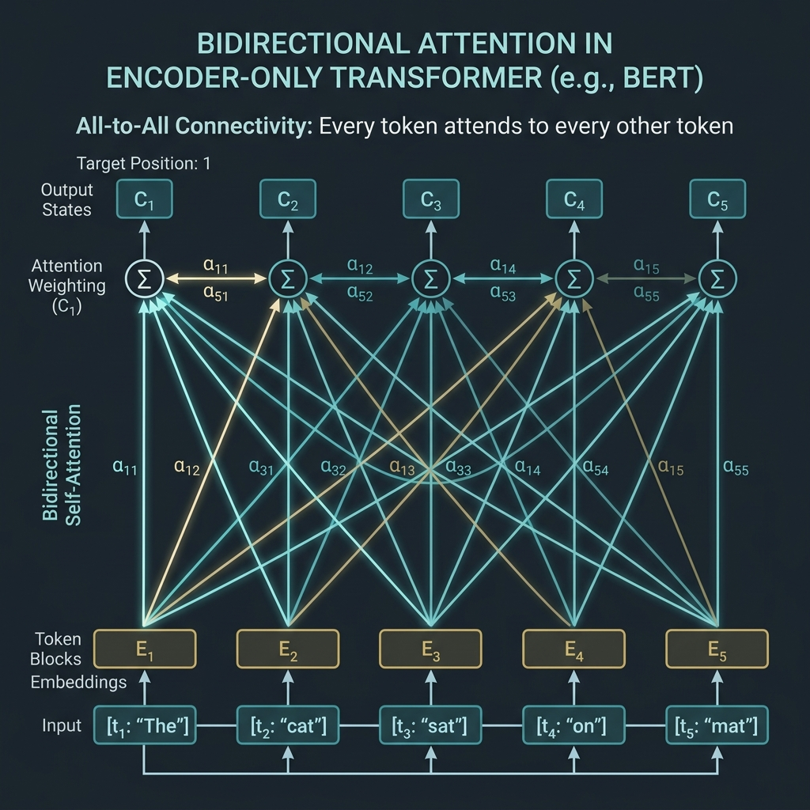

# 4.1 Encoder-only (BERT-style)

Encoder-only models, epitomized by Google's **BERT** (Bidirectional Encoder Representations from Transformers), represent a fundamental branch of the Transformer family tree. Unlike their generative cousins (Decoder-only models like GPT), Encoder-only models are designed to **understand** and **represent** text by looking at the entire context simultaneously.

This chapter explores the architecture, motivations, and evolution of Encoder-only models, from the seminal BERT to the modern resurgence with models like ModernBERT.

---

## The Metaphor: The Detective vs. The Storyteller

To understand the difference between Encoder-only and Decoder-only models, imagine two different tasks:

*   **Decoder-only (The Storyteller):** Reads a story line by line and predicts what happens next. They cannot look ahead because that would be "cheating." They only know the past.
*   **Encoder-only (The Detective):** Arrives at a crime scene and looks at all the clues simultaneously. To understand what happened at point A, the detective looks at points B, C, and D. They need a **bidirectional** view to understand the whole picture.

Encoder-only models are detectives. They process the entire input sequence at once, allowing every token to attend to every other token.


---

## Bidirectional Attention: All-to-All Connectivity

The defining characteristic of an Encoder-only model is its use of **Bidirectional Self-Attention**. In contrast to Causal Self-Attention (used in Decoders) which masks out future tokens, Bidirectional Attention allows full visibility.

Given a sequence of tokens, the attention matrix is full; no masking is applied (except for padding tokens).

<div style={{ display: 'flex', flexDirection: 'column', alignItems: 'center', width: '100%', margin: '20px 0' }}>

<div style={{ maxWidth: '600px', width: '100%' }}>

</div>

<em style={{ marginTop: '10px', color: '#7f8c8d' }}>Source: AI-generated illustration</em>

</div>

This all-to-all connectivity makes Encoder-only models exceptionally good at tasks that require a deep understanding of the relationship between all words in a sentence, such as:
*   **Sentiment Analysis**
*   **Named Entity Recognition (NER)**
*   **Question Answering (extractive)**
*   **Text Classification**

---

## Core Training Objective: Masked Language Modeling (MLM)

Since Encoder-only models see the whole sequence, we cannot train them by simply predicting the next word (as that would be trivial). Instead, BERT introduced **Masked Language Modeling (MLM)**.

### How MLM Works

1.  **Masking:** A certain percentage (typically 15%) of the input tokens are selected at random.
2.  **Replacement:**
    *   80% of the time, the token is replaced with a special `[MASK]` token.
    *   10% of the time, it is replaced with a random token.
    *   10% of the time, it is left unchanged (to bias the representation towards the actual observed word).
3.  **Prediction:** The model attempts to predict the original tokens for the masked positions based on the context provided by the non-masked tokens.

### The Mathematics of MLM

The loss function for MLM is the negative log-likelihood of the masked tokens. Let $M$ be the set of masked indices, and $x_i$ be the original token at index $i$. The model outputs a probability distribution over the vocabulary for each masked position: $P(\cdot | X_{\setminus M})$, where $X_{\setminus M}$ is the sequence with masked tokens.

The MLM loss is defined as:

$$\mathcal{L}_{MLM} = - \sum_{i \in M} \log P(x_i | X_{\setminus M})$$

This forces the model to learn deep bidirectional representations to fill in the blanks.

---

## Evolution and Key Models

### 0. The Precursor: ELMo and the Sesame Street Naming Trend
Before diving into BERT, it is impossible not to mention **ELMo** (Embeddings from Language Models), which was a major milestone in NLP history. Released in early 2018, ELMo popularized the concept of 'Contextualized Word Embeddings', where the meaning of a word changes depending on the context, instead of fixed vectors like Word2Vec [[1]](#ref-1). Although ELMo used bidirectional LSTMs rather than Transformers, it provided crucial inspiration for the birth of BERT.

**💡 Behind the Scenes: Sesame Street and NLP Wordplay**
Here is a fun behind-the-scenes story. Both ELMo and BERT are names of characters from the famous American children's program **Sesame Street**.
- **ELMo** was named after the red furry character 'Elmo',
- **BERT** was named after the yellow character 'Bert'.

After the ELMo researchers made a clever backronym (Embeddings from Language Models) to fit the paper title, Google researchers playfully followed suit and named their model **BERT** (Bidirectional Encoder Representations from Transformers), starting a massive 'Sesame Street universe' in the NLP community. Since then, models named after Sesame Street characters like Baidu's **ERNIE** and Google's **Big Bird** have followed, establishing a culture of pleasant wordplay among AI researchers.

---

### 1. BERT (2018)
**Motivation**: Before BERT, most language models were unidirectional (like GPT-1) or used shallow concatenation of independent left-to-right and right-to-left models (like ELMo). This limited their ability to capture true bidirectional context, which is crucial for understanding tasks like question answering or sentiment analysis where the meaning of a word depends on both what comes before and after it.

**Key Innovations**:
- **Deep Bidirectional Representations**: BERT was the first to use a deeply bidirectional Transformer encoder, allowing every token to attend to all other tokens in all layers [[2]](#ref-2).
- **Masked Language Modeling (MLM)**: Solved the problem of trivial predictions in bidirectional models by masking 15% of tokens.
- **Next Sentence Prediction (NSP)**: A binary classification task to predict if sentence B follows sentence A, helping the model understand inter-sentence relationships.

---

### 2. RoBERTa (2019)
**Motivation**: The authors of RoBERTa hypothesized that the original BERT model was significantly undertrained. They aimed to show that by carefully tuning hyperparameters and increasing data size, the same architecture could achieve much better results without changing the core design.

**Key Innovations**:
- **Dynamic Masking**: Instead of applying a static mask during data preprocessing, RoBERTa applied masking dynamically every time a sequence was fed to the model, leading to better generalization [[3]](#ref-3).
- **Removing NSP**: They found that the NSP task was not necessary and sometimes even hurt performance when training on longer contiguous sequences.
- **Larger Batches and More Data**: Trained with larger batch sizes (up to 8k) and on 160GB of text (vs BERT's 16GB), showing that compute and data scale still mattered for encoders.

---

### 3. ModernBERT (2024)
**Motivation**: During the generative AI boom (2022-2024), Decoder-only models received most of the research attention and hardware optimization. However, Encoder-only models remained the workhorses for critical tasks like search (retrieval-augmented generation or RAG) and classification. ModernBERT was created to bring Encoder-only models into the modern era, incorporating architectural improvements and hardware optimizations developed for LLMs.

**Key Innovations**:
- **Long Context Support**: Extended the context window from BERT's 512 tokens to 8,192 tokens using Rotary Position Embeddings (RoPE) [[4]](#ref-4).
- **Hardware Efficiency**: Integrated Flash Attention, GeGLU activation functions, and aggressive unpadding (removing pad tokens before processing) to achieve up to 3x speedup on modern GPUs.
- **Revitalized Architecture**: Proved that for non-generative tasks, a modernized encoder is still more efficient than a decoder of similar size.

---

### Comparison of Encoder-only Models

| Feature | BERT (Base) | RoBERTa (Base) | ModernBERT (Base) |
| :--- | :--- | :--- | :--- |
| **Max Context** | 512 tokens | 512 tokens | 8,192 tokens |
| **Masking** | Static | Dynamic | Dynamic |
| **NSP Task** | Yes | No | No |
| **Positional Emb.** | Absolute | Absolute | RoPE |
| **Activation** | GELU | GELU | GeGLU |
| **Efficiency** | Standard | Standard | Flash Attention, Unpadding |


---

## Why Encoder-Only Models Still Matter

Despite the fact that Decoder-only models have become the mainstream for Generative AI, Encoder-only models of the BERT family are still widely used in practice and play a crucial role. The reasons are as follows:

### 1. Bidirectional Context is Superior for Understanding
When the goal is to 'understand' text rather than 'generate' it, Causal Attention (which prevents looking at future tokens) can actually be counterproductive.
*   **Full Context Comprehension**: The meaning of a word can often only be accurately determined by looking at the context that follows it. Encoder-only models allow all tokens to reference each other, making them much more effective at understanding such homonyms or complex contexts.
*   **Classification and Named Entity Recognition (NER)**: In tasks like analyzing the sentiment of a text or extracting key information from a document, bidirectional attention that looks at the entire text at once yields higher accuracy.

### 2. Extreme Efficiency in Feature Extraction
In the recently highlighted **RAG (Retrieval-Augmented Generation)** systems, the process of converting documents into vectors, known as 'Embedding', is essential.
*   Encoder-only models are optimized for compressing and representing text as high-dimensional vectors.
*   Extracting embeddings with Decoder-only models requires inefficient prompting or special pooling techniques due to the restriction of not seeing future tokens. In contrast, Encoder-only models provide much faster and more accurate embeddings through tokens like `[CLS]` that contain the meaning of the entire sentence.

### 3. Cost-Effective Deployment
Decoder-only models often have billions of parameters, leading to high serving costs.
*   On the other hand, Encoder-only models like BERT or RoBERTa usually yield excellent understanding performance even with hundreds of millions of parameters.
*   For tasks that do not require generation, such as classification, search, and matching, there is no need to use huge decoder models. Using much smaller and faster encoder models can reduce infrastructure costs by a factor of tens.

### 4. ModernBERT: The Renaissance of Encoders
The emergence of ModernBERT has shown that Encoder-only models can also benefit from the advancements in LLMs. With long context support and Flash Attention application, it is now showing speed and efficiency that surpasses decoder models in large-scale document search and analysis tasks.


## PyTorch Implementation: MLM Head

Here is a simplified implementation of a Masked Language Modeling head on top of a BERT-like encoder.

```python
import torch
import torch.nn as nn
import torch.nn.functional as F

class MLMHead(nn.Module):
    def __init__(self, hidden_size, vocab_size):
        super().__init__()
        self.dense = nn.Linear(hidden_size, hidden_size)
        self.layer_norm = nn.LayerNorm(hidden_size)
        self.decoder = nn.Linear(hidden_size, vocab_size, bias=False)
        
        # Link bias to decoder
        self.bias = nn.Parameter(torch.zeros(vocab_size))
        self.decoder.bias = self.bias

    def forward(self, hidden_states):
        # hidden_states shape: (batch_size, seq_len, hidden_size)
        x = self.dense(hidden_states)
        x = F.gelu(x)
        x = self.layer_norm(x)
        
        # Project to vocab size
        # logits shape: (batch_size, seq_len, vocab_size)
        logits = self.decoder(x)
        return logits

# Example usage
hidden_size = 768
vocab_size = 30522 # Standard BERT vocab size
seq_len = 10
batch_size = 2

# Simulated output from Transformer Encoder
hidden_states = torch.randn(batch_size, seq_len, hidden_size)

mlm_head = MLMHead(hidden_size, vocab_size)
logits = mlm_head(hidden_states)

print("Logits Shape:", logits.shape) # Expected: (2, 10, 30522)
```

---

## Quizzes

<details>
<summary>Quiz 1: Why can't we train an Encoder-only model using standard Causal Language Modeling (predicting the next token)?</summary>
*Because an Encoder-only model uses bidirectional attention. If it were asked to predict the next token while seeing the entire sequence (including the answer), the task would be trivial and the model would learn nothing. It would just copy the answer from the input.*
</details>

<details>
<summary>Quiz 2: Why did RoBERTa remove the Next Sentence Prediction (NSP) task introduced in BERT?</summary>
*Subsequent research showed that the NSP task was not as beneficial as originally thought, and sometimes even hurt performance. Removing it and training on longer contiguous sequences allowed the model to learn better representations.*
</details>

<details>
<summary>Quiz 3: What are the main advantages of ModernBERT over the original BERT?</summary>
*ModernBERT addresses the limitations of original BERT by supporting much longer contexts (up to 8k tokens) and incorporating modern hardware optimizations like Flash Attention and GeGLU, making it much faster and more efficient on modern GPUs.*
</details>

<details>
<summary>Quiz 4: In MLM, why are 10% of the selected tokens replaced with a random token, and 10% left unchanged?</summary>
*This is done to reduce the discrepancy between pre-training and fine-tuning. During fine-tuning, the model never sees the `[MASK]` token. By sometimes keeping the original word or using a random word, the model learns to maintain representations for all tokens, not just predicting when it sees a `[MASK]`.*
</details>

<details>
<summary>Quiz 5: For what kind of tasks is a Decoder-only model preferred over an Encoder-only model?</summary>
*Decoder-only models are preferred for open-ended generation tasks, such as writing stories, code generation, or holding conversations. Encoder-only models are better suited for understanding tasks where the full context is available, like classification, extraction, and retrieval.*
</details>

---

## References

1. <a id="ref-1"></a>Peters, M. E., et al. (2018). *Deep contextualized word representations*. [arXiv:1802.05365](https://arxiv.org/abs/1802.05365).
2. <a id="ref-2"></a>Devlin, J., et al. (2018). *BERT: Pre-training of Deep Bidirectional Transformers for Language Understanding*. [arXiv:1810.04805](https://arxiv.org/abs/1810.04805).
3. <a id="ref-3"></a>Liu, Y., et al. (2019). *RoBERTa: A Robustly Optimized BERT Pretraining Approach*. [arXiv:1907.11692](https://arxiv.org/abs/1907.11692).
4. <a id="ref-4"></a>Answer.AI. (2024). *ModernBERT: Going Beyond the Limits of Encoder-only Models*. [arXiv:2412.13663](https://arxiv.org/abs/2412.13663).
