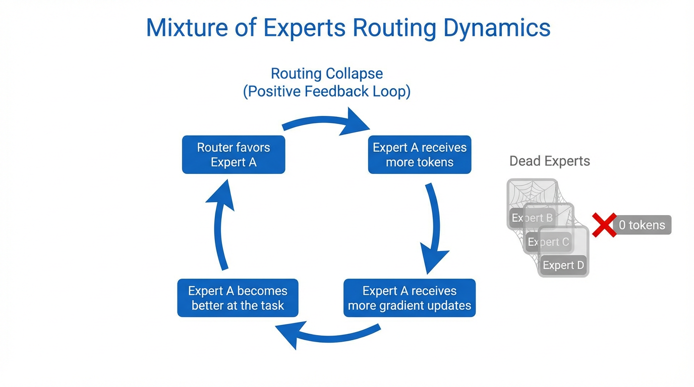

# 5.4 Collapsing & Load Balancing

In the preceding sections, we explored the mathematical beauty of routing and the systems-level necessity of expert parallelism. However, we also identified a critical vulnerability: **Mixture of Experts (MoE) models are inherently unstable.** 

Left to their own devices, MoE routers inevitably succumb to "The Matthew Effect" (the rich get richer). If one expert is slightly better initialized than others, the router will send it more tokens. This expert receives more gradients, improves faster, and attracts even more tokens. Within a few training steps, the entire model "collapses" into a single expert, effectively turning a trillion-parameter sparse model into a much smaller dense model, while leaving the remaining parameters and GPUs idle.

To prevent this catastrophic underutilization, MoE engineering relies on a suite of **Load Balancing** strategies. This section dissects the safety nets that keep sparse models balanced and stable.

---

## 1. The Expert Collapse Phenomenon

Expert Collapse is not just a performance issue; it is a hardware-ending event in distributed systems. When a router collapses:
*   **VRAM Overflow (OOM):** The GPU holding the "popular" expert receives 100% of the batch's tokens, exceeding its pre-allocated memory buffers.
*   **Compute Starvation:** The remaining GPUs in the cluster sit idle, waiting for the overloaded GPU to finish, reducing system throughput to near-zero.
*   **Representational Degeneracy:** The model loses its ability to specialize, as one set of weights is forced to represent every semantic concept from Python code to French poetry.

---

## 2. The Initial Solution: Auxiliary Load-Balancing Loss

The first and most widely used solution (introduced in GShard [[1]](#ref-1)) is the **Auxiliary Loss** ($\mathcal{L}_{aux}$). Instead of just optimizing for next-token prediction, we add a penalty term that encourages the router to distribute tokens uniformly across all $E$ experts.

The loss is typically defined as the scaled dot product between the fraction of tokens sent to each expert and the average routing probability for that expert:

$$ \mathcal{L}_{aux} = \alpha \cdot E \cdot \sum_{i=1}^{E} f_i \cdot P_i $$

Where:
*   $f_i$: The fraction of tokens dispatched to expert $i$.
*   $P_i$: The mean routing probability for expert $i$ across the batch.
*   $\alpha$: A hyperparameter controlling the strength of the balance constraint.

**The Fatal Flaw:** Auxiliary losses create a **gradient conflict**. If the model's intelligence dictates that a token *should* go to Expert A, but Expert A is already full, the auxiliary loss forces the router to send it to Expert B. This "unnatural routing" actively degrades the model's accuracy, a phenomenon known as the **MoE Alignment Tax**.


*Source: Generated by Gemini*

---

## 3. The Infrastructure Safety Net: Capacity Factor & Token Dropping

Even with an auxiliary loss, perfect balance is never guaranteed. To protect hardware from OOM events, engineers use a **Capacity Factor (C)**.

Each expert is assigned a maximum capacity: 
$$ \text{Capacity} = \text{floor} \left( \frac{\text{Tokens Per Batch}}{\text{Number of Experts}} \times C \right) $$

*   If $C=1.0$, the system allows no slack; experts can only take their "fair share."
*   If $C=1.5$, experts can take 50% more than their average share to account for natural variation.

**What happens when the capacity is exceeded?**
The excess tokens are **Dropped**. They are not processed by any expert and are passed forward through the residual connection ($x + 0$). While this prevents the GPU from crashing, it results in "dark spots" in the model's reasoning, significantly hurting performance on long-context tasks.

---

## 4. Advanced Stability: The Router Z-Loss

Large-scale MoE training often suffers from "Logit Drift," where the router's output values (logits) grow uncontrollably large, leading to numerical instability and training spikes. 

To solve this, frameworks like Mesh-TensorFlow introduced the **Router Z-Loss** [[2]](#ref-2). It penalizes the absolute magnitude of the routing logits, keeping them in a healthy range:

$$ \mathcal{L}_{z} = \beta \cdot \text{mean}(\log^2(\sum e^{z_i})) $$

This simple regularization term has become standard practice for training MoE models with hundreds of billions of parameters, ensuring the router remains "well-behaved" even after months of continuous training.

---

## 5. Auxiliary-Loss-Free Routing

By late 2024, researchers realized that any fixed loss-based balancing would always limit model intelligence. DeepSeek-V3 [[3]](#ref-3) pioneered **Auxiliary-Loss-Free Routing** using dynamic bias.

Instead of a loss term, they use a **Controller** that monitors expert load in real-time. If an expert is under-utilized, the controller adds a small positive bias ($b_i$) to its routing logits. If over-utilized, it subtracts bias.

$$ \text{Logit}_{final} = \text{Logit}_{model} + b_{dynamic} $$

**Why it wins:** Because the bias is **detached from the gradient**, the model's weights are never "forced" to learn bad routing. The router learns the "pure" token-expert affinity, while the bias handles the "messy" hardware balancing.

---

## Implementation: MoE Load Balancing & Z-Loss

This PyTorch snippet demonstrates how to calculate the classic Load Balancing loss and the modern Router Z-loss.

```python
import torch
import torch.nn.functional as F

def compute_moe_losses(router_logits, top_k_indices, alpha=1e-2, beta=1e-4):
    """
    router_logits: [batch_size * seq_len, num_experts]
    top_k_indices: [batch_size * seq_len, k]
    """
    num_experts = router_logits.size(-1)
    num_tokens = router_logits.size(0)
    
    # 1. Auxiliary Load Balancing Loss
    # Calculate fraction of tokens sent to each expert (f_i)
    expert_mask = F.one_hot(top_k_indices[:, 0], num_classes=num_experts).float()
    f_i = expert_mask.mean(dim=0)
    
    # Calculate mean routing probability (P_i)
    probs = F.softmax(router_logits, dim=-1)
    P_i = probs.mean(dim=0)
    
    # L_aux = alpha * E * sum(f_i * P_i)
    l_aux = alpha * num_experts * torch.sum(f_i * P_i)
    
    # 2. Router Z-Loss
    # Penalize large logit magnitudes for numerical stability
    # log(sum(exp(z_i))) is the log-sum-exp
    log_z = torch.logsumexp(router_logits, dim=-1)
    l_z = beta * torch.mean(log_z**2)
    
    return l_aux, l_z

# Example Usage
logits = torch.randn(1024, 8) # 1024 tokens, 8 experts
indices = torch.topk(logits, k=1, dim=-1).indices
l_aux, l_z = compute_moe_losses(logits, indices)
print(f"Aux Loss: {l_aux.item():.4f}, Z-Loss: {l_z.item():.4f}")
```

---

## Summary

Load balancing is the "dark art" of MoE engineering. It represents the constant tension between **Model Intelligence** (which wants to route tokens to the best expert) and **System Efficiency** (which wants to route tokens to the idle expert). From the rigid auxiliary losses of the past to the dynamic, loss-free biases of modern models, the goal remains the same: ensuring that every parameter we pay for is actually participating in the model's intelligence.

In the final section of this chapter, **5.5 Case Study**, we will see how these concepts come together in the world's most successful sparse models, from Mixtral to the massive DeepSeek-V3.

---

## Quizzes

<details>
<summary>Quiz 1: Explain how the "rich get richer" phenomenon (Expert Collapse) occurs during training if no load-balancing mechanism is used?</summary>
*It begins with random initialization. If Expert A happens to produce a slightly lower loss for a specific cluster of tokens than Expert B, the router's gradients will update to favor Expert A for those tokens. Because Expert A now receives more tokens, it undergoes more frequent weight updates, becoming even more specialized and effective. This creates a positive feedback loop where Expert A becomes the "optimal" choice for more and more tokens, eventually capturing all traffic while Expert B receives no gradients and never improves.*
</details>

<details>
<summary>Quiz 2: In a system with a Capacity Factor of 1.0, what is the consequence for a token that is "dropped" because its target expert is full? How does this affect long-range dependency modeling?</summary>
*A dropped token typically bypasses the MoE layer entirely, meaning its representation in that layer is purely the identity function (the residual connection). The token receives no non-linear transformation or information processing. In long-range modeling, if critical tokens (like a subject in a long sentence) are dropped, the model "forgets" their refined semantic meaning, leading to coherence failures or incorrect factual associations in later layers.*
</details>

<details>
<summary>Quiz 3: Why is DeepSeek-V3's dynamic bias strategy considered superior to the standard auxiliary loss for preserving model intelligence?</summary>
*Standard auxiliary loss is part of the objective function ($L_{total} = L_{LM} + L_{aux}$), meaning it generates gradients that physically change the model's weights to satisfy balancing constraints. This forces the model to learn sub-optimal weights. DeepSeek's dynamic bias is added to logits for selection but is 'detached' from the gradient tape. This means the model's weights ($W_{gate}$) only learn based on the language modeling loss (pure affinity). The balance is achieved through a mechanical 'nudge' in the forward pass, not by corrupting the learned representations.*
</details>

---

## References

1. <a id="ref-1"></a>Lepikhin, D., et al. (2020). *GShard: Scaling Giant Models with Conditional Computation and Automatic Sharding*. [arXiv:2006.16668](https://arxiv.org/abs/2006.16668).
2. <a id="ref-2"></a>Zoph, B., et al. (2022). *ST-MoE: Designing Stable and Transferable Sparse Expert Models*. [arXiv:2202.08906](https://arxiv.org/abs/2202.08906).
3. <a id="ref-3"></a>DeepSeek-AI. (2024). *DeepSeek-V3 Technical Report*. [arXiv:2412.19437](https://arxiv.org/abs/2412.19437).