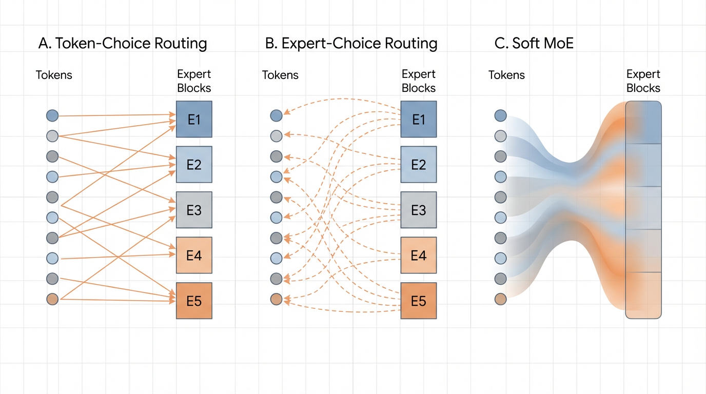

import { RoutingVisualizer } from '../../components/chapter-5/RoutingVisualizer.tsx';

# 5.2 Routing Algorithms

In the previous section, we established that a Mixture of Experts (MoE) architecture decouples a model's total capacity from its inference compute cost. However, this architectural elegance hinges entirely on a single, highly sensitive component: the **Router** (or Gating Network). 

If the experts are the specialized doctors in our mega-hospital, the router is the triage nurse. If the triage nurse sends 99% of the patients to the cardiologist, the cardiologist will be overwhelmed, the other specialists will sit idle, and the hospital's throughput will collapse. In MoE terminology, this catastrophic failure mode is known as **Expert Collapse** (or Routing Collapse).

The evolution of MoE architectures over the last decade is, fundamentally, the history of attempting to solve this exact routing problem. This section dissects the mathematical and engineering progression of routing algorithms, from the early stochastic hacks of 2017 to the elegant, auxiliary-loss-free paradigms powering frontier models like DeepSeek-V3.

---

## 1. The Baseline: Standard Top-$k$ Routing and Its Flaws

The most intuitive approach to routing is **Token-Choice Routing** (specifically, Top-$k$). For a given token representation $x$, the router projects it into a vector of logits corresponding to the $E$ available experts. A softmax function creates a probability distribution, and the token is dispatched to the $k$ experts with the highest probabilities.

$$ \text{Logits} = x \cdot W_{gate} $$
$$ p(x) = \text{Softmax}(\text{Logits}) $$
$$ \mathcal{E}_{selected} = \text{argmax}_k(p(x)) $$

While mathematically sound, this naive approach fails in practice due to a self-reinforcing feedback loop. Neural networks are prone to the "rich get richer" phenomenon. Early in training, due to random initialization, Expert A might perform slightly better on a batch of tokens than Expert B. The router learns this and begins sending more tokens to Expert A. Because Expert A receives more tokens, it receives more gradient updates, making it even better. Within a few thousand steps, the router sends *all* tokens to Expert A. The remaining experts are starved of gradients and become "dead experts."

---

## 2. Generation 1: Noisy Top-$k$ and Auxiliary Losses

To combat expert collapse, the seminal 2017 MoE paper by Shazeer et al. [[1]](#ref-1) introduced **Noisy Top-$k$ Routing**. By injecting tunable Gaussian noise into the logits before the Top-$k$ selection, the router is forced to explore different experts, preventing early lock-in.

$$ H(x) = x \cdot W_{gate} + \text{StandardNormal}() \cdot \text{Softplus}(x \cdot W_{noise}) $$

However, noise alone is insufficient for massive-scale training. Engineers introduced the **Auxiliary Load-Balancing Loss** ($\mathcal{L}_{bal}$). This is an additional penalty term added to the primary language modeling loss during training. It mathematically penalizes the model if the distribution of tokens across experts deviates from a uniform distribution.

$$ \mathcal{L}_{total} = \mathcal{L}_{LM} + \alpha \mathcal{L}_{bal} $$

Where $\alpha$ is a hyperparameter controlling the strength of the penalty.

**The Engineering Trade-off (The "Alignment Tax" of MoE):**
Auxiliary losses solve the hardware utilization problem but introduce a severe modeling problem. If $\alpha$ is too high, the router is forced to send tokens to suboptimal experts simply to satisfy the load-balancing quota. This degrades the **token-to-expert affinity**. The model sacrifices intelligence for the sake of hardware efficiency.

---

## 3. Generation 2: Expert Choice Routing (ECR)

In 2022, researchers at Google Brain proposed a paradigm shift: **Expert Choice Routing (ECR)** [[2]](#ref-2). If tokens choosing experts leads to imbalance, what if we reverse the relationship?

In ECR, instead of each token selecting the top-$k$ experts, **each expert selects the top-$k$ tokens**. 

Every expert is assigned a fixed **capacity factor** (the maximum number of tokens it is allowed to process in a given batch). The router computes the standard token-to-expert affinity matrix. Then, we transpose this matrix. Each expert looks at the entire batch of tokens and pulls the exact number of tokens needed to fill its buffer.

### The PyTorch Implementation of ECR

Unlike standard Top-$k$, ECR operates over the sequence/batch dimension rather than the expert dimension.

```python
import torch
import torch.nn as nn
import torch.nn.functional as F

class ExpertChoiceRouting(nn.Module):
    def __init__(self, d_model, num_experts, capacity_factor):
        super().__init__()
        self.num_experts = num_experts
        self.capacity_factor = capacity_factor
        
        # Router network
        self.router = nn.Linear(d_model, num_experts, bias=False)
        
    def forward(self, x):
        """
        x shape: [batch_size, seq_len, d_model]
        """
        batch_size, seq_len, d_model = x.shape
        num_tokens = batch_size * seq_len
        
        # Calculate fixed capacity per expert
        # E.g., if capacity_factor=2.0, an expert processes twice the average token share
        expert_capacity = int((num_tokens / self.num_experts) * self.capacity_factor)
        
        x_flat = x.view(-1, d_model) # [num_tokens, d_model]
        
        # 1. Compute affinity logits: [num_tokens, num_experts]
        logits = self.router(x_flat)
        
        # 2. Convert to routing weights (Softmax over experts)
        weights = F.softmax(logits, dim=-1)
        
        # 3. TRANSPOSE: Let experts view all tokens -> [num_experts, num_tokens]
        weights_t = weights.t()
        
        # 4. Expert Choice: Each expert picks its top `expert_capacity` tokens
        # top_weights, top_indices shape: [num_experts, expert_capacity]
        top_weights, top_indices = torch.topk(weights_t, expert_capacity, dim=-1)
        
        # (In a full implementation, tokens would now be gathered using top_indices, 
        # processed by their respective experts, and scattered back)
        
        return top_indices, top_weights

# Example usage
layer = ExpertChoiceRouting(d_model=1024, num_experts=8, capacity_factor=1.5)
dummy_input = torch.randn(2, 128, 1024) # 256 total tokens
indices, weights = layer(dummy_input)

# Each of the 8 experts exactly selected 48 tokens (256 / 8 * 1.5)
print(f"Indices shape: {indices.shape}") # Expected: [8, 48]
```

**The Pros and Cons of ECR:**
*   **Pro:** Perfect load balancing is guaranteed by definition. There is no need for auxiliary losses, avoiding the affinity degradation problem.
*   **Con:** Variable compute per token. Highly complex tokens might be selected by 4 different experts, while simple (or uninformative) tokens might not be selected by *any* expert, effectively dropping them from the forward pass. This variable routing complicates autoregressive generation during inference.

---

## 4. Generation 3: Soft MoE and Differentiable Routing

A parallel track of research sought to eliminate the non-differentiable `argmax` or `topk` operations entirely. **Soft MoE** [[3]](#ref-3) replaces discrete, hard routing with continuous, soft assignments.

Instead of sending an intact token to a specific expert, Soft MoE computes a weighted average of *all* tokens in the sequence and passes this "blended token" to the expert. Because every operation is a continuous matrix multiplication, the entire routing layer is fully differentiable.

While mathematically elegant and highly stable during training, Soft MoE requires all expert weights to be loaded into memory to compute the continuous mixtures. This negates some of the sparse activation benefits essential for extreme-scale inference, relegating it primarily to vision models (like Vision MoEs) rather than trillion-parameter LLMs.


*Source: AI-generated illustration*

---

## 5. Auxiliary-Loss-Free Routing (DeepSeek-V3)

In recent developments, the industry recognized that auxiliary losses were crippling the upper bounds of model intelligence. DeepSeek-V3 [[4]](#ref-4) introduced a masterclass in systems engineering: **Auxiliary-Loss-Free Routing via Dynamic Bias**.

Instead of penalizing the loss function, DeepSeek-V3 removes the auxiliary loss entirely. To maintain load balancing, they introduce a dynamic bias term $b_i$ for each expert $i$, added to the routing logits:

$$ \text{Logits}_i = (x \cdot W_{gate})_i + b_i $$

**The Mechanism:**
1.  During training, the system monitors the load of each expert.
2.  If Expert $i$ is receiving too many tokens (overloaded), its bias term $b_i$ is slightly decreased.
3.  If Expert $j$ is starved of tokens (underloaded), its bias term $b_j$ is slightly increased.
4.  **Crucially:** This bias term is *only* used for the Top-$k$ selection process. It is detached from the computational graph and is *not* used when calculating the routing weights multiplied with the expert outputs.

Because the bias is dynamically adjusted outside of the gradient tape, the model is physically forced to balance the load, but the backpropagation process is completely untainted by artificial balancing constraints. The model learns pure token-to-expert affinity, resulting in a significantly steeper convergence curve and higher reasoning capabilities.

---

## Interactive Visualization: Routing Paradigms

To intuitively grasp how these algorithms distribute compute, interact with the conceptual visualizer below. Observe how Token-Choice can lead to bottlenecks, while Expert-Choice guarantees hardware utilization at the cost of token coverage.

<RoutingVisualizer client:load />


---

## Summary and Next Steps

The routing algorithm is the defining characteristic of any MoE model. While the industry has largely converged on Top-$k$ routing augmented with dynamic bias adjustments (eschewing auxiliary losses), the physical reality of moving these tokens across thousands of GPUs introduces a new bottleneck. 

Even if the routing algorithm perfectly balances the load mathematically, how do we efficiently transfer a token residing on GPU 0 to the expert residing on GPU 412 without stalling the entire cluster? In the next section, **5.3 Expert Parallelism**, we will dive into the distributed systems engineering required to make these routing algorithms function at planetary scale.

---

## Quizzes

<details>
<summary>Quiz 1: Why does increasing the weight ($\alpha$) of the auxiliary load-balancing loss often result in a model with worse zero-shot reasoning capabilities on benchmarks like MMLU, even if the training loss converges faster?</summary>
*The auxiliary loss forces the router to prioritize hardware utilization (distributing tokens evenly) over token-to-expert affinity (sending a token to the expert that actually contains the most relevant knowledge). If $\alpha$ is too high, a highly complex mathematics token might be routed to an expert specialized in French literature simply because the math expert's buffer was getting full. This corrupts the specialization of the experts and degrades the model's overall reasoning capacity.*
</details>

<details>
<summary>Quiz 2: In Expert Choice Routing (ECR), it is mathematically possible for a specific token in the sequence to not be selected by *any* expert. In a standard Transformer architecture, why is dropping a token in the middle of a sequence highly problematic, and how must the architecture adapt?</summary>
*In a standard Transformer, if a token is completely dropped by the MoE layer, its representation becomes a zero-vector (or purely the residual connection) for subsequent layers. This destroys the continuous flow of sequence information, especially for autoregressive generation where the next token depends heavily on the precise representation of the current token. To adapt, ECR models rely heavily on the residual connection ($x + \text{MoE}(x)$) to bypass the dropped token forward, but it still makes autoregressive KV-caching highly unpredictable compared to Top-$k$ routing.*
</details>

<details>
<summary>Quiz 3: DeepSeek-V3 uses a dynamic bias term $b_i$ added to the routing logits to balance load, but explicitly excludes this bias from the gradient calculation of the routing weights. What would happen if this bias term *was* included in the gradient tape during backpropagation?</summary>
*If the bias term were included in the gradient tape, the model would learn to permanently adjust its internal router weights ($W_{gate}$) to account for the temporary load imbalances of specific batches. The bias is meant to be a transient, systemic "nudge" to fix immediate hardware bottlenecks. By keeping it out of the gradient calculation, the router's weights are updated purely based on semantic token-expert affinity (the cross-entropy loss of the language modeling objective), ensuring the model learns "what is right" rather than "what is currently convenient for the GPUs."*
</details>

---

## References

1. <a id="ref-1"></a>Shazeer, N., et al. (2017). *Outrageously Large Neural Networks: The Sparsely-Gated Mixture-of-Experts Layer*. [arXiv:1701.06538](https://arxiv.org/abs/1701.06538).
2. <a id="ref-2"></a>Zhou, Y., et al. (2022). *Mixture-of-Experts with Expert Choice Routing*. [arXiv:2202.09368](https://arxiv.org/abs/2202.09368).
3. <a id="ref-3"></a>Puigcerver, J., et al. (2023). *From Sparse to Soft Mixtures of Experts*. [arXiv:2308.00951](https://arxiv.org/abs/2308.00951).
4. <a id="ref-4"></a>DeepSeek-AI. (2024). *DeepSeek-V3 Technical Report*. [arXiv:2412.19437](https://arxiv.org/abs/2412.19437).