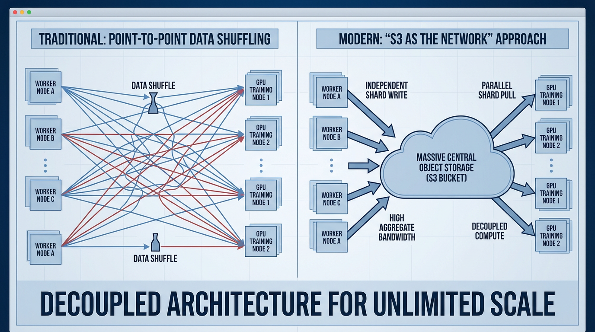

import DataPipelineEvolution from '../../components/chapter-6/DataPipelineEvolution.tsx';

# 6.1 Data Engineering at Scale

A foundation-model run consumes a versioned sequence of tokens, not an abstract “dataset.” If two jobs use the same source URLs but different crawl snapshots, filters, tokenizer revisions, packing rules, or sampling weights, they did not train on the same data. At scale, data engineering is therefore part of the optimization algorithm and the recovery system.

The production objective is broader than peak storage bandwidth: deliver the intended token mixture without starving an accelerator, reconstruct any suspect batch, resume from a coordinated checkpoint, and prove that evaluation material was excluded.

## 1. From Sources to an Immutable Training Snapshot

A practical pipeline separates four states:

1. **Raw evidence:** immutable source objects plus collection time, origin, license or consent basis, and deletion identifier.
2. **Curated documents:** normalized records with quality, language, safety, PII/secrets, and exact/near-duplicate decisions.
3. **Tokenized shards:** tokenizer-bound records with document boundaries, sample IDs, token counts, and checksums.
4. **Run view:** a frozen manifest that selects shards, mixture weights, epoch/stream policy, deterministic seed, and packing semantics.

Do not overwrite an old snapshot when a filter changes. Publish a new version, retain the transformation lineage, and make deletions propagate through derived artifacts. This is what allows an engineer to explain a capability regression, satisfy a deletion request, or reproduce the batch associated with a loss spike.

<DataPipelineEvolution client:load />

## 2. Dataset Manifest and Evaluation Quarantine

The manifest is the data control plane. At minimum, each run records:

| Contract field | Required evidence |
| :--- | :--- |
| Source and rights | source ID/URI, collection time, license or consent, policy tag, deletion lineage |
| Transform lineage | normalization, language/quality/PII filters and versions, rejection reason |
| Identity | stable sample ID, exact and near-duplicate cluster ID, shard checksum |
| Tokenization | tokenizer hash, normalization policy, BOS/EOS and document-boundary policy |
| Mixture | configured sampling weight and realized tokens by source/language/domain |
| Split | cluster-level train/dev/test assignment and split seed |
| Packaging | sequence length, packing algorithm/version, cross-document attention policy |

Perform exact/near deduplication and semantic clustering before split assignment so document variants, conversations, entities, and synthetic siblings remain in one split. Create an **evaluation quarantine** containing public benchmarks, private release prompts, rubrics, semantic neighbors, and teacher-generated variants. Match every candidate training sample against that quarantine before publishing the run view. A clean exact-string search is not enough for paraphrases or generated derivatives.

Validate mixture classifiers before trusting their labels. Report language and domain precision/recall on a human-audited set, plus the “unknown” slice. A sampling configuration such as 30% code and 10% Korean is a hyperparameter; log realized post-tokenization proportions because document counts and token counts differ.

## 3. Storage, Caching, and Throughput

Open table formats such as Apache Iceberg and Delta Lake can provide snapshot metadata and transactional publication over object storage [[1]](#ref-1) [[2]](#ref-2). They are useful options, not mandatory formats for every training corpus. Object storage is durable and horizontally scalable, but its usable throughput is bounded by request limits, network topology, throttling, object sizes, decompression, and tail latency.


*Source: AI-generated illustration. Measure the actual object-store, network, and cache path rather than assuming unlimited bandwidth.*

A typical path is object storage → node-local NVMe cache → asynchronous prefetch/decode/token read → pinned host buffers → accelerator. Choose where to tokenize or decode from measurements. Pre-tokenization saves repeated CPU work but couples shards to a tokenizer and packing policy; on-the-fly processing preserves flexibility but consumes CPU and may increase jitter. `.safetensors`, Parquet, WebDataset-style archives, and custom indexed binary formats solve different problems—none is a universal dataset format.

Capacity planning starts from the measured payload and step time:

$$
B_{\text{required}} = \frac{\text{global bytes consumed per step}}{T_{\text{step}} \times \eta},
$$

where $T_{\text{step}}$ is the target step time and $\eta < 1$ reserves headroom for tail latency, retries, and other traffic. Compare this demand with achieved, not advertised, bandwidth during a multi-node soak test.

## 4. Deterministic Sharding and Resume Contract

An `IterableDataset` object is copied into each DataLoader worker. Mutating fields inside those worker copies does not create a coordinated global cursor. A worker-local JSON file can be overwritten by another worker, omit rank state, or lag because code after `yield` has not run. Such a loader is not exactly resumable.

Instead, make assignment a pure function of immutable run state. The following deliberately small example demonstrates the partition invariant; production readers must add authenticated storage, retries, prefetch, decoding, and a distributed checkpoint coordinator.

```python
from dataclasses import dataclass, asdict
import hashlib
import json

@dataclass(frozen=True)
class DataCursor:
    dataset_version: str
    epoch: int
    permutation_seed: int
    world_size: int
    workers_per_rank: int
    shard_position: int
    sample_offset: int

def partition_shards(shard_ids, *, epoch, seed, rank, world_size,
                     worker_id, workers_per_rank):
    """Deterministic, remainder-safe assignment for one rank/worker."""
    keyed = sorted(
        shard_ids,
        key=lambda shard: hashlib.sha256(
            f"{seed}:{epoch}:{shard}".encode()
        ).digest(),
    )
    partition_id = rank * workers_per_rank + worker_id
    partitions = world_size * workers_per_rank
    return keyed[partition_id::partitions]

def encode_cursor(cursor: DataCursor) -> bytes:
    return json.dumps(asdict(cursor), sort_keys=True).encode()

# Smoke-test the ownership invariant.
shards = [f"shard-{i:03d}" for i in range(17)]
owners = [
    partition_shards(shards, epoch=2, seed=7, rank=rank, world_size=2,
                     worker_id=worker, workers_per_rank=3)
    for rank in range(2) for worker in range(3)
]
flat = [shard for owned in owners for shard in owned]
assert sorted(flat) == sorted(shards)
assert len(flat) == len(set(flat))
```

The checkpoint must atomically bind the data cursor to sharded model and optimizer state, scheduler, precision-scaler/FP8 state, global step and tokens, RNG states, sampler state, and dataset/tokenizer/code/config hashes. Each rank writes a unique temporary shard; a coordinator verifies checksums and expected writers before publishing a completion marker. Readers ignore incomplete generations.

State the delivery semantics honestly. If a crash can occur after an optimizer update but before the paired cursor is committed, the system may replay data from the last completed checkpoint. “Exactly once” requires a transaction boundary that couples the accepted model update and cursor; many training systems instead provide deterministic **at-least-once replay from the last checkpoint**. Measure whether that replay is acceptable.

Changing world size changes ownership. Only claim elastic resume if the checkpoint format and sampler can reshard from the global cursor without skipping or duplicating samples. Verify it with a restore drill and compare the next sample IDs, token counter, learning rate, and several updates with an uninterrupted control.

## 5. Data Loader Acceptance Test

Run the real loader before reserving the full cluster. Test one worker, one node, and the target multi-node topology with the actual storage endpoint and security policy.

- **Integrity:** validate manifest and shard checksums; quarantine corrupt objects without silently substituting data.
- **Coverage:** prove every assigned sample appears once per declared epoch/stream policy and no partition overlaps.
- **Boundaries:** inspect EOS/document separators, padding masks, packing boundaries, and cross-sample attention behavior.
- **Performance:** record tokens/s/GPU, data-wait fraction, cache hit rate, p50/p95/p99 shard latency, decompression time, retries, and stragglers.
- **Auditability:** persist sample and pack IDs with the training step so a suspect batch can be reconstructed.
- **Recovery:** kill ranks and workers during a soak test, restore only completed checkpoints, and run continuation-equivalence checks.
- **Backpressure:** verify bounded queues and disk usage when object storage slows; prefetch must not exhaust host RAM or local NVMe.

An acceptance threshold should be expressed relative to model demand—for example, a bounded data-wait fraction at the target token rate—not as a generic GB/s number.

## 6. Agentic Automation with Approval Boundaries

Agents can summarize logs, propose SQL or filter patches, and prepare quality reports. They should not silently change a production data snapshot. A safe workflow records the agent input, proposed diff, tool outputs, reviewer identity, dry-run metrics, and rollback artifact. Schema changes, filter-threshold relaxation, deletion-policy changes, and run-mixture publication require explicit approval.

| Candidate automation | Safe default | Prohibited default |
| :--- | :--- | :--- |
| Failure analysis | link evidence and draft a diagnosis | repeatedly retry an unknown corrupt shard |
| Code/SQL generation | open a reviewed patch and run on a sample | write directly to the published snapshot |
| Quality monitoring | report drift and affected sample IDs | relax a gate to make the alert disappear |
| Mixture exploration | calculate candidate token budgets | alter a scheduled training run without approval |

The practical output of the data pipeline is therefore an immutable, auditable run view plus a loader whose identity, throughput, and recovery properties were measured. Only then can an optimizer curve be interpreted as evidence about the model rather than an unknown data stream.

## Quizzes

<details>
<summary>Quiz 1: Two runs use the same source documents but different tokenizer hashes and packing policies. Are they using the same dataset?</summary>
*No. The optimizer consumes token sequences, boundaries, and masks. A run view must bind the source snapshot to tokenizer and packing identities; otherwise token budgets and examples are not reproducible.*
</details>

<details>
<summary>Quiz 2: Why must near-duplicate clustering happen before train/dev/test assignment?</summary>
*If splitting happens first, variants of one document can land in both training and evaluation. Clustering first lets the entire related group receive one split and reduces contamination and overly optimistic evaluation.*
</details>

<details>
<summary>Quiz 3: Why does the deterministic partition example use strided ownership rather than floor-sized contiguous slices?</summary>
*Striding assigns remainder shards naturally. Floor division can leave shards unassigned, while the rank-plus-worker partition ID also prevents different data-parallel ranks from reading the same shard.*
</details>

<details>
<summary>Quiz 4: A job checkpoints every 30 minutes and crashes after an optimizer step but before the next checkpoint. Can it claim exactly-once data delivery?</summary>
*Not without a transaction coupling that update and cursor. On restart it normally replays from the last completed checkpoint, which is deterministic at-least-once behavior. The contract and its effect must be measured honestly.*
</details>

<details>
<summary>Quiz 5: Average loader bandwidth exceeds demand, but one rank has high p99 shard latency. Is the loader ready?</summary>
*Not necessarily. Synchronous training waits for stragglers, so tail latency can dominate step time even when average throughput is high. A multi-node soak test must meet data-wait and tail-latency gates.*
</details>

## References

1. <a id="ref-1"></a>Apache Software Foundation. *Apache Iceberg: A Table Format for Huge Analytic Datasets*. [Official documentation](https://iceberg.apache.org/).
2. <a id="ref-2"></a>Armbrust, M., et al. (2020). *Delta Lake: High-Performance ACID Table Storage over Cloud Object Stores*. [arXiv:2008.06750](https://arxiv.org/abs/2008.06750).
3. <a id="ref-3"></a>PyTorch. *Data Loading Order and `IterableDataset` behavior*. [PyTorch documentation](https://docs.pytorch.org/docs/stable/data.html).
4. <a id="ref-4"></a>PyTorch. *Distributed Checkpoint*. [PyTorch documentation](https://docs.pytorch.org/docs/main/distributed.checkpoint.html).
