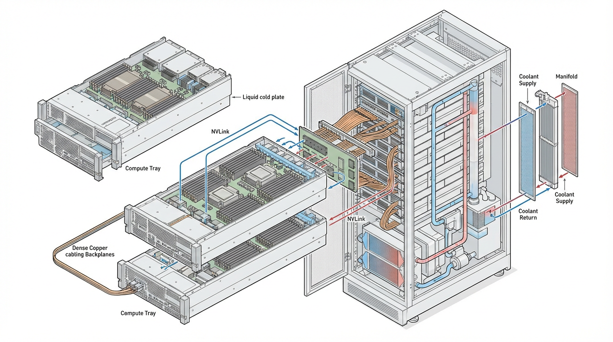
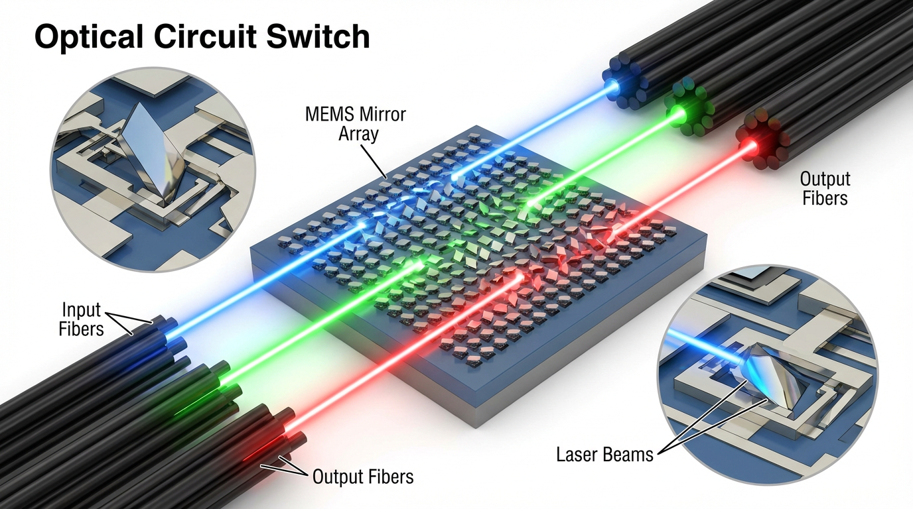

import ClusterTopologyExplorer from '../../components/chapter-6/ClusterTopologyExplorer.tsx';

# 6.4 Infrastructure

If Chapter 6.3 demonstrated how to stabilize the mathematics of a hundred-billion-parameter model, this section addresses the physical reality of computing it. The transition from early Deep Learning to the Foundation Model era is defined by a fundamental shift in hardware abstraction: **the data center is the computer.**

When engineers speak of training Llama 3 or Grok 3, they are not talking about a single server, nor even a rack. They are describing highly synchronized, warehouse-scale supercomputers comprising up to 100,000 GPUs, consuming hundreds of megawatts of power, and interconnected by thousands of miles of fiber optic cabling. 

At this scale, the laws of physics—specifically thermodynamics, light-speed latency limits, and component entropy—dictate the system architecture. This section deconstructs the state-of-the-art AI infrastructure of 2026, from rack-scale liquid cooling to the ongoing war between InfiniBand and Ethernet.

---

## 1. Compute Density: The Rack-Scale Paradigm

Historically, AI clusters were built using standard 4U or 8U servers housing 8 GPUs (e.g., NVIDIA HGX A100 or H100), connected via standard top-of-rack switches. As models moved toward Trillion-Parameter Mixture-of-Experts (MoE) architectures, the communication overhead between these discrete servers became a fatal bottleneck.

The industry solution is **Rack-Scale Architecture**, epitomized by systems like the NVIDIA GB200 NVL72 [[1]](#ref-1).


*Source: Generated by Gemini*

In a rack-scale design, the traditional boundaries of a "server" dissolve:
*   **The Massive Single GPU**: The GB200 NVL72 contains 72 Blackwell GPUs and 36 Grace CPUs. Instead of connecting via standard Ethernet, all 72 GPUs are wired into a single **NVLink domain** via a blind-mate copper backplane. This provides 130 TB/s of bidirectional bandwidth. To the PyTorch compiler, this entire rack appears as a single, coherent accelerator.
*   **Direct-to-Chip (DTC) Liquid Cooling**: A single NVL72 rack consumes approximately 120 kilowatts (kW) of power. Air cooling physically cannot move this volume of heat. Coolant Distribution Units (CDUs) pump specialized liquid directly over the CPU, GPU, and NVLink switch silicon. 

---

## 2. The Interconnect War: Scale-Out Networking

While NVLink handles *Scale-Up* (communication within a rack), training a frontier model requires *Scale-Out* (communication across thousands of racks). This is achieved using **RDMA (Remote Direct Memory Access)**, which allows one server to read or write directly to the GPU High Bandwidth Memory (HBM) of another server, entirely bypassing the CPU and Operating System kernel to achieve microsecond latency.

For the past decade, the undisputed king of RDMA was **InfiniBand**. However, the 2024-2026 period witnessed a massive industry shift toward **RoCEv2 (RDMA over Converged Ethernet)**.

### InfiniBand: The Legacy Champion
InfiniBand was designed ground-up for High-Performance Computing (HPC). Its primary advantage is **credit-based flow control**. A sender will not transmit data unless the receiver explicitly grants it a "credit" confirming it has buffer space. This makes InfiniBand inherently lossless, preventing the packet drops that cause catastrophic latency spikes in synchronous AI training.

### Ethernet (RoCEv2): The Hyperscale Challenger
Ethernet is ubiquitous, cheaper, and benefits from a massive open ecosystem. However, standard Ethernet is "lossy"—it drops packets when congested. RoCEv2 attempts to solve this using Priority Flow Control (PFC) and Explicit Congestion Notification (ECN). 

Historically, RoCEv2 struggled with "PFC storms," where a single congested port could pause traffic, cascading across the network and freezing the cluster. But two major deployments proved Ethernet's viability at the frontier scale:
1.  **Meta's Llama 3 Clusters**: Meta built two parallel 24,576-GPU clusters—one using InfiniBand and one using RoCEv2. Their findings proved that with careful topology-aware scheduling and network tuning, the Ethernet cluster matched InfiniBand's training throughput [[3]](#ref-3).
2.  **xAI Colossus**: Elon Musk's xAI deployed 100,000 H100 GPUs (later expanded to 200,000) in just 122 days. They completely bypassed InfiniBand, opting for NVIDIA's Spectrum-X Ethernet fabric. By utilizing SmartNICs (BlueField-3 DPUs) to offload congestion control, Colossus achieved 95% sustained throughput with zero packet loss [[2]](#ref-2).

---

## 3. The Google Alternative: TPUs and Light

While the rest of the industry builds hierarchical Fat-Tree networks with electrical packet switches, Google engineers architected the **Tensor Processing Unit (TPU)** pods using a radically different philosophy: the **3D Torus** and **Optical Circuit Switches (OCS)** [[4]](#ref-4).

In a TPU v5p pod, 8,960 chips are wired directly to their neighbors in a 3-dimensional grid (16×20×28). Instead of routing packets through layers of electrical spine and leaf switches, the edges of this grid are connected to an OCS [[4]](#ref-4).


*Source: Generated by Gemini*

### The Magic of MEMS Mirrors
An electrical switch must convert an incoming optical signal to electricity, read the packet header, route it, and convert it back to light. This consumes massive power. 

An OCS contains arrays of microscopic **MEMS (Micro-Electro-Mechanical Systems)** mirrors. When a connection is established, the mirrors physically tilt to reflect a laser beam from an input fiber directly into an output fiber. 
*   **Zero Power Overhead**: Once the mirrors are set, routing data costs zero additional power, regardless of bandwidth.
*   **Dynamic Topology**: If a TPU chip fails (which happens daily at scale), the OCS simply adjusts its mirrors to bypass the dead chip, maintaining the logical Torus topology without human engineers needing to physically re-cable the rack.

---

## 4. Interactive: Cluster Topology Explorer

Use the explorer below to compare the architectural differences between Rack-Scale NVLink, Fat-Tree Ethernet, and TPU Torus topologies.

<ClusterTopologyExplorer client:load />

---

## 5. The Physical Reality: Power and Entropy

Operating 100,000 GPUs is a battle against thermodynamics and entropy. 

### The Power Spike Problem
A 100,000-GPU cluster draws approximately **250 Megawatts** of power—enough to run a small city. AI workloads are highly synchronized. During the forward and backward passes, power draw is maximized. When the GPUs pause to synchronize gradients across the network (All-Reduce) or write a checkpoint to storage, the compute utilization drops to near zero. 

This causes violent, instantaneous swings in power demand (tens of megawatts dropping and spiking in milliseconds). Local power grids cannot handle this volatility. To prevent tripping grid breakers, hyperscalers deploy massive **Battery Energy Storage Systems (BESS)**, like Tesla Megapacks, directly adjacent to the data center to buffer these transient spikes [[2]](#ref-2).

### The Blast Radius
At the scale of 100,000 components, the Mean Time Between Failures (MTBF) is measured in hours. Cosmic rays flip memory bits (Silent Data Corruption), optical transceivers burn out, and liquid cooling pumps degrade. Infrastructure engineering is less about *preventing* failure and more about minimizing the **blast radius**—ensuring that a single failed NIC does not crash a 10,000-GPU training job, relying on rapid distributed checkpointing to recover instantly.

---

## 6. The Software Abstraction: NCCL

How does an AI researcher actually use this vast infrastructure? They don't write socket code or configure MEMS mirrors. The physical network is abstracted away by communication libraries, most notably **NCCL (NVIDIA Collective Communications Library)**.

When a PyTorch script invokes a distributed operation, NCCL queries the physical topology. It automatically detects if two GPUs share an NVLink switch, or if it must route traffic over RoCEv2 via the BlueField DPU, and executes optimal algorithms (like Ring or Double-Tree routing) to move the tensors.

```python
import torch
import torch.distributed as dist
import os

def setup_distributed_environment():
    # In a production cluster, environment variables are injected by the orchestrator (e.g., Slurm)
    os.environ.setdefault('MASTER_ADDR', '10.0.0.1')
    os.environ.setdefault('MASTER_PORT', '29500')
    os.environ.setdefault('WORLD_SIZE', '8')
    os.environ.setdefault('RANK', '0')
    os.environ.setdefault('LOCAL_RANK', '0')
    
    # Initialize the NCCL backend. NCCL handles the physical routing 
    # over NVLink, PCIe, and InfiniBand/RoCEv2 automatically.
    dist.init_process_group(backend='nccl')
    
    local_rank = int(os.environ['LOCAL_RANK'])
    torch.cuda.set_device(local_rank)
    return local_rank

def sync_gradients(model: torch.nn.Module):
    """
    Demonstrates the manual application of an All-Reduce operation.
    In practice, DistributedDataParallel (DDP) handles this automatically.
    """
    # Iterate through all parameters in the model
    for param in model.parameters():
        if param.grad is not None:
            # Sum the gradients across all GPUs in the cluster synchronously
            dist.all_reduce(param.grad.data, op=dist.ReduceOp.SUM)
            
            # Average the gradients based on the total number of GPUs
            param.grad.data /= dist.get_world_size()

if __name__ == "__main__":
    # local_rank = setup_distributed_environment()
    # model = MyFoundationModel().cuda(local_rank)
    # ... compute loss and loss.backward() ...
    # sync_gradients(model)
    pass
```

With the physical infrastructure established and the network stabilized, we face our next challenge: How do we actually slice a trillion-parameter model to fit across these GPUs? In **Chapter 7: Training Optimization & Systems**, we will explore 3D Parallelism and ZeRO optimization.

---

## Quizzes

<details>
<summary>Quiz 1: Consider a Mixture-of-Experts (MoE) model with expert parallelism across $P = 64$ devices. The global batch size is $B = 2^{20}$ tokens. Each token selects $k = 2$ experts. The hidden dimension is $D = 4096$ and data type is float16 (2 bytes). Assuming a uniform distribution of expert routing, derive and calculate the total data volume (in Gigabytes, GB) that a single device must transmit during the All-to-All communication phase for expert dispatching.</summary>
*The local batch size per device before dispatching is $B_{local} = B / P = 2^{20} / 64 = 2^{14} = 16,384$ tokens. With Top-$k$ gating where $k=2$, each token is sent to 2 experts. Assuming uniform distribution, each device retains $1/P$ of its assigned tokens and sends $(P-1)/P$ to other devices. Total transmitted tokens per device = $B_{local} \times k \times \frac{P-1}{P} = 16,384 \times 2 \times \frac{63}{64} = 32,256$ tokens. Data volume per token = $D \times 2\text{ bytes} = 4096 \times 2 = 8,192\text{ bytes}$. Total data volume transmitted per device = $32,256 \times 8,192\text{ bytes} = 264,241,152\text{ bytes} \approx 0.264\text{ GB}$ or $252\text{ MB}$.*
</details>

<details>
<summary>Quiz 2: In a RoCEv2 network, how does RDMA (Remote Direct Memory Access) fundamentally differ from traditional TCP/IP communication for distributed training?</summary>
*Traditional TCP/IP requires data to pass through the OS kernel, involving CPU interrupts and multiple memory copies between user space and kernel space. RDMA allows the network interface card (NIC) to read and write directly to the GPU's memory (HBM), bypassing the CPU and OS entirely. This cuts latency from milliseconds to microseconds, which is critical for synchronous gradient updates.*
</details>

<details>
<summary>Quiz 3: What is the primary advantage of Google's Optical Circuit Switches (OCS) over traditional electrical packet switches in a massive TPU pod?</summary>
*Traditional electrical switches must convert optical signals to electrical, read the packet headers, route them, and convert them back to optical—consuming massive power. OCS uses MEMS mirrors to physically reflect light from one fiber to another. It consumes near-zero power once the mirrors are set and allows dynamic reconfiguration of the cluster topology (e.g., routing around a failed chip) without physical re-cabling.*
</details>

<details>
<summary>Quiz 4: Why are massive AI clusters (like xAI's 100k GPU Colossus) increasingly deploying battery energy storage systems (like Tesla Megapacks) alongside grid power?</summary>
*AI training workloads are highly synchronized. When tens of thousands of GPUs simultaneously finish a compute phase and enter a communication phase, or when a checkpoint is triggered, the power draw of the entire data center drops and spikes violently. Battery systems buffer these massive, instantaneous power swings, preventing the local power grid from destabilizing or tripping breakers.*
</details>

---

## References

1. <a id="ref-1"></a>NVIDIA. (2024). "NVIDIA GB200 NVL72 Architecture." [Link](https://www.nvidia.com/en-us/data-center/gb200-nvl72/).
2. <a id="ref-2"></a>ServeTheHome. (2024). "Inside the 100K GPU xAI Colossus Cluster that Supermicro Helped Build for Elon Musk." [Link](https://www.servethehome.com/inside-100000-nvidia-gpu-xai-colossus-cluster-supermicro-helped-build-for-elon-musk/).
3. <a id="ref-3"></a>Meta. (2024). "Meta Unveils 24k GPU AI Infrastructure Design." [Link](https://engineering.fb.com/2024/03/12/data-center-engineering/building-metas-genai-infrastructure/).
4. <a id="ref-4"></a>Google Cloud. (2024). "Google TPU Architecture: 7 Generations Explained." [Link](https://cloud.google.com/blog/topics/systems/the-design-of-the-cloud-tpu-v5p-supercomputer).


