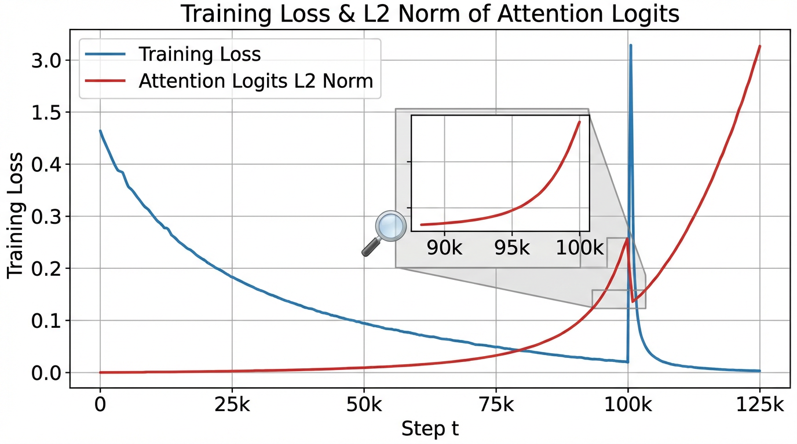

import LossSpikeSimulator from '../../components/chapter-6/LossSpikeSimulator.tsx';

# 6.3 Large-scale Training Stability

Training a 1B parameter model is like driving a sports car on a closed track; you might spin out, but recovery is easy. Training a 100B+ parameter model across tens of thousands of GPUs is like flying a supersonic jet. A microscopic anomaly—a corrupted batch of data, a slight numerical overflow in a single attention head, or a sudden gradient variance—can trigger a catastrophic failure known as a **Loss Spike**.

Historically, large-scale training was heavily *reactive*. During the training of models like OPT-175B or early LLaMA iterations, engineers had to monitor dashboards 24/7. When a loss spike occurred, the standard operating procedure was to pause training, roll back to a checkpoint from a few hundred steps prior, skip the offending data batch, and restart. This "rollback tax" wasted millions of dollars in idle GPU compute.

By 2024-2025, the paradigm shifted toward **proactive (or passive) stability**. State-of-the-art models like DeepSeek-V3 [[1]](#ref-1) achieved a remarkable engineering milestone: zero irrecoverable loss spikes and zero rollbacks throughout the training of 14.8 trillion tokens, even while utilizing aggressive FP8 mixed precision.

This section dives into the anatomy of training instability and the architectural interventions required to keep multi-billion parameter models well-conditioned from initialization to convergence.

<div style="background-color: #f8f9fa; border-left: 5px solid #0d6efd; padding: 15px; margin: 20px 0; border-radius: 4px;">
  <h4 style="margin-top: 0; color: #0d6efd;">🔍 Case Study: The Battle Against Training Instability (OPT-175B)</h4>
  
  <p>Meta AI's training of <strong>OPT-175B</strong> was a monumental engineering feat, documented in an unprecedented open logbook. The team encountered over <strong>70 major loss spikes</strong>, where the model's loss would suddenly diverge.</p>
  
  <p><strong>Technical Deep Dive:</strong></p>
  <ul>
    <li><strong>The Trigger</strong>: Many spikes were traced back to specific "toxic" data clusters—highly repetitive sequences (e.g., "the the the...") or malformed HTML. These patterns caused sudden gradient explosions in the early layers of the Transformer.</li>
    <li><strong>Hardware Factors</strong>: GPU ECC errors and network timeouts during All-Reduce operations often led to corrupted gradients, which slowly poisoned the model state before manifesting as a spike.</li>
  </ul>
  
  <p><strong>Engineering Mitigations:</strong></p>
  <ol>
    <li><strong>Checkpoint Rollback &amp; Data Skipping</strong>: The most common fix. The team would revert to a checkpoint ~100 steps prior and skip the data batch that caused the spike.</li>
    <li><strong>Learning Rate Manipulation</strong>: Reducing the learning rate by 10x temporarily to "smooth over" a rough loss landscape.</li>
    <li><strong>Optimizer Reset</strong>: Crucially, restarting from a checkpoint often required resetting the Adam optimizer's moments. The moving averages of gradients would otherwise carry the "momentum" of the bad directions into the resumed training.</li>
  </ol>
  
  <p><strong>Key Lesson</strong>: Large-scale training is as much about data and hardware management as it is about model architecture.</p>
  
  <p><em>Reference: Zhang, S., et al. (2022). "OPT: Open Pre-trained Transformer Language Models."</em></p>
</div>

---

## 1. The Anatomy of a Loss Spike

To prevent instability, we must first understand its mechanical origin. A loss spike is rarely instantaneous; it is the terminal symptom of a silent, compounding numerical disease.

Recent analyses [[2]](#ref-2) have shown that training divergence is almost always preceded by the uncontrolled growth of $L_2$ norms in the outputs of specific linear layers—namely the Query/Key projections, the output Projection layer, and the second Fully Connected layer (FC2) in the Feed-Forward Network.



### The Logit Growth Problem
As training progresses, the model becomes more confident. To minimize the cross-entropy loss, the network pushes the logits of the correct tokens to extreme positive values. 

1. **Attention Saturation**: If the $L_2$ norm of the Query and Key vectors grows unchecked, the dot product $Q \cdot K^T$ produces massive scalars. 
2. **Softmax Collapse**: When these massive scalars are passed through the softmax function, the distribution collapses into a near one-hot vector (e.g., `[0.0001, 0.9998, 0.0001]`). 
3. **Gradient Starvation & Explosion**: The gradients for the non-target tokens vanish, while the gradient for the target token becomes hyper-sensitive. A single noisy or out-of-distribution token in the next batch will generate an astronomical gradient, which propagates backward, corrupting the momentum buffers in the AdamW optimizer and permanently destroying the weight distributions.

---

## 2. Architectural Stabilizers

Rather than relying on hyperparameter tuning (like lowering the learning rate, which hurts final performance), modern foundation models modify the architecture to strictly bound internal activations.

### 2.1 QK Layer Normalization
Standard Transformers apply LayerNorm (or RMSNorm) to the input of the attention block. However, the $Q$ and $K$ projections can still drift. By applying an additional normalization directly to the Query and Key vectors *before* the dot product, we force the attention logits to be strictly bounded by the hidden dimension size.

$$
\text{Attention}(Q, K, V) = \text{softmax}\left( \frac{\text{RMSNorm}(Q) \cdot \text{RMSNorm}(K)^T}{\sqrt{d_k}} \right) V
$$

This prevents the attention entropy from collapsing, allowing engineers to safely increase the learning rate by up to 1.5x without divergence [[2]](#ref-2).

### 2.2 Softmax Capping (Logit Capping)
Even with QK Norm, the final logits fed into the cross-entropy loss can grow too large. Models like Gemma and Grok utilize **Softmax Capping**, which bounds the pre-softmax logits to a fixed range $[-c, c]$ using a scaled hyperbolic tangent function.

$$
\text{logits}_{\text{capped}} = c \cdot \tanh\left(\frac{\text{logits}}{c}\right)
$$

Typically, $c$ is set to a value like 30.0. In the linear region of $\tanh$ (near zero), the gradients flow normally. As logits approach $c$, the gradient naturally decays, acting as an automatic, differentiable gradient clipper that prevents the model from becoming overconfident.

### 2.3 The $z$-loss (Auxiliary Logit Penalty)
Introduced during the training of PaLM [[3]](#ref-3), the $z$-loss is an auxiliary objective added to the primary cross-entropy loss. It penalizes the logarithm of the partition function (the denominator of the softmax), encouraging the maximum logit to remain close to zero.

$$
\mathcal{L}_z = \alpha \cdot \log^2 \left( \sum_{i} \exp(x_i) \right)
$$

Where $\alpha$ is typically a very small constant (e.g., $10^{-4}$). This prevents the exponential moving averages in the optimizer from being corrupted by massive logit gradients.

---

## 3. Engineering Stable PyTorch Components

Let's implement these stability mechanisms in a realistic PyTorch setting. The following code demonstrates a robust Attention layer and a custom Cross-Entropy loss function designed for 100B+ scale training.

```python
import torch
import torch.nn as nn
import torch.nn.functional as F

class RMSNorm(nn.Module):
    def __init__(self, dim: int, eps: float = 1e-6):
        super().__init__()
        self.eps = eps
        self.weight = nn.Parameter(torch.ones(dim))

    def forward(self, x):
        variance = x.pow(2).mean(-1, keepdim=True)
        x_norm = x * torch.rsqrt(variance + self.eps)
        return self.weight * x_norm

class StableAttention(nn.Module):
    def __init__(self, d_model: int, num_heads: int, logit_cap: float = 30.0):
        super().__init__()
        self.num_heads = num_heads
        self.head_dim = d_model // num_heads
        self.logit_cap = logit_cap
        
        self.q_proj = nn.Linear(d_model, d_model, bias=False)
        self.k_proj = nn.Linear(d_model, d_model, bias=False)
        self.v_proj = nn.Linear(d_model, d_model, bias=False)
        self.o_proj = nn.Linear(d_model, d_model, bias=False)
        
        # Stability: QK Normalization
        self.q_norm = RMSNorm(self.head_dim)
        self.k_norm = RMSNorm(self.head_dim)

    def forward(self, x):
        B, L, D = x.size()
        
        q = self.q_proj(x).view(B, L, self.num_heads, self.head_dim).transpose(1, 2)
        k = self.k_proj(x).view(B, L, self.num_heads, self.head_dim).transpose(1, 2)
        v = self.v_proj(x).view(B, L, self.num_heads, self.head_dim).transpose(1, 2)
        
        # Apply RMSNorm to Q and K independently per head
        q = self.q_norm(q)
        k = self.k_norm(k)
        
        # Scaled Dot-Product
        scores = torch.matmul(q, k.transpose(-2, -1)) / (self.head_dim ** 0.5)
        
        # Stability: Softmax Capping (Logit Capping)
        if self.logit_cap > 0:
            scores = self.logit_cap * torch.tanh(scores / self.logit_cap)
            
        attn_weights = F.softmax(scores, dim=-1)
        out = torch.matmul(attn_weights, v)
        
        out = out.transpose(1, 2).contiguous().view(B, L, D)
        return self.o_proj(out)

def cross_entropy_with_zloss(logits: torch.Tensor, targets: torch.Tensor, z_loss_weight: float = 1e-4):
    """
    Computes Cross Entropy Loss with an auxiliary z-loss to prevent logit drift.
    """
    # Standard Cross Entropy
    ce_loss = F.cross_entropy(logits.view(-1, logits.size(-1)), targets.view(-1))
    
    # Compute z-loss: log^2(sum(exp(logits)))
    # We use logsumexp for numerical stability
    log_z = torch.logsumexp(logits, dim=-1)
    z_loss = (log_z ** 2).mean()
    
    return ce_loss + (z_loss_weight * z_loss)
```

---

## 4. Advanced Stability: MoE and Decoupling

### Auxiliary-Loss-Free Load Balancing
In Mixture-of-Experts (MoE) models, routing tokens to experts unevenly causes hardware bottlenecks (expert collapse). Historically, an *auxiliary loss* was added to the training objective to force even distribution. However, this auxiliary loss physically alters the model's gradients, often conflicting with the language modeling objective and causing instability.

DeepSeek-V3 [[1]](#ref-1) introduced **Auxiliary-Loss-Free Load Balancing**. Instead of modifying the loss function, they dynamically adjust a bias term added to the routing logits. 
Crucially, this bias is mathematically **detached from the gradient tape** (`bias.detach()`). The routing mechanism achieves perfect balance during the forward pass, but the backward pass only updates the router weights based on pure token-expert affinity, entirely eliminating a major source of MoE training divergence.

### Scale-Distribution Decoupling (SDD)
In very deep Post-Norm architectures, the variance of the residual stream grows linearly with depth, leading to gradient explosion. Wang et al. (2025) proposed **Scale-Distribution Decoupling (SDD)** [[4]](#ref-4). 
SDD explicitly separates the scale (magnitude) and distribution (direction) of weight matrices in fully-connected layers. By applying a normalization mechanism directly to the pre-activations and relying on a learnable scaling vector, SDD ensures that gradients remain well-conditioned, allowing Post-Norm Transformers to scale stably without needing complex initialization tricks.

---

## 5. Interactive: The Loss Spike Simulator

To build intuition for how these architectural choices prevent divergence, interact with the simulator below. It models the internal $L_2$ norm growth of a hypothetical training run. Notice how enabling QK-Norm and Softmax Capping acts as a "shock absorber" against noisy data batches.

<LossSpikeSimulator client:load />

---

## 6. Mixed Precision (FP8) Stability

As models scale to the trillion-parameter regime, training in BF16 becomes bottlenecked by memory bandwidth. The industry is aggressively moving to **FP8 (8-bit floating point)** mixed precision. 

FP8 severely restricts dynamic range (the maximum representable value is 448 in E4M3 format). If the $L_2$ norms of activations grow, they will immediately overflow FP8 bounds, resulting in `NaN` gradients. 

To train stably in FP8, modern frameworks employ **Fine-grained Quantization**. Instead of quantizing an entire tensor with a single scale factor, tensors are blocked (e.g., $1 \times 128$ tiles), and each block receives its own FP32 scale factor. Furthermore, critical "bottleneck" tensors—such as the latent vectors in Multi-head Latent Attention (MLA)—are kept in higher precision (BF16) because their variance is too high for FP8 to capture without catastrophic information loss.

---

## Summary and Next Steps

Stability is no longer a dark art of hyperparameter tuning; it is a rigorous architectural discipline. By strictly controlling the magnitude of internal representations via QK Norm, Softmax Capping, and decoupled routing, engineers can safely push learning rates higher and utilize aggressive low-precision formats like FP8.

With the model architecture now stable, the next challenge is mapping this massive computational graph onto physical hardware. In **Chapter 7: Training Optimization & Systems**, we will explore how 3D Parallelism, ZeRO optimization, and Flash Attention physically distribute these stable matrices across tens of thousands of GPUs.

---

## Quizzes

<details>
<summary>Quiz 1: Why does QK LayerNorm prevent loss spikes more effectively than simply lowering the global learning rate?</summary>
*Lowering the learning rate slows down the entire learning process uniformly, degrading final model performance and convergence speed. QK LayerNorm acts locally and dynamically; it specifically bounds the entropy of the attention mechanism regardless of the global step size, preventing the specific condition (attention collapse) that triggers the spike without penalizing the learning of other layers.*
</details>

<details>
<summary>Quiz 2: In Softmax Capping, how does the $\tanh$ function affect the backward pass (gradient flow) when logits become extremely large?</summary>
*The derivative of $\tanh(x)$ is $1 - \tanh^2(x)$. As the input logits become very large (approaching the cap $c$), $\tanh(x/c)$ approaches 1 or -1, and its derivative approaches 0. Therefore, when logits are extreme, the gradient is naturally scaled down to near zero, acting as a differentiable, automatic gradient clipper that prevents overconfident predictions from causing massive weight updates.*
</details>

<details>
<summary>Quiz 3: In DeepSeek-V3's auxiliary-loss-free balancing, why MUST the dynamic bias be detached (`.detach()`) from the gradient tape?</summary>
*If the dynamic bias were not detached, the backward pass would calculate gradients with respect to the bias to minimize the main language modeling loss. The optimizer would naturally try to undo the bias (since the bias is artificially forcing tokens to sub-optimal experts for the sake of load balancing). By detaching it, the bias acts purely as a forward-pass routing intervention, while the router network learns purely from the objective function without conflicting gradient signals.*
</details>

<details>
<summary>Quiz 4: What is the primary cause of instability in Deep Post-Norm Transformers that Scale-Distribution Decoupling (SDD) attempts to solve?</summary>
*In Post-Norm architectures, the output of the residual branch is added directly to the main residual stream without subsequent normalization. As the network gets deeper, the variance (scale) of the residual stream grows linearly. This unbounded growth leads to gradient explosion during the backward pass. SDD solves this by explicitly decoupling the scale and distribution of the weights, ensuring the variance is controlled mathematically rather than relying on vanishing initialization schemes.*
</details>

---

## References

1. <a id="ref-1"></a>DeepSeek-AI. (2024). *DeepSeek-V3 Technical Report*. [arXiv:2412.19437](https://arxiv.org/abs/2412.19437).
2. <a id="ref-2"></a>Anonymous. (2024). *Methods of Improving LLM Training Stability*. [arXiv:2410.16682](https://arxiv.org/abs/2410.16682).
3. <a id="ref-3"></a>Chowdhery, A., et al. (2022). *PaLM: Scaling Language Modeling with Pathways*. [arXiv:2204.02311](https://arxiv.org/abs/2204.02311).
4. <a id="ref-4"></a>Wang, Y., Zhuo, Z., Zeng, Y., Zhou, X., Yang, J., & Li, X. (2025). *Scale-Distribution Decoupling: Enabling Stable and Effective Training of Large Language Models.* [arXiv:2502.15499](https://arxiv.org/abs/2502.15499).

