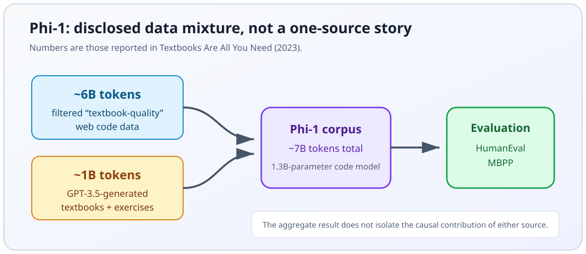

import ModelCollapseVisualizer from '../../components/chapter-6/ModelCollapseVisualizer.tsx';

# 6.5 Synthetic Data for Pre-training

While the previous section outlined the physical infrastructure required to compute a trillion-parameter model, and hinted at the distributed systems we will build in Chapter 7, there is one final, existential component of pre-training we must address: the data itself.

**Evidence snapshot: September 15, 2026.** The internet is vast, but the stock of licensable, usable, human-generated text is finite. Epoch AI estimated about 300 trillion quality- and repetition-adjusted public-text tokens, with a wide 90% interval of 100T–1,000T, and projected that continued scaling could fully use that stock between 2026 and 2032 [[5]](#ref-5). This is a forecast with large uncertainty, not a countdown clock. Compute-optimal ratios also depend on the objective, model family, repeated-token policy, and downstream deployment economics.

If high-quality data becomes a binding constraint, one response is to use existing models to generate or transform training examples. Synthetic data is one ingredient—not a consensus replacement for human data—and its value depends on provenance, coverage, verification, and mixture design.

However, this recursion is fraught with mathematical peril. 

---

## 1. The Curse of Recursion: Model Collapse

In 2024, Shumailov et al. published a *Nature* study of **model collapse** under recursive training [[1]](#ref-1). Their experiments show how replacing real data with samples from earlier models can lose distribution tails and compound approximation error. The result is conditional on the data-retention and sampling process; it does not imply that every mixture containing synthetic data must degrade or that degradation is always irreversible.

### The Mathematics of Collapse
When a Language Model $P_{\theta}(x)$ is trained on a dataset, it does not memorize the data perfectly; it approximates the underlying probability distribution. By definition, statistical models favor the *mode* (the most common patterns) and assign lower probability mass to the *tails* (rare, nuanced, or outlier data).

If generated samples underrepresent rare events, the next learner sees a biased empirical distribution. A useful abstraction is

$$
q_{t+1}(x) = (1-\lambda)p_{\text{real}}(x) + \lambda\,S\!\left(p_{\theta_t}(x); T, k, F\right),
$$

where $\lambda$ is the synthetic mixture weight and $S$ is the generation-and-filtering operator determined by temperature $T$, sample budget $k$, and filter $F$. Tail loss is not a universal monotonic-variance theorem: it depends on $\lambda$, whether original data is retained, sampling support, model error, and filtering bias. The important engineering question is therefore not “synthetic or real?” but **which operator produced each example, and which slices did it suppress?**

### Interactive: Visualizing Model Collapse

Use the slider below to inspect a stylized failure mode in which recursive sampling drops tail mass. The visualization is an intuition aid, not a claim that every real pipeline follows this exact trajectory.

<ModelCollapseVisualizer client:load />

To prevent Model Collapse, engineers cannot simply prompt a model to "write 10 billion tokens of text" and append it to the pre-training corpus. Synthetic data must be rigorously engineered, filtered, and anchored to ground truth.

---

## 2. Quality over Quantity: The "Textbooks" Paradigm

The first major breakthrough in synthetic pre-training data came from Microsoft Research's *Textbooks Are All You Need* (2023) [[2]](#ref-2). 

Microsoft's **Phi-1** study trained a 1.3B-parameter code model on about 6B tokens of filtered “textbook-quality” web data plus about 1B tokens of GPT-3.5-generated textbooks and exercises [[2]](#ref-2). Synthetic material complemented filtered real data; it did not replace the entire corpus.

The reported HumanEval and MBPP results made a strong case that data selection and pedagogical structure can compensate for some scale in a narrow code setting. They do not establish an exponential exchange rate between synthetic and web tokens, nor do they show that generated examples are “perfect.” The practical lesson is narrower: measure marginal value by domain slice, ablate the mixture, and retain a clean evaluation set that neither generators nor filters have seen.


*Source: Author-generated SVG based on the data quantities reported in [[2]](#ref-2). The diagram does not attribute the final score to either source in isolation.*

---

## 3. Where Synthetic Data Fits in Frontier Pipelines

By 2025 and 2026, synthetic data had become common in filtering, post-training, reasoning distillation, and verifier-guided data generation. Public reports disclose only part of these pipelines, so “backbone of frontier training” would overstate what can be independently known.

### Meta's Llama 3 Pipeline
The Llama 3 report describes model-assisted quality and domain classification for pre-training data, and extensive synthetic-data generation in post-training [[3]](#ref-3). The 405B model helped improve smaller variants, but the report also describes human annotations and multiple reward-model and filtering stages. “Entirely replaced human-written answers” is therefore not supported. Keep **pre-training selection**, **post-training response generation**, and **distillation** as separate provenance categories.

### DeepSeek's Specialist Distillation
The DeepSeek-V3 report describes specialist-model data generation for domains such as coding and mathematics, while the R1 report describes rejection sampling and distillation for reasoning models [[4]](#ref-4) [[6]](#ref-6). These are related but distinct stages and should not be collapsed into one undocumented recipe.

Math and code often provide stronger **outcome verifiers**, but “runs successfully” is not the same as “meets the specification,” and many proofs cannot be reduced to a cheap binary check. Verifiers can contain bugs, reward shortcuts, leak tests, or favor easily checked slices. They improve precision; they do not create infinite independent data or eliminate model-collapse, contamination, and coverage risks.

---

## 4. Engineering the Rejection Sampling Pipeline

One common method for generating synthetic data is **best-of-$k$ rejection sampling**. The generator produces multiple candidate responses for a prompt. A reward model or task verifier scores them, and a candidate is retained only when it passes explicit validity, quality, and novelty gates. Keeping only the argmax without a calibrated threshold can preserve a bad answer whenever all $k$ candidates are bad.

> **Deliberately simplified teaching example.** The kernel below shows chat-template use, token-level response slicing, and best-of-$k$ filtering. It omits distributed generation, per-domain verifier ensembles, calibrated thresholds, near-deduplication, contamination quarantine, PII/license filters, immutable manifests, and crash-resumable sharding. It assumes the generator and reward model fit on available devices and that the reward model's scalar score is already calibrated for this domain.

```python
import torch
from transformers import AutoModelForCausalLM, AutoTokenizer, AutoModelForSequenceClassification
from typing import List, Dict, Union

@torch.no_grad()
def rejection_sampling_pipeline(
    prompts: List[str],
    generator: AutoModelForCausalLM,
    gen_tokenizer: AutoTokenizer,
    reward_model: AutoModelForSequenceClassification,
    reward_tokenizer: AutoTokenizer,
    num_candidates: int = 8,
    threshold: float = 0.8
) -> List[Dict[str, Union[str, float]]]:
    """
    Generates synthetic data using Rejection Sampling.
    Returns only the prompt-response pairs that pass the reward threshold.
    """
    device = next(generator.parameters()).device
    reward_device = next(reward_model.parameters()).device
    synthetic_dataset = []

    for prompt in prompts:
        # 1. Render the same tokenizer-native template used by serving.
        prompt_ids = gen_tokenizer.apply_chat_template(
            [{"role": "user", "content": prompt}],
            tokenize=True,
            add_generation_prompt=True,
            return_tensors="pt",
        ).to(device)
        input_ids = prompt_ids.repeat(num_candidates, 1)
        attention_mask = torch.ones_like(input_ids)
        
        # High temperature to encourage diversity in the synthetic candidates
        outputs = generator.generate(
            input_ids=input_ids,
            attention_mask=attention_mask,
            max_new_tokens=256,
            temperature=0.9,
            do_sample=True,
            pad_token_id=gen_tokenizer.eos_token_id
        )
        
        # Slice by token position, never by prompt character length.
        response_ids = outputs[:, prompt_ids.shape[1]:]
        responses = gen_tokenizer.batch_decode(response_ids, skip_special_tokens=True)

        # 2. Score candidates using the Reward Model
        eval_texts = [
            reward_tokenizer.apply_chat_template(
                [{"role": "user", "content": prompt}, {"role": "assistant", "content": response}],
                tokenize=False,
                add_generation_prompt=False,
            )
            for response in responses
        ]
        reward_inputs = reward_tokenizer(
            eval_texts, return_tensors="pt", padding=True, truncation=True
        ).to(reward_device)
        
        # Assuming a scalar reward output from a sequence classification head
        rewards = reward_model(**reward_inputs).logits.squeeze(-1)
        
        # 3. Select the best candidate
        best_idx = torch.argmax(rewards).item()
        best_reward = rewards[best_idx].item()

        # 4. Filter based on threshold to ensure quality
        if best_reward >= threshold:
            synthetic_dataset.append({
                "prompt": prompt,
                "response": responses[best_idx],
                "reward_score": best_reward
            })

    return synthetic_dataset

# Example Usage (Assuming models are loaded):
# dataset = rejection_sampling_pipeline(
#     prompts=["Explain the difference between Pre-LN and Post-LN in Transformers."],
#     generator=llama_3_70b,
#     gen_tokenizer=llama_tokenizer,
#     reward_model=nemotron_reward_model,
#     reward_tokenizer=reward_tokenizer
# )
```

The rough cost is $kF_{\text{gen}} + kF_{\text{verify}}$, but wall time depends on batching, early rejection, sequence lengths, cache reuse, and verifier placement. It is not generally “$k+1$ times,” and public reports rarely disclose what fraction of total frontier-training compute went to data preparation.

---

## 5. Production Run Contract

A synthetic-data job should start from an immutable manifest, not a folder of prompts. Record source IDs and licenses or consent, deletion lineage, PII/secrets policy, prompt-template and tokenizer hashes, generator and verifier snapshots, decoding parameters, seeds, filter versions, and the target mixture weight. Group semantic siblings and generator variants before train/dev/test assignment, and quarantine public benchmarks, private release prompts, rubric text, and near neighbors before generation.

The objective is not “maximize accepted rows.” Optimize useful, non-duplicated, correctly attributed tokens per unit of compute subject to slice-quality constraints. Decisive hyperparameters include candidates per prompt $k$, temperature/top-$p$, response-length limits, per-verifier thresholds, real/synthetic mixture weight $\lambda$, domain quotas, deduplication thresholds, and maximum retries. Estimate memory separately for generator weights and KV cache, verifier weights, batched activations, temporary token buffers, embedding/deduplication indexes, and checkpointed shards.

Observe yield and cost by slice: generated, parse-valid, verifier-passing, deduplicated, policy-clean, and finally admitted examples; verifier disagreement; score drift; response length; novelty; contamination hits; PII/license rejections; tokens/s; GPU utilization; queue wait; and reconstructable batch IDs. Abort or pause when a critical quarantine match appears, nonfinite scores occur, provenance fields are missing, verifier calibration drifts outside its bound, a protected slice falls below its precision floor, duplication spikes, or cost per admitted token breaches budget.

Each checkpoint should contain completed shard IDs, input cursor, RNG state, accepted and rejected sample IDs with reason codes, generator/verifier/config/tokenizer hashes, filter and deduplication index versions, aggregate and per-slice counters, checksums, and a completion marker. Offline release evaluation compares a model trained with the candidate mixture against a real-data baseline on domain quality, base-capability retention, safety, memorization, format/tool behavior, latency, and critical slices with paired uncertainty. Promote only if those gates pass and a rollback-ready previous corpus/model bundle remains available.

---

## Summary

In Chapter 6, we have traversed the engineering stack required to pre-train a Foundation Model. We moved from byte-level tokenization (6.2), through training stability (6.3), to the physical cluster (6.4). Finally, this section treated synthetic data as a provenance- and evaluation-sensitive engineering input. Rejection sampling and outcome verifiers can improve precision, but they do not remove coverage, contamination, recursive-training, or evaluator-gaming risks.

With the data curated, the network stabilized, and the physical infrastructure humming, we are ready to execute `loss.backward()`. But how do we physically fit a 1-trillion parameter model onto GPUs that only have 80GB of memory? 

In **Chapter 7: Training Optimization & Systems**, we will dive into the software engineering of distributed training, exploring 3D Parallelism, ZeRO optimization, and Flash Attention.

---

## Quizzes

<details>
<summary>Quiz 1: In a Rejection Sampling pipeline, you generate $k$ candidate sequences in parallel for a prompt. The independent probability of a candidate sequence passing the deterministic verifier is $\alpha$. Derive the expected compute cost (in FLOPs) to obtain at least one accepted sequence if generating one candidate costs $F_{gen}$ and reward scoring costs $F_{rew}$. Furthermore, calculate the minimum $k$ required to ensure a $\ge 95\%$ success probability in a single parallel pass when $\alpha = 0.15$.</summary>
*The probability of obtaining at least one accepted candidate in a parallel pass of size $k$ is $p = 1 - (1 - \alpha)^k$. The number of passes $X$ until success follows a geometric distribution with expected value $E[X] = 1/p$. Each pass costs $k(F_{gen} + F_{rew})$ FLOPs. Thus, the expected total compute cost is $E[C] = \frac{k(F_{gen} + F_{rew})}{1 - (1 - \alpha)^k}$. To find the minimum $k$ for $95\%$ single-pass confidence: $1 - (1 - 0.15)^k \ge 0.95 \Rightarrow 0.85^k \le 0.05 \Rightarrow k \ge \frac{\ln(0.05)}{\ln(0.85)} \approx 18.43$. The minimum integer $k$ is 19.*
</details>

<details>
<summary>Quiz 2: How did the methodology of Microsoft's "Textbooks Are All You Need" (Phi-1) challenge the prevailing Scaling Laws of 2023?</summary>
*Phi-1 showed that a 1.3B code model trained on roughly 6B filtered web tokens plus 1B synthetic textbook/exercise tokens could be competitive on HumanEval and MBPP. It is evidence that data selection and structure matter in that setting, not proof of a universal or exponential exchange rate between synthetic and real tokens.*
</details>

<details>
<summary>Quiz 3: Why is it significantly easier and safer to use synthetic data for pre-training in domains like Mathematics and Coding compared to Creative Writing or History?</summary>
*Math and code can expose stronger outcome checks such as unit tests, compilers, numeric answers, or proof assistants. Those checks raise precision only for the properties they cover: tests can be incomplete, execution can succeed while the specification is violated, and verifier bugs can be exploited. Subjective domains rely more heavily on calibrated human or model judgments, so uncertainty and disagreement must be recorded rather than hidden.*
</details>

<details>
<summary>Quiz 4: In the context of Meta's Llama 3 and DeepSeek-V3, what is "Offline Distillation" (or Specialist Distillation)?</summary>
*It is the process where a massive, highly capable frontier model (e.g., Llama 3 405B) or a highly fine-tuned specialist model is used to generate millions of high-quality responses to prompts. These synthetic responses are then used as the ground-truth training data for smaller, more efficient models (like Llama 3 8B), effectively transferring or "distilling" the reasoning capabilities of the large model into the smaller one without requiring human annotators.*
</details>

---

## References

1. <a id="ref-1"></a>Shumailov, I., et al. (2024). "AI models collapse when trained on recursively generated data." Nature. [Link](https://www.nature.com/articles/s41586-024-07566-y).
2. <a id="ref-2"></a>Gunasekar, S., et al. (2023). *Textbooks Are All You Need.* [arXiv:2306.11644](https://arxiv.org/abs/2306.11644).
3. <a id="ref-3"></a>Meta. (2024). *The Llama 3 Herd of Models.* [arXiv:2407.21783](https://arxiv.org/abs/2407.21783).
4. <a id="ref-4"></a>DeepSeek-AI. (2024). *DeepSeek-V3 Technical Report.* [arXiv:2412.19437](https://arxiv.org/abs/2412.19437).
5. <a id="ref-5"></a>Villalobos, P., et al. (2024). *Will we run out of data? Limits of LLM scaling based on human-generated data.* [Epoch AI](https://epoch.ai/publications/will-we-run-out-of-data-limits-of-llm-scaling-based-on-human-generated-data).
6. <a id="ref-6"></a>DeepSeek-AI. (2025). *DeepSeek-R1: Incentivizing Reasoning Capability in LLMs via Reinforcement Learning.* [arXiv:2501.12948](https://arxiv.org/abs/2501.12948).
