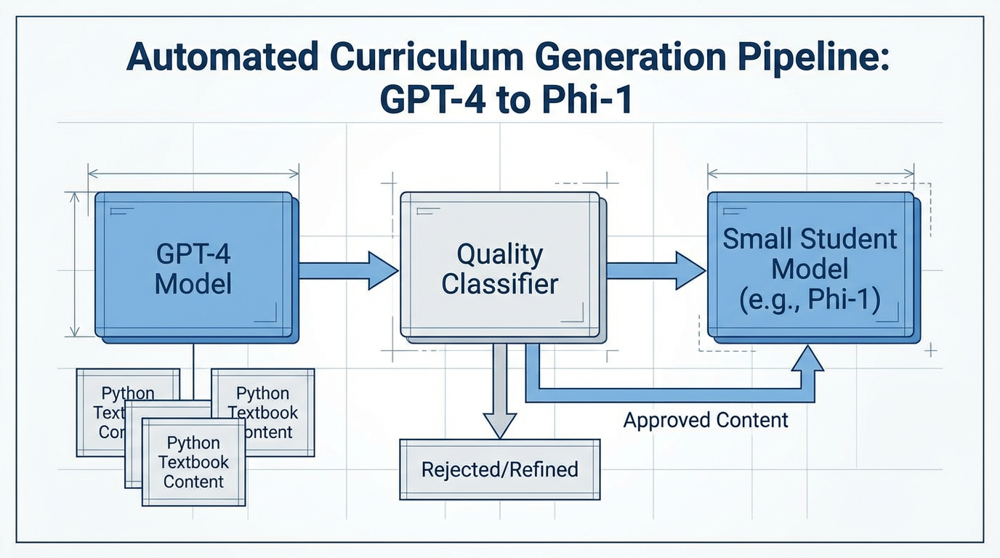

import ModelCollapseVisualizer from '../../components/chapter-6/ModelCollapseVisualizer.tsx';

# 6.5 Synthetic Data for Pre-training

While the previous section outlined the physical infrastructure required to compute a trillion-parameter model, and hinted at the distributed systems we will build in Chapter 7, there is one final, existential component of pre-training we must address: the data itself.

By 2024, researchers at Epoch AI and other institutions projected a looming "Data Wall." The internet, while vast, contains a finite amount of high-quality, human-generated text. Common Crawl, GitHub, and digitized books provide roughly 10 to 15 trillion unique, high-quality tokens. However, the scaling laws governing Foundation Models dictate that as parameter counts grow, the training token count must grow proportionally. 

If we exhaust the supply of human data, how do we train the next generation of models? One influential response has been a recursive one: **using existing Foundation Models to generate synthetic data to train the next generation of Foundation Models.**

However, this recursion is fraught with mathematical peril. 

---

## 1. The Curse of Recursion: Model Collapse

In 2024, Shumailov et al. published a seminal paper in *Nature* detailing a phenomenon known as **Model Collapse** [[1]](#ref-1). It is a progressive, irreversible degradation that occurs when AI models are trained recursively on synthetic data generated by previous generations of models, without sufficient injection of fresh human data.

### The Mathematics of Collapse
When a Language Model $P_{\theta}(x)$ is trained on a dataset, it does not memorize the data perfectly; it approximates the underlying probability distribution. By definition, statistical models favor the *mode* (the most common patterns) and assign lower probability mass to the *tails* (rare, nuanced, or outlier data).

If Generation 1 generates synthetic data, it will over-represent the mode and under-represent the tails. When Generation 2 is trained on this synthetic data, it learns an even narrower distribution. Mathematically, this forms a Markov chain where the variance $\sigma^2$ of the data distribution monotonically decreases.

$$ \lim_{N \to \infty} P_{\theta_N}(x) = \delta(x - \mu) $$

Over $N$ generations, the distribution collapses into a Dirac delta function $\delta$. The model loses all diversity, forgets complex concepts (like medieval architecture), and converges on an absurd fixed point (e.g., repeating the phrase "blue-tailed jackrabbits" endlessly) [[1]](#ref-1).

### Interactive: Visualizing Model Collapse

Use the slider below to observe how an initial data distribution (representing diverse human data) degrades over $N$ generations of synthetic training. Notice how the tails disappear and the model becomes overly confident in a narrow, shifted mean.

<ModelCollapseVisualizer client:load />

To prevent Model Collapse, engineers cannot simply prompt a model to "write 10 billion tokens of text" and append it to the pre-training corpus. Synthetic data must be rigorously engineered, filtered, and anchored to ground truth.

---

## 2. Quality over Quantity: The "Textbooks" Paradigm

The first major breakthrough in synthetic pre-training data came from Microsoft Research's *Textbooks Are All You Need* (2023) [[2]](#ref-2). 

Prior to this, the standard practice was to scrape massive, noisy datasets. Microsoft took the opposite approach with the **Phi-1** model (1.3B parameters). Instead of relying on raw web scrapes, they used GPT-3.5 to generate 1 billion tokens of highly structured, pedagogically sound "textbooks" and exercises. 

By injecting randomness into the generation prompts (constraining vocabulary, topics, and target audiences), they ensured diversity. Despite being trained on less than 1% of the data volume of contemporary models, Phi-1 achieved state-of-the-art results on coding benchmarks. This proved a critical engineering principle: **A small amount of high-entropy, perfectly structured synthetic data is worth exponentially more than a massive amount of noisy web data.**


*Source: AI-generated illustration*

---

## 3. Scaling Synthetic Data in SOTA Models

By 2025 and 2026, synthetic data transitioned from an experimental technique to the backbone of frontier model training.

### Meta's Llama 3 & 4 Pipeline
Meta utilized synthetic data in two distinct ways for the Llama series [[3]](#ref-3):
1.  **Data Filtering (Pre-training):** Llama 2 was used as a massive classifier to label and filter the raw web corpus for Llama 3. The model assessed the quality and domain (science, law, politics) of web pages, ensuring a balanced, high-quality data mix.
2.  **Offline Distillation (Post-training):** The massive Llama 3 405B model was used to generate millions of high-quality responses. These synthetic responses entirely replaced human-written answers in the post-training phase for the smaller 8B and 70B models. 

### DeepSeek's Specialist Distillation
DeepSeek-V3 and R1 heavily utilized synthetic data to bootstrap reasoning capabilities [[4]](#ref-4). DeepSeek engineered a process called **Specialist Distillation**. 
Instead of using a single generalist model to generate data, they fine-tuned the V3 base model into highly specific experts (e.g., an Agentic Coding expert, a Mathematical Logic expert). These specialists generated millions of Chain-of-Thought (CoT) trajectories. 

Because math and code are **auto-verifiable** (a Python script either runs or throws an error; a math equation is either true or false), DeepSeek could generate infinite synthetic data, run it through an execution environment to verify correctness, and keep only the successful trajectories. This completely bypasses the subjective degradation of Model Collapse.

---

## 4. Engineering the Rejection Sampling Pipeline

The standard method for generating high-quality synthetic data at scale is **Rejection Sampling**. The generator model produces multiple candidate responses for a given prompt. A Reward Model (or a deterministic verifier, like a compiler) scores the candidates, and only the highest-scoring response is added to the training corpus.

Below is a PyTorch implementation of a Rejection Sampling pipeline using the Hugging Face `transformers` library.

```python
import torch
from transformers import AutoModelForCausalLM, AutoTokenizer, AutoModelForSequenceClassification
from typing import List, Dict

@torch.no_grad()
def rejection_sampling_pipeline(
    prompts: List[str],
    generator: AutoModelForCausalLM,
    gen_tokenizer: AutoTokenizer,
    reward_model: AutoModelForSequenceClassification,
    reward_tokenizer: AutoTokenizer,
    num_candidates: int = 8,
    threshold: float = 0.8
) -> List[Dict[str, str]]:
    """
    Generates synthetic data using Rejection Sampling.
    Returns only the prompt-response pairs that pass the reward threshold.
    """
    device = generator.device
    synthetic_dataset = []

    for prompt in prompts:
        # 1. Generate N candidates
        inputs = gen_tokenizer([prompt] * num_candidates, return_tensors="pt", padding=True).to(device)
        
        # High temperature to encourage diversity in the synthetic candidates
        outputs = generator.generate(
            **inputs,
            max_new_tokens=256,
            temperature=0.9,
            do_sample=True,
            pad_token_id=gen_tokenizer.eos_token_id
        )
        
        candidates = gen_tokenizer.batch_decode(outputs, skip_special_tokens=True)
        # Extract just the generated response (remove the prompt)
        responses = [cand[len(prompt):].strip() for cand in candidates]

        # 2. Score candidates using the Reward Model
        # Format: "User: {prompt} \n Assistant: {response}"
        eval_texts = [f"User: {prompt} \n Assistant: {resp}" for resp in responses]
        reward_inputs = reward_tokenizer(eval_texts, return_tensors="pt", padding=True, truncation=True).to(device)
        
        # Assuming a scalar reward output from a sequence classification head
        rewards = reward_model(**reward_inputs).logits.squeeze(-1)
        
        # 3. Select the best candidate
        best_idx = torch.argmax(rewards).item()
        best_reward = rewards[best_idx].item()

        # 4. Filter based on threshold to ensure quality
        if best_reward >= threshold:
            synthetic_dataset.append({
                "prompt": prompt,
                "response": responses[best_idx],
                "reward_score": best_reward
            })

    return synthetic_dataset

# Example Usage (Assuming models are loaded):
# dataset = rejection_sampling_pipeline(
#     prompts=["Explain the difference between Pre-LN and Post-LN in Transformers."],
#     generator=llama_3_70b,
#     gen_tokenizer=llama_tokenizer,
#     reward_model=nemotron_reward_model,
#     reward_tokenizer=reward_tokenizer
# )
```

Notice the engineering trade-off here: generating 8 candidates and running a reward model requires approximately 9x the inference compute compared to standard generation. This is why frontier models spend an enormous percentage of their total compute budget on data preparation *before* the actual pre-training loop even begins.

---

## Summary

In Chapter 6, we have traversed the entire engineering stack required to pre-train a Foundation Model. We moved from the foundational text processing of byte-level tokenization (6.2), through the mathematical stabilization of gradients at scale (6.3), to the physical reality of 100,000-GPU clusters and MEMS optical switches (6.4). Finally, in this section, we addressed the "Data Wall" by engineered synthetic pipelines, avoiding the mathematical pitfalls of Model Collapse through rigorous rejection sampling and auto-verifiable environments.

With the data curated, the network stabilized, and the physical infrastructure humming, we are ready to execute `loss.backward()`. But how do we physically fit a 1-trillion parameter model onto GPUs that only have 80GB of memory? 

In **Chapter 7: Training Optimization & Systems**, we will dive into the software engineering of distributed training, exploring 3D Parallelism, ZeRO optimization, and Flash Attention.

---

## Quizzes

<details>
<summary>Quiz 1: In a Rejection Sampling pipeline, you generate $k$ candidate sequences in parallel for a prompt. The independent probability of a candidate sequence passing the deterministic verifier is $\alpha$. Derive the expected compute cost (in FLOPs) to obtain at least one accepted sequence if generating one candidate costs $F_{gen}$ and reward scoring costs $F_{rew}$. Furthermore, calculate the minimum $k$ required to ensure a $\ge 95\%$ success probability in a single parallel pass when $\alpha = 0.15$.</summary>
*The probability of obtaining at least one accepted candidate in a parallel pass of size $k$ is $p = 1 - (1 - \alpha)^k$. The number of passes $X$ until success follows a geometric distribution with expected value $E[X] = 1/p$. Each pass costs $k(F_{gen} + F_{rew})$ FLOPs. Thus, the expected total compute cost is $E[C] = \frac{k(F_{gen} + F_{rew})}{1 - (1 - \alpha)^k}$. To find the minimum $k$ for $95\%$ single-pass confidence: $1 - (1 - 0.15)^k \ge 0.95 \Rightarrow 0.85^k \le 0.05 \Rightarrow k \ge \frac{\ln(0.05)}{\ln(0.85)} \approx 18.43$. The minimum integer $k$ is 19.*
</details>

<details>
<summary>Quiz 2: How did the methodology of Microsoft's "Textbooks Are All You Need" (Phi-1) challenge the prevailing Scaling Laws of 2023?</summary>
*Prevailing scaling laws suggested that model performance scaled predictably with parameter count and raw data volume (trillions of tokens). Phi-1 proved that by drastically increasing data quality—using an LLM to generate perfectly structured, high-entropy "textbook" data—a model with only 1.3B parameters trained on just 7B tokens could match or beat models 10x its size trained on massive, noisy web scrapes.*
</details>

<details>
<summary>Quiz 3: Why is it significantly easier and safer to use synthetic data for pre-training in domains like Mathematics and Coding compared to Creative Writing or History?</summary>
*Math and Code are "auto-verifiable" environments. A generated Python script can be run through a compiler/interpreter to definitively prove if it works. A math proof can be checked by a rule-based solver. This provides a deterministic, ground-truth reward signal for Rejection Sampling, preventing the model from hallucinating or collapsing. Creative writing relies on subjective human preference or LLM-as-a-Judge, which is prone to recursive bias.*
</details>

<details>
<summary>Quiz 4: In the context of Meta's Llama 3 and DeepSeek-V3, what is "Offline Distillation" (or Specialist Distillation)?</summary>
*It is the process where a massive, highly capable frontier model (e.g., Llama 3 405B) or a highly fine-tuned specialist model is used to generate millions of high-quality responses to prompts. These synthetic responses are then used as the ground-truth training data for smaller, more efficient models (like Llama 3 8B), effectively transferring or "distilling" the reasoning capabilities of the large model into the smaller one without requiring human annotators.*
</details>

---

## References

1. <a id="ref-1"></a>Shumailov, I., et al. (2024). "AI models collapse when trained on recursively generated data." Nature. [Link](https://www.nature.com/articles/s41586-024-07566-y).
2. <a id="ref-2"></a>Gunasekar, S., et al. (2023). *Textbooks Are All You Need.* [arXiv:2306.11644](https://arxiv.org/abs/2306.11644).
3. <a id="ref-3"></a>Meta. (2024). *The Llama 3 Herd of Models.* [arXiv:2407.21783](https://arxiv.org/abs/2407.21783).
4. <a id="ref-4"></a>DeepSeek-AI. (2024). *DeepSeek-V3 Technical Report.* [arXiv:2412.19437](https://arxiv.org/abs/2412.19437).
