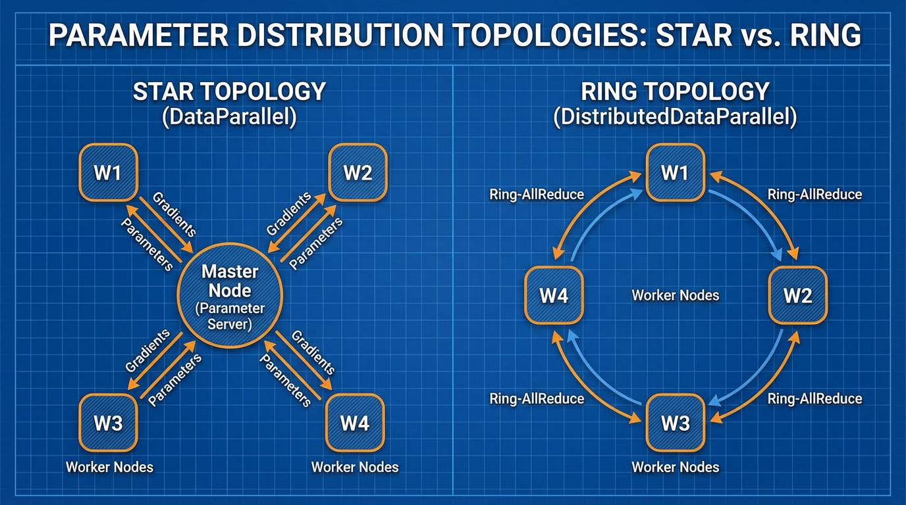

import DDPBucketingTimeline from '../../components/chapter-7/DDPBucketingTimeline.tsx';

# 7.1 Data Parallelism (DP/DDP)

In Chapter 6, we established the physical infrastructure—tens of thousands of GPUs connected via optical switches—and the data pipelines necessary to feed a trillion-parameter model. We successfully mitigated statistical degradation like Model Collapse and engineered our datasets. 

Now, we face the physics of computation. 

Training a modern Foundation Model on a single GPU is mathematically impossible within a human lifetime. Even if a model could fit into the VRAM of a single 80GB H100, processing 15 trillion tokens would take decades. To compress time, we must distribute the workload across thousands of accelerators. 

The most fundamental distribution strategy is **Data Parallelism**. In this paradigm, the model architecture remains intact and is fully replicated across every GPU in the cluster. Instead of slicing the model, we slice the dataset. 

---

## 1. The Naive Approach: `DataParallel` (DP)

Historically, engineers first attempted to parallelize training using a single-process, multi-thread paradigm, implemented in PyTorch as `torch.nn.DataParallel` (DP). 

The logic is straightforward:
1. **Replicate:** Copy the model to every GPU on a single node (e.g., an 8-GPU server).
2. **Scatter:** Take a large global batch of data (e.g., 1024 sequences) and slice it into micro-batches of 128 sequences. Send one micro-batch to each GPU.
3. **Forward Pass:** Each GPU independently computes the forward pass and calculates its local loss.
4. **Gather & Backward:** This is where the architecture fails. DP uses a Parameter Server topology (often implicitly mapping GPU 0 as the master). All GPUs send their gradients to GPU 0. GPU 0 averages the gradients, updates the master model weights, and then broadcasts the new weights back to GPUs 1-7.


*Source: AI-generated illustration*

### Why DP is Deprecated
`DataParallel` is inherently flawed for modern AI infrastructure:
* **The Python GIL:** Because it operates as a single Python process managing multiple threads, the Global Interpreter Lock (GIL) heavily restricts execution speed.
* **GPU 0 Bottleneck:** The master GPU acts as a severe communication bottleneck. While GPUs 1-7 sit idle, GPU 0 is overwhelmed with aggregating gradients and updating weights. This leads to extreme VRAM imbalance and low compute utilization (often sub-50% MFU).
* **Single-Node Limitation:** DP cannot span across multiple physical servers.

To train Foundation Models, we must eliminate the master node entirely.

---

## 2. The Standard: Distributed Data Parallel (DDP)

To resolve the bottlenecks of DP, the industry shifted to **Distributed Data Parallel (DDP)** (`torch.nn.parallel.DistributedDataParallel`). 

DDP operates on a multi-process architecture. If you have 1,024 GPUs, you spawn 1,024 independent Python processes. Each process has its own optimizer, its own memory space, and its own identical replica of the model. 

Because each process is independent, there is no GIL contention. The only time the processes need to interact is during the backward pass to ensure that every replica updates its weights identically. To do this without a central master node, DDP utilizes a decentralized communication primitive from High-Performance Computing (HPC): the **Ring All-Reduce**.

### The Mathematics of Ring All-Reduce
Introduced to Deep Learning by Baidu Research in 2017 [[1]](#ref-1), Ring All-Reduce allows $N$ nodes to average their gradients without overwhelming any single node. 

Let $M$ be the total size of the model's gradients (e.g., 4GB for a 1B parameter model). In a naive Parameter Server, the master node must receive $M \times (N-1)$ bytes of data, which scales linearly with the cluster size, inevitably crashing the network bandwidth.

In Ring All-Reduce, the GPUs are logically arranged in a circle. The algorithm operates in two phases:
1. **Scatter-Reduce:** The gradient tensor is chunked into $N$ blocks. Each GPU sends one block to its right neighbor and receives a different block from its left neighbor, continuously accumulating the values. After $N-1$ steps, every GPU holds the fully aggregated sum for exactly *one* of the $N$ blocks.
2. **All-Gather:** The fully aggregated blocks are circulated around the ring again. After another $N-1$ steps, every GPU has the complete, aggregated gradient tensor.

The total data transmitted by *any single node* is:
$$ \text{Volume} = 2 \times \frac{N - 1}{N} \times M $$

As $N \to \infty$, the data transmitted approaches $2M$. **The communication overhead is independent of the number of GPUs in the cluster.** This mathematical property is what allows companies to scale training to 100,000 GPUs without the network collapsing.

---

## 3. Engineering the Overlap: Gradient Bucketing

Even with Ring All-Reduce, waiting for the entire backward pass to finish before transmitting gigabytes of gradients across the network leaves the GPUs idle (stalled on I/O). 

Modern DDP implementations solve this through **Gradient Bucketing**. 
During the backward pass, gradients are computed from the final layers (e.g., Layer 100) back to the first layer (Layer 1). We do not need to wait for Layer 1's gradients to be computed to start transmitting Layer 100's gradients.

DDP groups gradients into "buckets" (defaulting to 25MB in PyTorch). As soon as a bucket is filled with computed gradients, DDP asynchronously fires a non-blocking `all_reduce` network call via the NCCL (NVIDIA Collective Communication Library) backend. 

### Interactive: Compute and Communication Overlap
Use the interactive timeline below to visualize how DDP overlaps the backward pass computation with network communication. Notice how bucketing prevents the GPU from stalling, hiding the network latency behind raw compute.

<DDPBucketingTimeline client:load />

*Note: In PyTorch, you can tune the bucket size using `bucket_cap_mb` in the DDP wrapper. Tuning this to match your InfiniBand or NVLink bandwidth is a critical micro-optimization for maximizing cluster throughput.*

---

## 4. PyTorch Implementation

Below is a production-grade implementation of DDP. Unlike toy examples, this script uses `torchrun` (the standard for multi-node execution), sets up the NCCL process group, configures the `DistributedSampler` (to ensure no two GPUs see the same data), and applies the DDP wrapper.

```python
import os
import torch
import torch.nn as nn
import torch.optim as optim
from torch.utils.data import DataLoader, Dataset
from torch.utils.data.distributed import DistributedSampler
from torch.nn.parallel import DistributedDataParallel as DDP
from torch.distributed import init_process_group, destroy_process_group

# 1. Initialize the Distributed Process Group
def setup():
    # torchrun automatically sets these environment variables
    init_process_group(backend="nccl")
    local_rank = int(os.environ["LOCAL_RANK"])
    torch.cuda.set_device(local_rank)
    return local_rank

def cleanup():
    destroy_process_group()

# Dummy Dataset for illustration
class DummyCorpus(Dataset):
    def __init__(self, size=10000, seq_len=512, vocab_size=32000):
        self.data = torch.randint(0, vocab_size, (size, seq_len))
        self.labels = torch.randint(0, vocab_size, (size, seq_len))
        
    def __len__(self):
        return len(self.data)
        
    def __getitem__(self, idx):
        return self.data[idx], self.labels[idx]

def train():
    local_rank = setup()
    
    # 2. Instantiate Model and move to local GPU
    # In reality, this would be a Transformer architecture
    model = nn.Sequential(
        nn.Embedding(32000, 1024),
        nn.Linear(1024, 4096),
        nn.GELU(),
        nn.Linear(4096, 32000)
    ).to(local_rank)
    
    # 3. Wrap model in DDP
    # gradient_as_bucket_view=True optimizes memory by avoiding extra copies
    model = DDP(model, device_ids=[local_rank], gradient_as_bucket_view=True)
    
    # 4. Setup Distributed Sampler
    dataset = DummyCorpus()
    # The sampler ensures each process gets a mutually exclusive slice of the dataset
    sampler = DistributedSampler(dataset, shuffle=True)
    dataloader = DataLoader(dataset, batch_size=16, sampler=sampler, num_workers=4)
    
    optimizer = optim.AdamW(model.parameters(), lr=1e-4)
    criterion = nn.CrossEntropyLoss()
    
    # 5. Training Loop
    epochs = 3
    for epoch in range(epochs):
        # CRITICAL: Set the epoch on the sampler to ensure different shuffles per epoch
        sampler.set_epoch(epoch)
        
        for step, (inputs, targets) in enumerate(dataloader):
            inputs, targets = inputs.to(local_rank), targets.to(local_rank)
            
            optimizer.zero_grad()
            
            # Forward pass
            outputs = model(inputs)
            loss = criterion(outputs.view(-1, 32000), targets.view(-1))
            
            # Backward pass triggers the asynchronous All-Reduce buckets
            loss.backward()
            
            # Optimizer steps only after all gradients are fully synchronized
            optimizer.step()
            
            if local_rank == 0 and step % 10 == 0:
                print(f"Epoch {epoch} | Step {step} | Loss {loss.item():.4f}")

    cleanup()

if __name__ == "__main__":
    # To run this script on a single node with 8 GPUs:
    # torchrun --standalone --nproc_per_node=8 train_ddp.py
    train()
```

### The Synchronization Barrier
In the code above, `optimizer.step()` acts as an implicit synchronization point. Because the weights must be identical across all GPUs before the next forward pass begins, the optimizer cannot step until the final Ring All-Reduce bucket has finished transferring. If one GPU is slower than the others (a "straggler" node, perhaps due to a thermal throttling issue), the entire cluster will halt and wait for it. This highlights the importance of homogeneous hardware in DDP clusters.

---

## Summary

Data Parallelism is the entry point to distributed training. By utilizing `DistributedDataParallel` and the Ring All-Reduce algorithm, we decouple network communication overhead from the cluster size, allowing us to scale throughput linearly by adding more GPUs. Furthermore, through gradient bucketing, we hide the latency of network transfers behind the raw computation of the backward pass.

However, a glaring limitation remains. **DDP requires the entire model, its gradients, and the optimizer states to fit into the VRAM of a single GPU.** 

If you have an 80GB A100 GPU, you can realistically only train a model up to ~2 billion parameters using standard DDP (due to the memory required for Adam optimizer states and activations). What happens when we want to train a 70-billion or 1-trillion parameter model? 

We must move beyond standard Data Parallelism and begin slicing the memory footprint itself. In **7.2 ZeRO (Zero Redundancy Optimizer)**, we will explore how to shatter the model state across the cluster, breaking the single-GPU memory barrier forever.

---

## Quizzes

<details>
<summary>Quiz 1: Why does PyTorch officially deprecate `DataParallel` (DP) in favor of `DistributedDataParallel` (DDP) even when training on a single machine with multiple GPUs?</summary>
*DP uses a single-process, multi-thread architecture, which is heavily bottlenecked by the Python Global Interpreter Lock (GIL). Furthermore, DP relies on a Parameter Server topology where GPU 0 acts as a master node, gathering all gradients and scattering updated weights. This causes severe VRAM imbalance and network congestion on GPU 0. DDP uses multi-processing (bypassing the GIL) and a decentralized Ring All-Reduce topology, ensuring balanced memory and compute utilization.*
</details>

<details>
<summary>Quiz 2: In a cluster of 1,000 GPUs, how much more gradient data must a single node transmit during a Ring All-Reduce compared to a cluster of 10 GPUs?</summary>
*Practically none. The total data transmitted by any single node in Ring All-Reduce is $2 \times \frac{N-1}{N} \times M$. For $N=10$, it is $1.8M$. For $N=1000$, it is $1.998M$. The communication volume asymptotically approaches $2M$ and is effectively independent of the cluster size, which is why it scales so well.*
</details>

<details>
<summary>Quiz 3: What is the primary purpose of "Gradient Bucketing" in DDP?</summary>
*Gradient bucketing allows the system to overlap computation (the backward pass) with communication (network transfer). Instead of waiting for the entire backward pass to finish before synchronizing gradients, DDP groups gradients into buckets. As soon as a bucket is full (e.g., gradients from the deeper layers are computed first), it triggers an asynchronous All-Reduce via NCCL, hiding the network latency behind the ongoing computation of the earlier layers.*
</details>

<details>
<summary>Quiz 4: If you have a 100-billion parameter model and a cluster of 1,024 GPUs (each with 80GB VRAM), can you train it using standard DDP? Why or why not?</summary>
*No, you cannot. Standard DDP requires a full replica of the model weights, gradients, and optimizer states to reside in the VRAM of every single GPU. A 100B parameter model in mixed precision requires roughly 1.6 Terabytes of VRAM just to store the optimizer states and weights, which vastly exceeds the 80GB limit of a single GPU. This necessitates advanced techniques like ZeRO or Tensor Parallelism.*
</details>

---

## References

1. <a id="ref-1"></a>Gibiansky, A. (2017). "Bringing HPC Techniques to Deep Learning." Baidu Research. [Link](https://andrew.gibiansky.com/blog/machine-learning/baidu-allreduce/).
2. <a id="ref-2"></a>Li, S., et al. (2020). *PyTorch Distributed: Experiences on Accelerating Data Parallel Training.* VLDB. [arXiv:2006.15704](https://arxiv.org/abs/2006.15704).