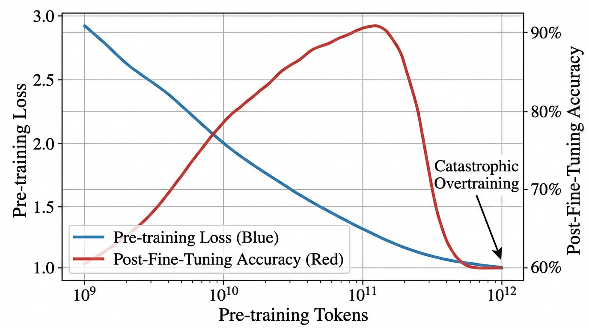

import OvertrainingVisualizer from '../../components/chapter-8/OvertrainingVisualizer.tsx';

# 8.3 Over-training vs Optimal-training

In the previous section, we established the physics of the Chinchilla scaling laws: to achieve the lowest possible pre-training loss for a strictly fixed compute budget, model parameters and training tokens must scale in equal proportions (roughly a 1:20 ratio). 

However, looking at the modern landscape of open-weights models, you will notice that the industry has almost universally abandoned this rule. Meta’s Llama 3 (8B), for instance, was trained on 15 trillion tokens—nearly 100 times its Chinchilla-optimal data budget. 

This divergence is not a mathematical error; it is an economic calculation. The Chinchilla laws optimize purely for the compute spent during the *training* phase. But for Foundation Models deployed at scale, training compute is a one-time Capital Expenditure (CapEx). Inference compute—generating tokens for millions of users daily—is a recurring, unbounded Operational Expenditure (OpEx). 

This economic reality birthed the era of **Over-training** (also known as Inference-Optimal scaling). By forcing a small architecture to digest a massive corpus of data, engineers create a model that rivals the intelligence of a network ten times its size, but runs cheaply on consumer hardware. 

Yet, there is no free lunch in deep learning. Recent research reveals that pushing models too far past their compute-optimal point introduces a severe architectural brittleness, fundamentally changing how we approach the entire training lifecycle.

---

## The Fine-Tuning Paradox

For years, the prevailing assumption in language modeling was simple: a lower pre-training loss strictly guarantees a better downstream model. If you train on more tokens, the model's zero-shot perplexity improves, and it should logically become a more capable assistant after Supervised Fine-Tuning (SFT) and Reinforcement Learning from Human Feedback (RLHF).

Recent empirical studies, most notably the discovery of **Catastrophic Overtraining** [[1]](#ref-1), have shattered this assumption. 

While over-training reliably improves zero-shot benchmark performance [[2]](#ref-2), it paradoxically destroys the model's downstream adaptability. As a model is trained on an ever-growing token budget, its ability to be successfully instruction-tuned actually *degrades*. 

### The OLMo-1B Case Study
To isolate this phenomenon, researchers analyzed intermediate checkpoints of the OLMo-1B model. 
*   **Checkpoint A:** Pre-trained on 2.3 Trillion tokens.
*   **Checkpoint B:** Pre-trained on 3.0 Trillion tokens.

As expected, Checkpoint B had a strictly lower pre-training loss than Checkpoint A. However, after applying the exact same instruction-tuning recipe to both models, Checkpoint B performed **over 2% worse** on standard LLM benchmarks. The extra 700 billion tokens of pre-training had actively harmed the model's utility as an assistant.



---

## Progressive Sensitivity

Why does a "smarter" pre-trained model become a worse instruction follower? The technical root cause is **Progressive Sensitivity**.

Think of a neural network's latent space as a block of clay. At the Chinchilla-optimal point, the clay is highly structured but still moist and plastic—it can easily be molded into a specific shape (an instruction-following assistant) during fine-tuning. 

When a model is massively over-trained, it is forced to compress an impossible amount of world knowledge into a limited number of parameters. To achieve this, the network relies on increasingly complex, highly overlapping representations (Superposition). The clay hardens. The parameters become hyper-specialized to the exact distribution of the pre-training corpus.

Mathematically, this manifests as a spike in the trace of the **Fisher Information Matrix**. The loss landscape around the over-trained weights becomes incredibly sharp. During the fine-tuning phase, even a tiny gradient update causes massive, unpredictable shifts in the model's behavior. The model loses the broad, general knowledge it acquired during early pre-training because the parameters are too brittle to withstand the fine-tuning updates without shattering.

---

## The Goldilocks Zone of Training

We are currently entering a "Post-Chinchilla" era where the definition of optimal training is being redefined. Engineers are no longer optimizing solely for pre-training loss, nor are they blindly over-training to minimize inference costs. 

The new objective is to find the **Utility-Optimal** point: the "Goldilocks zone" where a model is small enough for cheap inference, but still plastic enough to survive alignment and specialized task adaptation.

| Feature | Compute-Optimal (Chinchilla) | Optimal-Training (Utility/SOTA) | Over-training (Brittle) |
| :--- | :--- | :--- | :--- |
| **Primary Goal** | Minimize training compute | Balance inference cost vs. adaptability | Minimize inference cost at all costs |
| **Data-to-Param Ratio** | ~20 : 1 | ~100 : 1 to ~400 : 1 | > 1000 : 1 |
| **Fine-tuning Plasticity**| Highly effective | Stable updates | Brittle; "Catastrophic Overtraining" |
| **Pre-training Loss** | Moderate | Low | Lowest |
| **Downstream Utility** | Good | **Best** | Declining (The Paradox) |

<OvertrainingVisualizer client:load />

---

## Monitoring Parameter Sensitivity

To prevent catastrophic overtraining, modern pre-training clusters do not just monitor the validation loss; they continuously monitor the plasticity of the network. 

If the sensitivity of the weights spikes, it signals that the model is crossing the threshold from "Utility-Optimal" into "Brittle." One efficient way to approximate this sensitivity during a distributed training run is by tracking the trace of the Empirical Fisher Information Matrix—essentially, the sum of the squared gradients.

The following PyTorch implementation demonstrates how an engineer might monitor this metric across checkpoints.

```python
import torch
import torch.nn as nn

class TransformerBlock(nn.Module):
    """A simplified Transformer block for demonstration."""
    def __init__(self, d_model=256, vocab_size=1000):
        super().__init__()
        self.embedding = nn.Embedding(vocab_size, d_model)
        self.encoder = nn.TransformerEncoderLayer(d_model=d_model, nhead=4, batch_first=True)
        self.lm_head = nn.Linear(d_model, vocab_size)
        
    def forward(self, x):
        return self.lm_head(self.encoder(self.embedding(x)))

def compute_fisher_trace(model: nn.Module, inputs: torch.Tensor, targets: torch.Tensor) -> float:
    """
    Computes the empirical Fisher Information trace for a given batch.
    
    A rising trace across successive pre-training checkpoints indicates 
    increasing parameter sensitivity (brittleness) and the onset of 
    Catastrophic Overtraining.
    """
    model.eval()
    criterion = nn.CrossEntropyLoss()
    
    # Forward pass
    logits = model(inputs)
    
    # Reshape for CrossEntropy: (batch_size * seq_len, vocab_size)
    loss = criterion(logits.view(-1, logits.size(-1)), targets.view(-1))
    
    # Zero gradients before backward pass to ensure clean accumulation
    model.zero_grad()
    loss.backward()
    
    fisher_trace = 0.0
    for name, param in model.named_parameters():
        if param.requires_grad and param.grad is not None:
            # The diagonal of the empirical Fisher Information Matrix 
            # is approximated by the squared gradients.
            fisher_trace += (param.grad ** 2).sum().item()
            
    return fisher_trace

# --- Simulation: Monitoring a Checkpoint ---
torch.manual_seed(42)
model = TransformerBlock()

# Dummy validation batch: 4 sequences of length 32
val_inputs = torch.randint(0, 1000, (4, 32))
val_targets = torch.randint(0, 1000, (4, 32))

trace_value = compute_fisher_trace(model, val_inputs, val_targets)

print(f"Empirical Fisher Trace: {trace_value:.4f}")
print("System Prompt: If this value exhibits a sustained exponential increase ")
print("across checkpoints, trigger early stopping to preserve fine-tuning plasticity.")
```

As the industry pushes toward increasingly massive datasets, the discipline of Foundation Model Engineering is shifting. Training is no longer just about feeding tokens into a GPU until the loss bottoms out; it is about dynamically managing the physical state of the neural network to ensure it survives the transition from a raw text predictor to an aligned, agentic AI.

---

## Quizzes

<details>
<summary>Quiz 1: Why does a model with a lower pre-training loss sometimes perform worse after Supervised Fine-Tuning (SFT)?</summary>
*This is the Fine-Tuning Paradox caused by Catastrophic Overtraining. As a model is over-trained, its parameters become hyper-specialized and brittle (Progressive Sensitivity). During SFT, the gradients from the fine-tuning data cause massive, unpredictable shifts in these brittle weights, destroying the general knowledge the model acquired during pre-training.*
</details>

<details>
<summary>Quiz 2: If the Chinchilla scaling laws provide the mathematically optimal ratio for training efficiency, why do companies like Meta intentionally ignore them for models like Llama 3 8B?</summary>
*Chinchilla optimizes for training compute (CapEx). For open-weights or heavily deployed models, inference compute (OpEx) is the dominant cost over the model's lifecycle. By over-training a small model on vastly more data than Chinchilla recommends, engineers create a highly capable model that is exceptionally cheap and fast to serve at scale.*
</details>

<details>
<summary>Quiz 3: How does monitoring the Empirical Fisher Information Matrix help engineers during a massive pre-training run?</summary>
*The trace of the Fisher Information Matrix measures the sensitivity of the model's loss to changes in its parameters. If the trace spikes, it indicates the loss landscape has become extremely sharp and the weights have lost their plasticity. Engineers can use this metric as an early-warning system to halt pre-training before the model becomes too brittle to be aligned via RLHF or SFT.*
</details>

---

## References

1. <a id="ref-1"></a>Springer, J. M., et al. (2025). *Overtrained Language Models Are Harder to Fine-Tune*. [arXiv:2503.19206](https://arxiv.org/abs/2503.19206).
2. <a id="ref-2"></a>Gadre, S. Y., et al. (2024). *Language models scale reliably with over-training and on downstream tasks*. [arXiv:2403.08540](https://arxiv.org/abs/2403.08540).