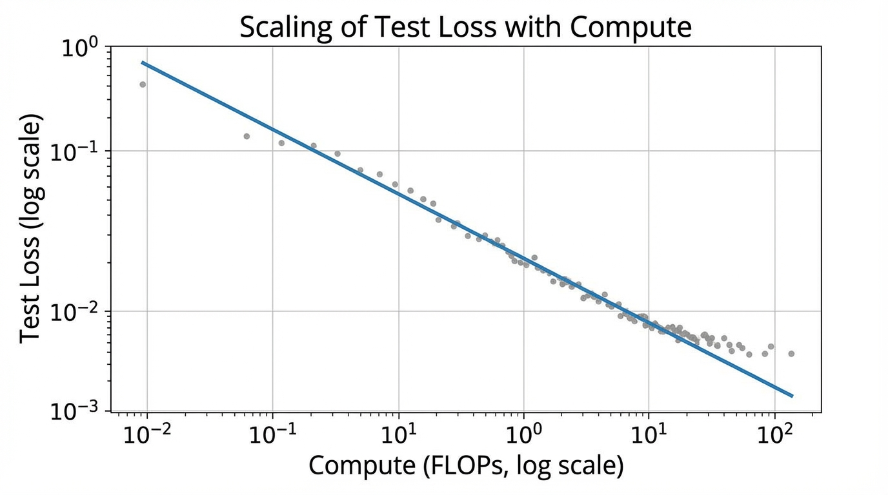

import PowerLawVisualizer from '../../components/chapter-8/PowerLawVisualizer.tsx';

# 8.1 The Power Law: The Thermodynamics of Deep Learning

Before 2020, deep learning architecture design was largely driven by intuition, heuristics, and trial-and-error. Engineers would build a model, train it, and hope the loss curve converged to a satisfactory number. The paradigm shifted fundamentally with the realization that neural network performance is not random, but governed by strict, predictable mathematical equations known as **Scaling Laws**.

If backpropagation is the mechanics of deep learning, scaling laws are its thermodynamics. They describe the macroscopic behavior of the system—how the final loss of a model behaves as you scale up the fundamental resources: **Compute, Data, and Parameters**. 

This predictability allows AI labs to train small, cheap models, fit a curve, and accurately predict the exact performance of a $100M training run before it even begins.

---

## The Empirical Discovery

While early observations of predictable scaling were documented by Hestness et al. in 2017 [[1]](#ref-1), the definitive formalization for modern Large Language Models (LLMs) was published by OpenAI's Kaplan et al. in 2020 [[2]](#ref-2). 

By training dozens of Transformer models ranging from thousands to billions of parameters, they discovered that the cross-entropy test loss ($L$) decreases as a simple **power law** with respect to three variables, provided the other two are not acting as bottlenecks:

1.  **$N$ (Parameters)**: The number of non-embedding parameters.
2.  **$D$ (Data)**: The number of tokens trained on.
3.  **$C$ (Compute)**: The total floating-point operations (FLOPs) used during training.

### The Mathematical Formulation

The power law relationship can be expressed through three independent equations:

$$ L(N) = \left(\frac{N_c}{N}\right)^{\alpha_N} + L_{\text{irreducible}} $$

$$ L(D) = \left(\frac{D_c}{D}\right)^{\alpha_D} + L_{\text{irreducible}} $$

$$ L(C) = \left(\frac{C_c}{C}\right)^{\alpha_C} + L_{\text{irreducible}} $$

Where:
*   $\alpha_N, \alpha_D, \alpha_C$ are the scaling exponents that dictate how fast the loss drops. Kaplan found these to be approximately $\alpha_N \approx 0.076$, $\alpha_D \approx 0.095$, and $\alpha_C \approx 0.050$.
*   $N_c, D_c, C_c$ are constants representing characteristic scales.
*   $L_{\text{irreducible}}$ is the **inherent entropy** of the dataset. 



### The Irreducible Loss Floor

The term $L_{\text{irreducible}}$ represents a theoretical minimum. Natural language contains inherent ambiguity, noise, and unobserved context. Even a theoretical model with infinite parameters and infinite compute cannot perfectly predict the next token every single time. As models grow exponentially larger, the returns diminish as the loss curve flattens out, asymptotically approaching this entropy floor.

---

## Log-Log Linearity

The power law is most clearly visualized on a log-log plot. If we ignore the irreducible loss for a moment (assuming we are far from the floor), taking the logarithm of the compute scaling equation yields:

$$ \log L(C) \approx -\alpha_C \log C + \log(C_c^{\alpha_C}) $$

This is the equation of a straight line ($y = mx + b$). This linearity is what makes scaling laws so powerful for engineering. You can plot the loss of a 10M, 100M, and 1B parameter model on a log-log graph, draw a straight line through them, and accurately predict the loss of a 100B parameter model.

<PowerLawVisualizer client:load />

---

## Extrapolating Loss in PyTorch

In practice, foundation model engineers use scaling laws to determine whether a massive training run is going off the rails. By fitting a curve to early, small-scale experiments, they establish a "baseline" expected loss.

The following PyTorch code demonstrates how to empirically fit a power law curve to a set of small-scale training runs, allowing us to project the expected loss for an ExaFLOP-scale model.

```python
import torch
import torch.nn as nn
import torch.optim as optim

# Empirical data: (Compute in PetaFLOPs, Validation Loss)
# Simulated data based on small-scale experimental runs
compute_flops = torch.tensor([1e1, 1e2, 1e3, 1e4, 1e5], dtype=torch.float32)
empirical_loss = torch.tensor([4.65, 3.72, 3.10, 2.68, 2.41], dtype=torch.float32)

class PowerLawFitter(nn.Module):
    """
    Fits the equation: L(C) = a * C^(-alpha) + E
    We optimize in log-space for numerical stability.
    """
    def __init__(self):
        super().__init__()
        # Initialize parameters with reasonable guesses
        self.log_a = nn.Parameter(torch.tensor(2.0))
        self.alpha = nn.Parameter(torch.tensor(0.05))
        self.E = nn.Parameter(torch.tensor(1.5)) # Irreducible entropy floor
        
    def forward(self, C):
        a = torch.exp(self.log_a)
        return a * torch.pow(C, -self.alpha) + self.E

def fit_scaling_law(compute, loss, epochs=5000, lr=0.01):
    model = PowerLawFitter()
    optimizer = optim.Adam(model.parameters(), lr=lr)
    criterion = nn.MSELoss()
    
    for epoch in range(epochs):
        optimizer.zero_grad()
        predictions = model(compute)
        
        # We use MSE on the log of the loss to penalize relative errors equally
        fit_loss = criterion(torch.log(predictions), torch.log(loss))
        fit_loss.backward()
        optimizer.step()
        
        if epoch % 1000 == 0:
            print(f"Epoch {epoch} | Fit MSE: {fit_loss.item():.6f}")
            
    return model

# Run the optimization
fitted_model = fit_scaling_law(compute_flops, empirical_loss)

# Extract learned coefficients
a_learned = torch.exp(fitted_model.log_a).item()
alpha_learned = fitted_model.alpha.item()
E_learned = fitted_model.E.item()

print(f"\nFitted Equation: L(C) = {a_learned:.2f} * C^(-{alpha_learned:.4f}) + {E_learned:.2f}")

# Predict loss for a 1 ExaFLOP run (1e6 PetaFLOPs)
c_next_gen = torch.tensor([1e6], dtype=torch.float32)
predicted_loss = fitted_model(c_next_gen).item()
print(f"Predicted Loss for 1 ExaFLOP: {predicted_loss:.3f}")
```

---

## The "Mirage" of Emergent Abilities

A critical nuance in scaling laws is the distinction between **cross-entropy loss** and **downstream task accuracy**. 

While the cross-entropy loss follows a perfectly smooth, predictable power law, capabilities on specific benchmarks (like MMLU or GSM8K) often appear to exhibit "emergent abilities"—sudden, discontinuous jumps in performance at specific scale thresholds.

However, researchers like Schaeffer et al. (2023) [[3]](#ref-3) argue that this emergence is largely a mirage caused by the choice of metric. Cross-entropy is continuous; it measures the probability distribution over tokens. If a model improves its probability assigned to the correct answer from 1% to 10%, the loss drops smoothly. But on a multiple-choice benchmark, the model will still score 0% until that probability surpasses the competing incorrect options, at which point the accuracy suddenly spikes to 100%. 

The underlying intelligence (measured by loss) scales predictably; it is our step-function evaluation metrics that create the illusion of sudden emergence.

---

## Quizzes

<details>
<summary>Quiz 1: Why do researchers explicitly exclude embedding parameters when calculating $N$ for scaling laws?</summary>
*Embedding parameters scale strictly with the vocabulary size (which is fixed) and the hidden dimension, rather than the depth or structural complexity of the core computational engine. Including them distorts the relationship between actual compute capability and loss, especially for smaller models where embeddings make up a disproportionately large fraction of total parameters.*
</details>

<details>
<summary>Quiz 2: In the equation $L(C) = (C_c / C)^{\alpha_C} + L_{\text{irreducible}}$, what physical or theoretical limit does $L_{\text{irreducible}}$ represent?</summary>
*It represents the inherent entropy (or Bayes risk) of the dataset. Natural language contains inherent ambiguity, noise, and unobserved context. Even a theoretical model with infinite parameters and infinite compute cannot perfectly predict the next token every time; it can only approach this fundamental entropy floor.*
</details>

<details>
<summary>Quiz 3: According to Kaplan's original findings, if you have a 10x increase in your compute budget, should you scale your model size and data equally?</summary>
*No. Kaplan et al. concluded that performance scales more efficiently by allocating the majority of new compute to model size (parameters) rather than data. They suggested scaling parameters much faster than the dataset size. (Note: This conclusion was later famously challenged and corrected by the Chinchilla scaling laws, which advocated for a balanced 1:1 scaling approach).*
</details>

<details>
<summary>Quiz 4: If scaling laws are so reliable, why do models sometimes experience sudden "loss spikes" during mid-training that deviate from the predicted curve?</summary>
*Scaling laws predict the optimal, converged loss under stable training conditions. Loss spikes are optimization failures—often caused by bad data batches, learning rate mismanagement, or numerical instability (like exploding gradients in FP16). They represent a failure of the optimizer to navigate the loss landscape, not a breakdown of the theoretical scaling limit.*
</details>

---

## References

1. <a id="ref-1"></a>Hestness, J., et al. (2017). *Deep Learning Scaling is Predictable, Empirically*. [arXiv:1712.00409](https://arxiv.org/abs/1712.00409).
2. <a id="ref-2"></a>Kaplan, J., et al. (2020). *Scaling Laws for Neural Language Models*. [arXiv:2001.08361](https://arxiv.org/abs/2001.08361).
3. <a id="ref-3"></a>Schaeffer, R., et al. (2023). *Are Emergent Abilities of Large Language Models a Mirage?*. [arXiv:2304.15004](https://arxiv.org/abs/2304.15004).