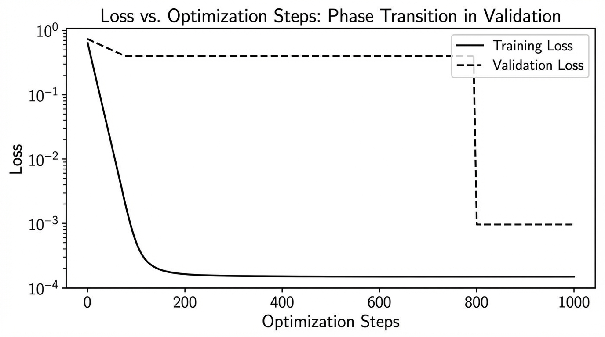
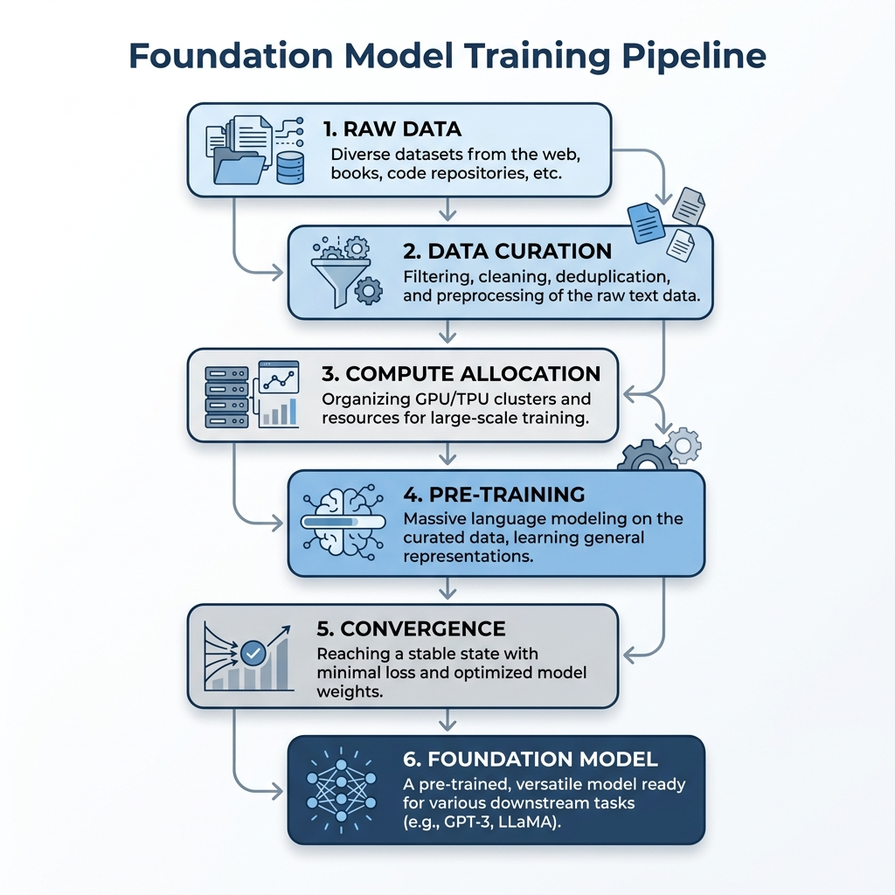

import GrokkingVisualizer from '../../components/chapter-8/GrokkingVisualizer.tsx';

# 8.4 Transfer Learning & Generalization

Pre-training creates an initialization; product value depends on what transfers to new tasks, distributions, and supervision. Transfer is empirical and conditional. Model scale, source/target similarity, tokenizer, adaptation method, data quantity, regularization, and evaluation all affect the result.

## 1. Effective Data Transfer

One way to quantify transfer is to compare a pre-trained model fine-tuned on $D_F$ examples with the same architecture trained from scratch. If the scratch model requires $D_S$ examples to reach the same measured loss, the effective transferred data is

$$
D_T=D_S-D_F.
$$

Hernandez et al. observed power-law relationships between effective transfer, model size, and fine-tuning data in their studied vision and language settings [[1]](#ref-1):

$$
D_T\approx kN^{\alpha}D_F^{\beta}.
$$

This is power-law growth, not exponential growth. The fitted exponents and even the usefulness of $D_T$ depend on the architecture, datasets, metric, and regime. Do not turn it into a promise that a model ten times larger needs a fixed fraction of labeled data. Refit or directly measure the downstream learning curve for the target system.

## 2. Grokking Is a Scoped Phenomenon

Grokking describes delayed generalization observed in particular small, structured tasks: training performance becomes nearly perfect, while validation improves much later under continued optimization [[2]](#ref-2).

*Source: AI-generated illustration. The curve represents a phenomenon observed in selected regimes, not a universal language-model schedule.*

Theoretical work explains some grokking settings through optimization, weight decay, representation, or norm dynamics, but no single mechanism proves that an arbitrary overfitting foundation-model run will later generalize. Continuing a costly run merely because “grokking may be next” is unsafe.

<GrokkingVisualizer client:load />

Use grokking experiments to learn about dynamics under controlled conditions. For production checkpoint decisions, require improvement on a fixed held-out set, multiple seeds or repeated probes where affordable, and a predeclared budget. If validation and downstream probes remain flat or regress beyond the stopping window, stop or branch the run rather than waiting indefinitely.

## 3. Weak-to-Strong Supervision

Weak-to-strong experiments ask whether a stronger student trained on labels from a weaker supervisor can recover some of the gap to strong supervision [[3]](#ref-3). The reported results vary by task and method: strong models can exceed weak-supervisor performance in some settings, but the gap is not consistently closed and failure modes remain.

This line of work is an analogy for difficult oversight, not evidence that a capable model will automatically infer human intent. Treat the weak labels as noisy observations with structured errors. Keep a strong or human-labeled audit set, measure performance by disagreement slice, and test whether errors are correlated with the weak supervisor.

Entropy minimization is not a general instruction to “trust the strong model's latent knowledge.” It can sharpen correct predictions, but it can also amplify confidently wrong predictions and distribution shift. Any auxiliary confidence objective needs a calibration and selective-risk evaluation against a baseline without it.

## 4. Scope Limits and Stopping Criteria

Before adapting a checkpoint, define the transfer experiment:

| Contract | Required decision |
| :--- | :--- |
| Source artifact | model/tokenizer/template hashes and pre-training checkpoint |
| Target data | provenance, cluster split, label/annotator quality, evaluation quarantine |
| Adaptation | full/adapter parameters, optimizer, LR/warmup, effective tokens, truncation and masks |
| Controls | from-scratch or smaller checkpoint, no-adaptation baseline, relevant RAG/prompt baseline |
| Metrics | fixed held-out target task, OOD slices, calibration, safety, base-capability retention, cost |
| Statistics | paired samples, multiple seeds where feasible, confidence intervals and critical-slice minima |

Use a **fixed held-out** corpus across checkpoints and never tune on the private release set. Predeclare a maximum token/step budget and evaluation cadence. Stop when a target is met, a critical retention/safety gate fails, or improvement remains inside the uncertainty band for the declared patience window. Save complete checkpoints so a later stage can branch from the best Pareto point rather than only the final step.

## 5. A Practical Transfer Matrix

| Observed need | First baseline | What would justify weight adaptation? |
| :--- | :--- | :--- |
| Current, attributable facts | RAG | the model cannot interpret retrieved domain text |
| Output format or tool policy | prompt/SFT | repeated behavior errors on held-out prompts |
| Broad domain language distribution | continued pre-training | RAG/SFT cannot close representation or fluency gap |
| Few labeled examples | prompting/adapter | stable gains over baselines with retention |
| Noisy weak supervision | filter/calibrate labels | strong student improves audit slices without copying systematic errors |

The matrix is a starting point, not a fixed pipeline. Run the cheapest reversible baseline first and promote a weight change only with held-out evidence.

## 6. Foundation Model Training Pipeline

*Source: AI-generated illustration.*

A common sequence is:

1. Freeze the data and tokenizer contract and run scaling pilots.
2. Pre-train a base model with recoverable distributed checkpoints.
3. Optionally use continued pre-training for a measured distribution gap.
4. Apply SFT for target interactions and task behavior.
5. Use preference optimization only when preference data and evaluation justify it.
6. Select the release artifact on domain, retention, safety, latency, cost, and rollback gates.

Each arrow is an evaluation gate. Later stages can improve one surface while degrading another, so “more training” is not a monotonic progress indicator.

## Quizzes

Quiz 1: Why does a fitted power law for effective transferred data not imply exponential gains from model size?

*A relationship such as $D_T\propto N^{\alpha}$ is a power law, and its exponent was estimated in a particular regime. Extrapolation requires the same architecture/data assumptions or new downstream measurements.*

Quiz 2: Training loss is flat and validation loss is high on a large language-model run. Should the team continue because of grokking?

*Not on that reason alone. Grokking is documented in selected regimes. Follow the predeclared held-out probes, uncertainty, patience, budget, and safety/retention gates; stop or branch when those gates say the run is not improving.*

Quiz 3: A strong student beats its weak supervisor. Has weak-to-strong alignment succeeded?

*Only partially. Compare with strong/human supervision, inspect disagreement and OOD slices, calibration, safety, and systematic inherited errors. Exceeding the weak baseline does not mean the supervision gap is closed.*

Quiz 4: Why can entropy minimization harm weak-to-strong training?

*It rewards confidence, not correctness. Under supervisor error or distribution shift it can sharpen wrong predictions, so calibration and selective-risk evaluation against a no-entropy baseline are required.*

Quiz 5: Why save intermediate checkpoints even when pre-training loss continues to fall?

*The best downstream adaptation, retention, safety, and lifecycle-cost point may occur before the lowest pre-training loss. Complete intermediate checkpoints let later stages branch from the measured Pareto optimum.*

## References

1. Hernandez, D., et al. (2021). *Scaling Laws for Transfer*. [arXiv:2102.01293](https://arxiv.org/abs/2102.01293).
2. Power, A., et al. (2022). *Grokking: Generalization Beyond Overfitting on Small Algorithmic Datasets*. [arXiv:2201.02177](https://arxiv.org/abs/2201.02177).
3. Burns, C., et al. (2023). *Weak-to-Strong Generalization: Eliciting Strong Capabilities With Weak Supervision*. [arXiv:2312.09390](https://arxiv.org/abs/2312.09390).
