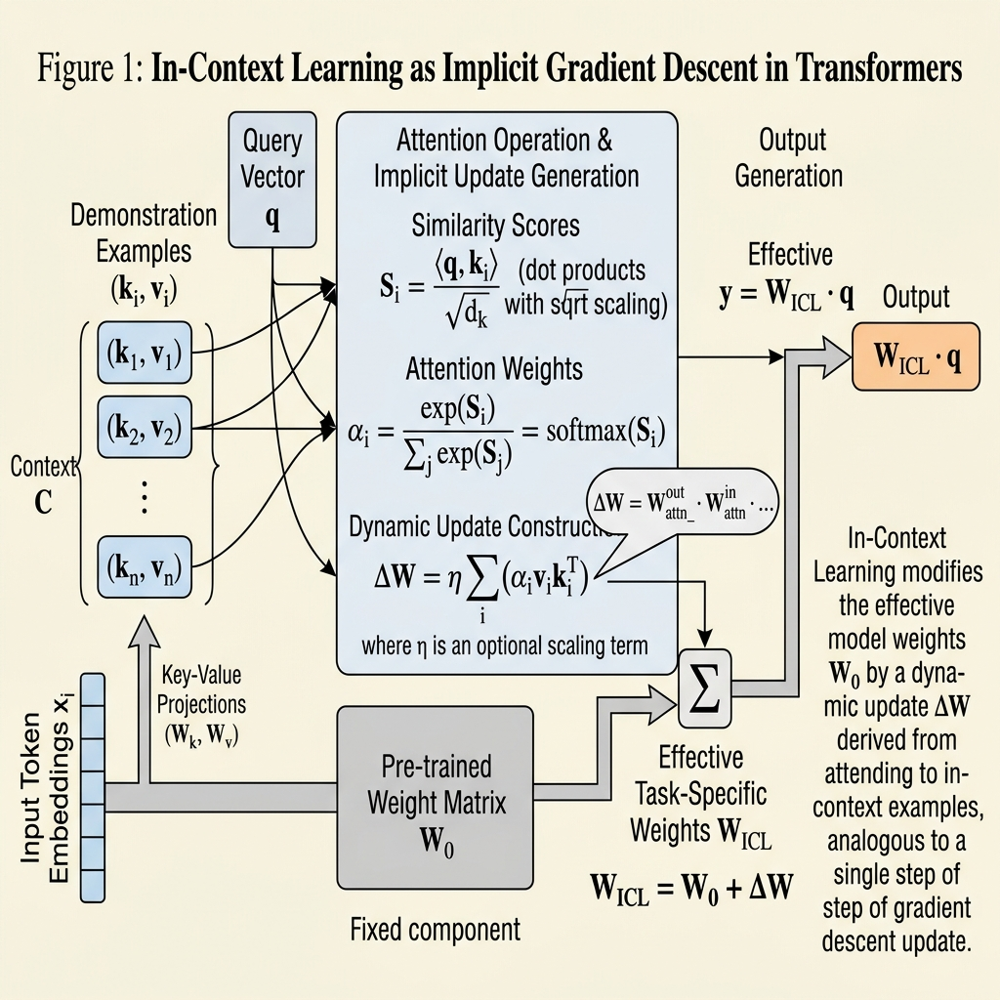
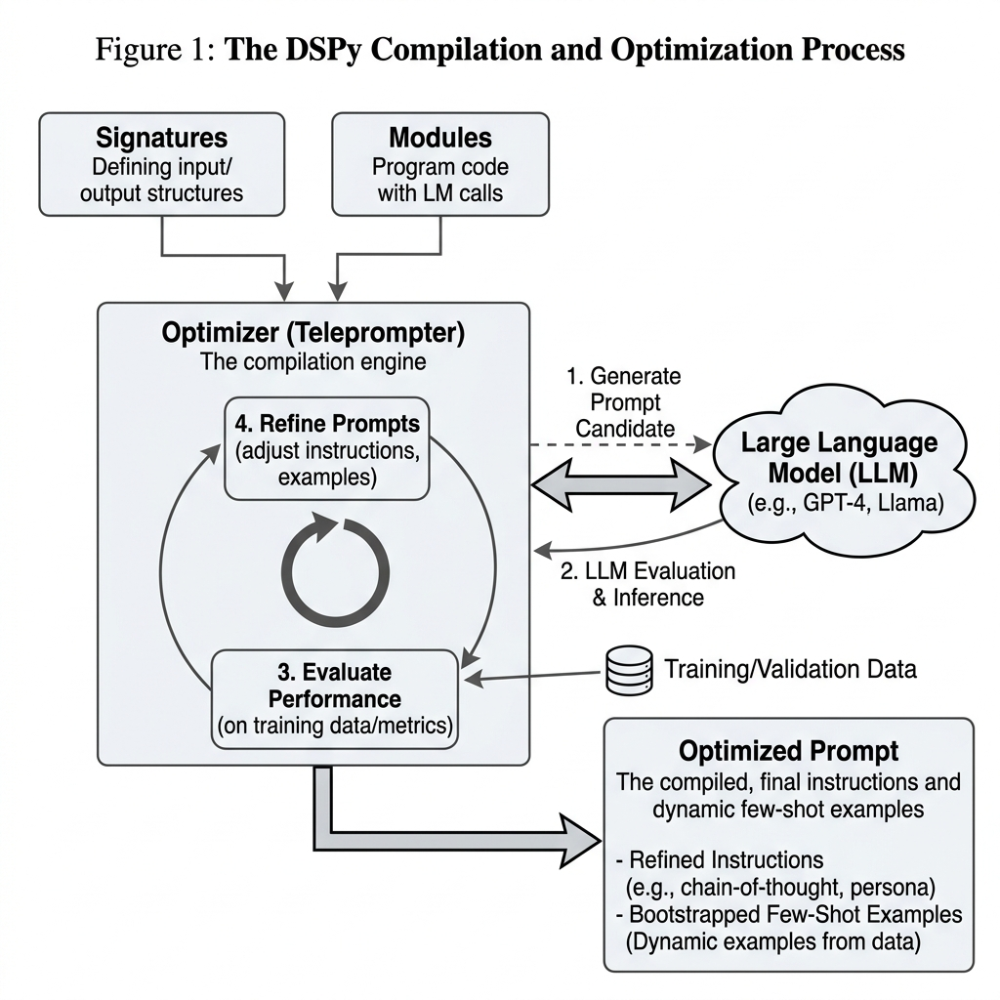

import DSPyCompilerVisualizer from '../../components/chapter-9/DSPyCompilerVisualizer.tsx';

# 9.4 Prompt Engineering as SFT

In the previous sections, we established that dataset curation often matters more than raw volume during post-training, applicable to both Supervised Fine-Tuning (SFT) and Parameter-Efficient Fine-Tuning (PEFT). Both paradigms require a dedicated training phase, gradient calculations, and optimizer states. 

However, what if you have zero compute budget for backpropagation? Or what if you need to adapt a model to a highly specific user persona in real-time, where spinning up a LoRA adapter is architecturally unfeasible?

This brings us to **Prompt Engineering**. In mainstream discourse, prompt engineering is often treated as a dark art of string manipulation—adding phrases like "Take a deep breath" or "You are a helpful assistant." But from a Foundation Model engineering perspective, **prompting is mathematically and functionally a surrogate for SFT**. By carefully structuring the context window, we can force the model to undergo an *implicit* fine-tuning process entirely within its forward-pass activations.

---

## The Mechanistic View: Attention as Implicit Gradient Descent

For years, the empirical success of In-Context Learning (ICL)—where a model adapts to a task simply by seeing a few examples in its prompt—was treated as an emergent mystery. How does a model "learn" without updating its weights?

In 2023, seminal research by Dai et al. [[1]](#ref-1) and von Oswald et al. [[2]](#ref-2) provided the mechanistic answer: **Transformer attention has a mathematical dual form to Gradient Descent.**

When you provide few-shot examples $(x_1, y_1), (x_2, y_2)$ in a prompt, the model does not just passively read them. The self-attention mechanism acts as a meta-optimizer. During the forward pass, the model computes "meta-gradients" from the demonstration examples and applies them to its internal representations, simulating a weight update.

### The Mathematics of ICL

Consider a simplified linear attention mechanism. Standard zero-shot inference relies purely on the pre-trained weights $W_{ZSL}$. However, when few-shot examples are introduced, the attention mechanism constructs a dynamic weight update $\Delta W_{ICL}$:

$$ \Delta W_{ICL} = \sum_{i=1}^{N} v_i k_i^T $$

Where:
* $k_i$ is the key vector representation of the demonstration input $x_i$.
* $v_i$ is the value vector representation of the demonstration label $y_i$.
* $N$ is the number of few-shot examples.

When a new query $q$ (the actual user question) is processed, the output is:

$$ \text{Output} = (W_{ZSL} + \Delta W_{ICL}) q = W_{ZSL}q + \sum_{i=1}^{N} v_i (k_i^T q) $$

Notice the term $k_i^T q$. This is the attention score (similarity) between the user's query and the few-shot examples. The model is literally performing a gradient descent step based on a Mean Squared Error (MSE) objective, adjusting its internal projection matrix on the fly. **In-Context Learning is implicit Supervised Fine-Tuning.**


*Source: AI-generated illustration.*

---

## Unrolling Compute: Chain-of-Thought (CoT)

If few-shot prompting replaces the *data* aspect of SFT, **Chain-of-Thought (CoT)** replaces the *depth* aspect.

A fundamental limitation of the standard Transformer architecture is its fixed computational depth. A 80-layer model can only execute 80 non-linear transformations per token. If a problem requires 500 steps of logical deduction to solve, the model will fail if forced to output the final answer immediately, regardless of how well it was fine-tuned.

CoT ("Let's think step by step") bypasses this architectural bottleneck. By forcing the model to generate intermediate reasoning tokens, we allow it to **unroll its computation graph**. 

Every generated token feeds back into the model for the next step, effectively multiplying the computational depth. If a model generates 100 tokens of reasoning before answering, it has effectively applied its 80 layers 100 times, resulting in 8,000 layers of sequential computation. This mechanism is the foundational principle behind **Test-Time Compute Scaling**, which powers advanced reasoning models like OpenAI's o1 and DeepSeek-R1 [[3]](#ref-3).

---

## The Engineering Era: DSPy and Prompt Compilers

Treating prompting as SFT leads to an inevitable engineering conclusion: if prompts are equivalent to training data and hyperparameters, **humans should not be writing them manually**. 

Manual prompt engineering is fragile. A prompt highly optimized for `Llama-3-70B` will often degrade performance when transferred to `DeepSeek-V3` because different models have different pre-training manifolds and tokenizers.

To solve this, the industry has shifted toward **Algorithmic Prompt Optimization**, spearheaded by frameworks like **DSPy** (Declarative Self-Improving Language Programs) developed at Stanford [[4]](#ref-4).

### From Strings to Parameters

DSPy abstracts away raw string manipulation. Instead of writing prompts, developers define the **Signature** (the input/output schema) and the **Module** (the computational flow). The framework then uses an optimizer (a "Teleprompter") to automatically search for the best instructions and bootstrap the optimal few-shot demonstrations based on a validation metric.

Below is a production-grade example of how prompt engineering is executed systematically in 2026:

```python
import dspy
from dspy.teleprompt import MIPROv2

# 1. Define the Signature (The "Architecture")
class MultiHopQA(dspy.Signature):
    """Answer complex questions by leveraging retrieved context."""
    context = dspy.InputField(desc="Retrieved factual snippets")
    question = dspy.InputField()
    reasoning = dspy.OutputField(desc="Step-by-step logical deduction")
    answer = dspy.OutputField(desc="Short factual answer")

# 2. Define the Module (The "Forward Pass")
class RAGPipeline(dspy.Module):
    def __init__(self):
        super().__init__()
        # We declare a CoT layer, but we don't write the prompt!
        self.generate_answer = dspy.ChainOfThought(MultiHopQA)

    def forward(self, question: str, context: list[str]):
        return self.generate_answer(context=context, question=question)

# 3. Compile (The "SFT Training Loop")
# MIPROv2 uses Bayesian Optimization to find the optimal prompt instructions and few-shot examples
teleprompter = MIPROv2(
    metric=exact_match_metric, 
    num_candidates=10, 
    init_temperature=1.0
)

# This process queries the LLM thousands of times to "train" the prompt
compiled_rag = teleprompter.compile(
    RAGPipeline(),
    trainset=train_examples,
    valset=val_examples,
    requires_permission_to_run=False
)

# 4. Save the "Weights" (The optimized prompt JSON)
compiled_rag.save("optimized_rag_prompt.json")
```

In this paradigm, if you swap your underlying LLM, you do not manually rewrite your prompts. You simply re-run the `compile()` method, and the optimizer discovers the exact phrasing and examples that trigger the optimal implicit gradient descent for the new model.


*Source: AI-generated illustration.*

---

## Interactive Visualizer: The Prompt Compiler

To understand the sheer scale of what an algorithmic prompt optimizer does, use the interactive component below. It simulates how a simple two-line DSPy Signature is expanded into a massive, highly-optimized Few-Shot Chain-of-Thought prompt during the compilation phase.

<DSPyCompilerVisualizer client:load />

---

## Summary & Next Steps

Prompt Engineering has matured from heuristic "prompt whispering" into a rigorous engineering discipline. By understanding In-Context Learning as implicit gradient descent and Chain-of-Thought as test-time compute scaling, we can leverage prompting as a highly efficient, gradient-free alternative to Supervised Fine-Tuning. Frameworks like DSPy formalize this by compiling declarative programs into mathematically optimized prompt structures.

However, whether we use explicit SFT (updating weights) or implicit SFT (optimizing prompts), we are still fundamentally teaching the model *how* to perform a task based on human demonstrations. But what happens when human demonstrations are flawed, or when we want the model to learn what humans *prefer* rather than just what they write?

In **Chapter 10: Alignment: RLHF & Direct Preference**, we will cross the boundary from imitation learning to preference optimization, exploring how algorithms like PPO and DPO align models with complex human values and safety constraints.

## Quizzes

<details>
<summary>Quiz 1: If In-Context Learning (ICL) acts as implicit gradient descent, why does its performance degrade significantly if the input formatting is highly unusual (e.g., replacing spaces with underscores), whereas explicit SFT can learn this unusual formatting?</summary>
*Explicit SFT physically alters the weight manifold, allowing the model to learn entirely new representations and mappings. ICL, however, operates entirely within the pre-trained weights. It relies on finding and activating existing latent circuitry. If the formatting is too far out-of-distribution (OOD), the model's attention mechanism cannot compute meaningful meta-gradients because the keys and values do not align with any pre-learned concepts.*
</details>

<details>
<summary>Quiz 2: In the dual form of Transformer attention, what components act as the "gradients" that update the model's implicit weights?</summary>
*The value vectors ($v_i$) of the few-shot demonstration examples, weighted by the attention scores (the dot product of the demonstration keys $k_i$ and the current query $q$). These weighted values are accumulated to form the dynamic weight update $\Delta W_{ICL}$.*
</details>

<details>
<summary>Quiz 3: From a systems engineering perspective, why is Chain-of-Thought (CoT) considered a mechanism for expanding a model's computational depth?</summary>
*A Transformer has a fixed number of layers, meaning it can only perform a fixed amount of computation per token generated. By generating intermediate reasoning tokens before outputting the final answer, the model unrolls its computation graph over time. Each new token feeds back into the model, effectively multiplying the total number of non-linear transformations applied to the problem.*
</details>

<details>
<summary>Quiz 4: What is the primary operational advantage of using a framework like DSPy over manually crafting extensive few-shot prompts?</summary>
*Portability and optimization. Manual prompts overfit to the specific idiosyncrasies of a single model (e.g., Llama-3). If the model is upgraded, the prompt often breaks. DSPy abstracts prompts into programmatic signatures and treats the actual text and examples as trainable parameters. By recompiling, the framework automatically searches for and bootstraps the optimal prompt for any new model without human intervention.*
</details>

---

## References

1. <a id="ref-1"></a>Dai, D., et al. (2023). *Why Can GPT Learn In-Context? Language Models Secretly Perform Gradient Descent as Meta-Optimizers*. [arXiv:2212.10559](https://arxiv.org/abs/2212.10559).
2. <a id="ref-2"></a>von Oswald, J., et al. (2023). *Transformers learn in-context by gradient descent*. [arXiv:2212.07677](https://arxiv.org/abs/2212.07677).
3. <a id="ref-3"></a>DeepSeek-AI. (2025). *DeepSeek-R1: Incentivizing Reasoning Capability in LLMs via Reinforcement Learning*. [arXiv:2501.12948](https://arxiv.org/abs/2501.12948).
4. <a id="ref-4"></a>Khattab, O., et al. (2024). *DSPy: Compiling Declarative Language Model Calls into Self-Improving Pipelines*. [arXiv:2310.03714](https://arxiv.org/abs/2310.03714).
