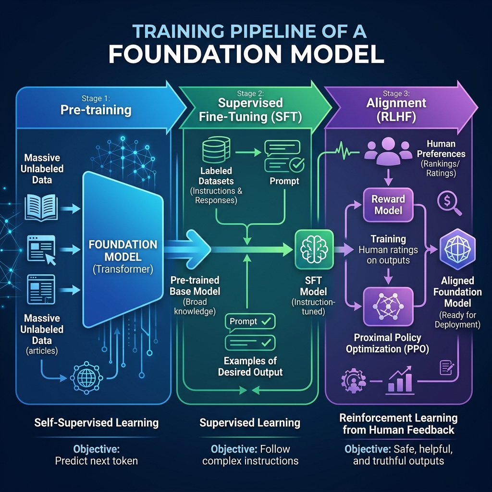

import { NextTokenVisualizer } from '../../../components/chapter-1/NextTokenVisualizer.tsx';


# 1.3 Deep Learning Paradigms

Foundation Model이 어떻게 구축되고 정렬(alignment)되는지 이해하기 위해, 우리는 머신러닝의 세 가지 기본 패러다임과 이들이 현대 AI 시스템에서 어떻게 융합되는지 탐구해야 합니다.

---

### **동기: 일반 지능을 위한 레시피**
왜 우리는 서로 다른 패러다임이 필요할까요? 안전하고 유용한 AI를 구축하는 데 단일 방법으로는 충분하지 않기 때문입니다:
*   **규모(Scale)는 자기지도를 필요로 합니다:** 인간이 라벨링한 데이터는 거대한 지식 기반을 구축하기에 너무 부족합니다.
*   **인스트럭션(지시)은 지도 학습을 필요로 합니다:** 순수한 텍스트 완성만으로는 훌륭한 어시스턴트가 될 수 없습니다.
*   **안전성(Safety)은 강화 학습을 필요로 합니다:** 모델의 행동을 인간의 가치에 맞게 정렬해야 하는데, 이는 규칙이나 라벨로 명시하기 어렵습니다.

이러한 패러다임을 이해하면 현대 LLM의 복잡한 학습 파이프라인을 탐색하는 데 도움이 됩니다.

---

### **비유: 학습의 세 가지 방법**

당신이 복잡한 전략 게임을 배우려고 한다고 가정해 봅시다.

1.  **Supervised Learning(지도 학습)은 코치와 함께 배우는 것과 같습니다.** 코치가 바둑판의 상태를 보여주고 어떤 수를 두어야 하는지 정확히 알려줍니다. 당신은 전문가를 모방하여 배웁니다.
2.  **Self-Supervised Learning(자가 지도 학습)은 게임에 대해 쓰여진 모든 책을 읽는 것과 같습니다.** 코치는 없지만, 수백만 개의 문장을 읽음으로써 어떤 단어(및 개념)가 대개 서로 뒤따르는지 파악합니다. 게임 세계의 *구조*를 배웁니다.
3.  **Reinforcement Learning(강화 학습)은 직접 게임을 해보는 것과 같습니다.** 수를 두고, 때로는 이기고, 때로는 집니다. 게임 자체의 피드백(보상)을 바탕으로 전략을 조정합니다.

현대의 Foundation Model은 최첨단 성능을 달성하기 위해 이 세 가지 방법을 모두 특정 순서로 사용합니다.

**얀 르쿤의 케이크 비유:** 딥러닝의 대가 얀 르쿤(Yann LeCun)은 이 패러다임들의 정보량을 설명하기 위해 유명한 비유를 들었습니다. 그는 머신러닝을 하나의 케이크에 비유하며, **자기지도 학습은 케이크의 빵** 에 해당하고(가장 방대한 정보), **지도 학습은 케이크 위의 아이싱** (약간의 정보), 그리고 **강화 학습은 케이크 꼭대기의 체리** (아주 적은 정보)라고 했습니다. 즉, 파운데이션 모델이 똑똑해지는 대부분의 이유는 엄청난 양의 데이터를 스스로 학습하는 자기지도 학습 덕분이라는 것입니다.

---

## 패러다임 전환의 짧은 역사

1.  **지도 학습 시대 (2012-2018):** 딥러닝은 ImageNet 분류와 같은 지도 학습 작업으로 도약했습니다. 모델은 훌륭했지만 좁은 분야의 전문가였습니다.
2.  **자기지도 혁명 (2018-현재):** BERT [[1]](#ref-1)와 GPT 같은 모델들은 라벨이 없는 텍스트에서 누락된 단어를 예측하는 것이 풍부하고 일반적인 표현으로 이어진다는 것을 보여주었습니다. 이것이 "파운데이션" 측면을 가능하게 했습니다.
3.  **정렬 시대 (2022-현재):** InstructGPT [[2]](#ref-2)는 RLHF를 대중화하여, 이러한 거대한 모델을 단순한 텍스트 완성기가 아닌 유용한 어시스턴트로 정렬할 수 있음을 보여주었습니다.

---

## 비교: 세 가지 패러다임

| 특징 | Supervised Learning (지도 학습) | Self-Supervised Learning (자기지도 학습) | Reinforcement Learning (강화 학습) |
| :--- | :--- | :--- | :--- |
| **데이터 유형** | 라벨이 있는 $(\mathbf{x}, y)$ | 라벨이 없는 $\mathbf{x}$ (자체 라벨링) | 환경과의 상호작용 |
| **피드백** | 직접적인 교정 | 데이터의 일부를 예측 | 스칼라 보상 |
| **장점** | 명확한 작업에서 높은 정밀도 | 데이터에 따라 무한히 확장 가능 | 복잡한 정책 학습 가능 |
| **단점** | 비싼 데이터 라벨링 비용 | 노이즈/편향을 학습할 수 있음 | 학습이 매우 불안정함 |
| **LLM에서의 역할** | 인스트럭션 튜닝 (SFT) | 핵심 사전 학습 (Pre-training) | 인간 선호도 정렬 (Alignment) |

---

<div style={{ display: 'flex', flexDirection: 'column', alignItems: 'center', width: '100%', margin: '20px 0' }}>

<div style={{ maxWidth: '600px', width: '100%' }}>

</div>

<em style={{ marginTop: '10px', color: '#7f8c8d' }}>출처: AI 생성 이미지</em>

</div>

---

## The Convergence in Foundation Models (Foundation Model에서의 융합)

현대의 Foundation Model은 이러한 패러다임들을 결합한 단계별 파이프라인을 사용하여 구축됩니다.

1.  **Pre-training (Self-Supervised):** 방대한 텍스트 데이터로 학습하여 언어 구조와 일반 지식을 배웁니다. 이 단계에서 모델이 똑똑해집니다.
2.  **Supervised Fine-Tuning (SFT):** 고품질의 인스트럭션 데이터를 미세 조정하여 프롬프트를 따르고 어시스턴트처럼 행동하는 법을 배웁니다.
3.  **Alignment (RLHF):** 인간의 선호도에 따라 학습된 리워드 모델과 함께 강화 학습을 사용하여 모델을 유용하고, 정직하며, 무해하게 만듭니다 [[2]](#ref-2).

---

## Autoregressive Loss 계산

LLM의 Self-Supervised 사전 학습에 사용되는 핵심 손실 함수를 살펴보겠습니다. 대개 다음 토큰을 예측하는 데 적용되는 **Cross-Entropy Loss**입니다.

다음은 단일 단계에 대해 이 손실이 어떻게 계산되는지 보여주는 PyTorch 스니펫입니다.

```python
import torch
import torch.nn as nn

# 어휘 사전 크기 및 시퀀스 길이
vocab_size = 5000
seq_len = 5

# 모델로부터 시뮬레이션된 로짓 (Batch_size, Seq_len, Vocab_size)
logits = torch.randn(2, seq_len, vocab_size)

# 타겟 토큰 (Batch_size, Seq_len) - 실제 다음 토큰들
targets = torch.randint(0, vocab_size, (2, seq_len))

# CrossEntropyLoss는 (N, C, ...) 또는 (N, C)를 기대합니다.
# 배치 및 시퀀스 차원을 펼칩니다.
loss_fct = nn.CrossEntropyLoss()
loss = loss_fct(logits.view(-1, vocab_size), targets.view(-1))

print(f"Calculated Autoregressive Loss: {loss.item():.4f}")
```

---

## Example: Next Token Prediction

Autoregressive 모델이 어떻게 작동하는지 경험해 보세요. 프롬프트를 선택하고 시뮬레이션된 다음 단어 확률을 확인해 보세요. 이것이 LLM에서 Self-Supervised 학습의 핵심 메커니즘입니다.

<NextTokenVisualizer client:load lang="ko" />

---

## Quizzes

<details>
<summary>Quiz 1: 왜 Self-Supervised Learning이 LLM의 돌파구로 간주되나요?</summary>
*인간이 라벨링한 데이터에 대한 의존성을 제거하기 때문입니다. SSL은 스스로 라벨을 생성함으로써(예: 다음 단어 예측) 라벨이 없는 원시 텍스트로부터 모델이 학습할 수 있게 합니다. 이를 통해 창발적 능력을 위해 필수적인 거대한 인터넷 규모의 데이터셋 학습이 가능해집니다.*
</details>

<details>
<summary>Quiz 2: Reinforcement Learning은 Supervised Learning과 어떻게 다른가요?</summary>
*Supervised Learning에서는 모든 입력에 대해 정답 출력이 주어집니다. Reinforcement Learning에서는 정답 행동이 주어지지 않으며, 모델은 환경과의 시행착오 상호작용을 통해 어떤 행동이 가장 높은 보상을 주는지 스스로 발견해야 합니다.*
</details>

<details>
<summary>Quiz 3: 사전 학습(Pre-training) 후 Supervised Fine-Tuning (SFT)은 어떤 역할을 하나요?</summary>
*사전 학습은 모델을 강력한 텍스트 완성기로 만들지만, 반드시 훌륭한 어시스턴트로 만드는 것은 아닙니다. SFT는 특정 프롬프트-응답 쌍으로 모델을 학습시켜 사용자의 의도를 이해하고 유용하며 대화식으로 응답하도록 가르칩니다.*
</details>

<details>
<summary>Quiz 4: SFT 이후에도 RLHF가 필요한 이유는 무엇입니까?</summary>
*SFT는 모델에게 어시스턴트의 형식을 가르치지만, 여전히 훈련 데이터(편향되거나 유용하지 않은 답변이 포함될 수 있음)를 모방합니다. RLHF는 인간이 모델의 출력에 점수를 매길 수 있게 하여, 순수한 모방에서 벗어나 더 안전하고 유용하며 인간의 가치에 부합하는 답변을 선호하도록 모델을 유도합니다.*
</details>

<details>
<summary>Quiz 5: 자연어 처리를 위해 처음부터 완전히 강화 학습만으로 모델을 훈련할 수 있습니까?</summary>
*이론적으로는 가능하지만 실제로는 극도로 어렵습니다. 행동 공간(가능한 모든 단어)이 너무 커서 무작위 탐색만으로는 일관된 언어를 생성하는 데 성공하기 어렵습니다. RL을 효과적으로 적용하기 전에 모델에게 언어에 대한 기본적인 이해를 제공하기 위해 SSL을 통한 사전 학습이 필요합니다.*
</details>

<details>
<summary>Quiz 6: 클리핑(Clipping)이 적용된 PPO(Proximal Policy Optimization)의 목적 함수(Objective Function)를 기술하고, 이것이 과도한 정책 업데이트를 어떻게 방지하는지 설명하시오.</summary>
*클리핑이 적용된 PPO 목적 함수는 다음과 같습니다: $L^{CLIP}(\theta) = \hat{\mathbb{E}}_t \left[ \min(r_t(\theta) \hat{A}_t, \text{clip}(r_t(\theta), 1 - \epsilon, 1 + \epsilon) \hat{A}_t) \right]$. 여기서 $r_t(\theta) = \frac{\pi_\theta(a_t | s_t)}{\pi_{\theta_{old}}(a_t | s_t)}$는 확률 비율(Probability Ratio)이고, $\hat{A}_t$는 $t$ 시점의 추정된 어드밴티지(Advantage)입니다. $\min$ 연산자는 일종의 보수적인 하한선(Pessimistic Lower Bound) 역할을 합니다. 어드밴티지가 양수($\hat{A}_t > 0$)인 경우, $r_t$가 커질수록 목적 함수가 증가하지만 $1 + \epsilon$에서 상한선이 적용되어 정책이 너무 급격하게 변하는 것을 방지합니다. 어드밴티지가 음수($\hat{A}_t < 0$)인 경우, $r_t$가 작아질수록 목적 함수가 증가하지만 $1 - \epsilon$에서 하한선이 적용되어 정책이 지나치게 악화되는 것을 방지합니다.*
</details>

---

## References

1. <a id="ref-1"></a>Devlin, J., Chang, M. W., Lee, K., & Toutanova, K. (2018). *BERT: Pre-training of deep bidirectional transformers for language understanding*. [arXiv:1810.04805](https://arxiv.org/abs/1810.04805).
2. <a id="ref-2"></a>Ouyang, L., et al. (2022). *Training language models to follow instructions with human feedback*. [arXiv:2203.02155](https://arxiv.org/abs/2203.02155).