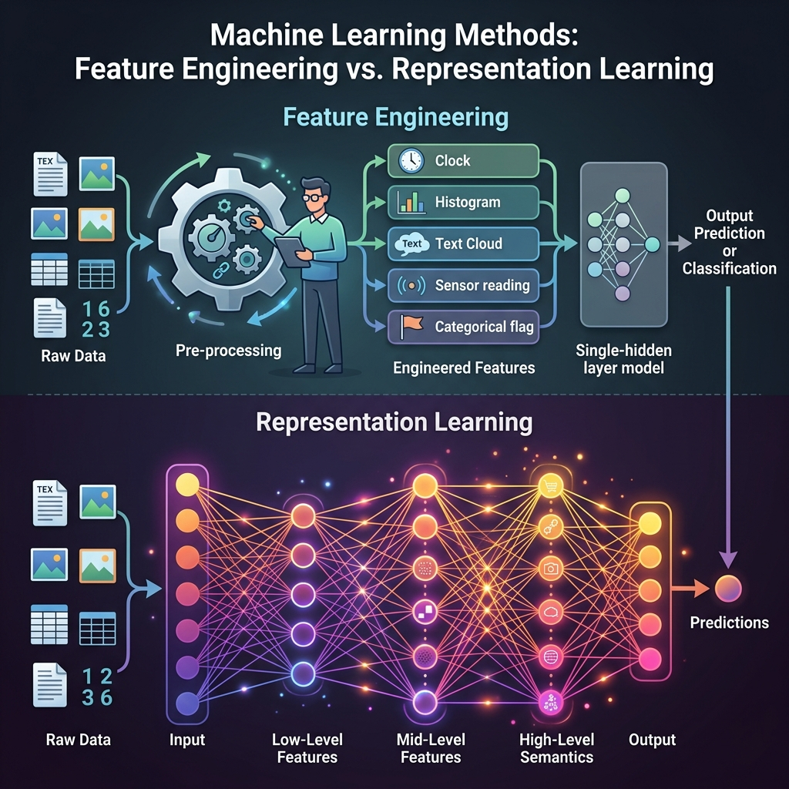

import { NlpRepresentationVisualizer } from '../../../components/chapter-1/NlpRepresentationVisualizer.tsx';


# 1.2 The Power of Representation

현대 Foundation Model을 가능하게 한 Deep Learning의 진정한 혁신은 단순히 네트워크가 커졌다는 것이 아니라, 그들이 **Representation (표현)** 의 문제를 해결했다는 점입니다.

---

### **동기: 표현이 모든 것인 이유**
AI에서 데이터를 어떻게 표현하느냐가 모델이 무엇을 배울 수 있는지를 결정합니다.
*   **차원의 저주 해결:** 원시 데이터(예: 4K 이미지)는 기존 알고리즘이 처리하기에 차원이 너무 많습니다. 좋은 표현은 이를 작고 관리 가능한 특징 집합으로 줄여줍니다.
*   **일반화 (Generalization):** 좋은 표현은 데이터의 *본질*(예: 특정 픽셀 값이 아닌 "개"라는 개념)을 캡처하여 모델이 새로운 데이터에서도 잘 작동하도록 합니다.
*   **파운데이션 모델:** GPT-4나 Gemini 같은 현대 모델들은 본질적으로 거대한 표현 학습기입니다. 그들은 언어와 세계에 대한 범용적인 표현을 학습하며, 이는 수천 가지의 다양한 작업에 사용될 수 있습니다.

---

### **비유: 얼굴을 설명하는 것 vs. 얼굴을 인식하는 것**

군중 속에서 특정 사람을 식별해야 한다고 가정해 봅시다.

*   **Feature Engineering (기존의 방식)은 전화로 그 사람을 설명하려는 것과 같습니다.** "그 사람은 코 길이가 2인치이고, 두 눈 사이는 1.5인치 떨어져 있으며, 턱이 둥급니다."라고 말할 수 있습니다. 당신은 수동으로 특정 특징(features)을 추출하고 있습니다. 만약 측정을 잘못하거나 그 사람이 고개를 돌리면 이 설명은 실패합니다.
*   **Representation Learning (Deep Learning)은 그 사람의 사진을 보는 것과 같습니다.** 당신의 뇌는 코 길이를 측정하지 않습니다. 이미지 전체를 처리하고 "그 사람의 얼굴"에 대한 고차원적이고 추상적인 표현(representation)을 추출합니다. 조명이 바뀌거나 안경을 써도 작동합니다.

Deep Learning이 성공한 이유는 인간에게 특징을 설명하라고 요구하는 것을 멈추고, 시스템이 스스로 최상의 표현을 찾도록 했기 때문입니다.

---

## 패러다임의 전환: 통계학에서 머신러닝으로

AI가 왜 수동으로 작성된 규칙(기호주의)에서 표현을 스스로 학습하는 방식(딥러닝)으로 이동했는지 이해하려면, 전통적인 통계학에서 머신러닝으로의 철학적 전환을 이해해야 합니다. 이는 통계학자 레오 브레이만(Leo Breiman)이 통계적 모델링의 "두 가지 문화(Two Cultures)"라고 부른 것과 일맥상통합니다 [[3]](#ref-3).

*   **통계학적 문화 (추론):** 전통적인 통계학은 변수들 간의 관계를 이해하는 데 집중합니다. 데이터 모델(예: 선형 회귀)을 가정하고 모수(parameters), p-value, 신뢰 구간 등에 초점을 맞춥니다. 적은 양의 데이터에서 잘 작동하며, **해석 가능성(Interpretability)** 과 **인과관계(Causality)** 를 중요하게 생각합니다.
*   **머신러닝 문화 (예측):** 머신러닝은 데이터가 생성되는 메커니즘을 블랙박스로 취급하고, 입력 $x$로부터 출력 $y$를 정확하게 예측할 수 있는 알고리즘을 찾는 데 집중합니다. 새로운 데이터에 대한 **예측 정확도** 와 **일반화(Generalization)** 성능을 최우선으로 하며, 이를 위해 신경망과 같은 복잡한 비선형 모델을 자주 사용합니다.

딥러닝과 파운데이션 모델은 이러한 머신러닝 문화의 극단적인 진화 형태입니다. 이들은 전통적인 통계적 해석 가능성보다는 거대한 규모에서의 실증적인 성능을 우선시합니다. 이러한 패러다임의 변화를 이해하면, 왜 LLM이 엄청난 능력을 보여주면서도 그 내부 동작을 명시적인 규칙으로 설명하기 어려운지 이해할 수 있습니다.

---

## 분열의 짧은 역사: 수동 제작 특징에서 딥러닝까지

머신러닝의 역사는 우리가 데이터를 어떻게 표현해 왔는지의 진화 과정으로 볼 수 있습니다.

1.  **수동 제작 시대 (2012년 이전):** 수십 년 동안 도메인 전문가들이 특징을 수동으로 설계했습니다. 컴퓨터 비전에서는 SIFT나 HOG를 사용했습니다. NLP에서는 TF-IDF나 신중하게 구축된 사전을 사용했습니다. 이는 느리고 취약하며 극단적인 도메인 전문 지식이 필요했습니다.
2.  **딥러닝 돌파구 (2012년):** AlexNet이 ImageNet 대회에서 큰 차이로 우승했습니다. 수동 제작 특징을 사용하지 않고, 심층 합성곱 신경망을 사용해 픽셀에서 직접 특징을 학습했습니다. 이는 자동화된 표현 학습이 인간의 설계를 능가함을 증명했습니다.
3.  **자기지도 학습 시대 (2018년-현재):** BERT와 GPT 같은 모델들은 방대한 양의 텍스트에서 누락된 단어를 예측함으로써, 인간의 레이블 없이도 엄청나게 풍부한 언어 표현을 학습할 수 있음을 보여주었습니다.

---

<div style={{ display: 'flex', flexDirection: 'column', alignItems: 'center', width: '100%', margin: '20px 0' }}>

<div style={{ maxWidth: '600px', width: '100%' }}>

</div>

<em style={{ marginTop: '10px', color: '#7f8c8d' }}>출처: AI 생성 이미지</em>

</div>

---

## Feature Engineering vs. Representation Learning

| 특징 | Feature Engineering (기존 ML) | Representation Learning (딥러닝) |
| :--- | :--- | :--- |
| **특징 설계 주체** | 인간 전문가 | 알고리즘 (신경망) |
| **도메인 종속성** | 높음 (각 분야마다 전문가 필요) | 낮음 (동일한 아키텍처가 여러 분야에 적용 가능) |
| **확장성** | 낮음 (노동 집약적) | **높음** (데이터와 컴퓨팅 파워에 따라 확장) |
| **해석 가능성** | **높음** (어떤 특징인지 정확히 앎) | 낮음 (블랙박스 표현) |
| **성능** | 인간의 직관에 의해 제한됨 | 복잡한 작업에서 **SOTA** 달성 |

---

### Hierarchical Feature Extraction (계층적 특징 추출)

Deep network는 여러 층(layer)으로 구성됩니다. 각 층은 서로 다른 추상화 수준에서 데이터를 표현하는 법을 배웁니다.
1.  **하위 층 (Low-level layers):** 선, 단순한 기울기, 기본 모양을 감지합니다.
2.  **중위 층 (Mid-level layers):** 선을 결합하여 객체의 부분(예: 모서리, 바퀴, 눈)을 감지합니다.
3.  **상위 층 (High-level layers):** 부분을 결합하여 전체 객체나 추상적인 개념(예: 자동차, 얼굴, 의미론적 의미)을 감지합니다.

---

## The Manifold Hypothesis (매니폴드 가설)

Representation learning에서 핵심적인 이론적 개념은 **Manifold Hypothesis**입니다.

이 가설은 실제 세계의 고차원 데이터(예: 가능한 모든 $256 \times 256$ 이미지)가 실제로는 고차원 공간 내에 내장된 훨씬 더 낮은 차원의 비선형 서브스페이스(매니폴드)에 존재한다고 가정합니다.

구겨진 종이 한 장을 생각해 보세요. 그것은 3D 공간에 존재하지만, 종이 자체는 2D 표면입니다. Representation learning의 목표는 데이터를 더 잘 이해하기 위해 이 종이를 "펴는" 것입니다.

---

## Learning a Latent Space

이것을 코드로 살펴보겠습니다. Representation learning을 볼 수 있는 가장 간단한 방법 중 하나는 **Autoencoder(오토인코더)**를 통한 것입니다. 오토인코더는 입력 데이터를 더 낮은 차원의 "잠재 공간(latent space)"(표현)으로 압축한 다음, 원래 입력을 재구성하려고 시도합니다.

다음은 데이터의 표현을 학습하는 간단한 Autoencoder의 PyTorch 구현입니다.

```python
import torch
import torch.nn as nn
import torch.optim as optim

# 더미 고차원 데이터 생성 (예: 10차원)
# 하지만 실제로는 2개의 잠재 요인에만 의존하도록 만듭니다.
N = 1000
latent_dim = 2
data_dim = 10

torch.manual_seed(42)
true_latent = torch.randn(N, latent_dim)
# 약간의 비선형성을 가진 고차원 투영
projection = nn.Linear(latent_dim, data_dim)
with torch.no_grad():
    X = torch.sin(projection(true_latent)) + torch.randn(N, data_dim) * 0.1

# Autoencoder 모델
class Autoencoder(nn.Module):
    def __init__(self):
        super(Autoencoder, self).__init__()
        # Encoder: 2D로 압축
        self.encoder = nn.Sequential(
            nn.Linear(data_dim, 5),
            nn.ReLU(),
            nn.Linear(5, latent_dim)
        )
        # Decoder: 다시 10D로 재구성
        self.decoder = nn.Sequential(
            nn.Linear(latent_dim, 5),
            nn.ReLU(),
            nn.Linear(5, data_dim)
        )

    def forward(self, x):
        latent = self.encoder(x)
        reconstructed = self.decoder(latent)
        return reconstructed, latent

model = Autoencoder()
criterion = nn.MSELoss()
optimizer = optim.Adam(model.parameters(), lr=0.01)

# 학습
for epoch in range(1000):
    reconstructed, latent = model(X)
    loss = criterion(reconstructed, X)
    
    optimizer.zero_grad()
    loss.backward()
    optimizer.step()
    
    if (epoch + 1) % 200 == 0:
        print(f'Epoch [{epoch+1}/1000], Loss: {loss.item():.4f}')

print("모델이 10D 데이터를 2D 표현으로 압축하는 법을 배웠습니다!")
```

---

## 예제: NLP에서의 Feature Engineering vs 표현 학습

전통적인 ML(어휘 사전 기반 Feature Engineering)과 딥러닝(표현 학습)이 언어의 맥락과 감성을 어떻게 다루는지 비교해보세요.

<NlpRepresentationVisualizer client:load lang="ko" />

---

## Quizzes

<details>
<summary>Quiz 1: Feature Engineering과 Representation Learning의 주된 차이점은 무엇인가요?</summary>
*Feature Engineering에서는 인간 전문가가 원시 데이터에서 관련 특징을 수동으로 설계하고 추출한 후 모델에 입력합니다. Representation Learning에서는 모델이 심층 네트워크의 여러 추상화 계층을 통해 학습 중에 원시 데이터에서 이러한 특징을 직접 추출하는 법을 자동으로 배웁니다.*
</details>

<details>
<summary>Quiz 2: 매니폴드 가설은 왜 고차원 데이터가 더 작은 네트워크로 처리될 수 있는지 어떻게 설명하나요?</summary>
*매니폴드 가설은 데이터가 고차원 공간(예: 수백만 픽셀)에 존재할 수 있지만, 데이터의 실제 의미 있는 변동은 훨씬 더 낮은 차원의 매니폴드에 위치한다고 제안합니다. Representation learning은 데이터를 이 매니폴드에 투영하는 법을 배움으로써 유효 차원수를 줄여 더 단순한 모델이나 후속 계층이 효과적으로 처리할 수 있도록 합니다.*
</details>

<details>
<summary>Quiz 3: 자연어 처리에서 계층적 표현의 예를 들어보세요.</summary>
*NLP에서 하위 수준은 원시 문자나 서브워드 토큰을 표현할 수 있습니다. 다음 수준은 이들을 결합하여 단어나 형태소를 만듭니다. 더 높은 수준은 구절, 문장, 그리고 마지막으로 전체 문서의 개념이나 의도를 표현합니다. 현대의 LLM은 어텐션 계층을 통해 이러한 계층 구조를 암시적으로 학습합니다.*
</details>

<details>
<summary>Quiz 4: 자기지도 학습(Self-Supervised Learning)이 표현 학습에서 중요한 마일스톤으로 여겨지는 이유는 무엇입니까?</summary>
*자기지도 학습은 모델이 가려진 단어를 예측하거나 다음 프레임을 예측하는 등의 pretext task를 만들어 레이블이 없는 데이터로부터 표현을 학습할 수 있게 합니다. 이는 가장 큰 병목 현상이었던 거대한 인간 레이블 데이터셋의 필요성을 없애 주어, 모델이 인터넷 규모의 데이터로 훈련하고 범용적인 표현을 학습할 수 있게 했습니다.*
</details>

<details>
<summary>Quiz 5: 의료와 같이 위험성이 높은 도메인에서 자동화된 표현 학습에 전적으로 의존할 때의 위험은 무엇입니까?</summary>
*주요 위험은 해석 가능성의 부족과 편향 증폭입니다. 모델이 스스로 표현을 학습하기 때문에, 인간이 특정 결정을 내린 이유를 이해하기 어렵습니다(블랙박스 문제). 훈련 데이터에 편향이 포함되어 있으면 모델은 해당 편향을 표현하는 법을 배우게 되어 잠재적으로 불공정하거나 위험한 결과를 초래할 수 있습니다.*
</details>

<details>
<summary>Quiz 6: Autoencoder에서 평균제곱오차(MSE) 손실 함수에 대한 병목 잠재 표현(Bottleneck Latent Representation) $\mathbf{z}$의 해석학적 기울기(Analytical Gradient)를 유도하시오.</summary>
*입력을 $\mathbf{x}$, 병목 표현을 $\mathbf{z} = f_\theta(\mathbf{x})$, 재구성된 출력을 $\mathbf{\hat{x}} = g_\phi(\mathbf{z})$라고 합시다. MSE 손실 함수는 $L = \frac{1}{D} \sum_{i=1}^D (x_i - \hat{x}_i)^2 = \frac{1}{D} \|\mathbf{x} - \mathbf{\hat{x}}\|^2_2$입니다. 연쇄 법칙(Chain Rule)에 의해, 잠재 벡터 $\mathbf{z}$에 대한 기울기는 다음과 같습니다: $\frac{\partial L}{\partial \mathbf{z}} = \frac{\partial L}{\partial \mathbf{\hat{x}}} \frac{\partial \mathbf{\hat{x}}}{\partial \mathbf{z}}$. 여기서 $\frac{\partial L}{\partial \mathbf{\hat{x}}} = -\frac{2}{D} (\mathbf{x} - \mathbf{\hat{x}})$임을 알 수 있습니다. 따라서 $\frac{\partial L}{\partial \mathbf{z}} = -\frac{2}{D} (\mathbf{x} - \mathbf{\hat{x}})^T \mathbf{J}_g(\mathbf{z})$가 되며, 이때 $\mathbf{J}_g(\mathbf{z}) = \frac{\partial g_\phi(\mathbf{z})}{\partial \mathbf{z}}$는 잠재 벡터 $\mathbf{z}$에서 평가된 디코더 함수 $g_\phi$의 야코비안(Jacobian) 행렬입니다.*
</details>

---

## References

1. <a id="ref-1"></a>Bengio, Y., Courville, A., & Vincent, P. (2013). *Representation learning: A review and new perspectives*. IEEE transactions on pattern analysis and machine intelligence, 35(8), 1798-1828. [arXiv:1206.5538](https://arxiv.org/abs/1206.5538).
2. <a id="ref-2"></a>LeCun, Y., Bengio, Y., & Hinton, G. (2015). *Deep learning*. Nature, 521(7553), 436-444.
3. <a id="ref-3"></a>Breiman, L. (2001). *Statistical modeling: The two cultures*. Statistical science, 16(3), 199-231.
4. <a id="ref-4"></a>**추천 영상**: [StatQuest: Word Embedding and Word2Vec](https://www.youtube.com/watch?v=viZrOnJclY0) 표현 학습의 대표적인 예인 워드 임베딩과 Word2Vec의 원리를 쉽게 설명한 영상입니다.