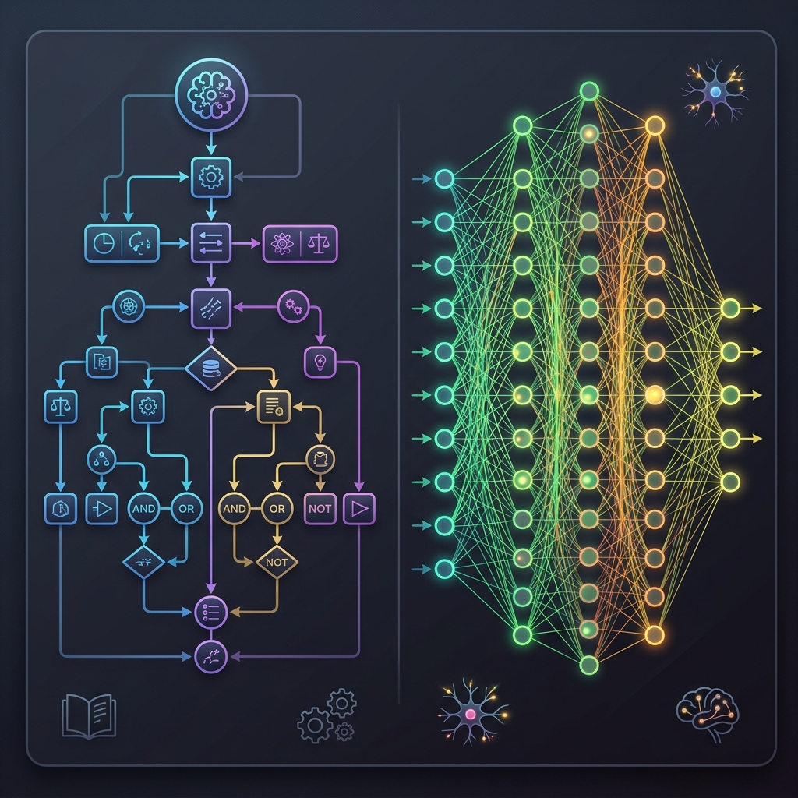

import { LogicGateVisualizer } from '../../../components/chapter-1/LogicGateVisualizer.tsx';

# 1.1 Symbolism vs. Connectionism

인공지능을 향한 여정은 근본적인 철학적, 기술적 분열로 정의되어 왔습니다. 바로 **Symbolism(기호주의)** 과 **Connectionism(연결주의)** 의 대립입니다. 이 논쟁은 단순히 역사적인 것이 아니라, 현대 Foundation Model의 능력과 한계를 이해하는 데 핵심적인 역할을 합니다.

---

### **동기: 이것이 오늘날 중요한 이유**
거대 파운데이션 모델 시대에 이 분열을 이해하는 것은 학문적 흥미에 그치지 않습니다. 이는 다음과 같은 사항에 대한 직접적인 통찰을 제공합니다:
*   **환각과 신뢰성 문제:** 왜 LLM은 통계적 패턴 학습만으로는 사실적 정확성을 항상 보장하지 못하는가?
*   **빠른 패턴 인식 vs. 숙고형 추론:** 연결주의는 직관적 인식과 패턴 완성에 강하고, 기호주의는 명시적 단계 추론에 초점을 맞췄습니다. 이 간극을 메우는 일은 지금도 중요한 연구 주제입니다.

---

### **비유: 레시피 북 vs. 수석 셰프의 직관**

맛있는 요리를 할 수 있는 시스템을 만들고 싶다고 가정해 봅시다.

*   **Symbolism(기호주의)적 접근은 거대한 레시피 북과 같습니다.** 세계적인 셰프들과 함께 앉아 가능한 모든 규칙을 적습니다: "스테이크 두께가 1인치라면 양면을 각각 4분씩 굽는다." "소스가 너무 시면 설탕을 한 꼬집 넣는다." 지능은 **명시적인 규칙** 과 **논리적인 조합** 에 존재합니다.
*   **Connectionism(연결주의)적 접근은 바닥부터 수석 셰프를 훈련시키는 것과 같습니다.** 아무런 레시피도 주지 않습니다. 대신 수천 번 요리를 하게 하고, 결과를 맛보고, 기술을 조정하게 합니다. 시간이 지나면서 그들은 재료들이 어떻게 상호작용하는지에 대한 **직관적인 이해** 를 발달시킵니다. 그들은 자신이 따르는 정확한 규칙을 설명할 수는 없지만, 걸작 요리를 만들어낼 수 있습니다.

현대의 Foundation Model은 바로 이 '수석 셰프의 직관'이 대규모로 구현된 대표적 사례입니다.

---

<div style={{ display: 'flex', flexDirection: 'column', alignItems: 'center', width: '100%', margin: '20px 0' }}>

<div style={{ maxWidth: '600px', width: '100%' }}>

</div>

<em style={{ marginTop: '10px', color: '#7f8c8d' }}>출처: AI 생성 이미지</em>

</div>

---

## 분열의 짧은 역사

두 학파 간의 긴장은 유명한 "AI 겨울"과 여름을 이끌어 왔습니다.

1.  **새벽 (1950년대):** 기호주의가 일반 문제 해결사에 대한 큰 기대를 모으며 초기 AI를 지배했습니다. 동시에 로젠블라트가 연결주의의 조상인 **Perceptron** (1958) [[2]](#ref-2)을 소개했습니다.
2.  **첫 번째 겨울 (1970년대):** 민스키와 페퍼트가 *Perceptrons* (1969) [[3]](#ref-3)를 출판하여 단층 네트워크가 XOR과 같은 비선형 문제를 해결할 수 없음을 증명했습니다. **이 사건은 AI 역사상 가장 유명한 전환점 중 하나입니다.** 당시 최고의 권위자였던 이들의 비판은 파괴적이었고, 이로 인해 신경망 연구는 한동안 긴 침체기를 겪었으며 연결주의는 학계의 주변부로 밀려났습니다.
3.  **전문가 시스템 시대 (1980년대):** 기호주의는 전문가 시스템으로 정점을 찍었지만, "지식 획득 병목 현상"에 부딪혔습니다. 동시에 역전파(Backpropagation)가 Rumelhart 등에 의해 대중화되어 (1986) [[4]](#ref-4) 연결주의가 부활했습니다.
4.  **딥러닝 혁명 (2010년대-현재):** 거대한 컴퓨팅 파워와 데이터 덕분에 연결주의가 지배하게 되었고, 오늘날 우리가 사용하는 파운데이션 모델로 이어졌습니다.

---

## The Symbolist Paradigm: Intelligence as Calculation (계산으로서의 지능)

Symbolism은 종종 **Classical AI** 또는 **GOFAI** (Good Old-Fashioned AI)로 불리며, 지능이 공식적인 규칙에 기반한 명시적인 심볼(기호)의 조작이라고 가정합니다.

### 핵심 철학
*   **Physical Symbol System Hypothesis:** 물리적 기호 시스템은 일반적인 지능적 행동을 위한 필요 충분한 수단을 가집니다 (Newell & Simon, 1976) [[1]](#ref-1).
*   **Representation (표현):** 지식은 사실과 규칙으로 표현됩니다 (예: `만약 동물에게 깃털이 있고 날 수 있다면, 그것은 새다`).
*   **Mechanism (메커니즘):** 추론 엔진은 새로운 지식을 도출하기 위해 논리적 규칙(연역, 귀납)을 적용합니다.

### 한계
Symbolism은 인간 전문가의 모든 지식을 추출하여 수동으로 코딩하는 것은 복잡한 현실 세계의 과제에서는 불가능한 것으로 판명되었기 때문에 벽에 부딪혔습니다. 인식과 모호성 처리에 실패했습니다.

---

## The Connectionist Paradigm: Intelligence as Emergence (창발로서의 지능)

Connectionism은 명시적인 규칙이라는 개념을 거부합니다. 대신 생물학적 뇌에서 영감을 받아, 단순하고 상호 연결된 처리 장치들의 상호작용에서 지능이 창발한다고 제안합니다.

### 핵심 철학
*   **Distributed Representation (분산 표현):** 지식은 특정 위치나 규칙에 저장되는 것이 아니라, 네트워크의 연결 가중치(weights)에 분산되어 저장됩니다.
*   **Learning (학습):** 시스템은 데이터를 기반으로 연결 가중치를 조정하며 학습하며, 일반적으로 **Backpropagation(역전파)** 과 같은 알고리즘을 사용합니다.
*   **Parallel Processing (병렬 처리):** 연산은 네트워크 전체에서 병렬로 발생합니다.

---

## 비교: Symbolism vs. Connectionism

| 특징 | Symbolism (기호주의) | Connectionism (연결주의) |
| :--- | :--- | :--- |
| **기본 단위** | 기호, 규칙, 논리 | 뉴런, 가중치, 연속적인 값 |
| **학습** | 전문가에 의해 하드코딩됨 (대부분) | 데이터로부터 학습됨 (역전파) |
| **해석 가능성** | **높음** (추적 가능한 규칙) | **낮음** (블랙박스 행렬) |
| **인식** | 부족함 (이미지/오디오에 어려움) | **탁월함** (비전/음성에서 SOTA) |
| **추론** | **탁월함** (엄격한 논리, 수학) | 부족함 (장쇄 논리에 어려움) |
| **데이터 요구량** | 낮음 (전문가 지식 필요) | **높음** (거대한 데이터셋 필요) |
| **노이즈 처리** | 취약함 (모델링되지 않은 입력에 실패) | **견고함** (점진적 성능 저하) |

---

## The Mathematical Contrast (수학적 대비)

두 패러다임을 수학적으로 대비해 볼 수 있습니다.

**Symbolic Inference (기호적 추론)** 은 종종 불리언 논리와 집합론에 의존합니다:
$$\forall x (Bird(x) \land \neg Flightless(x) \rightarrow CanFly(x))$$

**Connectionist Inference (연결주의적 추론)** 은 연속 함수와 선형 대수에 의존합니다:
$$y = \sigma(\mathbf{W}^T\mathbf{x} + b)$$
여기서 $\mathbf{W}$는 가중치 행렬, $\mathbf{x}$는 입력 벡터, $b$는 바이어스, $\sigma$는 비선형 활성화 함수입니다.

---

## From Rules to Weights

이것들이 코드에서는 어떻게 보이는지 살펴보겠습니다. 아래는 Symbolism이 쉽게 설명할 수 있지만 단층 Perceptron은 실패했던 XOR 문제를 Connectionist 접근법(단순한 신경망)이 어떻게 학습하여 해결하는지 보여주는 PyTorch 예제입니다.

```python
import torch
import torch.nn as nn
import torch.optim as optim

# XOR 데이터
X = torch.tensor([[0.0, 0.0], [0.0, 1.0], [1.0, 0.0], [1.0, 1.0]], dtype=torch.float32)
y = torch.tensor([[0.0], [1.0], [1.0], [0.0]], dtype=torch.float32)

# 단순한 Multi-Layer Perceptron (MLP)
class XORModel(nn.Module):
    def __init__(self):
        super(XORModel, self).__init__()
        self.hidden = nn.Linear(2, 2) # 은닉층
        self.output = nn.Linear(2, 1) # 출력층
        self.sigmoid = nn.Sigmoid()

    def forward(self, x):
        x = self.sigmoid(self.hidden(x))
        x = self.sigmoid(self.output(x))
        return x

model = XORModel()
criterion = nn.BCELoss()
optimizer = optim.SGD(model.parameters(), lr=0.1)

# 학습 루프
for epoch in range(10000):
    outputs = model(X)
    loss = criterion(outputs, y)
    
    optimizer.zero_grad()
    loss.backward()
    optimizer.step()
    
    if (epoch + 1) % 2000 == 0:
        print(f'Epoch [{epoch+1}/10000], Loss: {loss.item():.4f}')

# 모델 테스트
with torch.no_grad():
    predicted = model(X)
    print(f"Predicted outputs:\n{predicted.round()}")
```

---

## Example: The Connectionist Neuron

단일 인공 뉴런을 실험해 보세요. 가중치(weights)와 바이어스(bias)를 조정하여 출력이 어떻게 바뀌는지 확인해 보세요. 이것을 **AND** 게이트처럼 작동하게 만들 수 있나요?

<LogicGateVisualizer lang="ko" client:load />

---

## Quizzes

<details>
<summary>Quiz 1: Symbolism이 자연어 처리(NLP)에서 실패한 이유는 무엇인가요?</summary>
*Symbolism은 엄격한 문법 규칙과 사전에 의존했습니다. 그러나 인간의 언어는 매우 문맥적이고 모호하며 끊임없이 진화합니다. 규칙은 모든 뉘앙스, 관용구 및 예외 상황을 캡처할 수 없습니다. Connectionism은 방대한 텍스트에서 통계적 연관성을 학습하여 문맥을 더 잘 파악함으로써 성공합니다.*
</details>

<details>
<summary>Quiz 2: "XOR 문제"는 무엇이었으며 왜 중요했나요?</summary>
*XOR(배타적 논리합) 문제는 클래스가 선형적으로 분리되지 않는 단순한 분류 작업입니다. Minsky와 Papert는 단층 퍼셉트론이 XOR 함수를 학습할 수 없음을 증명했습니다. 이 비판은 다층 네트워크와 역전파가 개발될 때까지 이어진 신경망 연구의 긴 침체기에 중요한 계기가 되었습니다(첫 번째 AI 겨울).*
</details>

<details>
<summary>Quiz 3: 현대의 LLM은 순수하게 Connectionist인가요?</summary>
*핵심 아키텍처(Transformer)는 행렬 곱셈과 연속적인 표현에 의존하는 순수한 connectionist이지만, 우리가 이를 사용하는 방식은 때때로 그 격차를 메웁니다. 프롬프트 엔지니어링, Chain-of-Thought 추론, 도구 사용(예: 계산기 API 호출)은 connectionist 핵심 위에 기호주의적인 연산을 도입합니다. "Neuro-symbolic AI" 연구 분야는 이 두 가지의 장점을 결합하려고 적극적으로 시도하고 있습니다 (Garcez & Lamb, 2020) [[5]](#ref-5).*
</details>

<details>
<summary>Quiz 4: Symbolist 시스템에서 "지식 획득 병목 현상"에 대해 논하시오.</summary>
*지식 획득 병목 현상은 인간 전문가로부터 지식을 추출하여 명시적인 규칙으로 인코딩하는 것의 어려움을 말합니다. 인간 전문가는 종종 자신이 쉽게 말로 표현할 수 없는 직관과 암묵적 지식에 의존합니다. 더욱이, 복잡한 도메인에 필요한 규칙의 수는 기하급수적으로 증가하여 수동으로 관리하기가 불가능해집니다.*
</details>

<details>
<summary>Quiz 5: Connectionism의 "분산 표현" 개념은 Symbolic 표현과 어떻게 다릅니까?</summary>
*Symbolism에서는 개념이 특정 기호(예: 그래프의 노드나 특정 변수)로 표현되는 반면, Connectionism에서는 개념이 수많은 유닛(뉴런)들의 활동 패턴(pattern of activity)으로 표현됩니다. 즉, 특정 뉴런 하나가 개념을 대표하는 것이 아니라, 가중치(weights)와 활성화(activations)의 조합으로 정보가 저장됩니다. 이러한 방식은 시스템이 일부 손상되더라도 성능이 급격히 떨어지지 않는 graceful degradation과 새로운 데이터에 대한 generalization(일반화) 능력을 가능하게 합니다.*
</details>

<details>
<summary>Quiz 6: 계단 함수(Step Function) 활성화를 사용하는 단층 퍼셉트론이 XOR 문제를 해결할 수 없음을 선형 부등식을 통해 수학적으로 증명하시오.</summary>
*입력을 $x_1, x_2 \in \{0, 1\}$라고 합시다. 단층 퍼셉트론은 $y = \Theta(w_1 x_1 + w_2 x_2 - \theta)$를 계산합니다. 여기서 $\Theta$는 헤비사이드 계단 함수이고 $\theta$는 임계값입니다. XOR 문제를 해결하려면 다음 부등식이 성립해야 합니다:
1) $(0,0) \rightarrow 0$ 경우: $0 < \theta$
2) $(1,0) \rightarrow 1$ 경우: $w_1 \ge \theta$
3) $(0,1) \rightarrow 1$ 경우: $w_2 \ge \theta$
4) $(1,1) \rightarrow 0$ 경우: $w_1 + w_2 < \theta$
부등식 (2)와 (3)을 더하면 $w_1 + w_2 \ge 2\theta$를 얻습니다. 부등식 (1)에서 $\theta > 0$이므로, 이는 $w_1 + w_2 > \theta$를 의미합니다. 하지만 이는 부등식 (4)인 $w_1 + w_2 < \theta$와 직접적으로 모순됩니다. 따라서 이를 만족하는 가중치 $w_1, w_2$ 및 임계값 $\theta$는 존재하지 않으며, 단층 퍼셉트론은 XOR 문제를 해결할 수 없음이 증명됩니다.*
</details>

---

## References

1. <a id="ref-1"></a>Newell, A., & Simon, H. A. (1976). *Computer science as empirical inquiry: Symbols and search*. Communications of the ACM, 19(3), 113-126.
2. <a id="ref-2"></a>Rosenblatt, F. (1958). *The perceptron: a probabilistic model for information storage and organization in the brain*. Psychological review, 65(6), 386.
3. <a id="ref-3"></a>Minsky, M., & Papert, S. (1969). *Perceptrons*. MIT Press.
4. <a id="ref-4"></a>Rumelhart, D. E., Hinton, G. E., & Williams, R. J. (1986). *Learning representations by back-propagating errors*. Nature, 323(6088), 533-536.
5. <a id="ref-5"></a>Garcez, A. D., & Lamb, L. C. (2020). *Neurosymbolic AI: The 3rd Wave*. [arXiv:2012.05876](https://arxiv.org/abs/2012.05876).
