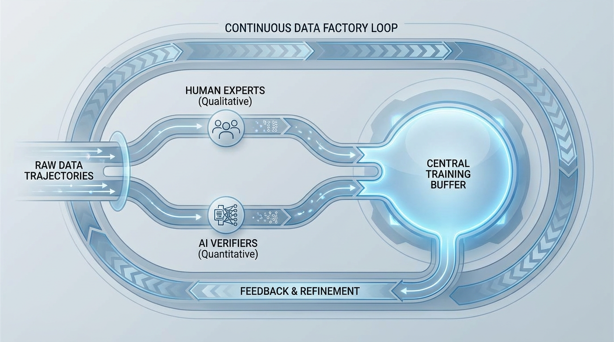

---
layout: ../../../layouts/BookLayout.astro
title: 10.1 Human Feedback Loop
lang: ko
---

# 10.1 Human Feedback Loop

9장에서는 지도 미세 조정(SFT)이 고품질 데모를 모방하여 모델에게 상호 작용하는 *방법*을 가르치는 과정을 살펴보았습니다. 하지만 모방 학습에는 근본적인 한계가 있습니다. 모델이 학습 분포의 평균적인 행동을 흉내 내도록 강제할 뿐, 여러 유효한 답변이 존재할 때 인간이 실제로 *선호하는* 것이 무엇인지 가르치지 않으며, 유해하거나 환각적인 추론을 본질적으로 처벌하지도 않습니다.

이러한 간극을 메우기 위해 업계는 역사적으로 인간 피드백 기반 강화 학습(RLHF)이 주도해 온 **정렬** (Alignment) 기술에 의존합니다. 그러나 파운데이션 모델이 복잡한 추론과 에이전트(Agentic) 태스크를 수행할 수 있도록 확장됨에 따라, 전통적인 인간 피드백 루프는 근본적으로 변화했습니다. 이제 피드백은 일회성 오프라인 정렬 단계가 아니라, 지속적이고 비동기적인 데이터 엔지니어링 파이프라인, 즉 "피드백-데이터 팩토리(Feedback-Data Factory)"로 진화했습니다.

---

## 1. 피드백의 아키텍처: 오프라인 vs 온라인

전통적인 RLHF 파이프라인은 엄격하게 동기식(Synchronous)으로 작동합니다. 시스템은 롤아웃(Rollout, 모델이 텍스트를 생성하는 과정) 배치를 수집하기 위해 일시 중지하고, 보상 모델(Reward Model, RM)이 점수를 매길 때까지 기다린 다음, 가중치를 고정하고 역전파(Backward pass)를 수행합니다. 이는 특히 롤아웃에 완료 시간이 가변적인 긴 컨텍스트 추론이나 코드 실행이 포함될 때 **스트래글러 효과** (Straggler effect) 라는 막대한 컴퓨팅 병목 현상을 유발합니다.

최근 공개된 post-training 시스템들을 보면 비동기식(Asynchronous) RL 아키텍처를 점점 더 많이 채택하고 있습니다. 그중 눈에 띄는 예가 THUDM의 `slime` 스택이며, GLM-5 리포트에서도 이 계열의 구성이 함께 언급됩니다 [[1]](#ref-1) [[2]](#ref-2). 이런 시스템에서는 생성과 학습을 분리해, 가장 느린 샘플 때문에 전체 학습기가 멈추는 상황을 줄입니다.

RL 프레임워크는 표준 최적화기라기보다는 **온라인 데이터셋 생성기** 에 가깝게 작동합니다. 궤적(Trajectory)을 지속적으로 생성하고, 점수를 매기며, 버퍼에 배치합니다. 이는 **궤적 승인 제어** (Trajectory Admission Control) 라는 개념을 도입합니다. 생성된 모든 데이터로 학습하는 대신, 시스템은 궤적을 엄격하게 필터링합니다. 특정 품질, 검증 가능성 및 정책 정렬 임계값을 통과한 롤아웃만이 학습 버퍼에 승인됩니다.

이러한 변화는 RL 단계에서의 데이터 품질의 의미를 재정의합니다. 더 이상 사전 학습(Pre-training)에서처럼 단순히 "나쁜 문서를 제거하는 것"이 아니라, 실시간 롤아웃에 대한 동적인 승인 제어가 핵심이 됩니다.

### 인터랙티브 시각화: 궤적 승인 제어 (Trajectory Admission Control)

아래의 인터랙티브 컴포넌트를 사용하여 비동기식 RL 롤아웃 스트림을 시뮬레이션해 보십시오. 시스템이 생성된 궤적을 실시간으로 어떻게 평가하는지 관찰하십시오. 보상 모델 임계값과 검증기(Verifier) 검사를 모두 통과한 궤적만이 후속 가중치 업데이트를 위해 RL 학습 버퍼에 승인됩니다.

import TrajectoryAdmissionVisualizer from '../../../components/chapter-10/TrajectoryAdmissionVisualizer.tsx';

<TrajectoryAdmissionVisualizer lang="ko" client:load />

---

## 2. 능동적 학습과 품질 인지 샘플링

인간의 라벨링은 AI 개발에서 가장 비싸고 속도를 제한하는 자원이며, 종종 "인간 세금(Human tax)"이라고 불립니다. 인간 피드백을 단일한 블록으로 취급하는 것은 매우 비효율적입니다.

현대의 정렬 파이프라인은 인간 노동의 비용 대비 신호 비율을 극대화하기 위해 **능동적 학습** (Active Learning) 을 사용합니다. 도메인 인지 분류기를 사용하여 데이터를 "품질 버킷" (예: 일반 채팅, STEM, 코드, 다국어)으로 분할합니다. 예를 들어, DCLM (DataComp for Language Models) [[3]](#ref-3) 과 같은 프레임워크를 기반으로 구축된 세계 지식 분류기는 중간 품질의 웹 콘텐츠에서 복잡하고 롱테일(Long-tail)인 지식을 추출하는 데 사용됩니다.

버킷화가 완료되면 인간 피드백이 전략적으로 라우팅됩니다. 일반적인 채팅에 대한 단순한 선호도 라우팅(A vs B)은 자동화된 보상 모델이 처리하는 반면, 인간 전문가(예: 대학원생, 전문 개발자)는 "어려운" 또는 "불확실한" 버킷에만 투입됩니다. 시스템은 보상 모델의 신뢰도가 낮거나 검증기(Verifier) 앙상블 간의 분산이 높은 궤적을 특별히 샘플링하여 인간에게 평가를 요청합니다.

---

## 3. 검증 가능성과 에이전트 환경

모델이 텍스트 생성기에서 자율 에이전트(Agentic AI)로 전환됨에 따라 주관적인 인간의 선호도(예: "어떤 응답이 더 자연스러운가?")만으로는 불충분해집니다. 응답이 매우 논리적으로 보일 수 있지만, 미묘한 논리적 결함이나 망가진 코드를 포함할 수 있기 때문입니다.

이 문제를 해결하기 위해 최첨단 모델의 피드백 루프는 **검증 가능한 실행 환경** (Verifiable Execution Environments) 을 통합합니다. 롤아웃 단계에서 모델은 샌드박스 처리된 Docker 환경에 배치됩니다. 모델이 스크립트를 작성하면 환경이 이를 실행하고 `stderr` 또는 `stdout`을 반환합니다. 웹 API를 탐색하는 경우 HTTP 응답이 캡처됩니다.

이는 **하이브리드 피드백 루프** (Hybrid Feedback Loop) 를 생성합니다:
1. **기계 검증 (Machine Verification)**: 객관적인 실행 (코드가 컴파일되는가? API가 200 OK 상태를 반환하는가?).
2. **인간 의도 (Human Intent)**: 주관적인 평가 (코드가 사용자의 실제 근본적인 문제를 안전하고 효율적으로 해결했는가?).

RL 프로세스를 검증 가능한 환경에 고정함으로써 연구자들은 인간 주석자(Annotator)의 부담을 크게 줄이는 동시에, 모델이 단순히 설득력 있는 텍스트가 아니라 실제 기능적 정확성을 최적화하도록 학습시킬 수 있습니다.

*출처: AI 생성 이미지. (검증 가능한 환경과 인간 의도 라우팅을 활용하는 비동기식 피드백-데이터 팩토리의 아키텍처).*

---

## 4. 인간 앵커와 보상 해킹 방지

RLHF에서 악명 높은 실패 모드는 **보상 해킹** (Reward Hacking) (또는 굿하트의 법칙, Goodhart's Law) 입니다. 정책 모델(Policy model)이 보상 모델(RM)의 스칼라 보상에 대해서만 순수하게 최적화될 때, 모델은 RM의 편향을 빠르게 학습합니다. 만약 RM이 길고 장황한 답변을 약간 더 선호한다면, 정책 모델은 결국 밀도나 실제 유용성은 부족하지만 매우 "AI 모델스러운" 거대한 텍스트 벽을 출력하게 됩니다.

이러한 분포 붕괴를 방지하기 위해 엔지니어는 학습 버퍼에 **인간 스타일 앵커** (Human Style Anchors) 를 주입합니다. 이는 전문가가 작성한 정답(Ground-truth) 응답으로, 정규화(Regularizing) 역할을 합니다.

수학적으로 RL 목적 함수는 표준 상대적 마진 최적화와 함께 이러한 고품질 인간 응답의 절대적 우도(Likelihood)를 극대화하는 앵커링 항을 포함하도록 수정됩니다. 이 앵커링된 목적 함수의 단순화된 형태는 다음과 같습니다:

$$
\mathcal{L} = \mathcal{L}_{\text{margin}}(x, y_w, y_l) + \lambda \mathbb{E}_{x, y_{human} \sim \mathcal{D}} [-\log \pi_\theta(y_{human} | x)]
$$

여기서 $\mathcal{L}_{\text{margin}}$ 은 승리한 응답 $y_w$ 와 패배한 응답 $y_l$ 을 평가하는 표준 선호도 최적화 손실이며, 두 번째 항은 가중치 $\lambda$ 가 적용된 인간 앵커 $y_{human}$ 의 음의 로그 우도(Negative log-likelihood)입니다. 이는 정책 $\pi_\theta$ 가 정답인 인간 텍스트에 대해 높은 확률을 유지하도록 강제하여, 모델이 생성하는 분포를 인간이 선호하는 문체적 경계에 묶어두고 보상 해킹 상태로 표류하는 것을 방지합니다.

---

## 5. "Badcase" 루프

산업용 AI 배포 환경에서 가장 가치 있는 데이터는 무작위 샘플링이 아니라 프로덕션 환경의 실패 사례에서 나옵니다. 이는 **Badcase 방법론** 으로 공식화됩니다.

모델이 실제 시나리오에서 실패할 경우(예: 다단계 추론 태스크에서의 조용한 실패), 해당 궤적은 플래그가 지정되어 전문적인 HITL(Human-in-the-loop) 검토 팀으로 전송됩니다. 해당 분야의 전문가(Subject Matter Experts, SMEs)는 실패를 분석하고, 올바른 궤적을 다시 작성하며, 모호성을 해결합니다.

이 과정에서 중요한 지표는 **주석자 간 일치도** (Inter-Annotator Agreement, IAA) 입니다. 만약 전문가들이 특정 Badcase의 올바른 행동에 대해 동의하지 못한다면, 프롬프트 자체가 위험할 정도로 모호한 것으로 간주되어 폐기되거나 다시 작성됩니다. 모호한 데이터로 모델을 학습시키면 노이즈가 있는 그래디언트가 발생하고 정렬이 불안정해집니다. 높은 IAA로 해결된 정제된 Badcase들은 RL 버퍼에 다시 주입됩니다. 이러한 실패 주도형 피드백 루프는 일반적인 선호도 데이터를 확장하는 것보다 모델의 신뢰성을 향상시키는 데 있어 수십 배 더 효과적인 경우가 많습니다.

---

## 요약 및 다음 단계

인간 피드백 루프는 정적인 데이터셋 수집 프로세스에서 역동적이고 비동기적인 엔진으로 진화했습니다. 능동적 학습, 검증 가능한 실행 환경, 그리고 엄격한 궤적 승인 제어를 결합함으로써 엔지니어는 인간 노동의 효율성을 극대화하는 동시에 보상 해킹과 같은 치명적인 실패를 방지할 수 있습니다.

그러나 이러한 데이터를 수집하고 필터링하는 것은 절반의 성공에 불과합니다. 모델을 실제로 정렬하려면 이렇게 승인된 궤적을 물리적인 가중치 업데이트로 변환해야 합니다. 다음 섹션인 **10.2 PPO (Proximal Policy Optimization)** 에서는 전통적인 RLHF를 구동하는 수학적 엔진에 대해 깊이 파고들어, 정책 그래디언트(Policy gradients)와 가치 함수(Value functions)가 어떻게 인간의 선호도를 정렬된 지능으로 변환하는지 탐구해 보겠습니다.

---

## Quizzes

Quiz 1: 대규모 모델을 위한 비동기식 RL 아키텍처(`slime` 프레임워크 등)가 전통적인 동기식 RLHF보다 우수한 이유는 무엇입니까?

*전통적인 동기식 RL은 롤아웃과 보상 채점을 기다리기 위해 전체 학습 파이프라인을 일시 중지하여 막대한 컴퓨팅 병목 현상(스트래글러 효과)을 유발합니다. 비동기식 RL은 생성과 학습을 분리합니다. 이는 온라인 데이터셋 생성기 역할을 하여 가중치 업데이트 프로세스를 차단하지 않고 지속적인 궤적 승인 제어를 가능하게 하므로 하드웨어 활용도와 처리량을 획기적으로 향상시킵니다.*

Quiz 2: 검증 가능한 실행 환경(Verifiable Execution Environments)은 에이전트 태스크에서 보상 신호의 성격을 어떻게 변화시킵니까?

*보상 신호를 순수하게 주관적인 인간의 선호도에서 객관적이고 알고리즘적인 검증(예: 코드 컴파일, API 성공 여부)으로 전환합니다. 이는 인간 라벨링 세금을 줄이고 모델이 그럴듯하지만 기능적으로 망가진 코드를 생성하는 것을 방지하여, 모델이 실제 실행 정확성을 최적화하도록 강제합니다.*

Quiz 3: "보상 해킹(Reward Hacking)"이란 무엇이며, 인간 스타일 앵커(Human Style Anchors)는 이를 어떻게 완화합니까?

*보상 해킹은 모델이 점수를 극대화하기 위해 보상 모델의 편향(예: 장황함에 대한 편향)을 악용하여 부자연스럽고 "모델스러운" 텍스트를 생성할 때 발생합니다. 인간 스타일 앵커는 학습 손실 함수에 주입되는 전문가가 작성한 정답 응답입니다. 모델의 출력 분포가 이러한 앵커에서 너무 멀어지면 페널티를 적용함으로써, 모델이 밀도 높고 인간다운 텍스트의 경계 내에 머물도록 강제합니다.*

Quiz 4: "Badcase" 데이터셋을 구축할 때 주석자 간 일치도(IAA)가 중요한 지표인 이유는 무엇입니까?

*낮은 IAA는 태스크나 프롬프트가 인간 전문가조차 동의할 수 없을 정도로 너무 모호하거나 주관적임을 나타냅니다. 이러한 모호한 데이터로 모델을 학습시키면 노이즈가 있는 그래디언트가 발생하고 정렬 안정성이 저하됩니다. 높은 IAA는 RL 버퍼에 주입되는 피드백 신호가 깨끗하고 객관적이며 수학적으로 실행 가능함을 보장합니다.*

Quiz 5: 궤적 승인 제어(Trajectory Admission Control)를 가정한 상태에서, 학습 데이터의 고갈(Starvation)을 방지하기 위해 'slime'과 같은 비동기식 RL 프레임워크의 워커 할당(Worker allocation)에 대한 수학적 균형 조건을 유도하십시오.

*생성 노드의 수를 $N_g$, 학습 노드의 수를 $N_t$, 생성 노드당 롤아웃 배치 크기를 $B_g$, 학습 배치 크기를 $B_t$, 생성 스텝당 시간을 $T_{gen}$, 학습 스텝당 시간을 $T_{train}$이라고 하겠습니다. 검증을 통과하는 궤적의 비율인 승인률을 $\alpha$ ($0 < \alpha \le 1$)라고 하면, 유효하게 승인되는 생성 처리량은 초당 $Th_{gen} = \alpha N_g \frac{B_g}{T_{gen}}$개의 궤적이 됩니다. 반면 학습 처리량은 초당 $Th_{train} = N_t \frac{B_t}{T_{train}}$개의 궤적이 됩니다. 학습 버퍼가 고갈되거나 지속적으로 넘치는 것을 방지하기 위해 두 처리량의 균형을 맞추어야 합니다: $\alpha N_g \frac{B_g}{T_{gen}} = N_t \frac{B_t}{T_{train}}$. 이를 최적의 워커 비율에 대해 정리하면 $\frac{N_g}{N_t} = \frac{B_t T_{gen}}{\alpha B_g T_{train}}$을 도출할 수 있습니다. 이 공식은 승인 필터가 더 엄격해질수록(즉, $\alpha$가 작아질수록) 엔지니어가 롤아웃 노드를 학습 노드에 비해 동적으로 얼마나 늘려야 하는지를 수학적으로 정의합니다.*

---

## References

1. Zeng, A., et al. (2026). *GLM-5: from Vibe Coding to Agentic Engineering*. [arXiv:2602.15763](https://arxiv.org/abs/2602.15763).
2. THUDM. (2025). *slime: An LLM post-training framework for RL scaling*. [GitHub](https://github.com/THUDM/slime).
3. DataComp-LM (DCLM) authors. (2024). *DataComp for Language Models*. [arXiv:2406.11794](https://arxiv.org/abs/2406.11794).
