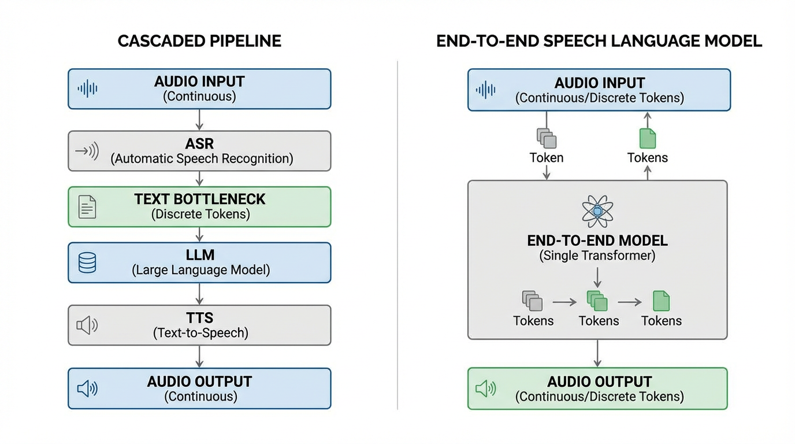
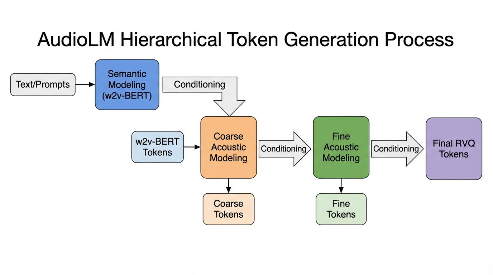

import RVQVisualizer from '../../../components/chapter-11/RVQVisualizer.tsx';

# 11.2 Audio & Speech Integration

텍스트는 깔끔하고 이산적(discrete)이며 고도로 압축되어 있습니다. 이는 어떤 음표를 연주해야 하는지 명시적으로 적어놓은 악보와 같습니다. 반면, 오디오는 실제 오케스트라의 연주 그 자체입니다. 발화된 단어뿐만 아니라 화자의 정체성, 감정 상태, 운율(prosody), 음향적 환경까지 포함하는 지저분하고 연속적인 고차원 데이터 스트림입니다.

과거 수십 년 동안 AI 시스템은 경직된 파이프라인을 통해 음성을 처리해 왔습니다. 오디오를 텍스트로 변환하는 **ASR (Automatic Speech Recognition)** , 텍스트를 처리하는 **LLM (Language Model)** , 그리고 응답을 다시 오디오로 변환하는 **TTS (Text-to-Speech)** 가 그것입니다. 이러한 계단식(cascaded) 접근 방식은 '감정의 병목 현상(emotion bottleneck)'을 유발합니다. 음성이 텍스트로 전사되는 순간, 억양, 망설임, 배경 상황 등 모든 반언어적(paralinguistic) 정보는 영구적으로 소실됩니다.

현대의 **Foundation Models** 은 오디오를 일급 시민(first-class citizen)으로 대우합니다. 오디오를 토큰으로 이산화하거나 연속적인 오디오 공간을 직접 모델링함으로써, LLM이 네이티브하게 '듣고' '말하도록' 학습시킬 수 있습니다. 이 섹션에서는 이산적인 신경망 코덱부터 2026년 SOTA (State-of-the-Art) 기술인 **Continuous Audio Language Models (CALM)** 에 이르기까지, 음성을 대형 언어 모델에 통합하는 이면의 엔지니어링과 수학을 해부합니다.


*Source: Generated by Gemini.*

---

## 1. The Modality Gap and Neural Audio Codecs

오디오 언어 모델링의 근본적인 과제는 샘플링 속도(sampling rate)입니다. 표준 16kHz 오디오 파일은 초당 16,000개의 연속적인 부동 소수점 값을 포함합니다. 반면 텍스트 LLM은 초당 대략 3~4개의 이산적인 토큰을 처리합니다. 원시 파형(raw waveform)을 Transformer에 직접 입력하면 Attention 메커니즘의 메모리 용량을 즉시 고갈시키는 시퀀스 길이가 생성됩니다.

이러한 간극을 메우기 위해 엔지니어들은 SoundStream, EnCodec과 같은 **Neural Audio Codecs** 를 활용합니다. 이 모델들은 소리를 위한 토크나이저 역할을 합니다. **RVQ (Residual Vector Quantization)** 라는 기법을 사용하여 고차원의 파형을 낮은 프레임 속도의 이산적인 토큰 시퀀스로 압축합니다.

### The Mathematics of RVQ

표준 **Vector Quantization (VQ)** 는 입력 벡터를 단일 학습된 코드북에서 가장 가까운 벡터로 매핑합니다. 그러나 인간 음성의 방대한 분산을 모두 포착할 만큼 큰 단일 코드북을 만드는 것은 연산적으로 불가능에 가깝습니다. **RVQ** 는 여러 개의 작은 코드북을 계단식(cascaded)으로 연결하여 이 문제를 해결합니다.

인코딩된 연속 오디오 프레임 $x \in \mathbb{R}^d$ 와 $Q$ 개의 코드북 $C_1, C_2, \dots, C_Q$ 가 주어졌을 때 (각 코드북은 차원이 $d$ 인 $N$ 개의 벡터를 포함):

1. 잔차(residual) 초기화: $x_1 = x$
2. 1부터 $Q$ 까지의 각 양자화기(quantizer) 단계 $q$ 에 대해:
   - 가장 가까운 코드북 벡터 찾기: 
     $$i_q = \arg\min_{i \in \{1 \dots N\}} \| x_q - C_q[i] \|_2^2$$
   - 양자화된 벡터 가져오기: $\hat{x}_q = C_q[i_q]$
   - 다음 단계를 위한 잔차 업데이트: $x_{q+1} = x_q - \hat{x}_q$
3. 최종 재구성된 벡터는 양자화된 벡터들의 합입니다:
   $$\hat{x} = \sum_{q=1}^Q \hat{x}_q$$

처음 몇 개의 코드북은 가장 두드러진 특징(의미적 내용, 전반적인 음성 구조)을 포착하는 반면, 더 깊은 단계의 코드북은 잔차에 남은 세밀한 디테일(음색, 배경 소음)을 포착합니다.

### Engineering the Quantizer

아래는 RVQ 모듈의 현실적인 PyTorch 구현체입니다. 확장된 이차 방정식 $(x-y)^2 = x^2 + y^2 - 2xy$ 를 사용하여 거리를 얼마나 효율적으로 계산하는지 주목하십시오.

```python
import torch
import torch.nn as nn

class ResidualVectorQuantizer(nn.Module):
    def __init__(self, num_quantizers=8, codebook_size=1024, dim=128):
        """
        Args:
            num_quantizers: 계단식 코드북의 개수 (Q)
            codebook_size: 각 코드북당 벡터의 개수 (N)
            dim: 각 벡터의 차원 (d)
        """
        super().__init__()
        self.num_quantizers = num_quantizers
        self.codebooks = nn.ParameterList([
            nn.Parameter(torch.randn(codebook_size, dim)) 
            for _ in range(num_quantizers)
        ])
        
    def forward(self, x):
        # x shape: [batch_size, seq_len, dim]
        residual = x
        quantized_out = torch.zeros_like(x)
        token_indices = []
        
        for i in range(self.num_quantizers):
            codebook = self.codebooks[i]
            
            # Squared L2 distance 계산: x^2 + y^2 - 2xy
            # residual^2: [batch, seq, 1]
            # codebook^2: [codebook_size]
            # matmul: [batch, seq, codebook_size]
            dist = (
                residual.pow(2).sum(dim=-1, keepdim=True) 
                + codebook.pow(2).sum(dim=-1) 
                - 2 * torch.matmul(residual, codebook.t())
            )
            
            # 가장 가까운 코드북 벡터의 인덱스 찾기
            indices = torch.argmin(dist, dim=-1) # [batch_size, seq_len]
            token_indices.append(indices)
            
            # 양자화된 벡터 조회 및 누적
            quantized = codebook[indices]
            quantized_out += quantized
            
            # 다음 양자화기 단계를 위한 잔차 업데이트
            residual = residual - quantized
            
        # token_indices shape: [batch_size, num_quantizers, seq_len]
        return quantized_out, torch.stack(token_indices, dim=1)

# 50Hz 오디오 프레임 레이트를 시뮬레이션하는 실행 예제
batch_size = 2
seq_len = 50 # 1초 분량의 오디오
dim = 128

dummy_audio_features = torch.randn(batch_size, seq_len, dim)
rvq = ResidualVectorQuantizer(num_quantizers=8, codebook_size=1024, dim=128)
reconstructed, indices = rvq(dummy_audio_features)

print(f"Original features: {dummy_audio_features.shape}")
print(f"Reconstructed features: {reconstructed.shape}")
print(f"Token indices shape: {indices.shape}") 
# Output: -> 프레임당 8개의 토큰이 생성됨
```

<RVQVisualizer lang="ko" client:load />

---

## 2. The Pioneers: AudioLM and VALL-E

오디오가 토큰화되면 텍스트처럼 다룰 수 있습니다. 그러나 오디오 토큰을 자기회귀적(autoregressive)으로 예측하는 것은 의미적 일관성(semantic coherence)과 음향적 충실도(acoustic fidelity) 사이의 심각한 트레이드오프를 발생시킵니다.

### Hierarchical Tokenization (AudioLM)
Google의 AudioLM [[1]](#ref-1) 은 "무엇을 말하고 있는지"와 "어떻게 말하고 있는지"를 분리하여 이 문제를 해결했습니다. 두 가지 서로 다른 유형의 토큰을 사용합니다:
1. **Semantic Tokens** : w2v-BERT와 같은 자기지도 학습 모델에서 추출됩니다. 이 토큰들은 언어적 구조와 음성적 내용을 포착하지만 화자의 정체성은 버립니다. 낮은 비트레이트를 가집니다.
2. **Acoustic Tokens** : 신경망 코덱(SoundStream)에서 추출됩니다. 고음질의 음향적 디테일을 포착합니다.

AudioLM은 시퀀스를 계층적으로 모델링합니다. 먼저 장기적인 언어적 일관성을 보장하기 위해 의미적 토큰을 자기회귀적으로 예측하고, 그 다음 해당 토큰들을 조건으로 삼아 음향적 토큰을 생성하여 고음질 출력을 보장합니다.

### Zero-Shot TTS as Language Modeling (VALL-E)
Microsoft의 VALL-E [[2]](#ref-2) 는 이 개념을 TTS로 확장했습니다. VALL-E는 TTS를 전통적인 멜 스펙트로그램 모델처럼 연속 신호 회귀 문제로 취급하는 대신, 조건부 언어 모델링 작업으로 취급합니다. 텍스트 프롬프트와 대상 화자의 단 3초짜리 음향 토큰 시퀀스가 주어지면, VALL-E는 후속 음향 토큰을 자기회귀적으로 예측합니다. LLM의 인컨텍스트 러닝(in-context learning) 기능을 통해 화자의 목소리, 감정, 심지어 배경의 방 울림까지 매끄럽게 모방할 수 있습니다.


*Source: Generated by Gemini.*

---

## 3. The Unified Era: AudioPaLM and Factorized Tokens

텍스트와 오디오를 위해 별도의 모델을 유지하는 것은 시스템 복잡성을 가중시킵니다. 다음 진화 단계는 단일 디코더 전용(decoder-only) Transformer 내에 두 모달리티를 통합하는 것이었습니다.

**AudioPaLM** [[3]](#ref-3) 은 사전 학습된 텍스트 LLM (PaLM-2)과 AudioLM의 이산 오디오 토큰화 파이프라인을 융합합니다. 텍스트 토큰(SentencePiece)과 오디오 토큰을 모두 포함하도록 어휘(vocabulary)를 확장함으로써, 모델은 텍스트와 오디오가 교차로 섞인 데이터를 소화할 수 있습니다. 이를 통해 중간 텍스트 표현 없이 직접적인 **S2ST (Speech-to-Speech Translation)** 및 **ASR** 이 가능해지며, 언어 간 반언어적(paralinguistic) 단서들을 보존할 수 있습니다.

성능을 더욱 향상시키기 위해, UniAudio 2.0과 같은 최근 아키텍처들은 **Factorized Audio Tokenization** 을 도입했습니다. 단순히 RVQ 토큰을 LLM에 쏟아붓는 대신, 오디오를 다음과 같이 분리합니다:
- **Reasoning Tokens** : 텍스트와 정렬된 고수준의 표현으로, 의미적 계획 및 이해에 사용됩니다.
- **Reconstruction Tokens** : 의미가 풍부한 음향적 단서들로, 고음질 파형 재구성에만 배타적으로 사용됩니다.

이러한 분해(factorization)는 의미적 추론 단계에서 LLM이 예측 불가능한 배경 소음을 예측하느라 모델의 용량(capacity)을 낭비하는 것을 방지합니다.

---

## 4. 최신 동향: Overcoming the Discrete Bottleneck

이산 토큰이 오디오와 LLM 사이의 간극을 성공적으로 메웠지만, 2025년과 2026년에 집중적으로 연구된 치명적인 결함인 **DRI (Discrete Representation Inconsistency)** [[4]](#ref-4) 를 야기했습니다.

### The DRI Problem
텍스트는 결정론적(deterministic)입니다. "Hello"라는 단어는 항상 동일한 정수 ID로 토큰화됩니다. 반면 오디오는 그렇지 않습니다. 신경망 오디오 인코더는 수용 영역(receptive field)이 큰 합성곱 레이어를 사용하기 때문에, 배경 소음이나 선행 컨텍스트가 약간만 변해도 연속적인 임베딩(embedding)이 달라집니다. 엄격한 이산 양자화기(RVQ)를 통과할 때, 이러한 미세한 변화는 완전히 동일하게 발화된 단어임에도 불구하고 선택되는 코드북 인덱스들이 완전히 다른 토큰 시퀀스로 쏟아지게(cascade) 만듭니다. 이러한 다대일(many-to-one) 매핑은 다음 토큰 예측 과정에서 LLM을 심각하게 혼란스럽게 만들어, 말더듬, 단어 건너뛰기, 환각(hallucination) 현상을 초래합니다.

### Continuous Audio Language Models (CALM)
DRI 문제와 RVQ의 손실 압축 병목 현상을 우회하기 위해, 2026년의 SOTA 기술은 **CALM (Continuous Audio Language Models)** [[5]](#ref-5) 으로 전환되었습니다.

CALM은 연속적인 오디오를 이산적인 ID로 강제 변환하는 대신, 매 타임스텝마다 연속적인 문맥 임베딩을 생성하는 거대한 Transformer 백본을 인스턴스화합니다. 그런 다음 이 임베딩은 일관성 모델링(consistency modeling)을 통해 오디오 VAE (Variational Autoencoder)의 다음 연속 프레임을 생성하는 작은 MLP 또는 디퓨전(diffusion) 헤드의 조건으로 사용됩니다.

양자화 단계를 완전히 생략함으로써 CALM은 더 낮은 연산 비용으로 더 높은 오디오 충실도를 달성합니다. 깊고 계단식으로 연결된 코드북이 필요 없어지며, 모델이 프레임당 8~16개의 이산 토큰이 아닌 타임스텝당 단 하나의 연속 벡터만 예측하면 됩니다.

---

## Summary & Next Steps

LLM에 오디오를 통합하는 기술은 계단식 ASR/TTS 파이프라인에 대한 과도한 의존에서 벗어나 네이티브 멀티모달 이해로 빠르게 진화했습니다. 우리는 소리를 이산화하기 위해 신경망 코덱(RVQ)을 엔지니어링했고, 의미(semantics)와 음향(acoustics)의 균형을 맞추기 위해 계층적 모델링을 활용했으며, 이제는 양자화 오류를 완전히 제거하기 위해 연속 잠재 모델링(CALM)으로 나아가고 있습니다.

---

## Quizzes

<details>
<summary>Quiz 1: 텍스트는 "문맥 독립적(context-independent)"인 반면 음향적 이산 표현은 "문맥 의존적(context-dependent)"인 이유는 무엇이며, 이로 인해 발생하는 문제는 무엇인가?</summary>
*텍스트 토큰화는 엄격한 사전 조회에 의존하므로 주변 텍스트와 관계없이 단어가 항상 동일한 ID에 매핑됩니다. 반면 음향 토큰은 수용 영역(receptive field)이 큰 합성곱 인코더에 의해 생성됩니다. 배경 소음이나 이전 오디오의 미세한 변화가 연속적인 임베딩을 변경시켜, 양자화기가 동일한 발화 단어에 대해 완전히 다른 토큰 시퀀스를 선택하게 만듭니다. 이는 이산 표현의 불일치(DRI)를 유발하여 자기회귀적 예측을 매우 불안정하게 만듭니다.*
</details>

<details>
<summary>Quiz 2: RVQ (Residual Vector Quantization)에서 양자화기 깊이 $q$ 가 증가함에 따라 잔차 벡터 $x_{q+1}$ 에는 어떤 변화가 일어나는가?</summary>
*잔차 벡터의 크기(분산)가 감소합니다. 처음 몇 개의 코드북은 가장 두드러진 특징(일반적인 음성 구조나 큰 소리 등)을 포착하는 반면, 더 깊은 코드북은 미세한 음색, 숨소리, 배경의 방 울림과 같은 미세하고 분산이 적은 음향적 디테일을 포착합니다.*
</details>

<details>
<summary>Quiz 3: AudioLM은 장기적인 언어적 일관성과 고음질 오디오 재구성 사이의 트레이드오프를 어떻게 해결했는가?</summary>
*계층적 토큰화(hierarchical tokenization) 접근법을 사용하여 해결했습니다. 먼저 화자의 정체성 없이 장기적인 언어 구조를 포착하는 프레임 레이트가 낮은 의미적 토큰(Semantic Tokens)을 예측하고, 그 의미적 토큰을 조건으로 삼아 고음질 오디오 디테일을 포착하는 프레임 레이트가 높은 음향적 토큰(Acoustic Tokens)을 생성합니다.*
</details>

<details>
<summary>Quiz 4: 2026년 엣지 디바이스(edge-device) 배포 환경에서 이산 코덱 기반 모델보다 CALM (Continuous Audio Language Model)이 더 선호될 수 있는 이유는 무엇인가?</summary>
*손실 코덱의 이산 토큰은 심각한 트레이드오프를 강제합니다. 오디오 충실도를 높이려면 프레임당 기하급수적으로 더 많은 토큰을 생성해야 하며(더 깊은 RVQ), 이는 시퀀스 길이와 연산 비용을 급격히 증가시킵니다. CALM은 연속적인 임베딩을 직접 출력하고 일관성 모델링을 사용하여 다음 프레임을 생성함으로써 양자화 병목 현상을 우회합니다. 이는 DRI 문제를 완화하고 프레임당 필요한 예측 단계 수를 줄여, 더 낮은 추론 지연 시간(latency)으로 더 높은 품질을 이끌어냅니다.*
</details>

<details>
<summary>Quiz 5: 음성 토큰에 대해 다중 코드북 양자화(예: Residual Vector Quantization)를 사용할 때 Key-Value(KV) 캐시 메모리 풋프린트를 어떻게 계산합니까? 이를 수학적으로 표현하고 트레이드오프를 설명하십시오.</summary>
*시퀀스 길이를 $L$, 임베딩 차원을 $D$, 레이어 수를 $N_{layer}$라고 가정합니다. 표준 FP16에서 KV 캐시 풋프린트는 $4 \times L \times D \times N_{layer}$ 바이트입니다 (Key와 Value 각각 2바이트씩, 총 4배수). $K$개의 센트로이드($\log_2 K$ 비트로 표현됨)를 가진 $N_c$개의 코드북을 사용하는 다중 코드북 양자화를 적용하면, 하나의 토큰은 $N_c \times \log_2 K$ 비트로 표현됩니다. KV 캐시를 이 방식으로 양자화하면, Key에 대한 풋프린트는 $L \times N_c \times \lceil \log_2 K / 8 \rceil \times N_{layer}$ 바이트가 됩니다. 메모리 절감 비율은 $2 \times D \times 16 / (2 \times N_c \times \log_2 K)$가 됩니다. 트레이드오프: 메모리는 크게 절약되지만, 어텐션 계산 중 역양자화(de-quantization) 오버헤드로 인해 레이턴시가 증가할 수 있습니다.*
</details>

---

## References

1. <a id="ref-1"></a>Borsos, Z., et al. (2022). *AudioLM: a Language Modeling Approach to Audio Generation*. [arXiv:2209.03143](https://arxiv.org/abs/2209.03143).
2. <a id="ref-2"></a>Wang, C., et al. (2023). *Neural Codec Language Models are Zero-Shot Text to Speech Synthesizers (VALL-E)*. [arXiv:2301.02111](https://arxiv.org/abs/2301.02111).
3. <a id="ref-3"></a>Rubenstein, P. K., et al. (2023). *AudioPaLM: A Large Language Model That Can Speak and Listen*. [arXiv:2306.12925](https://arxiv.org/abs/2306.12925).
4. <a id="ref-4"></a>Liu, W., et al. (2025). *Analyzing and Mitigating Inconsistency in Discrete Speech Tokens for Neural Codec Language Models*. [ACL Anthology](https://aclanthology.org/2025.acl-long.1498/).
5. <a id="ref-5"></a>Rouard, S., et al. (2025). *Continuous Audio Language Models*. [arXiv:2509.06926](https://arxiv.org/abs/2509.06926).