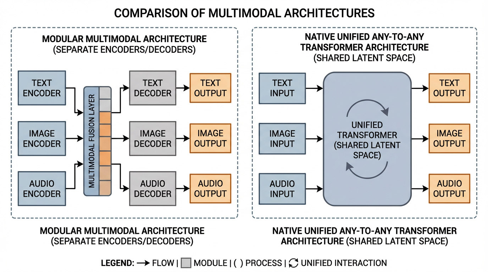

import OmniAttentionVisualizer from '../../../components/chapter-11/OmniAttentionVisualizer.tsx';

# 11.3 Unified Multimodal (Any-to-Any)

이전 섹션에서는 오디오가 Foundation Models에 어떻게 통합되었는지, 즉 계단식(cascaded) 파이프라인에서 연속적인 잠재 모델링(continuous latent modeling)으로 진화하는 과정을 살펴보았습니다. 그러나 오디오, 비전, 텍스트를 각각 고립된 통합 문제로 취급하면 필연적으로 시스템의 파편화를 초래합니다. 만약 모델이 이미지를 위한 특화된 어댑터, 오디오를 위한 별도의 신경망 코덱, 그리고 비디오를 위한 독립적인 디퓨전(diffusion) 헤드를 요구한다면, 아키텍처는 여러 구성 요소가 억지로 접착된 취약한 누더기(patchwork)가 되고 맙니다.

2024년부터 2026년 사이에 뚜렷하게 보이는 연구 흐름 중 하나가 **Native Any-to-Any Architectures** 로의 이동입니다. 사전 학습된 LLM을 동결(freeze)하고 교차 어텐션(cross-attention)으로 외부 인코더를 붙이는 "모듈형 멀티모달(modular multimodality)" 대신, 최근 시스템들은 멀티모달 처리를 더 많이 공유 백본 안으로 끌어들이려 합니다. 이런 관점에서는 텍스트, 이미지 패치, 오디오 프레임, 때로는 action-like token까지 공통 잠재 공간(common latent space) 안에서 다뤄집니다.

이 섹션에서는 통합된 Any-to-Any 모델 이면의 엔지니어링 원리를 해부하고, 옴니 토큰화(omni-tokenization), 교차 자기회귀(interleaved autoregression), 그리고 이를 지배하는 모달리티 불가지론적(modality-agnostic) 스케일링 법칙을 탐구합니다.


*출처: AI 생성 이미지.*

---

## 1. The Architecture of Unity: Omni-Tokens

Any-to-Any 모델의 핵심 엔지니어링 과제는 각 모달리티의 고유한 특성을 파괴하지 않으면서, 다양하고 고차원적인 신호들을 균일한 Transformer 백본으로 라우팅(routing)하는 것입니다.

초기 멀티모달 모델(예: Flamingo 또는 초기 LLaVA)에서는 시각적 특징이 텍스트 임베딩 공간으로 매핑되었습니다. 모델이 사실상 이미지를 텍스트 비슷한 표현으로 "번역"한 셈입니다. 반면 Qwen2.5-Omni [[1]](#ref-1) 같은 좀 더 네이티브한 멀티모달 시스템과 GPT-4o/Gemini 같은 제품 계열은 **Omni-Token Space** 에 더 가까운 설계를 지향합니다.

모달리티가 텍스트를 모방하도록 강제하는 대신, 모델은 기본 차원을 확장하여 모든 모달리티의 본질적인 구조를 수용합니다. 텍스트, 연속적인 오디오 프레임, 그리고 공간적인 이미지 패치는 모두 동등한 피어(peer)로 취급되는 공유된 고차원 공간으로 투영(projection)됩니다.

### Interleaved Autoregression
모든 입력이 동일한 차원 공간을 공유하기 때문에, Transformer는 이들을 단일하고 연속적인 시퀀스로 처리할 수 있습니다. 이는 **Fluid Context Switching** 을 가능하게 합니다. 사용자 프롬프트는 문자 그대로 `[Text] [Image Patch] [Text] [Audio Frame]` 과 같은 구조로 구성될 수 있습니다. 모델은 교차로 섞인(interleaved) 전체 시퀀스에 대해 self-attention을 계산하므로, 오디오 토큰이 텍스트를 거치지 않고도 이미지 패치에 직접 어텐션을 가할 수 있습니다.

### Engineering the Omni-Projector
이를 달성하기 위해 모델의 입력 레이어는 대대적으로 수정됩니다. 단일 텍스트 임베딩 테이블 대신, 모델은 각 모달리티에 특화된 경량 프로젝터(projector)를 사용하여 원시 특징(raw features)을 공유 차원 $D$ 로 매핑합니다.

아래는 Omni-Token Projector의 현실적인 PyTorch 구현체입니다. 학습 가능한 모달리티 임베딩(modality embeddings)이 추가된 것에 주목하십시오. 이는 공유 공간에서 우연히 비슷한 벡터로 매핑된 텍스트 토큰과 오디오 프레임을 모델이 혼동하지 않도록 방지하는 중요한 역할을 합니다.

```python
import torch
import torch.nn as nn

class OmniTokenProjector(nn.Module):
    def __init__(self, hidden_dim=4096):
        super().__init__()
        self.hidden_dim = hidden_dim
        
        # 1. 텍스트 임베딩 (표준 이산 룩업 테이블)
        self.text_embed = nn.Embedding(num_embeddings=128000, embedding_dim=hidden_dim)
        
        # 2. 이미지 패치 프로젝터 (예: ViT 또는 SigLIP 특징에서 추출)
        self.image_projector = nn.Linear(1152, hidden_dim)
        
        # 3. 오디오 프레임 프로젝터 (예: 연속 오디오 인코더에서 추출)
        self.audio_projector = nn.Linear(1024, hidden_dim)
        
        # 모달리티 타입 임베딩 (0: 텍스트, 1: 이미지, 2: 오디오)
        # 어텐션 메커니즘이 신호의 출처를 구별하도록 돕는 핵심 요소
        self.modality_embed = nn.Embedding(num_embeddings=3, embedding_dim=hidden_dim)

    def forward(self, text_ids=None, image_features=None, audio_features=None):
        embeddings = []
        
        if text_ids is not None:
            text_emb = self.text_embed(text_ids)
            # 모달리티 식별자 추가
            text_emb += self.modality_embed(torch.tensor(0, device=text_emb.device))
            embeddings.append(text_emb)
            
        if image_features is not None:
            img_emb = self.image_projector(image_features)
            img_emb += self.modality_embed(torch.tensor(1, device=img_emb.device))
            embeddings.append(img_emb)
            
        if audio_features is not None:
            aud_emb = self.audio_projector(audio_features)
            aud_emb += self.modality_embed(torch.tensor(2, device=aud_emb.device))
            embeddings.append(aud_emb)
            
        # 실제 forward pass에서는 시퀀스 위치에 따라 토큰들이 교차로 배열(interleaved)됩니다.
        # 이 데모에서는 단순히 시퀀스 차원을 기준으로 이어 붙입니다(concatenate).
        return torch.cat(embeddings, dim=1) if embeddings else None

# 교차 프롬프트(interleaved prompt)를 시뮬레이션하는 실행 예제
batch_size = 2
text_ids = torch.randint(0, 128000, (batch_size, 10)) # 10개의 텍스트 토큰
image_features = torch.randn(batch_size, 256, 1152)   # 256개의 이미지 패치 (예: 16x16 그리드)
audio_features = torch.randn(batch_size, 50, 1024)    # 50개의 오디오 프레임

projector = OmniTokenProjector(hidden_dim=4096)
unified_sequence = projector(text_ids, image_features, audio_features)

print(f"Text tokens shape: {text_ids.shape}")
print(f"Image patches shape: {image_features.shape}")
print(f"Audio frames shape: {audio_features.shape}")
print(f"Unified sequence shape: {unified_sequence.shape}") 
# Output: -> Transformer 백본에 완벽하게 정렬된 316개의 토큰 생성
```

<OmniAttentionVisualizer lang="ko" client:load />

---

## 2. Tokenized Diffusion and Continuous Flow

입력 프로젝션은 비교적 직관적이지만, Any-to-Any 출력을 *생성(generation)* 하는 것은 역사적으로 매우 복잡한 문제였습니다. 텍스트 생성은 Softmax 레이어를 통해 이산적인 어휘(vocabulary)에 대한 다음 토큰 예측(next-token prediction)에 의존합니다. 그렇다면 LLM이 어떻게 연속적인 4K 비디오나 고음질 오디오 파형을 네이티브하게 생성할 수 있을까요?

### The VQ-VAE vs. DiT Debate
최근까지 지배적인 접근 방식은 VQ-VAE (Vector Quantized Variational Autoencoders)를 사용하여 모든 출력을 이산 공간으로 강제 변환하는 것이었습니다. 모델이 이산적인 "이미지 토큰"을 예측하면, 디코더가 이를 픽셀로 렌더링하는 방식입니다. 그러나 이전 오디오 섹션에서 논의했듯이, 엄격한 양자화는 **Discrete Representation Inconsistency (DRI)** 를 유발하여 세밀하고 연속적인 디테일을 버리게 만듭니다.

이 문제를 푸는 한 가지 유력한 연구 흐름은 자기회귀적 추론과 diffusion-style generation을 하나의 스택 안에서 결합하는 방식입니다 [[2]](#ref-2).

Transformer는 표준 분류 헤드(Softmax) 대신, 구조적 청사진 역할을 하는 연속적인 "옴니 토큰(omni-tokens)"을 출력합니다. 이 연속적인 임베딩은 네트워크 끝에 부착된 경량 디퓨전 헤드(또는 DiT)로 직접 공급됩니다.
1. 자기회귀(autoregressive) 백본은 매크로 구조, 타이밍, 논리적 추론을 처리합니다.
2. 디퓨전(diffusion) 헤드는 마이크로 구조를 처리하여 연속적인 물리적 디테일(픽셀 또는 파형)을 렌더링합니다.

이러한 하이브리드 접근 방식을 통해 모델은 다음 토큰 예측의 논리적 엄밀성을 유지하면서도, 연속적인 디퓨전 모델의 고음질 생성 기능을 달성할 수 있습니다.

---

## 3. Unified Scaling Laws and Cross-Modal Transfer

모델이 단일 모달리티에서 네이티브 Any-to-Any로 전환될 때, 그 스케일링 동작은 극적으로 변화합니다. **Unified Scaling Laws** [[3]](#ref-3) 에 대한 연구는 모델의 성능이 BPC (Bits Per Character)나 모달리티 정규화 손실(modality-normalized loss)과 같은 일반화된 지표로 평가될 때, 모든 모달리티에 걸친 총 연산량(total compute)에 의해 주도되는 경향이 있음을 시사합니다.

### Cross-Modal Transfer Learning
Any-to-Any 아키텍처가 가져온 가장 심오한 엔지니어링적 결과는 **Cross-Modal Transfer Learning** 입니다. 모든 모달리티가 어텐션 레이어에서 동일한 파라미터 가중치를 공유하기 때문에, 한 모달리티에서 특정 개념을 학습하면 수학적으로 다른 모달리티에서도 해당 개념의 표현력이 향상됩니다.

- **Audio to Text**: 고음질 공간 오디오(spatial audio)에 대해 집중적으로 학습하면, 텍스트 기반의 물리 서술형 문제에서 물리적 공간과 타이밍을 추론하는 모델의 능력이 향상됩니다.
- **Video to Physics**: 비디오 스트림에서 다음 프레임을 예측하는 동시에 해당 오디오(예: 공이 튀는 소리)를 처리함으로써, 모델은 내부적으로 물리 엔진을 학습하게 됩니다.

때때로 "발현적 공감각(Emergent Synesthesia)"이라고도 불리는 이 현상은 멀티모달 데이터가 단순히 덧셈(additive)이 아니라 곱셈(multiplicative)의 효과를 낸다는 것을 의미합니다. 단순히 보고 들을 수 있는 모델을 얻는 것이 아니라, 보고 들을 수 있기 때문에 *텍스트를 더 잘 이해하는* 모델을 얻게 되는 것입니다.

---

## 4. Systems Engineering: Disaggregated Serving

프로덕션 환경에서 Any-to-Any 모델을 서빙(serving)하는 것은 거대한 시스템 병목 현상을 유발합니다. 단일 요청 내에서 텍스트 생성(메모리 대역폭 제한적인 자기회귀) 직후에 비디오 생성(연산량 제한적인 디퓨전)이 요구될 수 있기 때문입니다.

**vLLM-Omni** [[4]](#ref-4) 같은 프레임워크는 **Disaggregated Serving** 으로 이 문제에 대응합니다. 전체 Any-to-Any 파이프라인을 단일 GPU 클러스터에서 돌리는 대신, 아키텍처를 스테이지 그래프(stage graph)로 분해합니다. 자기회귀 LLM 백본은 KV 캐시 대역폭에 맞는 하드웨어에서 실행하고, diffusion-style 헤드는 연산 밀도가 높은 워커로 오프로드합니다. 논문은 이렇게 병목을 분리했을 때 job completion time이 크게 줄어든다고 보고합니다.

---

## Summary & Next Steps

Any-to-Any 멀티모달리티로의 전환은 단순한 인터페이스 업데이트가 아니라 근본적인 아키텍처의 재작성입니다. 모든 감각적 입력을 공유된 Omni-Token 공간으로 매핑하고 생성을 위해 연속적인 디퓨전 헤드를 활용함으로써, 모델은 모듈형 어댑터와 이산 코덱이 가진 손실 압축의 병목 현상을 우회합니다. 이 통합된 접근 방식은 교차 모달리티 전이 학습(cross-modal transfer learning)을 잠금 해제하여, 모델이 현실에 대한 보다 포괄적이고 물리 법칙에 기반한 내부 표현을 구축할 수 있게 해줍니다.

---

## Quizzes

<details>
<summary>Quiz 1: 모든 모달리티를 공유 잠재 공간(Omni-Tokens)으로 매핑하는 것이 모듈형 아키텍처에 비해 추론 지연 시간(latency)을 줄이는 이유는 무엇인가?</summary>
*모듈형 아키텍처는 일반적으로 중간 표현을 통해 데이터를 계단식으로 전달해야 합니다(예: 오디오를 텍스트로 변환하고, 텍스트를 처리한 다음, 텍스트를 이미지 프롬프트로 변환). 이는 순차적인 병목 현상을 유발하고 여러 개의 특화된 모델을 메모리에 로드해야 합니다. 반면 공유 잠재 공간을 사용하면 단일 Transformer를 통과하는 한 번의 순전파(forward pass)만으로 모든 모달리티를 동시에 처리하고 생성할 수 있어 지연 시간과 메모리 오버헤드가 대폭 감소합니다.*
</details>

<details>
<summary>Quiz 2: 비디오와 같은 연속적인 모달리티를 생성할 때, 엄격한 이산 벡터 양자화(VQ) 대신 Tokenized Diffusion을 통합하는 것의 주요 이점은 무엇인가?</summary>
*엄격한 VQ는 연속적이고 고차원적인 데이터를 제한된 이산 토큰 ID 세트로 강제 변환하여 이산 표현의 불일치(DRI)를 유발하고 세밀한 디테일을 버리게 만듭니다. Tokenized Diffusion은 Transformer가 디퓨전 헤드를 직접 조건화하는 연속적인 임베딩을 출력하도록 허용함으로써, 매크로 수준의 논리적 계획은 Transformer에 의존하면서도 물리적 신호(픽셀/파형)의 고음질 마이크로 구조를 보존할 수 있습니다.*
</details>

<details>
<summary>Quiz 3: Unified Scaling Law에 따르면, 교차 모달리티 전이 학습(cross-modal transfer learning)은 모델의 성능에 어떤 영향을 미치는가?</summary>
*모든 모달리티가 어텐션 레이어에서 동일한 파라미터 가중치를 공유하기 때문에, 한 모달리티에서 개념을 학습하면 다른 모달리티에서도 해당 표현력이 향상됩니다. 예를 들어, 비디오와 오디오를 학습하면 모델이 물리적 규칙(공간적 관계 및 타이밍 등)을 학습하게 되며, 이는 순수 텍스트 기반 작업에서 프롬프트가 주어졌을 때 동일한 물리적 개념을 추론하는 능력을 수학적으로 향상시킵니다.*
</details>

<details>
<summary>Quiz 4: 프로덕션 서빙 환경에서 Any-to-Any 모델에 Disaggregated Serving(예: vLLM-Omni)이 필요한 이유는 무엇인가?</summary>
*서로 다른 모달리티는 상충되는 하드웨어 최적화 요구 사항을 갖습니다. 텍스트 생성(자기회귀)은 KV 캐시로 인해 메모리 대역폭의 제한을 크게 받는 반면, 시각/오디오 생성(디퓨전)은 연산량의 제한을 크게 받습니다. Disaggregated serving은 이러한 특정 병목 현상에 맞춰 모델을 서로 다른 하드웨어 클러스터로 분할하고, 그 사이에서 중간 옴니 토큰을 라우팅함으로써 전체 시스템 처리량(throughput)을 극대화합니다.*
</details>

---

## References

1. <a id="ref-1"></a>Xu, J., et al. (2025). *Qwen2.5-Omni Technical Report.* [arXiv:2503.20215](https://arxiv.org/abs/2503.20215).
2. <a id="ref-2"></a>Xie, J., et al. (2024). *Show-o: One Single Transformer to Unify Multimodal Understanding and Generation.* [arXiv:2408.12528](https://arxiv.org/abs/2408.12528).
3. <a id="ref-3"></a>Sun, Q., & Guo, Z. (2024). *Scaling Law Hypothesis for Multimodal Model.* [arXiv:2409.06754](https://arxiv.org/abs/2409.06754).
4. <a id="ref-4"></a>Yin, P., et al. (2026). *vLLM-Omni: Fully Disaggregated Serving for Any-to-Any Multimodal Models.* [arXiv:2602.02204](https://arxiv.org/abs/2602.02204).
