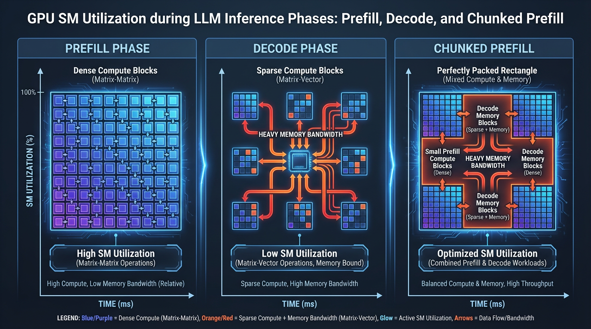

import ContinuousBatchingVisualizer from '../../../components/chapter-12/ContinuousBatchingVisualizer.tsx';

# 12.3 Continuous Batching

이전 섹션에서 다룬 **PagedAttention** 이 메모리 단편화를 제거하고 KV Cache 활용도를 극대화하여 LLM 추론의 *공간적(spatial)* 문제를 훌륭하게 해결했다면, 아직 *시간적(temporal)* 문제가 남아있습니다. 메모리는 방정식의 절반에 불과합니다. GPU에서 연산을 어떻게 스케줄링하느냐가 시스템의 최종 처리량(throughput)을 결정합니다.

전통적인 딥러닝(예: ResNet으로 이미지 분류)에서 배칭(batching)은 매우 단순합니다. $N$ 개의 이미지를 묶어 한 번의 순전파(forward pass)를 실행하고, 동시에 $N$ 개의 예측 결과를 얻습니다. 배치 내의 모든 항목은 처리하는 데 정확히 동일한 시간이 걸립니다.

하지만 자기회귀적(autoregressive) LLM 추론은 매우 동적입니다. 사용자의 프롬프트는 10개 토큰일 수도 있고 10,000개 토큰일 수도 있습니다. 생성되는 응답 역시 단 한 단어("네.")일 수도 있고 방대한 에세이일 수도 있습니다. 이렇게 동적으로 변하는 시퀀스 길이는 기존의 정적 배칭(static batching) 패러다임을 무너뜨렸고, 현대의 추론 엔진들이 OS 수준의 스케줄링 개념을 도입하도록 강제했습니다. 그 결과물이 바로 **Continuous Batching** (또는 iteration-level batching, in-flight batching)이며, 이는 LLM 서빙의 경제학을 근본적으로 뒤바꾼 기술입니다.

---

## 1. 정적 배칭의 치명적 결함: 호송대 효과 (The Convoy Effect)

2022년 이전, HuggingFace Transformers와 같은 추론 프레임워크는 **정적 배칭 (Static Batching)** 을 사용했습니다. 이 패러다임에서는 요청(request)들의 배치가 형성되면, 배치 내의 *모든 단일 요청* 이 `<EOS>` (End of Sequence) 토큰을 방출하거나 최대 길이에 도달할 때까지 GPU가 해당 배치를 계속 처리합니다.

4개의 요청으로 구성된 배치를 가정해 봅시다:
- **요청 A:** 10개의 토큰 생성.
- **요청 B:** 25개의 토큰 생성.
- **요청 C:** 15개의 토큰 생성.
- **요청 D:** 100개의 토큰 생성.

정적 배칭에서는 요청 A, B, C가 매우 빠르게 완료됩니다. 하지만 이들은 배치에서 빠져나갈 수 없으며, 이들의 GPU 메모리 또한 해제될 수 없습니다. 왜냐하면 배치 전체가 요청 D가 100번째 토큰을 생성하기를 기다리고 있기 때문입니다.

이러한 현상을 **호송대 효과 (Convoy Effect)** 또는 *조기 종료 문제(early termination problem)* 라고 부릅니다. GPU는 오직 D를 처리하기 위해 나머지 90번의 반복 연산 동안 A, B, C에 대해 의미 없는 더미 연산(또는 마스킹)을 수행하게 됩니다. 결과적으로 GPU 연산 활용도는 바닥으로 곤두박질치고, 대기열(queue)에 있는 새로운 요청들은 심각한 Head-of-Line Blocking(앞선 작업으로 인한 지연)을 겪게 됩니다.

---

## 2. 패러다임의 전환: 반복 수준 스케줄링 (Iteration-Level Scheduling)

호송대 효과를 해결하기 위해 연구자들은 2022년 기념비적인 논문인 *Orca: A Distributed Serving System for Transformer-Based Generative Models* [[1]](#ref-1) 에서 **반복 수준 스케줄링 (Iteration-Level Scheduling)** 을 도입했습니다.

엔진은 *요청(request)* 단위로 스케줄링하는 대신, *반복(iteration, 단일 토큰 생성)* 단위로 스케줄링을 수행합니다. 활성화된 모든 요청에 대해 정확히 하나의 토큰을 생성하는 순전파(forward pass)가 끝날 때마다, 스케줄러는 연산을 일시 중지하고 배치를 평가합니다:
1. 어떤 요청이 `<EOS>` 토큰을 방출했는가? 그렇다면 즉시 해당 요청을 배치에서 퇴거(evict)시키고 논리적 KV Cache 블록을 해제합니다.
2. 배치에 빈자리(그리고 충분한 VRAM)가 있는가? 그렇다면 대기열에서 즉시 새로운 요청을 가져와 활성 배치에 삽입합니다.

토큰 단위로 요청을 끊임없이 교체(swap)함으로써, GPU는 긴 시퀀스가 끝나기를 결코 기다리지 않습니다. 배치 크기는 항상 인위적으로 "가득 찬(full)" 상태를 유지하며, 이를 통해 처리량(throughput)을 극대화합니다.

### Interactive: Static vs. Continuous Batching

아래의 인터랙티브 시각화 도구를 사용하여 두 방식의 차이를 관찰해 보십시오. **Static Batching** 에서는 가장 긴 요청이 끝날 때까지 기다리는 동안 빈 슬롯(낭비되는 연산)이 어떻게 누적되는지 확인하십시오. 반면 **Continuous Batching** 에서는 슬롯이 열리는 즉시 새로운 요청이 배치로 매끄럽게 들어오는 것을 볼 수 있습니다.

<ContinuousBatchingVisualizer lang="ko" client:load />

---

## 3. 연산과 메모리의 이분법: Prefill vs. Decode

**Continuous Batching** 은 개념적으로는 간단해 보이지만, GPU 하드웨어에서 이를 효율적으로 구현하는 것은 극도로 어렵습니다. 그 이유는 LLM 추론이 서로 상충하는 하드웨어 프로파일을 가진 두 개의 완전히 다른 연산 단계로 구성되기 때문입니다:

1. **Prefill 단계 (프롬프트 처리):** 새로운 요청이 배치에 들어오면, 모델은 초기 KV Cache를 계산하기 위해 입력 프롬프트 전체를 동시에 처리해야 합니다. 수학적으로 이는 거대한 **행렬-행렬 곱셈 (GEMM, Matrix-Matrix Multiplication)** 입니다. 이 작업은 병렬화가 매우 잘 되며, GPU의 Tensor Core를 크게 활용하는 **연산 중심 (Compute-Bound)** 작업입니다.
2. **Decode 단계 (토큰 생성):** 프롬프트 처리가 완료되면, 모델은 한 번에 하나씩 토큰을 생성합니다. 각 토큰에 대해 모델은 새로운 토큰의 Query 벡터를 전체 과거 KV Cache와 곱합니다. 수학적으로 이는 **행렬-벡터 곱셈 (GEMV, Matrix-Vector Multiplication)** 입니다. 이 작업은 Tensor Core를 온전히 활용할 수 없으며, 심각한 **메모리 대역폭 중심 (Memory-Bandwidth-Bound)** 작업입니다.

**Continuous Batching** 을 사용할 때, 스케줄러는 필연적으로 이 두 단계를 섞게 됩니다. 새로 삽입된 요청은 Prefill 단계를 거쳐야 하는 반면, 배치 내의 기존 요청들은 Decode 단계를 거치고 있기 때문입니다.

---

## 4. 최신 SOTA: 청크 단위 프리필 (Chunked Prefill)

Prefill과 Decode를 섞는 것은 거대한 스케줄링 충돌을 일으킵니다. 30개의 요청이 Decode 단계에 있으며, 매 20밀리초마다 부드럽게 토큰을 생성하고 있다고 가정해 봅시다. 갑자기 50,000개의 토큰 프롬프트를 가진 거대한 새 요청이 배치에 들어옵니다.

50k 토큰의 Prefill을 처리하는 데는 GPU의 순수 연산 시간만 800밀리초가 걸릴 수 있습니다. GPU가 이 거대한 GEMM 연산에 점유되어 있기 때문에, 30개의 Decode 요청은 "멈춤(stalled)" 상태가 됩니다. 즉, 800밀리초 동안 단 하나의 토큰도 생성하지 못합니다. 최종 사용자 입장에서는 텍스트 생성이 갑자기 버벅거리고 멈추는 것처럼 보입니다. 이는 엄격한 서비스 수준 목표(SLO), 특히 **TBT (Time-Between-Tokens, 토큰 간 지연 시간)** 지표를 심각하게 위반합니다.

이를 해결하기 위해 최신 추론 엔진(vLLM, SGLang, TensorRT-LLM 등)은 **청크 단위 프리필 (Chunked Prefill)** 을 구현합니다 (이는 SARATHI [[2]](#ref-2) 와 같은 시스템에 의해 처음 대중화되었습니다).

스케줄러는 거대한 프롬프트를 한 번에 처리하는 대신, 관리하기 쉬운 크기의 청크(예: 1,024 또는 2,048 토큰)로 분할합니다. 각 반복(iteration) 동안 스케줄러는 진행 중인 Decode 요청들과 함께 정확히 하나의 Prefill 청크를 "업어 타듯(piggybacks)" 스케줄링합니다.


*Source: Generated by Gemini*

**이 방식이 훌륭한 이유:**
Decode 단계는 메모리 중심(memory-bound)이므로 연산 유닛(Tensor Core)들이 HBM으로부터 데이터를 기다리며 유휴 상태(idle)로 방치됩니다. **Chunked Prefill** 은 연산 집약적인(compute-heavy) 작업을 작은 단위로 쪼개어, 놀고 있는 Tensor Core에 할당합니다. 이는 워크로드의 산술적 강도(arithmetic intensity)를 완벽하게 균형 맞추어, 진행 중인 Decode의 토큰 생성을 지연시키지 않으면서도 거의 100%에 가까운 GPU 활용도를 달성하게 합니다.

---

## 5. 스케줄러 엔지니어링 (PyTorch 시뮬레이션)

현대적인 반복 수준 스케줄러의 메커니즘을 이해하기 위해, Python으로 핵심 이벤트 루프를 시뮬레이션해 볼 수 있습니다. 아래 코드는 매 토큰 생성 단계마다 요청들이 어떻게 상태(`waiting`, `prefill`, `decode`, `finished`)를 전환하는지 보여줍니다.

```python
import torch
from typing import List

class InferenceRequest:
    def __init__(self, req_id: int, prompt_length: int, max_new_tokens: int):
        self.req_id = req_id
        self.prompt_length = prompt_length
        self.max_new_tokens = max_new_tokens
        self.generated_tokens = 0
        self.status = "waiting" # 상태: waiting, prefill, decode, finished

class ContinuousBatchingScheduler:
    def __init__(self, max_batch_size: int):
        self.waiting_queue: List[InferenceRequest] = []
        self.running_batch: List[InferenceRequest] = []
        self.max_batch_size = max_batch_size
        
    def add_request(self, request: InferenceRequest):
        self.waiting_queue.append(request)
        
    def _evict_finished_requests(self):
        """생성이 완료된 요청들을 배치에서 제거합니다."""
        active = []
        for req in self.running_batch:
            # 실제 환경에서는 여기서 <EOS> 토큰 ID 생성 여부도 함께 확인합니다.
            if req.generated_tokens >= req.max_new_tokens:
                req.status = "finished"
                print(f"Request {req.req_id} finished.")
            else:
                active.append(req)
        self.running_batch = active

    def _pull_new_requests(self):
        """배치에 여유 공간이 있다면 대기열에서 새로운 요청을 가져옵니다."""
        available_slots = self.max_batch_size - len(self.running_batch)
        
        while available_slots > 0 and self.waiting_queue:
            new_req = self.waiting_queue.pop(0)
            new_req.status = "prefill"
            self.running_batch.append(new_req)
            available_slots -= 1

    def step(self, mock_model_forward):
        """단일 반복(하나의 토큰 생성 단계)을 실행합니다."""
        # 1. 이전 단계에서 완료된 요청들을 정리합니다.
        self._evict_finished_requests()
        
        # 2. 빈 슬롯을 새로운 요청으로 채웁니다.
        self._pull_new_requests()
        
        if not self.running_batch:
            return # 엔진이 유휴(idle) 상태임
            
        # 3. 단계별로 요청들을 분리합니다.
        prefill_reqs = [r for r in self.running_batch if r.status == "prefill"]
        decode_reqs = [r for r in self.running_batch if r.status == "decode"]
        
        # 4. 순전파(Forward Pass) 실행
        # 실제 엔진에서는 커스텀 CUDA 커널을 사용하여 청크 단위 프리필과 
        # 디코드를 단일 패스로 융합(fuse)합니다.
        mock_model_forward(prefill_reqs, decode_reqs)
        
        # 5. 요청 상태 업데이트
        for req in self.running_batch:
            if req.status == "prefill":
                # 한 번의 반복 후 프롬프트 처리가 완료되면 decode 상태로 전환합니다.
                req.status = "decode" 
            elif req.status == "decode":
                req.generated_tokens += 1

# --- 시뮬레이션 실행 ---
def mock_forward(prefill, decode):
    # GPU 실행 시간을 시뮬레이션합니다.
    pass

scheduler = ContinuousBatchingScheduler(max_batch_size=4)
for i in range(6):
    # 짧은 생성과 긴 생성 요청을 섞어서 추가합니다.
    scheduler.add_request(InferenceRequest(i, prompt_length=100, max_new_tokens=(i+1)*5))

iteration = 0
while scheduler.waiting_queue or scheduler.running_batch:
    print(f"Iteration {iteration} | Active Batch Size: {len(scheduler.running_batch)}")
    scheduler.step(mock_forward)
    iteration += 1
```

---

## 6. 요약 및 열린 질문 (Summary and Open Questions)

**Continuous Batching** 은 LLM 추론 스케줄러를 단순한 FIFO(First-In-First-Out) 큐에서 복잡한 OS 형태의 작업 관리자로 탈바꿈시켰습니다. 반복(iteration) 수준에서 작동함으로써, 추론 엔진은 요청 길이의 편차와 관계없이 높은 GPU 활용도를 유지할 수 있습니다. 나아가 **Chunked Prefill** 과 같은 고급 기법은 엔지니어들이 연산 중심의 Prefill 단계와 메모리 중심의 Decode 단계 사이의 균형을 맞출 수 있게 하여, 지연 시간(TBT)을 희생하지 않으면서도 높은 처리량을 보장합니다.

하지만 완벽한 스케줄링과 메모리 관리(PagedAttention)를 갖추었음에도 불구하고, 우리는 Decode 단계에서 GPU의 메모리 대역폭이라는 근본적인 한계에 부딪히게 됩니다. 한 번에 하나의 토큰을 생성하려면 매 단계마다 HBM에서 SRAM으로 모델의 전체 가중치(weights)를 불러와야만 합니다. 이 자기회귀적 병목 현상을 깨고 한 번의 순전파로 *여러 개* 의 토큰을 생성할 방법은 없을까요? 우리는 다음 섹션인 **추측 해독 (Speculative Decoding)** 에서 이 질문에 대한 해답을 탐구할 것입니다.

---

## Quizzes

<details>
<summary>Quiz 1: 정적 배칭(Static Batching)이 LLM 추론 시 GPU 활용도를 심각하게 떨어뜨리는 원인은 무엇인가?</summary>
*호송대 효과(Convoy Effect) 때문입니다. 배치 내 요청들의 생성 길이가 다를 경우, 짧은 요청들은 일찍 완료되지만 가장 긴 요청이 끝날 때까지 메모리를 해제하거나 배치에서 나갈 수 없습니다. 이로 인해 GPU는 새로운 요청을 처리하지 못하고 빈 사이클을 낭비하게 됩니다.*
</details>

<details>
<summary>Quiz 2: Prefill 단계와 Decode 단계 간 하드웨어 활용의 가장 큰 차이점은 무엇인가?</summary>
*Prefill 단계는 전체 프롬프트를 동시에 처리하는 행렬-행렬 곱셈(GEMM)을 수행하므로 고도로 연산 중심(Compute-Bound)입니다. 반면 Decode 단계는 한 번에 하나의 토큰을 생성하는 행렬-벡터 곱셈(GEMV)을 수행하며, KV Cache와 모델 가중치를 끊임없이 읽어와야 하므로 심각한 메모리 대역폭 중심(Memory-Bandwidth-Bound)입니다.*
</details>

<details>
<summary>Quiz 3: Chunked Prefill은 Continuous Batching에서 발생하는 지연 시간(TBT) 스파이크 문제를 어떻게 해결하는가?</summary>
*거대한 Prefill 요청이 배치에 들어오면 GPU 연산 자원을 독점하여 진행 중인 Decode 요청들의 토큰 생성을 멈추게 만듭니다. Chunked Prefill은 이 거대한 프롬프트를 작은 블록으로 쪼개어 Decode 반복 연산에 업어 타듯(piggyback) 스케줄링함으로써, Decode를 지연시키지 않으면서 연산과 메모리 작업의 균형을 맞춥니다.*
</details>

<details>
<summary>Quiz 4: 반복 수준 스케줄러(Iteration-Level Scheduler)에서 대기열의 새로운 요청이 활성 GPU 배치로 들어갈 수 있는 정확한 시점은 언제인가?</summary>
*어떤 토큰 생성 단계(반복)의 경계에서든 가능합니다. 순전파(forward pass)가 완료된 직후 스케줄러는 배치를 평가하여 EOS 토큰을 생성한 요청을 퇴거시키고, 다음 순전파가 시작되기 전에 빈자리에 새로운 요청을 즉시 끌어옵니다.*
</details>

<details>
<summary>Quiz 5: 정적 배칭(Static Batching)과 동적/연속 배칭(Continuous Batching)의 스케줄러 큐 상태 전이를 수학적으로 공식화하시오. 반복 $t$ 에서의 활성 요청 집합을 $B_t$, 대기 큐를 $Q_t$, 요청 $r$ 이 `<EOS>` 를 방출하는 반복 시점을 $E(r)$ 이라 정의한다.</summary>
*정적 배칭에서 상태 전이는 블록(block) 단위로 이루어집니다. $B_t$ 내에 $t < E(r)$ 인 요청 $r$ 이 하나라도 존재한다면 $B_{t+1} = B_t$ 입니다. 새로운 요청은 배치가 완전히 비었을 때만 가져올 수 있습니다: $B_t = \emptyset$ 일 때만 $B_{t+1} = \text{pop}(Q_t, \text{max\_batch})$ 입니다. 반면 연속 배칭에서는 상태 전이가 반복(iteration) 수준에서 발생합니다: $B_{t+1} = \{r \in B_t \mid t < E(r)\} \cup \text{pop}(Q_t, \text{max\_batch} - |\{r \in B_t \mid t < E(r)\}|)$ 입니다. 이는 모든 반복 $t$ 마다 활성 요청 수 $|B_t|$ 를 $\text{max\_batch}$ 로 최대화하여 호송대 효과를 완전히 방지합니다.*
</details>

---

## References

1. <a id="ref-1"></a>Yu, G.-I., Jeong, J. S., Kim, G.-W., Kim, S., & Chun, B.-G. (2022). "Orca: A Distributed Serving System for Transformer-Based Generative Models". *16th USENIX Symposium on Operating Systems Design and Implementation (OSDI 22)*. [arXiv:2203.10842](https://arxiv.org/abs/2203.10842)
2. <a id="ref-2"></a>Agrawal, A., Panwar, A., Mohan, J., Kwatra, N., Gulavani, B. S., & Ramjee, R. (2023). *SARATHI: Efficient LLM Inference by Piggybacking Decodes with Chunked Prefills*. *arXiv preprint arXiv:2308.16369*. [arXiv:2308.16369](https://arxiv.org/abs/2308.16369)