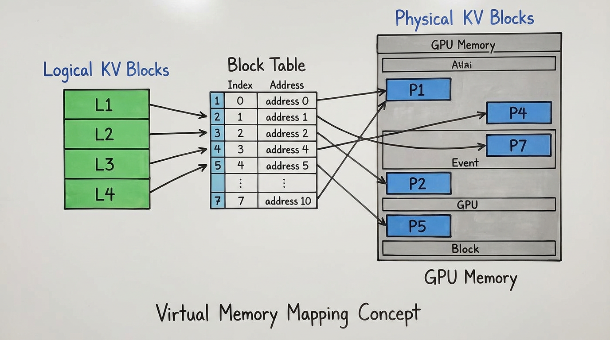

import PagedAttentionVisualizer from '../../../components/chapter-12/PagedAttentionVisualizer.tsx';

# 12.2 PagedAttention (vLLM)

이전 섹션에서 확인했듯, **KV Cache** 는 자기회귀적(autoregressive) LLM 서빙에서 가장 치명적인 병목 지점입니다. Multi-Head Latent Attention (MLA)나 양자화(Quantization) 같은 아키텍처 혁신이 캐시의 *절대적인 크기* 를 줄이는 데 기여했지만, 이는 근본적인 시스템 엔지니어링 문제, 즉 **'이 거대한 메모리를 어떻게 할당하고 관리할 것인가'** 를 해결하지는 못합니다.

2023년 이전의 표준 추론 백엔드(예: HuggingFace Transformers)는 **KV Cache** 메모리를 연속적인(contiguous) 덩어리로 할당했습니다. 사용자의 프롬프트에 대한 최종 응답 길이가 요청 시작 시점에는 알 수 없기 때문에, 시스템은 모델이 지원하는 최대 컨텍스트 윈도우(maximum context window)를 기준으로 메모리를 과도하게 할당(over-allocate)할 수밖에 없었습니다. 이러한 순진한 접근 방식은 고대역폭 메모리(HBM)의 재앙적인 낭비를 초래했고, 단일 GPU가 처리할 수 있는 동시 요청 수를 심각하게 제한했습니다.

이 병목 현상에 대한 해결책은 새로운 신경망 아키텍처가 아니라, 1960년대부터 존재해 온 고전적인 운영체제(OS) 개념인 **가상 메모리(Virtual Memory)** 에서 나왔습니다. 그 결과물인 **PagedAttention** 알고리즘은 **vLLM** 엔진의 핵심을 이루며, LLM 서빙의 경제학을 근본적으로 재정의했습니다.

---

## 1. The Fragmentation Crisis (단편화 위기)

**PagedAttention** 이 왜 혁명적인지 이해하려면, 기존 LLM 서빙 시스템의 메모리 프로파일을 면밀히 살펴봐야 합니다. 동적인 시퀀스 생성을 위해 연속적인 메모리 할당을 사용할 때, 두 가지 유형의 단편화(Fragmentation)가 발생합니다.

1. **내부 단편화 (Internal Fragmentation):** 시스템이 프롬프트를 수신하면 **KV Cache** 를 위해 연속된 메모리 청크를 할당해야 합니다. 모델이 10개의 토큰을 생성할지 1,000개의 토큰을 생성할지 알 수 없으므로, 시스템은 가능한 최대 시퀀스 길이(예: 2,048 토큰)만큼 메모리를 예약합니다. 만약 모델이 단 20개의 토큰만 생성하고 멈춘다면, 나머지 2,028개 토큰 분량의 메모리는 예약만 된 채 전혀 사용되지 않고 버려집니다.
2. **외부 단편화 (External Fragmentation):** 길이가 각기 다른 요청들이 서로 다른 시간에 종료되면서, 연속된 메모리 청크들이 해제되고 GPU VRAM 곳곳에 작은 "구멍(holes)"들이 남게 됩니다. 이 구멍들을 모두 합치면 엄청난 양의 메모리가 되지만, 물리적으로 연속되어 있지 않기 때문에 새로운 대규모 요청을 할당하는 데 사용할 수 없습니다.

vLLM 연구팀의 분석에 따르면, 표준 서빙 시스템에서는 단편화와 과도한 메모리 예약으로 인해 **KV Cache 메모리의 60%에서 80%가 낭비** 되고 있었습니다. 오직 20%에서 40%의 메모리만이 실제 텐서 데이터를 저장하는 데 사용되었습니다.

---

## 2. The OS Inspiration: Paging and Block Tables

현대 운영체제에서 물리적 RAM은 애플리케이션에 거대하고 연속적인 덩어리로 할당되지 않습니다. 대신 메모리는 고정된 크기의 "페이지(pages)"로 나뉩니다. 애플리케이션은 연속적인 *논리적(logical)* 메모리 공간을 보는 반면, OS는 페이지 테이블(Page Table)을 사용하여 이를 비연속적인 *물리적(physical)* 페이지에 매핑합니다.

**PagedAttention** 은 이 패러다임을 **KV Cache** 에 정확히 동일하게 적용합니다:
- **논리적 블록 (Logical Blocks):** 사용자 요청의 토큰 시퀀스는 논리적 블록(예: 블록당 16 토큰)으로 나뉩니다.
- **물리적 블록 (Physical Blocks):** GPU VRAM은 고정된 크기의 물리적 블록들로 이루어진 거대한 풀(pool)로 사전 분할됩니다.
- **블록 테이블 (Block Table):** 특정 요청에 대해 어떤 논리적 블록이 어떤 물리적 블록에 해당하는지 추적하는 매핑 테이블입니다.


*Source: Kwon et al., 2023 [[1]](#ref-1)*

요청이 시작될 때, 엔진은 초기 프롬프트를 담을 수 있는 만큼의 물리적 블록만 할당합니다. 모델이 자기회귀적으로 새로운 토큰을 생성함에 따라, 시스템은 *필요할 때마다(on-demand)* 새로운 물리적 블록을 할당합니다.

블록의 크기가 고정되어 있고 비연속적으로 저장될 수 있기 때문에, **외부 단편화는 완벽하게 제거됩니다**. 내부 단편화 역시 시퀀스의 *마지막* 블록에 남은 빈 공간(일반적으로 4% 미만의 낭비)으로 최소화됩니다.

### Interactive PagedAttention Simulation

아래의 인터랙티브 컴포넌트는 논리적 블록이 물리적 블록에 동적으로 매핑되는 과정을 보여줍니다. 토큰을 생성할 때 블록의 경계를 넘어서는 순간에만 새 메모리가 소비되며, 요청을 해제(Free)할 때 생기는 비연속적인 빈 공간들을 새로운 요청이 완벽하게 재사용할 수 있음을 관찰해 보십시오.

<PagedAttentionVisualizer lang="ko" client:load />

---

## 3. Engineering PagedAttention (PyTorch Simulation)

프로덕션 환경에서 **PagedAttention** 은 고도로 최적화되고 융합된(fused) 커스텀 CUDA 커널로 구현됩니다. 이 커널은 블록 테이블을 직접 읽고, 행렬 곱셈 중에 비연속적인 Key와 Value 텐서를 즉석에서(on-the-fly) 가져옵니다.

하지만 그 메커니즘을 깊이 이해하기 위해, 순수 PyTorch를 이용해 기능적인 시뮬레이션을 구성해 볼 수 있습니다. 다음 코드는 중앙 메모리 풀이 어떻게 관리되며, 비연속적인 물리적 블록 위에서 어텐션이 어떻게 계산되는지 보여줍니다.

```python
import torch
import torch.nn.functional as F

class KVCacheMemoryPool:
    def __init__(self, num_blocks, block_size, num_heads, head_dim, dtype=torch.float16):
        self.num_blocks = num_blocks
        self.block_size = block_size
        
        # 물리적 VRAM 풀: [num_blocks, 2 (K & V), num_heads, block_size, head_dim]
        self.physical_memory = torch.zeros(
            (num_blocks, 2, num_heads, block_size, head_dim), 
            dtype=dtype, 
            device='cuda'
        )
        # 사용 가능한 블록 인덱스의 스택
        self.free_blocks = list(range(num_blocks)[::-1]) 

    def allocate_block(self):
        if not self.free_blocks:
            raise RuntimeError("Out of Memory: 사용 가능한 KV 블록이 없습니다.")
        return self.free_blocks.pop()

    def free_block(self, block_idx):
        self.free_blocks.append(block_idx)

def paged_attention_simulated(query, physical_pool, block_table, context_len):
    """
    순수 PyTorch로 PagedAttention 커널의 로직을 시뮬레이션합니다.
    query: [1, num_heads, 1, head_dim] (현재 생성 중인 토큰의 Query)
    physical_pool: KVCacheMemoryPool 객체
    block_table: 이 특정 시퀀스에 할당된 물리적 블록 인덱스들의 리스트
    context_len: 시퀀스 내 유효한(valid) 토큰의 총 개수
    """
    num_heads = query.size(1)
    head_dim = query.size(3)
    block_size = physical_pool.block_size
    
    # 1. 비연속적인 물리적 블록들로부터 연속적인 K와 V 텐서를 재구성합니다.
    # 참고: 실제 CUDA 커널에서는 이 명시적인 재구성 과정을 생략하고, 
    # 메모리 대역폭을 절약하기 위해 블록 단위로 직접 내적(dot product)을 계산합니다.
    keys = []
    values = []
    
    for block_idx in block_table:
        # 물리적 블록 가져오기: [num_heads, block_size, head_dim]
        k_block = physical_pool.physical_memory[block_idx, 0]
        v_block = physical_pool.physical_memory[block_idx, 1]
        keys.append(k_block)
        values.append(v_block)
        
    # 시퀀스 차원을 따라 블록들을 이어 붙임(Concatenate)
    # 형태: [num_heads, total_allocated_len, head_dim]
    contiguous_k = torch.cat(keys, dim=1)
    contiguous_v = torch.cat(values, dim=1)
    
    # 2. 마지막 블록에 포함된 패딩(빈 공간) 토큰들을 context_len을 사용해 잘라냅니다.
    contiguous_k = contiguous_k[:, :context_len, :]
    contiguous_v = contiguous_v[:, :context_len, :]
    
    # 3. PyTorch 호환성을 위해 배치(Batch) 차원 추가
    contiguous_k = contiguous_k.unsqueeze(0)
    contiguous_v = contiguous_v.unsqueeze(0)
    
    # 4. 표준 Scaled Dot-Product Attention 계산
    # 실제 시나리오에서는 여기에 FlashAttention을 적용할 수 있습니다.
    attn_output = F.scaled_dot_product_attention(query, contiguous_k, contiguous_v)
    
    return attn_output
```

*참고: 실제 vLLM CUDA 커널은 위 코드의 1단계처럼 블록들을 연속적인 텐서로 이어 붙이지 않습니다. 대신 `block_table` 을 순회하며 부분적인 어텐션 점수를 블록 단위로 계산하고, FlashAttention에서 사용된 것과 동일한 수학적 항등식을 이용해 결과를 누적(accumulate)합니다. 이를 통해 최대 메모리 풋프린트를 무시할 수 있는 수준으로 유지합니다.*

---

## 4. Advanced Memory Management: Copy-on-Write (CoW)

논리적 블록을 물리적 메모리에서 분리함으로써, **PagedAttention** 은 이전에는 불가능하거나 극도로 비효율적이었던 고급 메모리 공유(memory-sharing) 기능을 잠금 해제합니다.

단일 프롬프트를 모델에 전달하고 모델이 여러 개의 다양한 후보 응답을 동시에 생성하는 **병렬 샘플링(Parallel Sampling)** 이나 **빔 서치(Beam Search)** 를 생각해 보십시오. 전통적인 시스템에서는 공유되는 프롬프트에 대한 **KV Cache** 가 모든 후보 시퀀스마다 메모리에 복제되어야 했으며, 이는 엄청난 VRAM 낭비로 이어졌습니다.

**PagedAttention** 을 통해 vLLM은 **Copy-on-Write (CoW)** 메커니즘을 구현합니다:
1. 모든 후보 시퀀스는 프롬프트에 대해 완전히 동일한 '논리적-물리적 블록 매핑'을 공유합니다. 물리적 블록은 단순히 *참조 횟수(reference count)* 만 유지합니다.
2. 시퀀스들이 새로운 토큰을 생성하기 시작할 때, 내용이 달라지기 전까지는 물리적 블록을 계속 공유합니다.
3. 특정 시퀀스가 공유된 블록에 새로운 토큰을 써야 할 때, 시스템은 참조 횟수가 $1$ 보다 큰 것을 감지하고, *새로운* 물리적 블록을 할당한 뒤 공유 데이터를 복사하고 해당 시퀀스의 블록 테이블을 업데이트합니다.

이 CoW 메커니즘은 복잡한 샘플링 시나리오에서 메모리 사용량을 최대 **55%** 까지 줄여주며, 빔 서치 중 훨씬 더 큰 배치 크기(batch size)를 허용합니다.

---

## 5. Case Study: The LMSYS Chatbot Arena

**PagedAttention** 의 현실 세계에서의 파급력은 그 탄생 배경에서 가장 잘 드러납니다. vLLM은 UC Berkeley의 연구원들에 의해 개발되었으며, 2023년 초 **LMSYS Chatbot Arena** 와 Vicuna 모델 출시의 엄청난 성공을 이끈 원동력이었습니다 [[1]](#ref-1).

작은 학술 연구팀으로 운영되던 LMSYS는 대학에서 지원하는 제한된 수의 GPU만 사용할 수 있었습니다. Vicuna가 출시되었을 때 트래픽 급증은 상상을 초월했습니다. 표준 HuggingFace Transformers 백엔드를 사용하던 그들의 서버는 끊임없이 OOM(Out-Of-Memory) 에러를 내며 다운되었고, 서비스할 수 있는 사용자 수는 심각하게 제한되었습니다.

엔진을 vLLM으로 교체함으로써, LMSYS는 HuggingFace Transformers 대비 **24배 높은 처리량(throughput)** 을 달성했으며, HuggingFace의 최적화된 TGI(Text Generation Inference)와 비교해서도 **3.5배 높은 처리량** 을 기록했습니다.

메모리 낭비가 거의 0에 수렴하게 되자, vLLM은 단일 배치(batch)에 훨씬 더 많은 요청을 욱여넣을 수 있었습니다. 이러한 배치 크기의 극적인 증가는 개별 요청의 **지연 시간(latency, 첫 토큰까지의 시간)** 을 눈에 띄게 저하시키지 않으면서도 시스템 전체의 **처리량(초당 토큰 생성 수)** 을 비약적으로 향상시켰습니다. 결과적으로 **PagedAttention** 은 LMSYS가 5배 더 많은 트래픽을 처리하고 GPU 운영 비용을 50% 절감하여, 제한된 하드웨어로 수백만 명의 사용자를 감당할 수 있게 해주었습니다.

---

## 6. Summary and Open Questions

**PagedAttention** 은 LLM 추론을 순수한 머신러닝 문제에서 시스템 엔지니어링의 영역으로 탈바꿈시켰습니다. OS 수준의 가상 메모리 개념을 GPU VRAM에 적용함으로써 **KV Cache** 의 단편화를 제거하고, Copy-on-Write를 통한 효율적인 메모리 공유를 가능하게 했습니다. 오늘날 TensorRT-LLM이나 SGLang을 포함한 사실상 모든 최신 추론 엔진은 vLLM에서 영감을 받은 블록 기반 메모리 관리의 변형을 사용하고 있습니다.

하지만, 배치를 꽉 채워 효율적으로 요청을 처리하게 되면서 우리는 새로운 문제에 직면하게 됩니다: 바로 **스케줄링(Scheduling)** 입니다. 만약 요청 A가 10개의 토큰을 생성하고 요청 B가 1,000개의 토큰을 생성한다면, 전체 배치의 연산을 멈추지 않고 어떻게 GPU에서 요청들을 효율적으로 교체(swap)할 수 있을까요? 이는 다음 섹션에서 탐구할 **연속 배칭(Continuous Batching)** 의 개념으로 직접 이어집니다.

---

## Quizzes

<details>
<summary>Quiz 1: PagedAttention은 KV Cache의 *외부 단편화(External Fragmentation)* 문제를 구체적으로 어떻게 해결하는가?</summary>
*외부 단편화는 사용 가능한 메모리가 작고 비연속적인 조각들로 나뉘어 대규모의 연속적인 할당을 처리할 수 없을 때 발생합니다. PagedAttention은 메모리를 고정된 크기의 비연속적인 물리적 블록으로 할당하고 이를 블록 테이블을 통해 논리적으로 매핑하기 때문에, VRAM 내의 위치와 상관없이 비어 있는 물리적 블록이라면 어떤 요청이든 즉시 가져다 사용할 수 있습니다. 이로 인해 외부 단편화가 완벽히 제거됩니다.*
</details>

<details>
<summary>Quiz 2: PagedAttention 구조에서 *내부 단편화(Internal Fragmentation)* 가 여전히 발생하는 유일한 상황은 언제인가?</summary>
*내부 단편화는 오직 시퀀스의 가장 마지막 물리적 블록에서만 발생합니다. 논리적 블록의 크기가 16토큰인데 시퀀스가 마지막 블록에서 3개의 토큰만 사용하고 종료된다면, 해당 물리적 블록에 남은 13개의 토큰 슬롯은 낭비됩니다. 하지만 이 낭비는 엄격하게 제한적이며, 최대 컨텍스트 길이에 맞춰 메모리를 할당하던 기존 방식과 비교하면 무시할 수 있는 수준입니다.*
</details>

<details>
<summary>Quiz 3: Copy-on-Write (CoW) 메커니즘이 빔 서치(Beam Search) 디코딩에 특히 유리한 이유는 무엇인가?</summary>
*빔 서치에서는 여러 후보 시퀀스들이 완전히 동일한 초기 프롬프트를 공유하며, 내용이 달라지기 전까지 초기에 생성된 토큰들도 공유하는 경우가 많습니다. CoW를 사용하면 이 모든 시퀀스들이 공유된 컨텍스트에 대해 동일한 물리적 메모리 블록을 매핑하여 사용할 수 있습니다. 특정 시퀀스가 다른 시퀀스들과 다르게 고유한 토큰을 생성하여 갈라지는(diverge) 시점에만 새 메모리가 할당되므로, 시퀀스 히스토리 전체를 복제하는 방식에 비해 메모리 풋프린트를 극적으로 줄일 수 있습니다.*
</details>

<details>
<summary>Quiz 4: PagedAttention을 사용하면 연속적인 KV Caching을 사용할 때와 비교하여 LLM의 수학적 출력이나 정확도(Accuracy)가 달라지는가?</summary>
*아니요. PagedAttention은 순수한 알고리즘적 최적화입니다. 메모리가 저장되고 불려오는 '방식'만 바뀔 뿐, 실제 Self-Attention 계산(내적과 Softmax 연산)은 표준 연속적 어텐션과 수학적으로 완전히 동일하게 수행됩니다. 따라서 모델은 정확히 동일한 출력 로짓(logits)을 생성합니다.*
</details>

<details>
<summary>Quiz 5: PagedAttention의 내부 단편화(Internal Fragmentation) 오버헤드를 수학적으로 공식화하시오. 블록 크기를 $B$ 토큰, 요청 $i$ 의 시퀀스 길이를 $S_i$, 토큰당 메모리 풋프린트를 $M$ 바이트라 정의한다. $N$ 개의 요청으로 구성된 배치에 대해 정확한 단편화 메모리 유도 공식을 도출하시오.</summary>
*PagedAttention에서 메모리는 $B$ 토큰 크기의 고정된 물리적 블록 단위로 할당됩니다. 내부 단편화는 시퀀스의 마지막에 할당된 블록이 완전히 채워지지 않았을 때만 발생합니다. 요청 $i$ 에 대해 낭비되는 토큰 슬롯의 수는 $(B - (S_i \pmod B)) \pmod B$ 입니다. 따라서 요청 $i$ 에 대해 낭비되는 정확한 메모리 풋프린트는 $W_i = M \times ((B - (S_i \pmod B)) \pmod B)$ 바이트입니다. $N$ 개의 요청 배치에 대한 총 내부 단편화 오버헤드는 $W_{total} = \sum_{i=1}^N W_i$ 입니다. $S_i$ 가 균등 분포(uniformly distributed)를 따른다고 가정할 때, 요청당 평균 낭비 토큰 수는 $B/2$ 에 수렴합니다. 결과적으로 $N$ 개 요청에 대한 평균 총 오버헤드는 대략 $N \times M \times \frac{B}{2}$ 바이트가 됩니다.*
</details>

---

## References

1. <a id="ref-1"></a>Kwon, W., Li, Z., Zhuang, S., Sheng, Y., Zheng, L., Yu, C. H., ... & Stoica, I. (2023). "Efficient Memory Management for Large Language Model Serving with PagedAttention". *Proceedings of the 29th Symposium on Operating Systems Principles (SOSP)*. [arXiv:2309.06180](https://arxiv.org/abs/2309.06180)