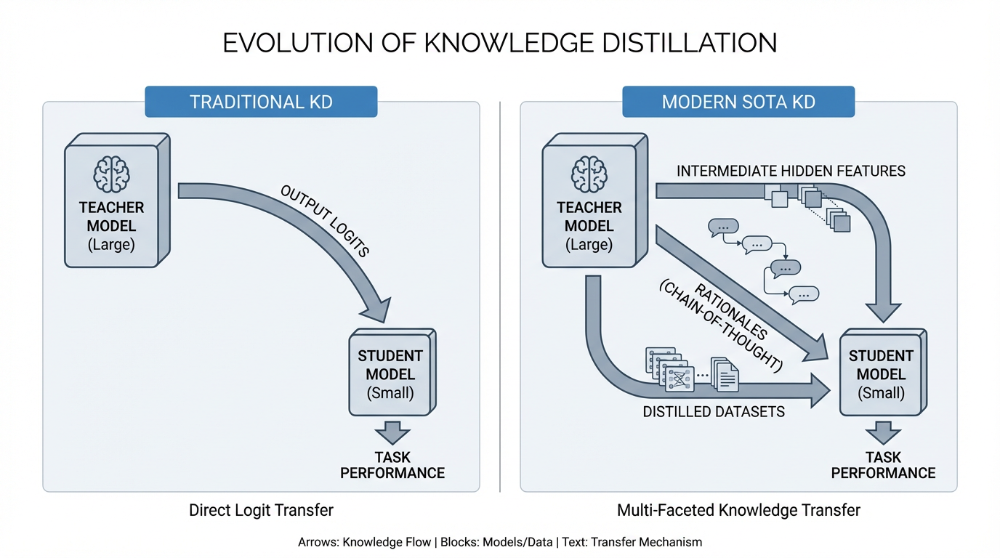

import KDVisualizer from '../../../components/chapter-13/KDVisualizer.tsx';

# 13.4 Knowledge Distillation

양자화가 기존 모델의 무게를 줄이는 작업이라면, **지식 증류(Knowledge Distillation, KD)** 는 아예 짐을 다시 싸는 일에 가깝습니다. 원래 모델 구조를 유지한 채 가중치만 압축하는 대신, 더 큰 **교사(teacher)** 모델의 행동을 따라 하도록 더 작은 **학생(student)** 모델을 새로 학습시키기 때문입니다.

이 차이는 실무에서 중요합니다. 양자화와 희소화는 원래 네트워크의 구조에 묶여 있지만, 증류는 더 자유롭습니다. 학생은 폭과 깊이가 달라도 되고, 경우에 따라서는 아키텍처 계열 자체가 달라도 됩니다. 중요한 것은 우리가 원하는 행동을 얼마나 잘 옮겨오느냐입니다.

LLM 시대의 증류도 더 야심차게 바뀌었습니다. 이제는 단순히 출력 확률을 흉내 내는 데서 그치지 않고, reasoning trace, hidden-state structure, decoding behavior까지 더 작은 모델로 옮기려는 시도가 많아졌습니다.

---

## 1. 로짓 매칭에서 추론 과정으로의 진화

역사적으로 지식 증류는 **로짓 매칭 (Logit Matching)** 에 의존했습니다. 2015년 Geoffrey Hinton 등이 제안한 [[1]](#ref-1) 이 방식의 핵심은, 교사 모델의 출력 로짓(Logits)에 숨겨진 '어두운 지식(Dark Knowledge)'—즉, 정답이 아닌 오답 클래스들 간의 상대적 확률 분포—을 학생이 학습하게 만드는 것입니다.

출력층의 소프트맥스(Softmax) 함수에 높은 **온도 (Temperature, $T$)** 를 적용하면, 날카로운 확률 분포가 부드러워지며 학생 모델은 쿨백-라이블러 발산(KL Divergence)을 통해 이 미세한 관계를 학습합니다.

$$ \mathcal{L}_{KD} = T^2 \cdot \mathcal{D}_{KL}\left( \text{Softmax}\left(\frac{Z_{teacher}}{T}\right) \Big|\Big| \text{Softmax}\left(\frac{Z_{student}}{T}\right) \right) $$

이 방식은 분류 작업에서는 매우 효과적이지만, 생성과 추론이 핵심인 LLM에서는 한계가 드러납니다. 최종 토큰 분포만 맞추면 학생은 “무슨 답이 자주 나오는지”는 배울 수 있어도, 교사가 그 답에 도달한 과정까지는 배우지 못할 수 있습니다. 그래서 작은 학생 모델이 문체는 비슷하게 흉내 내지만 reasoning-heavy task에서는 여전히 약한 경우가 많습니다.

### 더 풍부한 supervision으로 가는 흐름

이 간극을 줄이기 위해 최근 연구는 최종 로짓 바깥의 신호를 더 적극적으로 활용합니다.

1. **Rationale-Based Distillation**: 교사가 최종 답만이 아니라 중간 reasoning step까지 제공합니다 [[2]](#ref-2).
2. **Feature-Based Alignment**: 학생이 출력뿐 아니라 내부 hidden-state 구조 일부까지 교사와 비슷해지도록 유도합니다.

이 방법들이 “작은 모델도 곧바로 큰 모델처럼 생각하게 만든다”는 뜻은 아닙니다. 다만, 출력만 맞추는 방식보다 더 유용한 행동을 옮겨오는 데 도움이 되는 경우가 많습니다.


*출처: AI 생성 이미지. 로짓 매칭에서 단계별 추론(CoT) 증류 및 특징 정렬로 진화한 지식 증류의 패러다임 변화를 보여주는 개념도.* 

---

## 2. 생성 모델을 위한 분포 교정: Forward KL vs Reverse KL

토큰을 순차적으로 생성하는 자기회귀(Auto-regressive) 모델의 지식 증류에서 가장 중요한 수학적 결정 중 하나는 발산(Divergence) 함수의 방향입니다. 전통적인 지식 증류는 교사 분포 $P$ 와 학생 분포 $Q$ 사이의 **Forward KL Divergence** $\mathcal{D}_{KL}(P || Q)$ 를 최소화합니다.

* **Forward KL (Mean-seeking)**: 전통적인 선택입니다. 교사 분포가 확률을 두는 영역을 학생도 넓게 덮도록 유도합니다. coverage가 중요할 때는 장점이 있지만, 학생이 훨씬 작을 경우 확률 질량을 너무 넓게 퍼뜨리는 부작용이 생길 수 있습니다.
* **Reverse KL (Mode-seeking)**: MiniLLM 같은 연구는 자기회귀 생성에서는 **Reverse KL Divergence** $\mathcal{D}_{KL}(Q || P)$ 가 더 잘 맞을 수 있다고 봅니다 [[3]](#ref-3). 학생이 교사가 선호하는 모드에 더 강하게 집중하게 만들기 때문에, 일부 설정에서는 더 또렷하고 유창한 출력을 만들 수 있습니다.

핵심은 어느 한쪽이 항상 우월하다는 이야기가 아닙니다. divergence 방향이 학생의 성격을 바꾸기 때문에, 생성형 증류에서는 이것을 기본값이 아니라 설계 선택으로 봐야 한다는 점이 중요합니다.

---

## 3. On-Policy 증류: 학생의 실수로부터 배우기

고정된 오프라인 데이터셋(Off-policy)에 의존하는 증류 방식은 텍스트 생성 시 **노출 편향 (Exposure Bias)** 이라는 치명적인 문제를 겪습니다. 학습 중에는 교사 모델이 생성한 완벽한 텍스트 궤적만 보지만, 실제 추론 시 학생 모델이 단 하나의 토큰이라도 실수로 다르게 생성하면, 이후의 궤적은 학습 데이터에 존재하지 않는 미지의 영역(Out-of-Distribution)이 되어 출력 품질이 붕괴됩니다.

이에 대한 대응이 **On-Policy Distillation** 입니다. 일반화된 지식 증류(GKD) 같은 방법은 교사가 만든 이상적인 경로만 보여주는 대신, 학생이 실제로 생성한 시퀀스를 교사가 다시 채점하게 만듭니다 [[4]](#ref-4). 즉, 학생이 자주 빠지는 나쁜 상태에서 다음 토큰을 어떻게 골라야 하는지까지 배우게 하는 방식입니다.

실무적으로 중요한 이유는 분명합니다. 배포된 모델은 깨끗한 예제에서 실패하기보다, 한 번 살짝 틀어진 뒤 그 상태를 회복하지 못해서 실패하는 경우가 많기 때문입니다.

---

## 4. 아키텍처 비동질성과 특징 정렬

증류의 실질적인 장점 중 하나는 학생이 교사의 축소판일 필요가 없다는 점입니다. 더 큰 Transformer에서 더 작은 Transformer로 옮길 수도 있고, 이런 아이디어를 다른 모델 계열로까지 얼마나 넓힐 수 있는지도 활발히 탐구되고 있습니다.

문제는 hidden representation이 서로 다른 공간에 놓여 있다는 점입니다. 교사는 더 넓은 레이어를 가질 수 있고, head 수나 recurrence 구조도 다를 수 있습니다. 그래서 흔히 **projection layer** 를 추가해 학생의 표현을 교사의 latent space로 매핑한 뒤 alignment loss를 적용합니다.

여기서부터 증류는 개념 설명을 넘어 진짜 엔지니어링 문제가 됩니다. 어느 레이어를 맞출지, 얼마나 자주 맞출지, 손실 가중치를 어떻게 둘지가 학습 안정성과 학생 품질에 직접 영향을 주기 때문입니다.

---

## 5. 엔지니어링: 특징 기반 지식 증류 구현

아래의 PyTorch 코드는 구조적 비동질성(Heterogeneity)을 극복하기 위해 표준 태스크 손실, 로짓 기반 KL 발산, 그리고 투영 레이어를 활용한 특징 정렬(Feature Alignment) 손실을 하나로 결합한 최신 지식 증류 파이프라인을 보여줍니다.

```python
import torch
import torch.nn as nn
import torch.nn.functional as F

class ModernKDLoss(nn.Module):
    def __init__(self, student_dim: int, teacher_dim: int, temp: float = 2.0, alpha: float = 0.5, beta: float = 0.1):
        """
        Args:
            student_dim: 학생 모델의 은닉 상태 차원
            teacher_dim: 교사 모델의 은닉 상태 차원
            temp: 로짓 평활화를 위한 온도 파라미터
            alpha: 로짓 증류(KL Divergence) 손실의 가중치
            beta: 특징 정렬(Feature Alignment) 손실의 가중치
        """
        super().__init__()
        self.temp = temp
        self.alpha = alpha
        self.beta = beta
        
        # 학생 모델의 은닉 상태를 교사 모델의 차원으로 변환하는 선형 투영 레이어
        self.feature_projector = nn.Linear(student_dim, teacher_dim, bias=False)
        
        self.kl_loss = nn.KLDivLoss(reduction="batchmean")
        self.mse_loss = nn.MSELoss()

    def forward(
        self, 
        student_logits: torch.Tensor, 
        teacher_logits: torch.Tensor, 
        student_hidden: torch.Tensor, 
        teacher_hidden: torch.Tensor, 
        labels: torch.Tensor
    ) -> torch.Tensor:
        # 1. 표준 태스크 손실 (Cross Entropy)
        # 차원 평탄화: [batch * seq_len, vocab_size]
        task_loss = F.cross_entropy(student_logits.view(-1, student_logits.size(-1)), labels.view(-1))
        
        # 2. 로짓 기반 KD 손실 (Forward KL Divergence)
        # 온도를 적용한 후, 기울기 크기 복원을 위해 T^2 를 곱함
        soft_student = F.log_softmax(student_logits / self.temp, dim=-1).view(-1, student_logits.size(-1))
        soft_teacher = F.softmax(teacher_logits / self.temp, dim=-1).view(-1, teacher_logits.size(-1))
        kd_loss = self.kl_loss(soft_student, soft_teacher) * (self.temp ** 2)
        
        # 3. 특징 정렬 손실 (Feature-based Alignment Loss)
        # 학생의 특징을 교사의 차원으로 투영한 후 평균 제곱 오차(MSE) 계산
        projected_student_hidden = self.feature_projector(student_hidden)
        feature_loss = self.mse_loss(projected_student_hidden, teacher_hidden)
        
        # 전체 손실 결합
        total_loss = (1.0 - self.alpha) * task_loss + \
                     self.alpha * kd_loss + \
                     self.beta * feature_loss
                     
        return total_loss

# 실행 예시
batch_size, seq_len, vocab_size = 4, 128, 32000
d_student, d_teacher = 1024, 4096

# 텐서 시뮬레이션 (실제 학습 루프에서는 모델의 forward 패스 결과값)
s_logits = torch.randn(batch_size, seq_len, vocab_size, requires_grad=True)
t_logits = torch.randn(batch_size, seq_len, vocab_size) # 교사 모델은 동결(Frozen) 상태
s_hidden = torch.randn(batch_size, seq_len, d_student, requires_grad=True)
t_hidden = torch.randn(batch_size, seq_len, d_teacher)   
targets = torch.randint(0, vocab_size, (batch_size, seq_len))

# 손실 계산 및 역전파
criterion = ModernKDLoss(student_dim=d_student, teacher_dim=d_teacher)
loss = criterion(s_logits, t_logits, s_hidden, t_hidden, targets)
print(f"계산된 총 지식 증류 손실: {loss.item():.4f}")
loss.backward() # 옵티마이저 스텝 준비 완료
```

---

## 6. 실전 증류 플레이북

실제 제품을 위한 distillation pipeline을 설계할 때 중요한 질문은 대개 철학적인 것이 아니라 운영적인 것입니다.

1. **무슨 행동을 옮기고 싶은가?** 정확도, 지연 시간, 포맷 준수, tool use, safety 중 무엇이 핵심인지에 따라 필요한 teacher signal이 달라집니다.
2. **정말 맞는 teacher인가?** 특화 작업에서는 파라미터 수보다 도메인 적합성이 더 중요할 수 있습니다.
3. **어떤 failure mode를 볼 것인가?** clean benchmark에서는 좋아 보여도 길이 드리프트, calibration, refusal behavior에서 무너질 수 있습니다.
4. **비용은 어디서 가장 많이 드는가?** rationale 생성이나 on-policy teacher scoring이 전체 증류 비용의 대부분을 차지하기도 합니다.

그래서 production distillation은 보통 “teacher output으로 작은 모델 학습시키기”에서 끝나지 않습니다. dataset curation, teacher quality check, student-trajectory evaluation, release gate가 함께 붙는 경우가 많습니다.

---

## 7. 인터랙티브 컴포넌트: 잠재 공간 정렬 시뮬레이터

Logit-Only KD와 Feature-Based KD가 학생 모델의 내부 표현에 어떤 차이를 만드는지 직관적으로 보려면 아래 시각화 도구를 살펴보세요.

* **Logit-Only KD**: 최종 정답 분포는 어느 정도 맞추지만 내부 클러스터링은 여전히 불안정할 수 있습니다.
* **Feature-Based KD**: 학생의 latent space가 교사의 기하학에 더 가까워지면서 일반화와 안정성이 좋아지는 경우가 많습니다.


<KDVisualizer lang="ko" client:load />

---

## 8. 요약 및 다음 단계

지식 증류는 단순한 로짓 매칭 기법에서, 큰 모델의 행동을 작은 모델로 옮기는 더 넓은 도구 상자로 발전했습니다. 지금 중요한 것은 “KD를 썼다”가 아니라, 어떤 teacher를 선택했고, 어떤 divergence를 썼고, 학생이 실제로 만드는 궤적까지 평가했는지입니다.

양자화와 희소화와 함께 쓰면, 지식 증류는 더 작은 하드웨어와 더 빡빡한 latency budget 안에서도 꽤 강한 모델을 배포하게 해 주는 가장 실용적인 수단 중 하나입니다. 하지만 작은 모델은 내부에 담을 수 있는 지식량이 제한적입니다. 다음 장인 **Chapter 14: RAG (Retrieval Augmented Generation)** 에서는 그 한계를 retrieval로 어떻게 보완하는지 보겠습니다.

---

## Quizzes

<details>
<summary>Quiz 1: 전통적인 로짓 기반 지식 증류에서 소프트맥스 함수에 적용되는 온도(Temperature, $T$) 파라미터의 수학적 역할은 무엇입니까?</summary>
*일반적인 소프트맥스 함수는 정답 클래스에 확률이 극단적으로 쏠리는 매우 날카로운(Sharp) 분포를 만듭니다. 온도를 1보다 큰 값으로 설정하여 로짓을 나누면 확률 분포가 평평해지며(Smoothed), 이를 통해 정답이 아닌 오답 클래스들 간의 미세한 확률 차이(Dark Knowledge)가 증폭됩니다. 학생 모델은 이 부드러워진 분포를 학습함으로써 교사 모델의 일반화(Generalization) 패턴을 더 잘 흡수할 수 있습니다.* 
</details>

<details>
<summary>Quiz 2: 생성형 증류에서 Reverse KL이 항상은 아니지만 종종 매력적인 선택이 되는 이유는 무엇입니까?</summary>
*Forward KL은 교사 분포를 넓게 덮도록 유도하기 때문에, 작은 학생에게는 확률 질량이 너무 퍼질 수 있습니다. Reverse KL은 더 mode-seeking해서 교사가 선호하는 연속에 학생이 더 강하게 집중하게 만들 수 있습니다. 그래서 일부 생성 설정에서는 더 또렷하고 유창한 출력을 만들 수 있습니다.*
</details>

<details>
<summary>Quiz 3: On-Policy Distillation이 해결하려는 문제는 무엇입니까?</summary>
*훈련 때 본 깨끗한 teacher trajectory와, 실제 추론에서 학생이 만들어 내는 imperfect trajectory 사이의 간극을 줄이려는 것입니다. 학생이 직접 만든 시퀀스를 교사가 다시 채점하게 하면, 학생은 이상적인 경로뿐 아니라 자신이 실제로 빠지는 나쁜 상태에서 어떻게 회복할지도 배울 수 있습니다.*
</details>

<details>
<summary>Quiz 4: 아키텍처가 다른 teacher와 student 사이에서 projection layer를 자주 넣는 이유는 무엇입니까?</summary>
*teacher와 student의 hidden state는 차원 수도 다르고 기하학도 다를 수 있습니다. projection layer는 student 표현을 교사 latent space와 비교 가능한 공간으로 옮겨 주기 때문에, MSE 같은 alignment loss를 의미 있게 적용할 수 있게 해 줍니다.*
</details>

<details>
<summary>Quiz 5: 실제 distillation pipeline에서 teacher의 파라미터 수보다 teacher 선택 자체가 더 중요한 이유는 무엇입니까?</summary>
*학생은 teacher가 주는 신호만 배울 수 있기 때문입니다. 도메인에 잘 맞는 teacher는 target task에 더 적합한 출력, rationale, hidden-state structure를 제공합니다. 반대로 훨씬 더 큰 일반 모델이라도 배포 목표와 신호가 어긋나면 좋은 teacher가 아닐 수 있습니다.*
</details>

---

## References

1. <a id="ref-1"></a>Hinton, G., Vinyals, O., & Dean, J. (2015). *Distilling the Knowledge in a Neural Network.* [arXiv:1503.02531](https://arxiv.org/abs/1503.02531).
2. <a id="ref-2"></a>Hsieh, C. Y., et al. (2023). *Distilling Step-by-Step! Outperforming Larger Language Models with Less Training Data and Smaller Model Sizes.* [arXiv:2305.02301](https://arxiv.org/abs/2305.02301).
3. <a id="ref-3"></a>Gu, Y., Dong, L., Wei, F., & Huang, M. (2024). *MiniLLM: On-Policy Distillation of Large Language Models.* [arXiv:2306.08543](https://arxiv.org/abs/2306.08543).
4. <a id="ref-4"></a>Agarwal, R., et al. (2024). *On-Policy Distillation of Language Models: Learning from Self-Generated Mistakes.* [arXiv:2306.13649](https://arxiv.org/abs/2306.13649).
