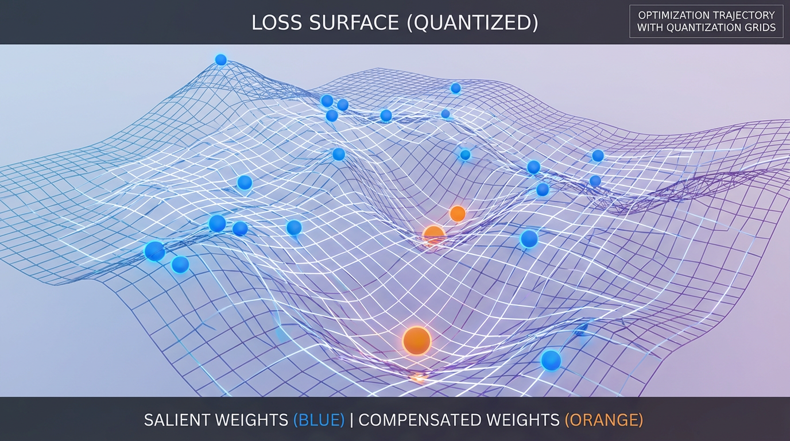

import QuantizationMethodVisualizer from '../../../components/chapter-13/QuantizationMethodVisualizer.tsx';

# 13.2 Quantization Methods

이전 섹션에서 우리는 학습 후 양자화(PTQ)와 양자화 인지 학습(QAT)의 근본적인 차이를 확립했습니다. QAT가 모델이 저정밀도 환경에서 살아남도록 능동적으로 학습시킴으로써 가장 높은 정확도 하한선을 제공하는 것은 사실이나, 이를 위해서는 막대한 컴퓨팅 자원이 필요합니다. 따라서 대다수의 프로덕션 환경에서 엔지니어들은 사전 학습된 파운데이션 모델을 빠르고 효율적으로 압축하기 위해 고도화된 **PTQ 알고리즘** 에 의존합니다.

가중치를 단순히 가장 가까운 4비트 정수로 반올림하는 순진한(Naive) PTQ 접근법은 대형 언어 모델(LLM)에서 치명적인 정확도 손실을 초래합니다. LLM의 가중치와 활성화(Activation) 분포에는 모델의 추론 능력을 결정짓는 극단적인 **이상치(Outliers)** 가 존재하기 때문입니다. 만약 압축 과정에서 이러한 이상치가 잘려 나가거나(Clipping) 반올림되어 사라진다면, 모델의 논리 구조는 완전히 붕괴됩니다.

이 문제를 해결하기 위해 AI 엔지니어링 커뮤니티는 중요한 이상치를 보존하면서도 가중치를 압축하는 수학적이고 정교한 방법론들을 발전시켜 왔습니다. 이번 섹션에서는 현대 양자화의 세 가지 지배적인 패러다임인 **GPTQ**, **AWQ**, 그리고 **GGUF** 생태계를 해부하고, **FP8** 과 같은 비트 수준의 데이터 타입 포맷이 가져온 변화를 심층적으로 분석합니다.

---

## 1. GPTQ: 헤시안(Hessian)을 통한 오차 보상

2022년 말에 등장한 **GPTQ** (Accurate Post-Training Quantization for Generative Pre-trained Transformers) [[1]](#ref-1) 는 175B(1,750억 개) 파라미터 규모의 모델을 단일 GPU에서 불과 몇 시간 만에 3비트 또는 4비트로 양자화하면서도 Perplexity 저하를 무시할 수 있는 수준으로 억제하여 모델 압축 분야에 혁명을 일으켰습니다.

### Optimal Brain Surgeon의 수학적 재해석
GPTQ는 가중치를 개별적으로 고립시켜 양자화하지 않습니다. 대신 양자화를 하나의 최적화 문제로 취급합니다: *"가중치 A를 반올림하여 오차가 발생했다면, 가중치 B를 어떻게 조정해야 그 오차를 상쇄할 수 있을까?"*

이 개념은 고전적인 신경망 가지치기(Pruning) 기법인 Optimal Brain Surgeon (OBS)에서 유래했습니다. GPTQ는 전체 정밀도 레이어의 출력과 양자화된 레이어의 출력 사이의 제곱 오차를 최소화합니다. 이를 효율적으로 수행하기 위해 2차 미분 정보, 구체적으로 활성화 값의 **헤시안 행렬(Hessian Matrix)** 을 사용합니다.

주어진 가중치 행렬 $W$ 와 입력 $X$ 에 대해, 목표는 다음의 제곱 오차를 최소화하는 양자화된 행렬 $\hat{W}$ 를 찾는 것입니다:
$$ \arg\min_{\hat{W}} ||WX - \hat{W}X||_2^2 $$

GPTQ는 가중치 행렬을 행(Row) 단위로 처리합니다. 특정 가중치 $w_i$ 가 $\hat{w}_i$ 로 양자화될 때, 오차 $\delta = w_i - \hat{w}_i$ 가 발생합니다. GPTQ는 활성화 값의 역헤시안 행렬($H^{-1}$)을 사용하여, 이 $\delta$ 를 보상하기 위해 해당 행에 남아있는 **아직 양자화되지 않은 모든 가중치** 를 일제히 업데이트합니다.

### GPTQ 루프 엔지니어링

아래는 GPTQ 핵심 알고리즘의 개념적인 PyTorch 구현입니다. 실제 프로덕션 환경(예: AutoGPTQ)에서는 거대한 행렬을 역산할 때 발생하는 수치적 불안정성을 피하기 위해 숄레스키 분해(Cholesky Decomposition)와 블록 단위 업데이트(Block-wise updates)를 사용하여 고도로 최적화됩니다.

```python
import torch

def quantize_to_nearest(w, bits=4):
    """기본적인 균일 양자화(Uniform Quantization)를 시뮬레이션합니다."""
    q_max = (1 << (bits - 1)) - 1
    q_min = -(1 << (bits - 1))
    scale = w.abs().max() / q_max
    q = torch.clamp(torch.round(w / scale), q_min, q_max) * scale
    return q

def gptq_core_loop(W, H_inv, bits=4):
    """
    단순화된 GPTQ 업데이트 루프.
    W: 전체 정밀도 가중치 행렬 [out_features, in_features]
    H_inv: 활성화 값의 역헤시안 행렬 [in_features, in_features]
    """
    W_q = torch.zeros_like(W)
    W_temp = W.clone()
    
    in_features = W.shape[1]
    
    for i in range(in_features):
        # 1. 현재 열(Column)의 가중치를 추출
        w = W_temp[:, i]
        d = H_inv[i, i]
        
        # 2. 현재 열을 양자화
        q = quantize_to_nearest(w, bits)
        W_q[:, i] = q
        
        # 3. 헤시안 대각 성분으로 스케일링된 양자화 오차 계산
        error = (w - q) / d
        
        # 4. 오차 보상: 아직 양자화되지 않은 나머지 가중치들을 업데이트
        # 역헤시안의 교차 상관관계(Cross-correlation)를 곱하여 오차를 뺌
        W_temp[:, i+1:] -= error.unsqueeze(1) @ H_inv[i, i+1:].unsqueeze(0)
        
    return W_q

# 실행 예시
out_feat, in_feat = 128, 128
W_full = torch.randn(out_feat, in_feat)

# 역헤시안 시뮬레이션 (실제로는 캘리브레이션 데이터셋을 통과시켜 계산됨)
H = torch.randn(in_feat, in_feat)
H = H.T @ H + torch.eye(in_feat) * 0.01 # Positive semi-definite 보장
H_inv = torch.linalg.inv(H)

W_quantized = gptq_core_loop(W_full, H_inv, bits=4)
print(f"GPTQ Quantization Complete. Shape: {W_quantized.shape}")
```

GPTQ는 매우 효과적이지만 헤시안을 계산하기 위한 신중한 캘리브레이션 단계가 필수적입니다. 만약 캘리브레이션 데이터가 편향되어 있다면, 헤시안은 엉뚱한 특징(Features)을 보상하는 데 우선순위를 두게 되어 일반화(Generalization) 성능이 크게 떨어집니다.

---

## 2. AWQ: 활성화 인지 가중치 양자화

GPTQ가 수학적인 오차 보상에 집중한다면, **AWQ** (Activation-aware Weight Quantization) [[2]](#ref-2) 는 철저히 경험적(Empirical)인 접근을 취합니다. AWQ의 저자들은 매우 중요한 사실을 관찰했습니다: **"모든 가중치가 동일한 중요도를 가지는 것은 아니다."**

LLM 가중치의 약 1%만이 핵심적인 '돌출된(Salient)' 가중치입니다. 이 1%의 가중치만 양자화하지 않고 남겨두면, 모델은 전체 정밀도에 준하는 정확도를 유지합니다. 하지만 1%의 가중치는 FP16으로 유지하고 나머지 99%를 INT4로 혼합하여 배치하는 것은 하드웨어 실행 관점에서 악몽과도 같으며, 복잡한 희소 행렬 곱셈(Sparse-matrix multiplication) 커널을 요구합니다.

### 돌출성 역설 (The Salience Paradox)
그렇다면 이 중요한 가중치들을 어떻게 식별할까요? 놀랍게도 가중치 자체의 크기(Magnitude)를 보는 것은 소용이 없습니다. 크기가 큰 가중치라도 항상 0에 가까운 활성화 값과 곱해진다면 출력에 미치는 영향은 무의미합니다. AWQ는 중요한 가중치를 찾기 위해서는 반드시 그 가중치를 통과하는 **활성화(Activation)의 크기** 를 보아야 한다고 증명했습니다.

### 스케일링 트릭 (The Scaling Trick)
혼합 정밀도 하드웨어 커널을 사용하지 않고 이 중요한 가중치들을 보호하기 위해, AWQ는 수학적 동치(Equivalence) 트릭을 사용합니다.

선형 연산 $Y = WX$ 에 대해, 스케일링 벡터 $S$ 를 도입할 수 있습니다:
$$ Y = WX = (W \cdot S) (X \cdot S^{-1}) $$

AWQ는 큰 활성화 값과 곱해지는 가중치를 찾아내어, 해당 채널에 대한 스케일링 팩터 $S$ 를 계산해 가중치의 크기를 **확대(Scale up)** 합니다. 중요한 가중치의 크기를 키우면, INT4 양자화 구간(Bins) 내에서 더 넓은 영역을 차지하게 되어 상대적인 양자화 오차가 극적으로 감소합니다. 추론 시에는 행렬 곱셈 전에 활성화 값을 $S^{-1}$ 로 **축소(Scale down)** 하여 최종 수학적 출력이 동일하게 유지되도록 보장합니다.

```python
import torch

def awq_scale_weights(W, X, s_x=0.5):
    """
    W: 가중치 행렬 [out_features, in_features]
    X: 캘리브레이션 활성화 값 [batch, seq_len, in_features]
    s_x: 스케일링 강도를 조절하는 하이퍼파라미터
    """
    # 1. 활성화 값의 크기 평균을 통해 중요한(Salient) 채널 식별
    act_magnitudes = X.abs().mean(dim=(0, 1)) # Shape: [in_features]
    
    # 2. 스케일링 팩터 계산
    # 활성화 값이 큰 채널의 가중치를 확대(Scale up)함
    scales = act_magnitudes ** s_x
    scales = scales / scales.max() # 오버플로우 방지를 위한 정규화
    
    # 3. 가중치에 스케일 적용
    W_scaled = W * scales.unsqueeze(0)
    
    # 4. 실제 배포 시에는 역스케일(Inverse scale)이 이전 레이어의 편향/가중치에 
    # 병합되거나(Folded), 활성화 값에 직접 적용됩니다.
    # X_scaled = X / scales
    
    return W_scaled, scales

# 실행 예시
W = torch.randn(256, 128)
X = torch.randn(16, 512, 128) # Batch=16, Seq=512, Dim=128

W_awq, scales = awq_scale_weights(W, X)
print(f"AWQ Scaling Applied. Max Scale: {scales.max():.4f}, Min Scale: {scales.min():.4f}")
```

AWQ는 헤시안 행렬을 계산하거나 역산할 필요가 없기 때문에 GPTQ보다 처리 속도가 근본적으로 빠르며, 인스트럭션 튜닝(Instruction-tuned) 모델이나 멀티모달 모델에서 예외적으로 뛰어난 견고성을 보여줍니다.

---

## 3. TurboQuant: 회전 도메인 양자화 (Rotation-Domain Quantization)

2025년 구글 연구진이 제안한 **TurboQuant** [[3]](#ref-3) 는 이상치 문제를 기하학적 뿌리에서부터 해결합니다. 표준 기저(Basis)에서 이상치를 수용하려고 애쓰는 대신, TurboQuant는 양자화 전에 **벡터 공간 전체를 회전** 시킵니다.

### 메커니즘: 빠른 월시-아다마르 변환 (FWHT)
`[0.1, 0.2, 100.0, 0.1]`과 같이 하나의 거대한 이상치를 가진 벡터를 상상해 보십시오. 이를 직접 양자화하는 것은 어렵습니다. TurboQuant는 가중치나 활성화 벡터에 빠른 월시-아다마르 변환(FWHT)이나 무작위 회전 행렬과 같은 직교 변환(Orthogonal transformation)을 적용합니다.

회전은 직교하기 때문에 어텐션 및 선형 레이어의 핵심 연산인 내적(Inner product)을 보존합니다. 하지만 회전은 이상치의 에너지를 **모든 차원으로 고르게 분산** 시킵니다. 그 결과 벡터는 극단적인 이상치가 거의 없는 정규 분포에 가까운 형태를 띠게 됩니다.

1. **회전 (Rotate)**: $x' = R \cdot x$ (이상치가 부드러워짐).
2. **양자화 (Quantize)**: $\hat{x}' = Q(x')$ (양자화가 매우 효율적이고 균일하게 이루어짐).
3. **역회전 (Compute)**: 회전된 공간에서 연산을 수행하거나, 융합된 CUDA 커널에서 직접 역변환 $R^T$를 적용합니다.

**💡 비하인드 스토리: KV 캐시의 구원자**
TurboQuant는 초기에 **KV 캐시 양자화** 로 큰 찬사를 받았습니다. 키와 값을 회전시킴으로써, TurboQuant는 채널당 단 3.5비트에서 절대적인 품질 중립성을 달성했고, 2.5비트에서도 아주 미미한 성능 저하만을 보였습니다. 이를 통해 서빙 프레임워크는 KV 캐시 메모리 장벽에 부딪히지 않고 동시 배치 크기를 두 배로 늘릴 수 있게 되었습니다.

---

## 4. GGUF와 llama.cpp 생태계

GPTQ와 AWQ가 알고리즘이라면, **GGUF** (GPT-Generated Unified Format)는 `llama.cpp` 프로젝트와 밀접하게 결합된 파일 포맷이자 양자화 생태계입니다. GGUF는 오픈소스 LLM 배포의 파편화를 해결하고, 모델이 표준 소비자용 하드웨어(특히 CPU와 Apple Silicon의 Metal)에서 효율적으로 실행되도록 설계되었습니다.

### 블록 양자화 (Blocked Quantization)
표준 PyTorch 텐서와 달리, GGUF는 전체 행렬을 한 번에 양자화하지 않습니다. 대신 **블록 양자화** 를 사용합니다. 가중치 행렬을 평탄화(Flatten)한 뒤, 작은 블록(예: 32개의 가중치)으로 나눕니다. 각 블록은 고유한 스케일링 팩터와 제로 포인트(Zero-point)를 갖습니다. 이렇게 국소적으로 스케일을 적용하면, 하나의 거대한 이상치가 전체 행렬의 정밀도를 망가뜨리는 것을 방지할 수 있습니다.

### K-Quants: 계층적 혼합 정밀도
GGUF 생태계를 정의하는 핵심 특징은 **k-quant** 제품군(예: `Q4_K_M`, `Q5_K_S`)입니다. 이는 고도로 정교한 계층적 혼합 정밀도(Hierarchical Mixed Precision) 양자화를 의미합니다.

전체 모델에 일괄적으로 4비트 양자화를 적용하는 대신, k-quant는 256개의 가중치로 구성된 슈퍼 블록(Super-blocks)을 더 작은 서브 블록으로 나누어 관리합니다. 더 중요한 것은 레이어의 **유형(Type)** 에 따라 다른 비트 폭(Bit-width)을 할당한다는 점입니다.
예를 들어 `Q4_K_M` 포맷의 경우:
*   어텐션 프로젝션 레이어($Q, K, V$)는 노이즈에 매우 민감하므로 5비트 또는 6비트로 양자화됩니다.
*   피드포워드 네트워크(FFN) 확장 레이어는 파라미터 중복이 많고 노이즈에 강건하므로 엄격한 4비트로 양자화됩니다.
*   최종 출력층인 `lm_head` 는 종종 8비트로 유지됩니다.

이러한 엔지니어링 주도의 수동적 접근 방식은 균일 양자화(Uniform Quantization)에 비해 모델 크기 대 정확도 측면에서 훨씬 우수한 파레토 최적(Pareto frontier)을 제공합니다.


*Source: Generated by Gemini. GGUF의 K-Quants가 각 레이어의 민감도에 따라 비트를 동적으로 할당하여 최적의 압축 효율을 달성하는 개념도.*

---

## 5. 데이터 타입 전쟁: FP8 vs INT4

역사적으로 PTQ는 전적으로 정수형(Integer) 포맷(INT8, INT4)에 의존해 왔습니다. 그러나 NVIDIA의 Hopper 아키텍처(H100)가 **8비트 부동소수점 (FP8)** 에 대한 네이티브 하드웨어 지원을 도입하면서 양자화 지형이 근본적으로 변화했습니다 [[4]](#ref-4).

### 왜 부동소수점(Floating Point)인가?
정수형 양자화는 구간(Bins)을 균일하게 분배합니다. 1과 2 사이의 거리는 100과 101 사이의 거리와 같습니다. 그러나 LLM의 가중치는 대부분의 값이 0 근처에 밀집해 있고 극소수의 극단적인 이상치가 존재하는 정규 분포(Gaussian distribution)를 따릅니다.

부동소수점 포맷은 지수부(Exponent)와 가수부(Mantissa)를 사용합니다. 이를 통해 대부분의 가중치가 존재하는 0 근처에서는 매우 높은 정밀도를 할당하고, 동시에 엄청난 동적 범위(Dynamic Range)를 확보하여 이상치를 클리핑 없이 표현할 수 있습니다.

### E4M3 vs E5M2
IEEE FP8 표준은 두 가지 명확한 인코딩 방식을 정의합니다:
1.  **E4M3 (지수 4비트, 가수 3비트)**: 동적 범위는 다소 좁지만 정밀도가 높습니다. 추론 시 순전파 과정에서 **가중치(Weights)** 와 **활성화(Activations)** 를 양자화하는 데 사용되는 표준 선택지입니다.
2.  **E5M2 (지수 5비트, 가수 2비트)**: 정밀도를 희생하는 대신 거대한 동적 범위를 제공합니다. 학습 중 값이 급격하게 요동치는 **기울기(Gradients)** 를 저장하는 데 주로 사용됩니다.

FP8은 신경망 가중치의 분포와 태생적으로 훨씬 잘 맞아떨어지기 때문에, FP16 모델을 FP8(E4M3)로 변환할 때는 복잡한 알고리즘(GPTQ/AWQ 등)이나 캘리브레이션이 거의 필요하지 않습니다. 이는 사실상 '공짜로' VRAM과 메모리 대역폭을 2배 절약해 주는 마법과 같으며, 현재 엔터프라이즈 모델 서빙 인프라의 기본 표준으로 자리 잡았습니다.

---

## 6. 양자화 및 압축: 최종 종합 정리

실무 엔지니어를 위한 실용적인 가이드를 제공하기 위해, 13장에서 다룬 다양한 양자화 및 압축 기술을 종합하고 실제 배포 시 참고할 수 있는 계산기를 제공합니다.

### 압축 기술 지형도

| 기술 | 패러다임 | 비트 수 (Bit-width) | 주요 용도 | 하드웨어 지원 |
| :--- | :--- | :--- | :--- | :--- |
| **PTQ (기본)** | 학습 후 양자화 | 8-bit | 빠른 배포, 성능 하락 최소화 | 제한 없음 |
| **AWQ / GPTQ** | 학습 후 양자화 | 4-bit | 프로덕션 LLM 서빙, 밸런스 우수 | GPU (Tensor Cores) |
| **QAT** | 학습 중 양자화 | 4-bit / 2-bit | 저비트에서 최대 정확도 유지 | GPU |
| **GGUF** | 학습 후 양자화 | 혼합 (2-8 bit) | 온디바이스 / CPU 실행 | CPU / Metal / GPU |
| **TurboQuant** | 사전 회전 PTQ | 2-3 bit | KV 캐시 압축 | GPU |
| **BitNet b1.58** | 네이티브 1비트 | 1.58-bit | 미래의 non-MatMul 하드웨어 | 전용 AI 칩 |

### HuggingFace 키워드 매핑
HuggingFace에서 모델을 탐색할 때 특정 태그를 만나게 됩니다. 그 의미는 다음과 같습니다:
- **`AWQ`**: Activation-aware Weight Quantization. 온라인 서빙(vLLM 등)에 적합합니다.
- **`GPTQ`**: 대략적인 헤시안(Hessian)을 사용하는 학습 후 양자화. 정적 배치(Static batching)에 좋습니다.
- **`GGUF`**: `llama.cpp`에서 사용하는 포맷. CPU 및 엣지 디바이스(MacBook 등)에 최적화되어 있습니다.
- **`EXL2`**: ExLlamaV2 포맷. 소비자용 하드웨어에서 매우 빠른 GPU 추론을 위해 고도로 최적화되어 있습니다.

### 메모리 요구 사항 및 배포 가이드
모델을 로드하는 데 실제로 얼마나 많은 VRAM이 필요할까요? 다음은 일반적인 모델 크기 및 양자화 수준에 따른 대략적인 기준입니다 (KV 캐시 제외).

| 모델 크기 | FP16 (비양자화) | INT8 | INT4 | INT2 | 최소 필요 GPU |
| :--- | :--- | :--- | :--- | :--- | :--- |
| **7B / 8B** | ~16 GB | ~8 GB | ~4 GB | ~2 GB | 단일 소비자용 GPU (RTX 4060 등) |
| **13B / 14B** | ~28 GB | ~14 GB | ~7 GB | ~3.5 GB | 단일 GPU (RTX 4070/4080 등) |
| **70B** | ~140 GB | ~70 GB | ~35 GB | ~17.5 GB | 1x H100 또는 2x RTX 3090/4090 |

**대략적인 추정을 위한 공식**: 
$$\text{VRAM (GB)} \approx \frac{\text{파라미터 수 (B)} \times \text{파라미터당 비트 수}}{8} \times 1.2 \text{ (오버헤드)}$$
*(참고: 실제 서빙 시에는 이 기본 풋프린트에 활성 KV 캐시 메모리를 추가해야 합니다.)*

---

## 7. 인터랙티브 컴포넌트: 양자화 알고리즘 시뮬레이터

아래의 대화형 시각화는 거대한 이상치(Outlier)를 포함한 가중치 블록을 서로 다른 PTQ 알고리즘이 어떻게 처리하는지 보여줍니다.
*   **Uniform INT4**: 이상치를 잘라내거나(Clipping) 작은 가중치들의 정밀도를 파괴합니다.
*   **AWQ**: 활성화 크기에 기반하여 해당 열의 가중치를 확대(Scale up)함으로써 상대적 정밀도를 보존합니다.
*   **GPTQ**: 첫 번째 가중치의 양자화 오차를 블록 내의 후속 가중치들로 전가(Shift)하여 전체 오차를 상쇄합니다.

<QuantizationMethodVisualizer client:load />

---


## Quizzes

<details>
<summary>Quiz 1: AWQ 알고리즘이 "돌출된(Salient)" 가중치를 식별할 때 가중치 자체의 크기가 아닌 활성화(Activation) 값의 크기를 사용하는 근본적인 이유는 무엇입니까?</summary>
*가중치의 크기가 아무리 크더라도, 지속적으로 0에 가까운 활성화 값과 곱해진다면 해당 가중치가 모델의 최종 출력에 미치는 실제 기여도는 무의미해집니다. 가중치의 진정한 중요도(돌출성)는 그 가중치를 통해 얼마나 많은 데이터 흐름이 발생하는지에 따라 결정되며, 이는 해당 가중치와 짝을 이루는 활성화 값의 크기(Magnitude)를 측정함으로써만 파악할 수 있기 때문입니다.*
</details>

<details>
<summary>Quiz 2: GPTQ 알고리즘에서 특정 가중치를 양자화할 때 발생하는 반올림 오차(Rounding Error)는 전체 모델의 성능 저하를 막기 위해 어떻게 처리됩니까?</summary>
*가중치가 양자화될 때 GPTQ는 반올림으로 인해 발생한 정확한 수치적 오차를 계산합니다. 그런 다음 활성화 값의 역헤시안(Inverse Hessian) 행렬을 사용하여, 그 오차를 동일한 행(Row)에 있는 아직 양자화되지 않은 나머지 가중치들에 수학적으로 투영(Project)합니다. 즉, 잃어버린 정밀도를 보상하기 위해 남은 가중치들의 값을 조정하는 방식으로 전체 오차를 상쇄합니다.*
</details>

<details>
<summary>Quiz 3: 표준적인 균일 4비트 양자화(Uniform 4-bit)와 비교했을 때, GGUF 생태계의 k-quant 시스템이 가지는 가장 큰 아키텍처적 이점은 무엇입니까?</summary>
*K-quant는 계층적 혼합 정밀도(Hierarchical mixed-precision)를 활용합니다. 모든 레이어를 강제로 4비트에 맞추는 대신, 어텐션 프로젝션과 같이 노이즈에 극도로 민감한 레이어에는 더 높은 정밀도(5비트 또는 6비트)를 할당하고, FFN처럼 강건한 레이어에는 낮은 정밀도(4비트)를 할당합니다. 이 방식을 통해 파일 크기와 모델 정확도 사이의 트레이드오프를 균일 양자화보다 훨씬 최적화할 수 있습니다.*
</details>

<details>
<summary>Quiz 4: LLM 가중치를 양자화할 때 기존의 정수형(INT8) 포맷보다 FP8 (E4M3) 포맷이 태생적으로 더 적합한 수학적 이유는 무엇입니까?</summary>
*정수형 포맷은 구간을 균일하게 분배하기 때문에, 0 근처에 밀집해 있고 극단적인 이상치를 포함하는 LLM 가중치의 정규 분포(Gaussian distribution)를 표현하는 데 한계가 있습니다. 반면 FP8은 지수부와 가수부를 사용하여 0 근처에서는 높은 정밀도를 제공하면서도 동시에 거대한 동적 범위(Dynamic Range)를 유지합니다. 이로 인해 이상치를 심하게 클리핑하지 않고 담아낼 수 있어, 복잡한 캘리브레이션 없이도 거의 무손실에 가까운 압축이 가능합니다.*
</details>

<details>
<summary>Quiz 5: 활성화 행렬 $X \in \mathbb{R}^{T \times D}$에 대해 대칭적 텐서별 양자화(Symmetric Per-tensor Quantization)와 동적 토큰별 양자화(Dynamic Per-token Quantization)의 양자화 스케일 팩터 $S$를 수학적으로 명확히 정의하고, 둘 간의 정확도 차이를 정식화하시오.</summary>
*클리핑 경계 $[-128, 127]$을 갖는 대칭적 INT8 양자화에서 스케일 팩터는 절대 최댓값을 이산 경계로 매핑하는 역할을 합니다. 텐서별 양자화에서 하나의 정적 스케일 팩터는 행렬 전체를 아울러 도출됩니다: $S_{tensor} = \frac{\max_{t, d} |X_{t, d}|}{127}$. 반면 동적 토큰별(행 단위) 양자화에서는 각 토큰 궤적 $t$마다 독립적으로 스케일링 벡터 $S \in \mathbb{R}^T$가 계산됩니다: $S_{token}(t) = \frac{\max_d |X_{t, d}|}{127}$. 동적 토큰별 양자화는 특정 토큰 시퀀스의 이상치가 관계없는 다른 토큰 시퀀스 격자망 차원들의 정밀도를 평탄하게 뭉개버리는(Coarse-grain) 현상을 방지하여 국소 스케일링을 통해 비약적으로 높은 정확도를 도출합니다.*
</details>

---

## References

1. <a id="ref-1"></a>Frantar, E., Ashkboos, S., Hoefler, T., & Alistarh, D. (2022). *GPTQ: Accurate Post-Training Quantization for Generative Pre-trained Transformers.* [arXiv:2210.17323](https://arxiv.org/abs/2210.17323).
2. <a id="ref-2"></a>Lin, J., Tang, J., Tang, H., Yang, S., Dang, X., & Han, S. (2023). *AWQ: Activation-aware Weight Quantization for LLM Compression and Acceleration.* [arXiv:2306.00978](https://arxiv.org/abs/2306.00978).
3. <a id="ref-3"></a>Zandieh, A., et al. (2025). *TurboQuant: Online Vector Quantization with Near-optimal Distortion Rate*. [arXiv:2504.19874](https://arxiv.org/abs/2504.19874).
4. <a id="ref-4"></a>Micikevicius, P., Stosic, D., Burgess, N., Cornea, M., Dubey, P., ... & Wu, H. (2022). *FP8 Formats for Deep Learning.* [arXiv:2209.05433](https://arxiv.org/abs/2209.05433).