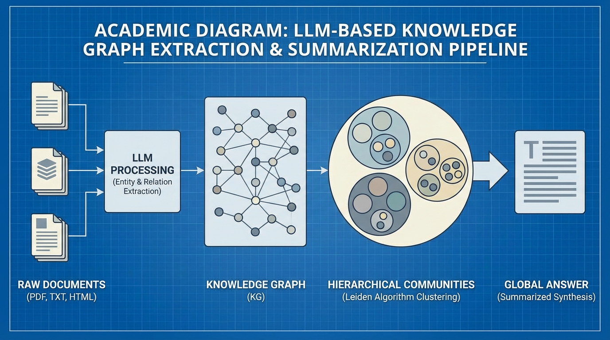

import GraphVisualizer from '../../../components/chapter-14/GraphVisualizer.tsx';

# 14.5 GraphRAG 및 온톨로지

한 엔터프라이즈 어시스턴트가 다음과 같은 질문을 받았다고 생각해 봅시다. *"우리가 라이선스를 받은 모델을 만든 스타트업을 인수한 회사의 CEO는 누구인가?"* 벡터 검색기는 스타트업, 인수, CEO가 등장하는 문서 조각들을 어느 정도 찾아올 수는 있습니다. 하지만 정답에 이르는 관계 자체를 따라가지는 못할 수 있습니다. 벡터 검색은 의미적 유사성에는 강하지만, 관계형 탐색에는 약하기 때문입니다.

이 차이는 중요합니다. 실제 현업의 많은 질문은 "비슷한 문단을 찾아줘"가 아니라 엔티티와 엣지를 따라가야 하는 문제이기 때문입니다. 소유 관계 추적, 장애 타임라인 분석, 의존성 출처 파악, 계약 관계 탐색, 코퍼스 전체의 주제 파악이 모두 여기에 속합니다. 이런 질문을 잘 풀려면 시스템을 단순한 의미론적 텍스트 매칭에서 관계형 추론으로 업그레이드해야 합니다. 이것이 바로 **지식 그래프 (Knowledge Graphs)** 와 **GraphRAG** 의 영역입니다.

---

## 1. 언제 GraphRAG가 운영 비용을 정당화하는가

GraphRAG는 일반적인 벡터 RAG보다 운영 비용과 복잡성이 높기 때문에, 그만한 값을 해야 합니다. 다음과 같은 트래픽이 많을 때 특히 유리합니다.

- **다중 홉 질문:** 문서 사이의 관계를 따라가야 정답이 나오는 경우
- **전역 요약:** 특정 passage가 아니라 코퍼스 전체의 구조와 주제를 묻는 경우
- **출처 민감 워크플로우:** 답이 어떻게 조립되었는지를 보여 줘야 하는 경우

반대로 사용자 질문의 대부분이 "문서 어디에 X가 적혀 있나?"에 가깝다면, 일반적인 벡터 RAG가 더 싸고 단순한 선택인 경우가 많습니다. GraphRAG는 청크 자체보다 관계와 커뮤니티 구조가 답의 품질을 결정할 때 더 적합합니다.

---

## 2. LLM 시대의 온톨로지 (Ontology in the Era of LLMs)

**온톨로지 (Ontology)** 는 지식 그래프의 공식적인 청사진입니다. 특정 도메인 내에 존재할 수 있는 엔티티(노드)의 범주와 관계(엣지)를 정의합니다.

역사적으로 시맨틱 웹(Semantic Web)을 위한 온톨로지 구축(RDF나 OWL과 같은 프레임워크 사용)은 인간이 직접 큐레이션해야 하는 고통스러운 과정이었습니다. 엄격한 스키마(Schema)와 경직된 트리플 스토어(Subject-Predicate-Object 구조)가 요구되었습니다. 이러한 취약성 때문에 전통적인 지식 그래프는 확장하기가 매우 어려웠습니다.

파운데이션 모델 시대에 접어들면서, 패러다임은 **LLM 기반 프로퍼티 그래프 (LLM-extracted Property Graphs)** 로 전환되었습니다. 더 이상 스키마를 정의하기 위해 대규모의 인력이 필요하지 않습니다. 대신 가벼운 JSON 스키마를 사용하고, LLM에 프롬프트를 주어 원시 텍스트에서 동적으로 온톨로지를 추출하도록 합니다.

*   **노드 (Entities):** `Person`, `Organization`, `Technology`, `Location`.
*   **엣지 (Relationships):** `FOUNDED_BY`, `ACQUIRED`, `USES_FRAMEWORK`.
*   **속성 (Properties):** 노드나 엣지에 부착된 메타데이터 (예: `acquisition_date: "2024-01-15"`).

LLM이 문서를 처리할 때, LLM은 범용 파서(Universal parser) 역할을 하여 구조화된 그래프 데이터를 출력합니다. 이는 비구조화된 텍스트를 질의 가능한 수학적 구조로 변환하는 핵심 과정입니다.

---

## 3. 실용적 구현: 엔티티 및 관계 추출 (Extracting Entities and Relationships)

비구조화된 텍스트에서 지식 그래프를 구축하기 위해, 우리는 LLM에 엔티티와 그들의 관계를 식별하도록 프롬프트를 주고, 이를 구조화된 형식(예: JSON)으로 반환하도록 합니다.

다음은 OpenAI의 구조화된 출력(Structured Outputs)을 사용하여 그래프 데이터를 추출하는 Python 예시입니다.

```python
from typing import List
from pydantic import BaseModel, Field
from openai import OpenAI

client = OpenAI()

class Entity(BaseModel):
    id: str = Field(description="엔티티의 고유 식별자, 보통 이름.")
    type: str = Field(description="엔티티의 범주 (예: Person, Company, Tech)")
    description: str = Field(description="엔티티의 짧은 설명이나 역할.")

class Relationship(BaseModel):
    source: str = Field(description="소스 엔티티의 ID.")
    target: str = Field(description="타겟 엔티티의 ID.")
    type: str = Field(description="관계의 유형 (예: FOUNDED_BY, ACQUIRED_BY)")

class KnowledgeGraph(BaseModel):
    entities: List[Entity]
    relationships: List[Relationship]

def extract_graph(text: str) -> KnowledgeGraph:
    response = client.beta.chat.completions.parse(
        model="gpt-4o-mini",
        messages=[
            {"role": "system", "content": "Extract a knowledge graph from the text."},
            {"role": "user", "content": text}
        ],
        response_format=KnowledgeGraph,
    )
    return response.choices[0].message.parsed

text = "Elon Musk founded SpaceX in 2002. Later, SpaceX launched the Falcon 1."
graph = extract_graph(text)
print(graph.model_dump_json(indent=2))
```

---


## 4. 다중 홉 탐색 문제 (The Multi-Hop Traversal Problem)

사용자가 다중 홉 질문을 던질 때, 오케스트레이터(14.3장에서 논의됨)는 올바른 컨텍스트를 검색하기 위해 그래프를 탐색해야 합니다.

만약 쿼리가 *"GitHub를 인수한 회사의 CEO는 누구인가?"* 라면 다음과 같은 과정을 거칩니다:
1.  **벡터 검색 (Vector Search):** 쿼리를 임베딩하여 `[GitHub]` 노드를 찾습니다.
2.  **그래프 탐색 (Graph Traversal):** 엣지를 따라 이동합니다: `[GitHub] --(ACQUIRED_BY)--> [Microsoft] --(HAS_CEO)--> [Satya Nadella]`.
3.  LLM은 이 정확한 하위 그래프(Subgraph)를 제공받아 올바르게 답변합니다.

아래의 시각화 도구를 통해 벡터 RAG가 어떻게 연결 고리를 놓치는지, 반면 GraphRAG가 어떻게 관계형 엣지를 성공적으로 탐색하는지 확인해 보십시오.


<GraphVisualizer client:load lang="ko" />

### 그래프 검색 엔지니어링: 재시작이 있는 무작위 보행 (Random Walk with Restart, RWR)

프로덕션 환경에서는 가능한 모든 다중 홉 경로에 대해 수동으로 Cypher 쿼리를 작성하지 않습니다. 대신 그래프 데이터베이스는 수학적 알고리즘을 사용하여 주변 노드의 관련성 점수를 매깁니다. 표준적인 접근법은 PageRank의 변형인 **재시작이 있는 무작위 보행 (Random Walk with Restart, RWR)** 입니다.

시작 분포 $\mathbf{p}_0$ (벡터 검색을 통해 찾은 초기 노드들)가 주어지면, 알고리즘은 그래프의 엣지를 탐색하는 무작위 보행자(Random walker)를 시뮬레이션합니다. 보행자가 무관한 영역으로 너무 멀리 표류하는 것을 방지하기 위해, 시작점으로 다시 "순간 이동(Teleporting)"할 확률 $c$ 를 갖습니다.

$$ \mathbf{p}_{t+1} = (1 - c) \mathbf{W} \mathbf{p}_t + c \mathbf{p}_0 $$

여기서 $\mathbf{W}$ 는 열 정규화된(Column-normalized) 인접 행렬입니다. 아래는 이 검색 메커니즘을 구현한 현실적인 PyTorch 코드입니다.

```python
import torch

class GraphRetriever:
    """
    재시작이 있는 무작위 보행(RWR)을 사용한 그래프 검색의 PyTorch 구현체입니다.
    초기 벡터 검색 결과를 고도로 관련성 있는 하위 그래프로 확장합니다.
    """
    def __init__(self, num_nodes: int, edges: torch.Tensor, restart_prob: float = 0.15):
        """
        Args:
            num_nodes: 지식 그래프 내 전체 엔티티 수.
            edges: (2, num_edges) 형태의 텐서. edges[0]은 소스, edges[1]은 타겟.
            restart_prob: 초기 검색 노드로 다시 순간 이동할 확률 (c).
        """
        self.num_nodes = num_nodes
        self.restart_prob = restart_prob
        
        # 인접 행렬 초기화
        self.adj_matrix = torch.zeros(num_nodes, num_nodes)
        
        # p_{t+1} = W * p_t 인 열 추계적(Column-stochastic) 행렬을 위해,
        # 열은 소스 노드를, 행은 타겟 노드를 나타냅니다.
        self.adj_matrix[edges[1], edges[0]] = 1.0
        
        # 인접 행렬 정규화 (열 추계적)
        out_degree = self.adj_matrix.sum(dim=0, keepdim=True)
        out_degree[out_degree == 0] = 1.0 # 싱크 노드(Sink nodes)에서 0으로 나누는 것 방지
        self.trans_matrix = self.adj_matrix / out_degree

    def retrieve_subgraph(self, initial_nodes: torch.Tensor, num_steps: int = 15) -> torch.Tensor:
        """
        Args:
            initial_nodes: 시작 분포를 나타내는 텐서 (num_nodes, 1)
                           (예: 초기 벡터 임베딩 검색을 통해 찾은 노드들).
        Returns:
            그래프 내 모든 노드에 대한 관련성 점수 (Relevance scores).
        """
        # 초기 분포 정규화
        p_0 = initial_nodes / initial_nodes.sum()
        p_t = p_0.clone()
        
        # 정상 분포(Stationary distribution)를 계산하기 위한 거듭제곱 연산(Power iteration)
        for _ in range(num_steps):
            p_t = (1 - self.restart_prob) * torch.matmul(self.trans_matrix, p_t) + self.restart_prob * p_0
            
        return p_t

# --- 실행 예시 ---
if __name__ == "__main__":
    # 5개의 노드를 가진 작은 온톨로지 그래프 시뮬레이션
    # 예: 0: 사용자 쿼리, 1: GitHub, 2: Microsoft, 3: Satya Nadella, 4: OpenAI
    edges = torch.tensor([
        [1, 2, 2], # 소스 노드
        [2, 3, 4]  # 타겟 노드
    ])
    
    retriever = GraphRetriever(num_nodes=5, edges=edges, restart_prob=0.2)
    
    # 노드 1(GitHub)의 순위가 높게 나온 벡터 검색 시뮬레이션
    initial_dist = torch.zeros(5, 1)
    initial_dist[1, 0] = 1.0 
    
    # 다중 홉 하위 그래프 컨텍스트 검색
    relevance_scores = retriever.retrieve_subgraph(initial_dist, num_steps=20)
    
    # LLM 컨텍스트 윈도우에 주입할 상위 k개의 노드 선택
    top_k = torch.topk(relevance_scores.squeeze(), k=3)
    print(f"상위 검색된 노드 인덱스: {top_k.indices.tolist()}")
    print(f"노드 관련성 점수: {top_k.values.tolist()}")
```

최근의 그래프 강화 검색 연구는 이 아이디어를 더 발전시키고 있습니다. 예를 들어 HippoRAG는 지식 그래프와 Personalized PageRank 계열 검색을 결합해, 반복적인 retrieval loop보다 더 낮은 비용으로 multi-hop recall을 끌어올리는 방향을 보여 줍니다 [[3]](#ref-3). 실무 관점에서 중요한 교훈은, 엔티티 그래프를 갖추는 순간 그래프 검색도 별도 세계가 아니라 retrieval stack 안의 또 하나의 retriever가 된다는 점입니다.

---

## 5. 마이크로소프트의 GraphRAG: 전역적 의미 파악 (Global Sensemaking)

엣지를 탐색하는 것이 다중 홉 질문(로컬 검색)을 해결해 주지만, RAG에서 가장 어려운 문제인 **전역적 의미 파악 (Global Sensemaking)** 을 해결해 주지는 못합니다.

만약 사용자가 *"이 전체 데이터셋의 주요 주제는 무엇인가?"* 라고 묻는다면 벡터 검색은 완전히 실패합니다. "주제(theme)"라는 단어와 의미론적으로 일치하는 상위 10개의 청크만 검색할 뿐, 코퍼스의 99%를 놓치게 됩니다.

2024년, 마이크로소프트 리서치(Microsoft Research)는 이러한 전역적 요약 문제를 해결하기 위해 특별히 설계된 **GraphRAG** [[1]](#ref-1) 라는 새로운 아키텍처를 발표했습니다. 마이크로소프트의 접근 방식은 질의 시점에 단순히 그래프를 탐색하는 데 그치지 않고, 그래프를 사용하여 전체 데이터셋의 계층적 요약을 사전 계산(Precompute)합니다.


*Source: Edge, D., et al. (2024). "From Local to Global: A Graph RAG Approach to Query-Focused Summarization." [[1]](#ref-1)*

### 마이크로소프트 GraphRAG의 4단계

1.  **추출 (Extraction):** LLM이 모든 소스 문서를 처리하여 엔티티와 관계를 추출하고 거대한 비구조화 지식 그래프 $G = (V, E)$ 를 형성합니다.
2.  **커뮤니티 탐지 (Community Detection):** 시스템은 **Leiden 알고리즘** [[2]](#ref-2) 을 적용하여 그래프를 계층적이고 잘 연결된 클러스터(커뮤니티)로 분할합니다. 자주 상호작용하는 엔티티들(예: 책의 특정 서브플롯에 등장하는 모든 캐릭터와 장소)은 하나의 커뮤니티 $C_i$ 로 그룹화됩니다.
3.  **사전 생성 요약 (Pregenerated Summarization):** 사용자가 질문을 던지기도 전에, LLM은 그래프 내의 모든 단일 커뮤니티에 대해 포괄적인 요약 $S_i$ 를 생성합니다.
4.  **맵리듀스 질의 (Map-Reduce Querying):** 전역 쿼리가 도착하면 시스템은 원시 텍스트를 검색하지 않습니다. 대신 LLM에 각 커뮤니티 요약을 독립적으로 사용하여 부분적인 답변을 생성하도록 프롬프트를 줍니다(Map). 마지막으로 모든 부분 답변을 단일하고 응집력 있는 전역 응답으로 병합합니다(Reduce).

지식을 계층적으로 구조화함으로써, **GraphRAG** 는 컨텍스트 윈도우의 한계를 벗어나 수백만 토큰 데이터셋의 전체를 정확하게 반영하는 답변을 제공합니다.

---

## 6. 요약 및 다음 단계

**GraphRAG** 는 검색을 단순한 텍스트 매칭에서 관계형 추론으로 한 차원 끌어올립니다. 지식을 온톨로지와 계층적 커뮤니티로 구조화함으로써, 시스템은 엣지를 동적으로 탐색하여 다중 홉 쿼리에 답하고 방대한 데이터셋에 대한 전역적 의미 파악을 수행할 수 있습니다. 실무에서 중요한 질문은 그래프가 흥미로운가가 아니라, 실제 워크로드가 관계, 출처, 코퍼스 구조에 크게 의존하느냐입니다.

하지만 잘 설계된 그래프 파이프라인도 운영에서는 여전히 실패할 수 있습니다. 엣지가 오래됐을 수도 있고, entity resolution이 틀릴 수도 있으며, re-ranking이 timeout 날 수도 있고, 생성 모델이 근거를 무시할 수도 있습니다. 다음 절인 **14.6 RAG 실패 모드와 운영 설계** 에서는 이런 시스템이 실제로 어디서 깨지고, 어떻게 graceful degradation을 설계할지 살펴보겠습니다.

---

## Quizzes

<details>
<summary>Quiz 1: 표준적인 벡터 RAG가 "데이터셋의 주요 주제는 무엇인가?"와 같은 '전역적 의미 파악(Global Sensemaking)' 질문에서 지속적으로 실패하는 이유는 무엇입니까?</summary>
*벡터 RAG는 의미론적 유사성에 의존하여 상위 k개의 청크라는 작은 부분집합만 가져옵니다. 전역적인 질문은 문서 전체에 걸쳐 있는 모든 관련 주제를 끌어올 만큼 특정 청크의 임베딩과 강하게 일치하지 않습니다. 설령 일치하더라도, 컨텍스트 윈도우는 응집력 있는 요약이 아닌 파편화된 텍스트 조각들로 채워지게 됩니다.*
</details>

<details>
<summary>Quiz 2: 현대의 LLM 기반 GraphRAG 컨텍스트에서, "온톨로지(Ontology)"의 개념은 전통적인 시맨틱 웹 아키텍처(RDF/OWL)와 비교하여 어떻게 진화했습니까?</summary>
*전통적인 시맨틱 웹은 엄격하고 확장이 어려운 인간 큐레이션 스키마(RDF/OWL)를 요구했습니다. 반면 현대의 GraphRAG는 LLM을 사용하여 비구조화된 텍스트에서 엔티티와 관계를 동적으로 추출하며, 종종 엄격한 트리플 스토어보다는 유연하고 가벼운 스키마(프로퍼티 그래프)를 준수합니다.*
</details>

<details>
<summary>Quiz 3: 마이크로소프트의 GraphRAG 아키텍처에서 Leiden 알고리즘의 구체적인 수학적 목적은 무엇입니까?</summary>
*Leiden 알고리즘은 그래프 커뮤니티 탐지(Community detection)에 사용됩니다. 거대하고 비구조화된 엔티티 지식 그래프를 계층적이고 잘 연결된 클러스터(커뮤니티)로 분할합니다. 이를 통해 시스템은 질의 시간 전에 밀접하게 관련된 엔티티들에 대한 모듈화된 요약을 생성할 수 있습니다.*
</details>

<details>
<summary>Quiz 4: 제공된 PyTorch의 재시작이 있는 무작위 보행(RWR) 구현에서 `restart_prob` 매개변수의 역할은 무엇입니까?</summary>
*`restart_prob` (재시작 확률)는 무작위 보행이 초기 검색 결과에서 무한히 멀리 표류하는 것을 방지합니다. 탐색이 주기적으로 (벡터 검색을 통해 찾은) 시작 노드로 다시 "순간 이동"하도록 강제함으로써, 검색된 하위 그래프가 사용자의 원래 쿼리 컨텍스트에 강하게 편향되도록 보장합니다.*
</details>

<details>
<summary>Quiz 5: 그래프 추출 과정에서 동일한 엔티티가 다르게 작성된 문맥적 모호성(예: "Musk", "Elon", "Tesla의 CEO")을 맞닥뜨릴 수 있습니다. 이러한 중복 노드를 해결하고 병합(Collapse)하는 명시적 수학적 논리를 정식화하십시오.</summary>
*프로퍼티 그래프에서의 엔티티 해소(Entity Resolution)는 대개 2단계 접근 방식을 사용합니다. 첫째, 노드 속성 임베딩의 코사인 유사도를 계산하여 중복 후보를 식별합니다: $S_{cosine}(n_a, n_b) = \frac{E(n_a)^T E(n_b)}{||E(n_a)||_2 ||E(n_b)||_2} \ge \theta_{threshold}$. 둘째, 확인된 노드 쌍들의 인접 그래프 가중치를 통합하여 노드를 병합합니다: $W_{collapsed}(i, j) = W(a, j) + W(b, j)$. 이 과정을 통해 다중 홉 RWR 알고리즘 수행 시 중복 노드로 인해 탐색 경로가 불필요하게 분기(Bifurcate)되는 파편화된 모호성을 예방합니다.*
</details>

---

## References

1. <a id="ref-1"></a>Edge, D., et al. (2024). *From Local to Global: A Graph RAG Approach to Query-Focused Summarization.* [arXiv:2404.16130](https://arxiv.org/abs/2404.16130).
2. <a id="ref-2"></a>Traag, V. A., Waltman, L., & van Eck, N. J. (2019). *From Louvain to Leiden: guaranteeing well-connected communities.* [Scientific Reports](https://www.nature.com/articles/s41598-019-41695-z).
3. <a id="ref-3"></a>Gutiérrez, B. J., Shu, Y., Gu, Y., Yasunaga, M., & Su, Y. (2025). *HippoRAG: Neurobiologically Inspired Long-Term Memory for Large Language Models.* [arXiv:2405.14831](https://arxiv.org/abs/2405.14831).
