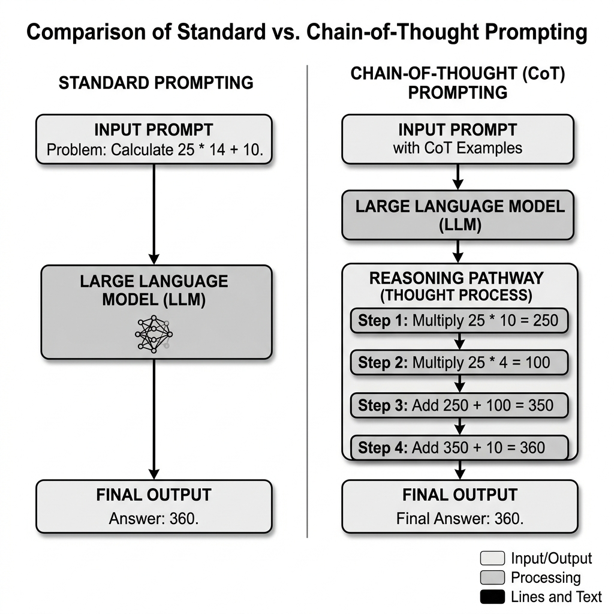

# 15.1 생각의 사슬 프롬프팅 (Chain of Thought Prompting)

대규모 언어 모델(LLMs)은 많은 작업에서 탁월한 성능을 보이지만, 다단계 수학 문제나 기호 논리와 같은 복잡한 추론 작업에서는 종종 어려움을 겪습니다. Wei 등이 2022년에 발표한 **생각의 사슬 (Chain of Thought, CoT) 프롬프팅** [[1]](#ref-1) 은 모델이 중간 해결 단계의 시퀀스를 생성하도록 유도함으로써 LLM의 추론 능력을 극적으로 향상시키는 간단하지만 강력한 기술입니다.

## 핵심 개념: 단계별 생각하기

표준 프롬프팅(Standard Prompting)은 모델에 직접 답을 요구하므로, 모델이 단일 패스로 입력을 출력에 직접 매핑하려고 하기 때문에 복잡한 작업에서 오류가 발생하기 쉽습니다. 반면 CoT 프롬프팅은 추론 과정이 명시적으로 표시된 몇 가지 예시를 모델에 제공하거나, 단순히 모델에 "단계별로 생각하라"고 지시합니다.

중간 단계를 생성함으로써 모델은 복잡한 문제를 더 작고 관리하기 쉬운 하위 문제로 효과적으로 분해합니다. 이를 통해 모델은 추론 프로세스에 더 많은 연산량(생성된 토큰 형태)을 할당할 수 있습니다.


*출처: AI 생성 이미지*

## Zero-Shot CoT: 마법의 문장

Few-shot CoT는 예시를 제공해야 하지만, Kojima 등(2022) [[2]](#ref-2) 은 프롬프트에 **"차근차근 생각해 봅시다 (Let's think step by step)"** 라는 문구를 추가하는 것만으로도 예시 없이 유사한 추론 행동을 유도할 수 있음을 발견했습니다. 이를 **Zero-Shot CoT** 라고 합니다.

이 간단한 추가는 모델이 최종 답변에 도달하기 전에 추론 경로를 생성하도록 트리거하여 GSM8K(수학 문장제 문제)와 같은 벤치마크에서 정확도를 크게 향상시킵니다.

## CoT가 도움이 될 때와 오히려 해가 될 때

CoT는 실제로 문제를 분해하는 과정이 필요한 작업에서 가장 큰 힘을 발휘합니다. 예를 들어 산술 문장제, 기호 조작, 제약이 있는 계획 문제, 혹은 중간 변수들을 계속 추적해야 하는 경우가 그렇습니다.

반대로 다음과 같은 작업에서는 효과가 제한적이거나 오히려 비용만 늘릴 수 있습니다.

- 단순한 사실 조회
- 얕은 분류
- 근거 문서만 바로 제시하면 되는 retrieval 질의
- 중간 텍스트를 길게 쓰는 것이 정확도보다 지연 시간만 늘리는 상황

여기에는 자주 놓치는 실패 모드도 있습니다. 추론 텍스트가 길어질수록 실제 논리는 틀렸는데도 답이 더 그럴듯해 보일 수 있다는 점입니다. 즉, CoT는 많은 추론 과제에서 성능을 높이지만, 중간 단계를 따로 점검하지 않으면 과신도 함께 키울 수 있습니다.

### 눈에 보이는 추론과 프로덕션 인터페이스는 다르다

연구 논문에서는 reasoning trace 자체가 연구 대상이기 때문에 CoT를 그대로 보여 주는 경우가 많습니다. 하지만 프로덕션에서는 보통 두 문제를 분리합니다.

- 내부적으로는 reasoning을 쓰되, 사용자에게는 최종 답과 근거만 반환한다
- 최종 답을 엄격한 schema 안에 넣도록 강제한다
- reasoning 텍스트 자체를 믿기보다, 최종 결과를 별도 검증한다

그래서 CoT는 "설명이 곧 정답을 보장한다"기보다, **토큰 형태로 소비되는 추가 test-time compute** 로 이해하는 편이 더 정확합니다.

## 프로덕션에서의 CoT 구현 전략

LLM을 사용하여 애플리케이션을 구축하는 개발자에게 CoT는 필수적인 기술입니다. 그러나 이는 프로덕션 환경에서 몇 가지 과제를 안겨줍니다.

### 1. 출력 파싱의 어려움

모델이 생각의 사슬을 생성할 때, 최종 답변은 텍스트 내에 묻혀 있습니다. 개발자는 이를 추출할 안정적인 방법이 필요합니다.

**전략 A: 특정 형식 지정 프롬프팅**
추론의 맨 끝에 특정 XML 태그나 JSON 필드에 최종 답변을 넣도록 모델에 지시합니다.
> "추론의 끝에 최종 답변을 \<answer\>최종_답변\</answer\> 형식으로 제공하세요."

**전략 B: 정규 표현식을 이용한 후처리**
정규식을 사용하여 일반적인 패턴이나 지정된 태그를 찾습니다.

### 2. 자기 일관성 (Self-Consistency): 신뢰성 향상

CoT 추론은 때때로 궤도를 벗어날 수 있습니다. 신뢰성을 높이기 위해 Wang 등(2022) [[3]](#ref-3) 은 **자기 일관성 (Self-Consistency)** 을 제안했습니다.
하나의 생각의 사슬만 생성하는 대신, 모델은 0이 아닌 온도를 설정하여 *여러 개* 의 추론 경로(예: 5개 또는 10개)를 생성합니다. 그런 다음 시스템은 최종 답변을 집계하여(예: 다수결) 가장 일관된 답변을 찾습니다. 이는 무작위 오류를 크게 줄여줍니다.

### PyTorch를 이용한 CoT 로직 시뮬레이션

CoT는 프롬프팅 기술이지만, 추론 단계에 따라 연산량이 어떻게 확장되는지 이해하기 위해 "단계별" 토큰 생성 및 검증 프로세스를 시뮬레이션할 수 있습니다.

```python
import torch
import torch.nn as nn
import torch.nn.functional as F

class SimpleReasoningModel(nn.Module):
    def __init__(self, vocab_size, embed_dim):
        super().__init__()
        self.embedding = nn.Embedding(vocab_size, embed_dim)
        self.transformer = nn.TransformerEncoder(
            nn.TransformerEncoderLayer(d_model=embed_dim, nhead=4),
            num_layers=2
        )
        self.output_layer = nn.Linear(embed_dim, vocab_size)
        
    def forward(self, x):
        x = self.embedding(x)
        x = self.transformer(x)
        return self.output_layer(x)

def generate_with_cot(model, prompt_tokens, max_steps=5):
    """
    중간 추론 단계를 포함하는 시퀀스 생성을 시뮬레이션합니다.
    """
    current_tokens = prompt_tokens
    
    print(f"초기 프롬프트: {current_tokens.tolist()}")
    
    for step in range(max_steps):
        # 다음 토큰 예측 (추론의 한 단계를 시뮬레이션)
        logits = model(current_tokens)
        next_token_logits = logits[:, -1, :]
        next_token = torch.argmax(next_token_logits, dim=-1, keepdim=True)
        
        # 시퀀스에 추가
        current_tokens = torch.cat([current_tokens, next_token], dim=1)
        
        print(f"단계 {step + 1} 추론 토큰: {next_token.item()}")
        
    return current_tokens

# 예제 사용법
vocab_size = 100
embed_dim = 64
model = SimpleReasoningModel(vocab_size, embed_dim)

# 프롬프트 시뮬레이션
prompt = torch.tensor([[1, 2, 3]]) # 토큰화된 프롬프트
final_sequence = generate_with_cot(model, prompt, max_steps=4)
print(f"CoT가 포함된 최종 시퀀스: {final_sequence.tolist()}")
```

## Quizzes

<details>
<summary>Quiz 1: 생각의 사슬 프롬프팅이 표준 프롬프팅에 비해 복잡한 추론 작업에서 성능을 향상시키는 이유는 무엇인가요?</summary>
*표준 프롬프팅은 모델이 단일 패스로 입력을 출력에 직접 매핑하도록 강제하므로 복잡한 문제에서 어렵습니다. CoT는 모델이 중간 단계를 생성하여 문제를 분해하고 추론 프로세스에 더 많은 연산량(토큰)을 할당할 수 있도록 하여 정확도를 높입니다.*
</details>

<details>
<summary>Quiz 2: 프로덕션 API 환경에서 생각의 사슬 프롬프팅을 사용할 때의 주요 트레이드오프는 무엇인가요?</summary>
*주요 트레이드오프는 대기 시간(Latency)과 비용의 증가입니다. CoT는 모델이 답변에 도달하기 전에 많은 중간 토큰을 생성해야 합니다. LLM 요금은 일반적으로 토큰당 부과되고 속도는 자기회귀 생성에 의해 제한되므로, CoT는 요청을 더 느리고 비싸게 만듭니다.*
</details>

<details>
<summary>Quiz 3: 자기 일관성(Self-Consistency) 방법은 어떻게 CoT 추론의 신뢰성을 향상시키나요?</summary>
*자기 일관성은 0이 아닌 온도 샘플링을 사용하여 동일한 프롬프트에 대해 독립적인 여러 추론 경로를 생성합니다. 그런 다음 최종 답변에 대해 다수결을 취합니다. 잘못된 경로는 서로 다른 답변을 생성할 가능성이 높은 반면 올바른 경로는 수렴할 가능성이 높기 때문에, 이는 모델이 단일 추론 체인에서 무작위 오류를 범할 위험을 줄여줍니다.*
</details>

<details>
<summary>Quiz 4: CoT 생성 과정 중 추론 모델의 KV 캐시 메모리 사용량을 계산하시오. 시퀀스 길이가 $L$ 토큰으로 확장되고, 은닉 차원(hidden dimension) $d$, 어텐션 헤드 수 $n_h$, 키-값 헤드 수 $n_{kv}$ (Grouped Query Attention), 레이어 수 $l$, 데이터 정밀도는 FP16이라고 가정한다. 명시적인 공식을 제공하고 $L = 8192$, $d = 4096$, $n_h = 32$, $n_{kv} = 8$, $l = 32$인 경우의 용량을 도출하시오.</summary>
*KV 캐시 메모리 사용량은 다음과 같이 계산됩니다: $\text{Memory}_{\text{KV}} = 2 \times l \times L \times n_{kv} \times d_k \times 2 \text{ 바이트}$ (여기서 $d_k = d / n_h$는 헤드당 차원). 이 예시에서는 $d_k = 4096 / 32 = 128$입니다. 값을 대입하면: $\text{Memory}_{\text{KV}} = 2 \times 32 \times 8192 \times 8 \times 128 \times 2 \text{ 바이트} = 2^{30} \text{ 바이트} = 1 \text{ GB}$가 됩니다. 이 명시적인 용량 도출을 통해, 시퀀스 길이 $L$을 크게 확장시키는 CoT 생성이 메모리 공간(footprint)의 선형적 증가를 초래하며 효과적인 메모리 관리가 없을 경우 OOM(Out-Of-Memory) 문제를 일으킬 수 있음을 알 수 있습니다.*
</details>

---

## References

1. <a id="ref-1"></a>Wei, J., et al. (2022). *Chain-of-Thought Prompting Elicits Reasoning in Large Language Models*. [arXiv:2201.11903](https://arxiv.org/abs/2201.11903).
2. <a id="ref-2"></a>Kojima, T., et al. (2022). *Large Language Models are Zero-Shot Reasoners*. [arXiv:2205.11916](https://arxiv.org/abs/2205.11916).
3. <a id="ref-3"></a>Wang, X., et al. (2022). *Self-Consistency Elicits CoT Reasoning in LLMs*. [arXiv:2203.11171](https://arxiv.org/abs/2203.11171).
